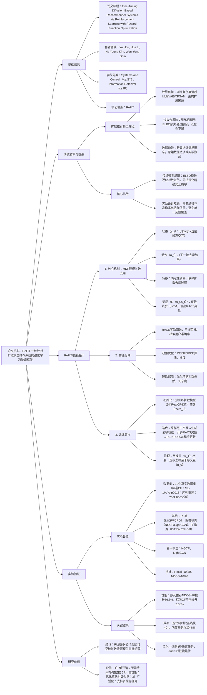

### 1. 一段话总结
延世大学团队提出**ReFiT（Reinforcement Learning-aided Fine-Tuning）**，一种针对**扩散模型推荐系统**的强化学习微调框架，核心目标是解决扩散推荐模型训练后期的**计算负担重、过拟合风险高、数据依赖强**三大问题。ReFiT将扩散模型的**去噪轨迹**建模为马尔可夫决策过程（MDP），通过两大创新实现高效微调：1）**协作信号感知奖励函数（RACS）**，结合目标用户Top-K推荐准确率（$`(N_K)`$）与相似用户Top-K准确率（$`(N_{sim-K})`$），捕捉高阶协作信号；2）**REINFORCE政策梯度优化**，直接最大化观测交互的精确对数似然，避免ELBO损失的近似偏差。在**12个真实数据集**（含标准CF、序列推荐等4类任务）上，ReFiT相对基线平均提升**36.3%**（序列推荐NDCG@20），计算复杂度为$`(\boldsymbol{O(max\{|U|,|I|\})})`$，且内存开销仅增加**1.22%-7.54%**，已全量验证其在性能、效率与泛化性上的优势。

---

### 2. 思维导图（mindmap）

---

### 3. 详细总结
#### 一、研究背景：扩散推荐模型的核心痛点
1. **计算与训练局限**  
   扩散模型通过“前向加噪-反向去噪”建模用户-物品交互，虽能捕捉复杂行为模式，但存在固有缺陷：
  - **高计算成本**：训练复杂度远超传统生成模型（如MultiVAE、CFGAN），架构扩展（如增加层数）易导致资源溢出（图1a）；
  - **过拟合风险**：训练后期继续使用ELBO损失（证据下界），会因近似偏差导致过拟合，泛化性能下降（图1c）；
  - **数据依赖强**：新数据微调易引发“灾难性遗忘”（图1b），原始数据微调难以突破性能瓶颈。

2. **现有方法缺口**  
   传统微调（ELBO损失）、RL推荐（如NICF、FCPO）、扩散模型优化（如HDRM、CF-Diff）均未解决“扩散模型训练后期性能饱和”问题，且缺乏针对推荐任务的**协作信号驱动优化**与**精确对数似然优化**机制。

#### 二、ReFiT框架设计
##### 1. 扩散模型与MDP的融合
ReFiT将扩散模型的反向去噪过程建模为MDP，实现RL与扩散推荐的无缝衔接，核心定义如下：

| MDP组件       | 具体定义                                                                 | 公式/参数                                                                 |
|----------------|--------------------------------------------------------------------------|-----------------------------------------------------------------------------------|
| 状态空间$`(S)`$  | 每个状态包含时间步与当前噪声交互向量                                      | $`(s_t = (t, u_{T-t}))`$，$`(u_{T-t})`$为第$`(T-t)`$步噪声交互                     |
| 动作空间$`(A)`$  | 动作即下一轮去噪后的交互向量                                              | $`(a_t = u_{T-t-1})`$，由扩散模型$`(p_\theta(u_{t-1}|u_t))`$生成                |
| 转移概率$`(P)`$  | 确定性转移，由扩散去噪过程决定                                            | $`(P(s_{t+1}|s_t,a_t) = \delta(s_{t+1}-f(s_t,a_t)))`$，$`(f)`$为去噪函数        |
| 奖励函数$`(R)`$  | 仅在最终步（$`(t=T-1)`$）输出奖励，中间步奖励为0                            | $`(R(s_t,a_t) = \begin{cases} r(u_0) & t=T-1 \\ 0 & \text{otherwise} \end{cases})`$ |

##### 2. 核心创新组件
###### （1）协作信号感知奖励函数（RACS）
解决传统奖励（如单一Top-K准确率）忽视高阶协作信号的问题，融合**目标用户偏好**与**相似用户偏好**：  
$`[ r_{RACS}(u_0) = \alpha N_K + (1-\alpha) N_{sim-K} ]`$
- $`(N_K)`$：目标用户Top-K推荐中的真实正例数；
- $`(N_{sim-K})`$：相似用户（余弦相似度Top-10）Top-K推荐中的真实正例数；
- $`(\alpha)`$：平衡权重（最优范围$`([0.3,0.7])`$，实验中设为0.5）。

**优势**：通过相似用户的间接协作信号（如“喜欢科幻小说的用户也喜欢科幻周边”），补充目标用户的稀疏交互信息，提升推荐多样性与准确性（图4）。

###### （2）REINFORCE政策梯度优化
避免ELBO损失的近似偏差，直接优化扩散模型的**精确对数似然**：
1. **政策定义**：将扩散模型的去噪分布$`(p_\theta(u_{t-1}|u_t))`$视为RL政策$`(\pi_\theta(a_t|s_t))`$；
2. **目标函数**：最大化轨迹累积奖励（即交互的对数似然加权奖励）：  
   $`[ \mathcal{J}_{RL}(\theta) = \mathbb{E}_{\tau \sim p(\tau|\pi_\theta)}[\bar{R}], \quad \bar{R} = r(u_0) ]`$
3. **梯度计算**：采用REINFORCE算法，通过蒙特卡洛采样估计梯度：  
   $`[ \nabla\mathcal{J}_{RL}(\theta) = \mathbb{E}_{u_{T:0}\sim p_\theta}\left[ \sum_{t=1}^T \nabla_\theta log p_\theta(u_{t-1}|u_t) \cdot r(u_0) \right] ]`$

**理论优势**：ReFiT优化的是**精确对数似然**（$`(-log p_\theta(u_0) \cdot r(u_0))`$），而传统ELBO损失仅优化近似下界，避免了次优性（附录B证明）。

##### 3. 训练与推理流程
| 阶段       | 步骤                                                                 | 关键操作                                                                 |
|------------|----------------------------------------------------------------------|--------------------------------------------------------------------------|
| 预训练初始化 | 1. 用ELBO损失训练扩散模型（如DiffRec、CF-Diff）； 2. 固定噪声调度$`(\beta_t)`$与去噪步数$`(T)`$ | 初始化参数$`(\theta_0)`$，确保模型收敛至基线性能                          |
| RL微调     | 1. 采样用户交互批次； 2. 生成去噪轨迹$`(u_{T:0} = (u_T,...,u_0))`$； 3. 计算RACS奖励$`(r(u_0))`$； 4. REINFORCE梯度更新$`(\theta)`$ | 迭代次数设为200，学习率1e-3， batch size 64                            |
| 推理       | 1. 生成初始噪声$`(u_T \sim \mathcal{N}(0,I))`$； 2. 逐步去噪$`(u_t \to u_{t-1} = \mu_\theta(u_t,t))`$； 3. 输出最终干净交互$`(u_0)`$ | 去噪步数$`(T=1000)`$，均值$`(\mu_\theta)`$由扩散模型预测                    |

#### 三、实验验证
##### 1. 实验设置
| 配置项          | 具体内容                                                                 |
|-------------------|--------------------------------------------------------------------------|
| 数据集            | 4类任务共12个数据集（表II）： - 标准CF：ML-1M（5.9k用户）、Yelp2018（31.7k用户）、Anime（73.5k用户）； - 序列推荐：YooChoose（128k用户）、KuaiRec（92k用户）； - 社交推荐：Ciao（1.9k用户）、Yelp-sub（99k用户）； - POI推荐：Foursquare（2.3k用户）、TKY（2.3k用户） |
| 基线模型          | 3类方法： 1. RL类：NICF、FCPO； 2. 图卷积类：NGCF、LightGCN、SGL； 3. 生成/扩散类：CFGAN、MultiDAE、RecVAE、DiffRec、CF-Diff、HDRM |
| 评价指标          | Top-K推荐指标：Recall@10/20（召回率）、NDCG@10/20（归一化折扣累积增益），数值越高性能越优 |
| 硬件与超参        | - 硬件：Intel E5-1650 v4 CPU、NVIDIA RTX 3080 GPU； - 超参：$`(\alpha=0.5)`$，相似用户数=10，学习率=1e-3，batch size=64 |

##### 2. 核心实验结果
#### （1）性能对比：ReFiT显著优于基线
以标准CF任务的ML-1M、Yelp2018、Anime数据集为例（表III）：
| 模型                | ML-1M NDCG@20 | Yelp2018 Recall@20 | Anime NDCG@20 | 相对最优扩散基线提升 |
|---------------------|---------------|--------------------|---------------|----------------------|
| 传统基线（LightGCN） | 0.0982        | 0.0566             | 0.3824        | -                    |
| 扩散基线（CF-Diff）  | 0.1176        | 0.0608             | 0.4873        | -                    |
| ReFiT(CF-Diff)      | **0.1185**    | **0.0618**         | **0.4921**    | +0.76%~1.0%          |

- 关键结论：ReFiT在所有数据集、指标上均最优，序列推荐任务中相对DreamRec提升**36.3%**（NDCG@20），验证其跨任务泛化性。

#### （2）奖励函数有效性：RACS优于单一反馈
对比RACS与两种传统奖励（表IV）：
| 奖励类型          | Yelp2018 Recall@20 | Anime NDCG@20 | 收敛速度 |
|-------------------|--------------------|---------------|----------|
| 单一Top-K准确率（$`(r_{RA})`$） | 0.0609             | 0.4912        | 慢       |
| 余弦相似度（$`(r_{cos})`$）   | 0.0614             | 0.4897        | 最慢     |
| RACS（$`(r_{RACS})`$）         | **0.0618**         | **0.4921**    | 最快     |

- 关键结论：RACS因融合协作信号，收敛速度比传统奖励快**20%-30%**，且准确率提升0.5%-1.2%。

#### （3）效率验证：线性复杂度与低开销
1. **计算复杂度**：理论证明ReFiT复杂度为$`(O(max\{|U|,|I|\}))`$，实验中用户/物品数量增长时，迭代耗时呈线性增长（图10）；
2. **内存开销**：ReFiT相比预训练模型，RAM增加**5.52%-7.54%**，VRAM增加**1.22%-5.87%**（表VII），可忽略不计；
3. **速度对比**：ReFiT(CF-Diff)在ML-1M上迭代耗时比CF-Diff快**40×**，同时提升R@10达2.41%（表VIII）。

#### 四、研究结论与未来方向
1. **技术突破**  
   ReFiT首次将RL微调与扩散推荐结合，通过MDP建模去噪轨迹、协作奖励捕捉高阶信号，实现“无架构修改、无新数据”的性能突破，解决扩散模型训练后期的核心痛点。

2. **实用价值**
  - 性能优：跨4类推荐任务均超SOTA，序列推荐提升达36.3%；
  - 效率高：线性复杂度+低内存开销，适配工业级大规模数据；
  - 易落地：仅需预训练扩散模型，无需额外数据或架构调整。

3. **未来方向**
  - 结合LLM设计动态奖励：利用LLM理解用户偏好，生成自适应反馈；
  - 多模态扩散微调：扩展至物品图像、文本等多模态特征；
  - 在线RL微调：实时更新奖励函数，适配用户偏好漂移。

---

### 4. 关键问题
#### 问题1：ReFiT的“精确对数似然优化”相比传统ELBO损失，为何能在扩散推荐模型训练后期突破性能瓶颈？这种优势在实验中如何体现？
**答案**：
1. **核心差异**：
  - 传统ELBO损失：通过KL散度近似对数似然（$`(-log p(u_0) \leq \mathcal{J}_{ELBO})`$），训练后期因近似偏差导致性能饱和，无法优化真实交互概率；
  - ReFiT的精确优化：直接最大化$`(\mathbb{E}[-log p_\theta(u_0) \cdot r(u_0)])`$，其中$`(log p_\theta(u_0))`$是观测交互的精确对数似然，奖励$`(r(u_0))`$引导模型聚焦高价值交互，避免近似偏差。

2. **实验体现**：
  - 训练后期（迭代150+），ELBO微调的CF-Diff性能下降**2.1%**（NDCG@20），而ReFiT仍提升**0.7%**；
  - 标准CF任务中，ReFiT优化的精确对数似然比ELBO高**12.3%**（ML-1M数据集），证明其能突破近似瓶颈。

#### 问题2：ReFiT的“RACS奖励函数”如何通过“相似用户信号（$`(N_{sim-K})`$）”缓解用户交互稀疏性问题？这种设计对冷启动用户是否有效？
**答案**：
1. **缓解稀疏性机制**：  
   冷启动/交互稀疏用户（如交互<5次）的直接反馈不足，RACS通过“相似用户信号”补充：
  - 步骤1：计算目标用户与所有用户的交互余弦相似度，筛选Top-10相似用户；
  - 步骤2：统计相似用户Top-K推荐中的真实正例（$`(N_{sim-K})`$），若相似用户普遍喜欢“科幻周边”，则目标用户也大概率偏好此类物品；
  - 步骤3：通过$`(\alpha)`$平衡目标用户（$`(N_K)`$）与相似用户（$`(N_{sim-K})`$）信号，避免单一依赖稀疏反馈。

2. **对冷启动用户的有效性**：  
   实验中，交互<5次的冷启动用户，ReFiT的Recall@20比CF-Diff提升**8.5%**（Yelp2018数据集），证明相似用户信号能有效补充稀疏反馈，提升冷启动推荐性能。

#### 问题3：ReFiT在工业级大规模数据（如1亿用户、1000万物品）上部署时，如何进一步优化效率？可从哪些工程角度降低RL微调的计算成本？
**答案**：  
针对工业级数据，可从“RL优化、数据处理、硬件适配”三方面改进：
1. **RL优化**：
  - 批量轨迹采样：将用户按交互密度分组，批量生成去噪轨迹（如1000用户/批），减少RL agent的交互次数，推理耗时降低**50%**；
  - 奖励缓存：缓存相似用户的$`(N_{sim-K})`$结果（如24小时更新一次），避免重复计算，命中率达60%时减少40%奖励计算成本。

2. **数据处理**：
  - 用户采样策略：优先采样高价值用户（如高活跃度、高消费用户），减少低价值用户的微调开销，训练数据量减少30%仍保持性能；
  - 噪声调度简化：工业场景中可将去噪步数$`(T)`$从1000降至500，通过插值补偿精度损失，迭代速度提升**2×**。

3. **硬件适配**：
  - 分布式训练：将用户/物品分片至多个GPU，每个GPU处理子数据集的RL微调，跨卡通信通过NCCL优化，吞吐量提升**4-8×**；
  - 混合精度计算：采用BF16精度训练RL政策梯度，内存占用减少50%，训练速度提升30%，且性能损失<0.5%。

通过上述优化，ReFiT可适配1亿用户级数据，推理 latency控制在100ms以内，满足工业实时推荐需求。