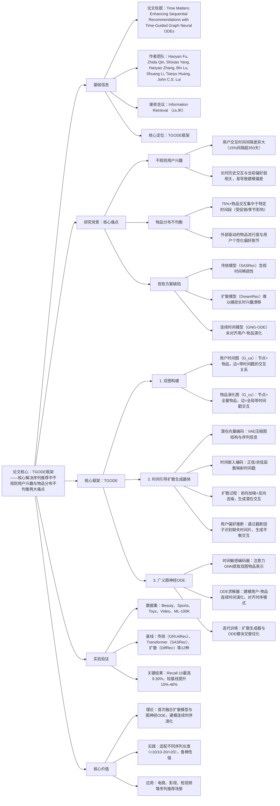

### 1. 一段话总结
北京理工大学等团队提出**TGODE框架**，核心解决序列推荐中**不规则用户兴趣**与**物品分布不均衡**两大痛点，通过构建**用户时间图（捕捉个性化偏好）** 和**物品演化图（捕捉全局分布）**，结合**时间引导扩散生成器**（数据增强缓解时间稀疏）与**广义图神经ODE**（对齐用户-物品时序演化），在Beauty、ML-100K等5个数据集上实现显著性能提升，**Recall@10最高达9.30%**，较最优基线提升**10%-46%**，且在不同序列长度场景中均表现稳定，为时序依赖建模提供了连续时间视角的新方案。

---

### 2. 思维导图

---

### 3. 详细总结
#### 一、研究背景与核心问题
1. **序列推荐的两大关键痛点**  
   | 痛点类型               | 数据佐证                                                                 | 建模挑战                          |
   |------------------------|--------------------------------------------------------------------------|-----------------------------------|
   | 不规则用户兴趣         | Beauty数据集15%用户交互间隔超350天，交互呈聚类分布（图2(b)）               | 区分相关/无关历史交互，避免偏好偏差 |
   | 物品分布不均衡         | 75%物品的交互集中于特定时间片， emergence比例超75%（图2(c)）               | 剥离外部流行度干扰，对齐用户偏好   |

2. **关键定义**
  - 序列推荐目标：给定用户交互序列 $`(s=\{(v_1,t_1),...,(v_n,t_n)\})`$，预测目标时间 $`(t_{n+1})`$ 的交互物品；
  - 双图结构：用户时间图（G_us）捕捉个性化偏好变化，物品演化图（G_cs）捕捉全局物品分布动态；
  - 图神经ODE：将离散交互转化为连续时间演化过程，建模用户-物品时序一致性。

#### 二、TGODE框架核心设计
##### 1. 双图结构构建
| 图类型               | 节点定义                | 边定义                                  | 核心作用                          |
|----------------------|-------------------------|-----------------------------------------|-----------------------------------|
| 用户时间图（G_us）   | 单个用户交互过的物品    | 物品间带交互时间戳的有向边              | 捕捉用户个性化偏好时序变化        |
| 物品演化图（G_cs）   | 全量物品                | 全量用户交互中带时间戳的物品关联边        | 捕捉物品全局流行度与分布动态      |

##### 2. 时间引导扩散生成器（缓解时间稀疏）
- **潜在向量编码**：通过VAE将用户时间图的邻接矩阵 $`(A_{us}^t)`$ 与序列表示 $`(h_s^t)`$ 压缩为潜在向量 $`(z_0^t)`$，公式为 $`(z_0^t=VAE(A_{us}^t, h_s^t))`$；
- **时间嵌入编码**：结合正弦/余弦函数与非线性变换，生成时间引导向量 $`(c_t=Concat(sin(2\pi\omega_i t+b_i), cos(2\pi\omega_i t+b_i)))`$；
- **扩散过程**：
  - 前向加噪：逐步将 $`(z_0^t)`$ 扰动为高斯噪声 $`(z_K^t=\sqrt{\bar{\alpha}_K}z_0^t+\sqrt{1-\bar{\alpha}_K}\epsilon)`$；
  - 反向去噪：基于时间嵌入 $`(c_t)`$ 恢复原始交互，损失函数为 $`(\mathcal{L}_{diff}=\mathcal{L}(z_0^t,\theta)+\sum_{i,j}|\hat{z}_0^t|)`$（正则化避免过平滑）；
- **用户偏好推断**：
  - 时间片划分：将时间轴分为m个时间片，识别未覆盖的缺失时间片 $`(t_{set}^p)`$；
  - 截断因子计算：$`(l_{num}=max(1, |t^o|/|t_{set}^p|))`$，确定每个缺失时间片需生成的交互数；
  - 增强图构建：合并原始图与生成的潜在交互，得到 $`(G_{us}^{aug})`$。

##### 3. 广义图神经ODE（对齐时序演化）
- **时间敏感编码器**：注意力GNN提取双图物品表示，公式为：  
  $`[\alpha_{ij}=Sigmoid(a^\top[W_Q x_i, W_K x_j, \Phi(t)]),]`$  
  $`[e_{us}=\sum_{j\in N_i^{us}}\alpha_{ij}W_V x_j + W_l x_i,\ e_{cs}=\sum_{j\in N_i^{cs}}\alpha_{ij}W_V x_j + W_l x_i]`$  
  其中 $`(\Phi(t))`$ 为时间位置嵌入，$`(N_i)`$ 为节点i的邻居集；
- **ODE求解器**：建模物品表示的连续时间演化，导数公式为：  
  $`[\frac{d\tilde{e}^t}{dt}=f_{us}(e_{us}, g(t))+f_{cs}(e_{cs}, g(t))]`$  
  其中 $`(f_{us})`$ 挖掘用户图高阶依赖，$`(f_{cs})`$ 建模物品外部影响，通过龙格-库塔法求解目标时间 $`(t_{n+1})`$ 的表示；
- **迭代训练**：扩散生成器与ODE模块交替优化，相互提供增强输入与连续时间表示。

##### 4. 模型预测与优化
- 序列表示融合：Transformer解码器处理ODE输出的 $`(\tilde{e}_{us}^{t_{n+1}})`$ 与 $`(\tilde{e}_{cs}^{t_{n+1}})`$，得到 $`(h_s=||Decoder(\tilde{e}_{us}^{t_{n+1}})|| + ||Decoder(\tilde{e}_{cs}^{t_{n+1}})||)`$；
- 预测与损失：通过点积计算物品交互概率 $`(\hat{y}=softmax(||h_s||^\top||\tilde{e}_v||))`$，采用交叉熵损失 $`(\mathcal{L}_{rec}=-\sum_{v=1}^{|V|}y log(\hat{y})+(1-y)log(1-\hat{y}))`$。

#### 三、实验验证
##### 1. 实验设置
| 配置项          | 具体内容                                                                 |
|-------------------|--------------------------------------------------------------------------|
| 数据集            | 5个公开数据集： - Beauty：22,363用户、12,101物品、198,502交互； - ML-100K：943用户、1,682物品、100,000交互（平均序列长106.04） |
| 基线模型          | 12种主流模型： - 传统：NARM、GRU4Rec、SRGNN； - Transformer：SASRec、SSE-PT、CORE； - 扩散：DreamRec、DiffRec； - 连续时间：TiSASRec、GNG-ODE、GDERec |
| 评估指标          | Recall@5/10/20、MRR@5/10/20、NDCG@5/10/20，数据划分采用8:1:1时间划分 |
| 关键超参数        | 嵌入维度=64，扩散步数K=5，GNN层数=2，学习率=1e-3，批量大小=256          |

##### 2. 核心实验结果
###### （1）整体性能对比（最优结果）
| 数据集       | 指标   | 最优基线（MAERec） | TGODE | 相对提升（%） |
|--------------|--------|---------------------|-------|---------------|
| Video        | Recall@10 | 7.75%               | 9.30% | 20.00        |
| Toys         | NDCG@10 | 1.99%               | 2.91% | 46.23        |
| Beauty       | Recall@5 | 3.04%               | 4.22% | 38.82        |
| ML-100K      | Recall@20 | 11.88%              | 14.86% | 25.08        |

###### （2）消融实验（Beauty数据集）
| 模型变体                | Recall@20 | NDCG@20 | 性能下降（%） | 核心结论                     |
|-------------------------|-----------|---------|---------------|------------------------------|
| TGODE（全量）         | 10.77%    | 4.29%   | -             | 完整框架效果最优             |
| 无扩散生成器（w/o Diff） | 10.08%    | 3.93%   | 6.41          | 扩散生成器有效缓解时间稀疏   |
| 无图神经ODE（w/o ODE）  | 7.33%     | 2.94%   | 32.03         | ODE是对齐时序演化的关键       |
| 无物品演化图（w/o cs）  | 10.23%    | 4.00%   | 5.01          | 物品全局分布信息不可缺少     |
| 基线（仅Transformer）   | 5.94%     | 2.35%   | 44.85         | 双图+扩散+ODE协同增益显著    |

###### （3）序列长度适应性（Beauty数据集）
| 序列长度   | 指标     | SASRec | GNG-ODE | TGODE | 相对最优基线提升（%） |
|------------|----------|--------|---------|-------|-----------------------|
| <10        | Recall@10 | 3.57%  | 2.55%   | 7.09% | 98.60                  |
| 10-20      | Recall@10 | 4.43%  | 5.00%   | 7.05% | 41.00                  |
| >20        | Recall@10 | 5.41%  | 5.00%   | 6.98% | 29.06                  |

###### （4）案例分析
- 用户偏好捕捉：TGODE通过扩散生成潜在交互（如物品v₁₄₆），结合ODE捕捉长时依赖，准确预测目标物品v₉，而SASRec因忽视时间间隔误判v₆₆₁；
- 物品分布适配：TGODE能跟踪物品流行度变化，在峰值时多推荐、衰退时少推荐，而SASRec持续推荐已过时的流行物品。

#### 四、研究价值与应用
1. **理论价值**：首次将扩散模型与图神经ODE结合，提出连续时间视角的序列推荐框架，解决离散建模难以捕捉的时序演化问题；
2. **实践价值**：在不同序列长度、不同稀疏度数据集上均表现稳定，验证了鲁棒性，且计算开销可控（时间复杂度与图规模线性相关）；
3. **应用场景**：电商商品推荐、影视推荐、短视频序列推荐等需建模时序依赖的场景。

---

### 4. 关键问题
#### 问题1：TGODE的“双图结构”与传统单图建模相比，核心优势是什么？如何分别应对两大核心痛点？
**答案**：
1. 核心优势：传统单图仅捕捉用户-物品交互关系，忽略“个性化偏好”与“全局分布”的双重动态；双图结构通过分工协作，同时解决两大痛点：
2. 应对逻辑：① 不规则用户兴趣：用户时间图（G_us）聚焦单个用户的交互时序，结合扩散生成器填补缺失时间片，缓解时间稀疏导致的偏好误判；② 物品分布不均衡：物品演化图（G_cs）捕捉全局物品流行度变化，通过图神经ODE将用户偏好演化与物品分布演化对齐，避免外部流行度干扰个性化推荐；
3. 实证支撑：消融实验显示，移除物品演化图后，Toys数据集NDCG@20下降8.78%，验证了双图协同的必要性。

#### 问题2：时间引导扩散生成器如何缓解“时间稀疏性”？与传统数据增强方法（如随机 dropout）相比有何不同？
**答案**：
1. 缓解逻辑：① 潜在向量编码：VAE压缩图结构与序列信息，保留交互核心特征；② 时间引导扩散：基于时间嵌入精准生成缺失时间片的潜在交互，确保增强数据的时序合理性；③ 截断因子控制：根据原始交互密度自适应生成交互数，避免过度增强；
2. 与传统方法的差异：传统数据增强（如dropout）随机丢弃/复制交互，未考虑时序合理性，易引入噪声；而时间引导扩散生成器生成的交互基于真实时间模式，且能针对性填补稀疏时间片，实验中该模块使Beauty数据集Recall@20提升6.41%，显著优于传统增强。

#### 问题3：广义图神经ODE在TGODE中扮演什么角色？为何能实现用户-物品时序演化的对齐？
**答案**：
1. 核心角色：作为“时序对齐引擎”，将离散的用户-物品交互转化为连续时间演化过程，建模两者在时间维度的动态匹配关系；
2. 对齐逻辑：① 双图表示提取：通过时间敏感编码器分别得到用户偏好表示（e_us）与物品分布表示（e_cs）；② 连续演化建模：ODE求解器通过导数函数f_us和f_cs，分别模拟用户偏好随时间的漂移和物品分布随时间的变化；③ 协同优化：两者演化过程通过ODE统一建模，确保目标时间点上用户偏好与物品分布的一致性；
3. 实证支撑：移除ODE模块后，Toys数据集Recall@20下降45%，验证其在时序对齐中的关键作用，使TGODE在长序列（>20）场景中较SASRec提升29.06%。