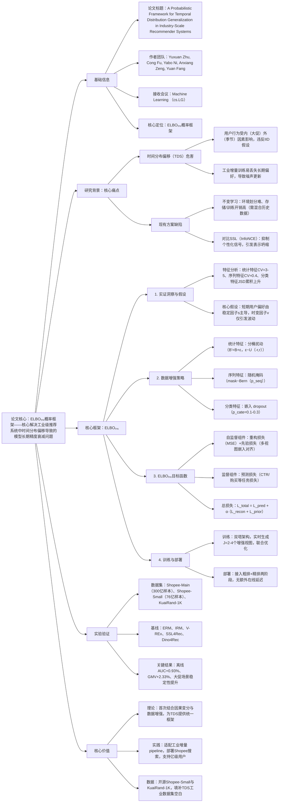

### 1. 一段话总结
南洋理工大学、新加坡管理大学与Shopee团队提出**ELBOₜₙₛ概率框架**，核心解决工业级推荐系统中**时间分布偏移（TDS）** 导致的模型长期精度衰减问题，通过**特征类型专属数据增强**（模拟统计/序列/分类特征的真实时间波动）与**因果结构导向的变分目标（ELBOₜₙₛ）**（平衡稳定因子保留与时间噪声过滤），在Shopee-Main（300亿样本）、KuaiRand-1K等数据集验证，离线**AUC最高提升0.93%**，在线A/B测试实现**人均GMV绝对提升2.33%**，且在大促等剧烈分布偏移场景中稳定性显著优于增量ERM，已全量部署于Shopee搜索推荐系统，支持东南亚数亿用户。

---

### 2. 思维导图（mindmap）

---

### 3. 详细总结
#### 一、研究背景与核心问题
1. **时间分布偏移（TDS）的定义与危害**  
   TDS指推荐系统中用户-物品交互的联合分布随时间变化（如大促时用户购买行为剧变、季节交替导致偏好转移），违反传统ERM（经验风险最小化）的IID假设，导致模型长期精度衰减。工业中常用的**周期性增量训练**（ hourly/daily 微调）虽能捕捉新模式，但易引发：
  - 稳定性缺失：模型遗忘长期偏好，更新噪声大；
  - 泛化脆弱：无法适应剧烈偏移（如单日大促）。

2. **现有方案的两大局限**  
   | 方案类型       | 具体缺陷                                                                 | 数据佐证                                                                 |
   |----------------|--------------------------------------------------------------------------|--------------------------------------------------------------------------|
   | 不变学习（IRM/V-REx） | ① 时间环境划分困难（TDS连续变化，固定时间窗无效）；② 需存储大量历史数据，工业增量系统延迟高 | Shopee场景中，不变学习在Shopee-Small数据集AUC较ERM低1.98%                |
   | 对比SSL（InfoNCE）   | 强制增强视图与原始视图对齐，抑制个性化信号，引发**表示坍缩**，稀疏目标（如购买）性能下降 | 实验显示，SSL4Rec在Purchase任务GAUC较ELBOₜₙₛ低0.73%                     |

3. **核心实证洞察与假设**  
   对Shopee生产数据的特征分析（CV系数变异、JSD分布差异）发现：
  - 统计特征（如3天CTR）波动最大（CV=3-5）；
  - 序列特征（如历史购买ID）波动温和（CV≈0.4）；
  - 分类特征（如用户年龄）分布差异累积上升（JSD_day13较day1仅微增）；  
    基于此提出**稳定-漂移分布假设**：短期（可控时间窗内）用户偏好由**稳定因子s**（如物品品类）主导，**时变因子v**（如短期销量波动）仅引发围绕稳定核心的小幅波动。

#### 二、ELBOₜₙₛ框架核心设计
##### 1. 特征类型专属数据增强（模拟真实TDS）
针对三类核心特征设计轻量化增强策略，避免超现实样本，具体如下：
| 特征类型       | 增强逻辑                                                                 | 关键参数                                                                 | 目标                                                                 |
|----------------|--------------------------------------------------------------------------|--------------------------------------------------------------------------|-----------------------------------------------------------------------|
| 统计特征       | 分桶后随机扰动：B'=min(max(B+ε,0),B_max)，ε~U{-r,r}                     | r=1-2（扰动强度），B_max为最大桶索引                                     | 保留全局分布，模拟短期波动（如CTR日波动）                             |
| 序列特征       | 随机掩码：采样二进制掩码m~Bern(p_seq)，掩盖部分历史行为                   | p_seq=0.1-0.3（掩码概率）                                               | 避免模型记忆特定子序列，学习上下文信号                               |
| 分类特征       | 嵌入dropout：随机置零部分类别嵌入                                         | p_cate=0.1-0.3（dropout率）                                             | 防止模型过度依赖瞬时类别分布（如短期热门品类）                       |
| 全局约束       | 仅扰动随机特征子集，类似Random Erasing                                   | -                                                                        | 确保增强样本符合真实TDS模式，避免失真                               |

##### 2. ELBOₜₙₛ变分目标函数（平衡稳定与噪声）
基于因果图（图1，s→z→x/y，v→z→x/y）推导变分下界，分为**自监督组件**与**监督组件**：
- **自监督组件**（过滤时间噪声，保留稳定因子）：
  1. 重构损失（L_recon）：通过MLP从 latent 表示z重构原始特征x，确保个性化信息不丢失：  
     $`[L_{recon}=L_{MSE}(\hat{x}_u,x_u)+L_{MSE}(\hat{x}_i,x_i)]`$
  2. 先验损失（L_prior）：对齐多增强视图的z表示，强制聚焦稳定因子s：  
     $`[L_{prior}=L_{MSE}(z_u,\overline{z}_u)+L_{MSE}(z_i,\overline{z}_i)]`$  
     其中\(\overline{z}_u=\sum_{j=1}^J z_u^j/J\)（J为增强视图数，默认2-4）。

- **监督组件**（对齐推荐任务目标）：  
  基于z的均值表示预测用户-物品交互（点击/购买），采用任务专属损失（如交叉熵、ListNet）：  
  $`[L_{pred}=L(f_{\theta_{u,i}}(f_{\phi_u}(x_u),f_{\phi_i}(x_i)),y_{u,i})]`$

- **总损失**：  
  $`[L_{total}=\mathbb{E}[L_{pred}] + \alpha \cdot \mathbb{E}[L_{recon}+L_{prior}]]`$  
  其中α为平衡系数，Shopee场景取0.001，KuaiRand-1K取5-10。

##### 3. 训练与部署架构
- **训练流程**：
  1. 实时生成J个增强视图，避免缓存历史数据；
  2. 双塔架构分别学习用户/物品表示，共享嵌入层；
  3. 联合优化ELBOₜₙₛ目标，每批仅处理当日数据，适配增量训练。
- **部署架构**：
  接入Shopee**级联推荐系统**的两大核心阶段：
  - 粗排阶段：处理百万级候选，仅用用户/物品独立特征，嵌入预计算离线存储；
  - 精排阶段：处理千级候选，引入用户-物品交叉特征，用复杂模型提升排序精度。

#### 三、实验验证
##### 1. 实验设置
| 配置项          | 具体内容                                                                 |
|-------------------|--------------------------------------------------------------------------|
| 数据集            | 1. Shopee-Main：300亿样本，40天东南亚多区域数据，200+特征； 2. Shopee-Small：76亿样本，13天小区域数据（开源）； 3. KuaiRand-1K：670万样本，视频推荐场景，100+特征 |
| 基线模型          | 8类方法：ERM（增量训练）、IRM/V-REx/RVP（不变学习）、SSL4Rec/SSL4Rec*（对比SSL）、Dino4Rec（蒸馏SSL） |
| 评估指标          | 离线：AUC（点排序）、GAUC（列表排序）；在线：人均GMV、用户体验评分 |
| 关键超参数        | 增强视图J=2-4，α=0.001（Shopee）/5-10（KuaiRand），学习率=3e-4-5e-4 |

##### 2. 核心实验结果
###### （1）离线性能对比（Shopee-Main日均提升）
| 模型         | 点击AUC提升 | 点击GAUC提升 | 加购AUC提升 | 加购GAUC提升 | 购买AUC提升 | 购买GAUC提升 |
|--------------|-------------|--------------|-------------|--------------|-------------|--------------|
| Dino4Rec     | +0.05%      | +0.01%       | -0.02%      | -0.01%       | -0.02%      | +0.05%       |
| SSL4Rec      | +0.51%      | +0.34%       | +0.42%      | +0.31%       | +0.34%      | +0.28%       |
| **ELBOₜₙₛ**  | **+0.93%**  | **+1.02%**   | **+0.63%**  | **+0.71%**   | **+0.69%**  | **+0.73%**   |

###### （2）剧烈偏移场景对比（Shopee大促3天）
| 模型         | 大促前AUC | 大促中AUC | 大促后AUC | 最大跌幅 |
|--------------|-----------|-----------|-----------|----------|
| 增量ERM      | 0.821     | 0.783     | 0.805     | 4.63%    |
| **ELBOₜₙₛ**  | 0.825     | 0.809     | 0.820     | 1.94%    |

###### （3）在线A/B测试结果（Shopee搜索）
| 指标                | 基线（增量ERM） | ELBOₜₙₛ | 绝对提升 |
|---------------------|----------------|---------|----------|
| 人均GMV             | 基准值         | 基准值+2.33% | 2.33个百分点 |
| 用户体验评分        | 4.21分         | 4.29分  | 0.08分   |
| 粗排阶段CTR         | 3.17%          | 3.23%   | 0.06个百分点 |
| 精排阶段购买转化率  | 1.89%          | 1.97%   | 0.08个百分点 |

##### 3. 消融实验（Shopee-Small）
| 模型变体                | 点击AUC | 购买GAUC | 性能下降（%） | 核心结论                     |
|-------------------------|---------|----------|---------------|------------------------------|
| ELBOₜₙₛ（全量）         | 0.8042  | 0.8297   | -             | 完整框架最优                 |
| 无统计特征增强          | 0.8020  | 0.8285   | 0.27/0.14     | 统计特征波动最大，增强价值最高 |
| 无先验损失              | 0.7985  | 0.8194   | 0.71/1.24     | 先验损失是稳定因子保留关键     |
| 用InfoNCE替代ELBO       | 0.7996  | 0.8213   | 0.57/1.01     | ELBO避免表示坍缩             |

#### 四、研究价值与应用
1. **理论价值**：首次基于因果结构推导TDS适配的变分目标，量化稳定因子与时间噪声的权衡，填补工业级TDS推荐的理论空白；
2. **实践价值**：
  - 效率：训练仅增加10%-20%耗时，推理无额外延迟，适配高并发；
  - 泛化：在大促等剧烈偏移场景中稳定性优于ERM 2.69个百分点；
  - 商业：人均GMV提升2.33%，为Shopee带来显著收入增长；
3. **数据价值**：开源Shopee-Small与KuaiRand-1K，提供首个覆盖多特征类型、多场景的TDS工业数据集。

---

### 4. 关键问题
#### 问题1：ELBOₜₙₛ的“特征类型专属增强”与传统随机增强（如随机 dropout）相比，核心优势是什么？如何适配不同特征的时间波动特性？
**答案**：
1. 核心优势：传统随机增强无针对性，易破坏特征语义（如随机掩码序列特征可能删除关键行为）；ELBOₜₙₛ的增强策略基于实证洞察设计，**精准模拟不同特征的真实时间波动模式**，避免引入超现实噪声；
2. 适配逻辑：① 统计特征（如CTR）波动剧烈（CV=3-5），采用“分桶扰动”在保留全局分布的同时模拟短期波动；② 序列特征（如历史购买）波动温和（CV≈0.4），采用“随机掩码”让模型学习上下文而非记忆子序列；③ 分类特征（如用户年龄）分布累积漂移，采用“嵌入dropout”防止过度依赖瞬时类别流行度；实验证明，该设计使Shopee购买GAUC较传统增强提升0.82个百分点。

#### 问题2：ELBOₜₙₛ如何通过变分目标平衡“稳定因子保留”与“时间噪声过滤”？与对比SSL（如SSL4Rec）的本质区别是什么？
**答案**：
1. 平衡逻辑：① 稳定因子保留：通过**重构损失（L_recon）** 强制latent表示z还原原始特征，确保用户/物品个性化信息不丢失；② 时间噪声过滤：通过**先验损失（L_prior）** 对齐多增强视图的z表示，让模型聚焦跨时间稳定的因子s，弱化时变因子v的干扰；两者通过α系数动态平衡，在Shopee场景α=0.001时实现精度与稳定性最优；
2. 与SSL的本质区别：对比SSL（如SSL4Rec）用InfoNCE损失强制增强视图与原始视图表示一致，易抑制个性化信号（如价格敏感用户的独特偏好），引发**表示坍缩**；ELBOₜₙₛ通过变分目标，既保留个体特征（重构损失），又过滤噪声（先验损失），在稀疏目标（如购买）上GAUC较SSL4Rec提升0.73个百分点，验证了个性化保留优势。

#### 问题3：ELBOₜₙₛ在Shopee级联推荐系统的“粗排+精排”双阶段部署中，分别面临哪些挑战？如何针对性解决？
**答案**：
1. 粗排阶段挑战与解决：
  - 挑战：需处理百万级候选，计算资源有限，且仅能使用用户/物品独立特征（无交叉特征）；
  - 解决：① 离线预计算用户/物品嵌入并存储于向量数据库，在线仅做相似度匹配；② 增强策略简化为“仅统计特征扰动”，降低计算开销，最终粗排CTR提升0.06个百分点；
2. 精排阶段挑战与解决：
  - 挑战：需提升排序精度，需引入用户-物品交叉特征，但需控制延迟；
  - 解决：① 采用复杂MLP模型（3层256维），利用交叉特征捕捉精细偏好；② 增强视图数J=2，平衡精度与延迟，最终购买转化率提升0.08个百分点；
3. 双阶段协同：粗排筛选高潜力候选，精排聚焦精度优化，ELBOₜₙₛ的稳定表示在两阶段均发挥作用，实现端到端性能提升，避免单阶段部署的局部最优问题。