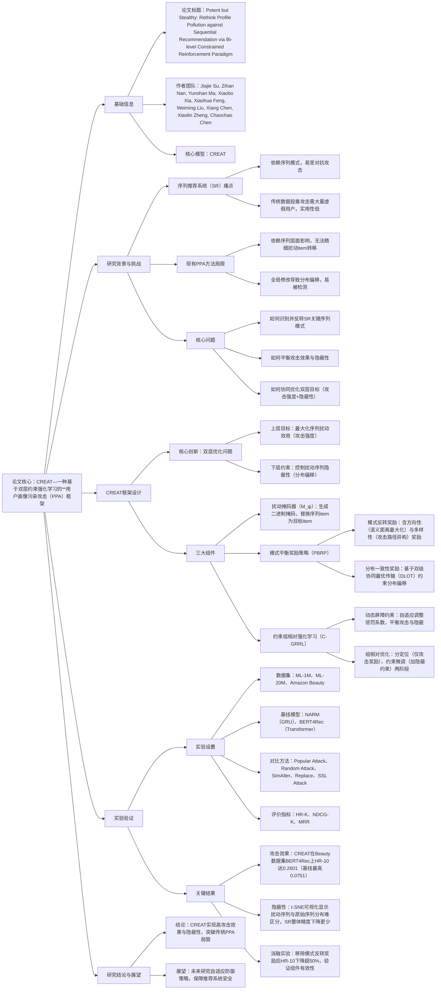

### 1. 一段话总结
浙江大学、北京大学等团队提出**CREAT（Constrained REinforcement driven ATtack）**——一种基于双层约束强化学习的**用户画像污染攻击（PPA）框架**，旨在解决传统PPA方法对序列层面依赖强、易被检测的问题。CREAT通过**模式平衡奖励策略（PBRP）** （融合模式反转奖励与分布一致性奖励）识别并反转序列推荐系统（SR）的关键模式，同时最小化分布偏移；结合**约束组相对强化学习（C-GRRL）** ，通过动态屏障约束与组共享经验回放实现逐步扰动。在ML-1M、ML-20M、Amazon Beauty三个数据集上的实验表明，CREAT在**HR@10、NDCG@10**等指标上显著优于SimAlter、Replace等基线方法，例如在Beauty数据集BERT4Rec模型上，HR@10达0.2601（基线SSL Attack仅0.0109），且扰动序列与原始序列分布差异小，具备高隐蔽性。

---

### 2. 思维导图（mindmap）

---

### 3. 详细总结
#### 一、研究背景：序列推荐系统的安全隐患与现有攻击的局限
1. **序列推荐系统（SR）的核心价值与脆弱性**  
   SR通过建模用户交互序列挖掘动态兴趣，广泛应用于电商、短视频等场景，但对**序列模式的敏感性**使其易受对抗攻击。现有攻击主要分为两类：
    - **数据投毒攻击**：注入大量伪造序列，但需大规模用户账号或虚假画像，现实场景中实用性低；
    - **用户画像污染攻击（PPA）**：篡改少量真实用户的交互历史，诱导SR产生目标误推荐，更具隐蔽性与实用性。

2. **现有PPA方法的两大核心局限**
    - **攻击粒度粗**：依赖“序列层面”影响（如全局序列结构修改），无法精细扰动item间的转移模式，导致攻击强度低，仅对特定兴趣用户有效；
    - **隐蔽性差**：全局修改强制序列兴趣向目标对齐，引发显著**分布偏移**，易被检测机制识别（如基于序列分布异常的监控）。

3. **研究目标**  
   设计一种能**精准反转SR关键模式**、同时**最小化分布偏移**的PPA方法，实现“高攻击效果+高隐蔽性”的平衡。

#### 二、CREAT框架：双层约束强化学习的画像污染攻击
CREAT将PPA重构为**双层优化问题**（上层最大化攻击强度，下层约束隐蔽性），通过三大核心组件实现目标，框架如图2所示。

##### 1. 问题定义：PPA的数学形式
设SR模型为$`\Phi_\theta`$，用户交互序列为$`s_u=[v_1,...,v_L]`$，PPA目标是在**扰动预算$`M≤K`$**（替换item数量限制）下，将部分序列$`S`$修改为$`S'`$，最大化目标item$`v^*`$的推荐曝光率$`ER(v^*)`$：
$`\hat{\theta}=\arg\min_{\theta}\sum_{s_u \in (D\setminus S)\cup S'} L(s_u;\theta)`$
$`\tilde{S}=\arg\max_{S'}\mathbb{E}_{u\sim U}[ER(v^*|\Phi_{\hat{\theta}}(s_u))]`$
其中$`\hat{\theta}`$为污染后的SR参数，$`\tilde{S}`$为最优扰动序列集。

##### 2. 核心组件1：扰动掩码器（Perturbation Masker）
- **功能**：生成二进制掩码$`m\in\{0,1\}^L`$（$`m_t=1`$表示将$`s_t`$替换为$`v^*`$），按步骤迭代构建扰动序列：
  $`s'(i)=s'(i-1)\odot(1-m(i))+v^*\cdot m(i)`$
- **优化目标**：在预算$K$内，选择最优替换位置，平衡攻击效果与隐蔽性。

##### 3. 核心组件2：模式平衡奖励策略（PBRP）
融合两种奖励，分别优化上层攻击强度与下层隐蔽性：

| 奖励类型          | 核心目标                | 计算逻辑                                                                 | 关键指标/公式                                                                 |
|-------------------|-------------------------|--------------------------------------------------------------------------|-------------------------------------------------------------------------------|
| 模式反转奖励      | 最大化攻击强度          | 识别并反转SR依赖的关键序列模式，包含**方向性奖励**（语义距离最大化）与**多样性奖励**（攻击路径异构） | 方向性奖励：$`R_{dir}^{(i)}=\sum_{j=1}^i[D(\varphi_{rec}(S_{t_j}^p),\varphi_{rec}(v^*))+D(\varphi_{rec}(v^*),\varphi_{rec}(S_{t_j}^f))]`$；多样性奖励：$`R_{div}^{(i)}=\log\det(G_y^{(i)})`$（$`G_y`$为Gram矩阵） |
| 分布一致性奖励    | 最小化分布偏移          | 基于**双级协同最优传输（DLOT）**，约束扰动序列与原始序列在“全局序列+局部模式”的分布差异 | $`R_{dist}^{(i)}=-DLOT_{\lambda_1,\lambda_2}(\mathbb{X}_{orig},\mathbb{X}_{pert}^{(i)})`$，DLOT同时对齐序列级（$`h_{orig}/h_{pert}`$）与模式级（$`p_{orig}/p_{pert}`$）表示 |

##### 4. 核心组件3：约束组相对强化学习（C-GRRL）
分两阶段优化，解决双层目标协同问题：

| 阶段                | 核心任务                                  | 关键设计                                                                 |
|---------------------|-------------------------------------------|--------------------------------------------------------------------------|
| 定位阶段（Localization） | 学习有效攻击行为                          | 仅用模式反转奖励训练掩码器，生成纯攻击目标的策略$`\pi_{att}`$，类似有监督微调 |
| 约束微调阶段（Constrained Fine-tuning） | 加入隐蔽性约束，优化最终策略              | 1. **动态屏障约束**：自适应调整惩罚系数$`\delta`$，公式为$`\delta=\left[\frac{J_{dist}-\rho_{st}-\nabla_\psi J_{dist}^\top\nabla_\psi(J_{dir}+J_{div})}{\|\nabla_\psi J_{dist}\|^2+\kappa}\right]_+`$；2. **组相对优化**：采样$`G`$条轨迹，计算组基线$`\mu_G`$与标准差$`\sigma_G`$，归一化优势函数$`\hat{A}_{i,t}=\frac{r_{i,t}-\mu_{G,t}}{\sigma_{G,t}+\epsilon}`$，稳定训练 |

#### 三、实验验证：攻击效果与隐蔽性的双重优势
##### 1. 实验设置
| 配置项                | 具体内容                                                                 |
|-----------------------|--------------------------------------------------------------------------|
| 数据集                | ML-1M（6,040用户，3,416item）、ML-20M（138,493用户，18,345item）、Amazon Beauty（22,363用户，12,101item） |
| 基线SR模型            | NARM（GRU-based）、BERT4Rec（Transformer-based）                         |
| 对比攻击方法          | Popular Attack（注入热门item）、Random Attack（随机注入）、SimAlter（梯度导向注入）、Replace（梯度导向替换）、SSL Attack（生成式投毒） |
| 评价指标              | 攻击效果：HR@1/5/10、NDCG@5/10、MRR；隐蔽性：SR整体精度下降率、t-SNE分布可视化 |
| 实验环境              | Ubuntu 22.04.4 LTS，4×RTX 3090，2×12核Xeon Silver 4116，503GB RAM        |

##### 2. 关键实验结果
#### （1）整体攻击效果：CREAT显著优于基线
以Beauty数据集（最稀疏，攻击难度最高）为例，BERT4Rec模型上的关键指标对比：

| 攻击方法   | HR@10  | NDCG@10 | MRR    |
|------------|--------|---------|--------|
| Pure（无攻击） | 0.0000 | 0.0000  | 0.0022 |
| Popular    | 0.0000 | 0.0000  | 0.0026 |
| SimAlter   | 0.0048 | 0.0017  | 0.0068 |
| Replace    | 0.0000 | 0.0000  | 0.0034 |
| SSL Attack | 0.0109 | 0.0060  | 0.0097 |
| **CREAT**  | **0.2601** | **0.1038**  | **0.0773** |

- 结论：CREAT的HR@10是最佳基线（SSL Attack）的**23.9倍**，证明其对稀疏数据集的强攻击能力。

#### （2）消融实验：验证组件有效性
以ML-1M数据集NARM模型为例，移除关键组件后的性能下降：

| 模型变体       | HR@10  | 相对下降率 | 结论                     |
|----------------|--------|------------|--------------------------|
| CREAT（全组件） | 0.1428 | -          | 基准性能                 |
| w/o dir（无方向性奖励） | 0.1027 | 28.0%      | 方向性奖励对攻击强度至关重要 |
| w/o div（无多样性奖励） | 0.1027 | 28.0%      | 多样性奖励避免攻击路径单一 |
| w/o pv（无模式反转奖励） | 0.0560 | 60.8%      | 模式反转是攻击核心       |
| w/o dist（无分布一致性奖励） | 0.1069 | 25.1%      | 分布一致性奖励牺牲少量攻击效果换隐蔽性 |

#### （3）隐蔽性验证：扰动序列难被检测
- **SR整体精度影响**：CREAT导致ML-1M数据集NARM模型的HR@10下降2.63%，而Replace下降5.33%，证明其对系统正常推荐的干扰更小；
- **t-SNE可视化**：Popular、Random的扰动序列与原始序列分布差异明显，而CREAT的扰动序列完全融入原始序列簇，无明显异常。

#### （4）目标item流行度适应性：对长尾item攻击效果更优
在ML-20M数据集BERT4Rec模型上，不同流行度目标item的HR@10对比：

| 目标item类型 | Pure   | SimAlter | Replace | CREAT   |
|--------------|--------|----------|---------|---------|
| Head（头部） | 0.2139 | 0.3401   | 0.3816  | 0.4590  |
| Medium（中部） | 0.0046 | 0.1398   | 0.0872  | 0.2628  |
| Tail（长尾） | 0.0000 | 0.0000   | 0.0000  | 0.1502  |

- 结论：CREAT是唯一能有效提升长尾item曝光的方法（HR@10达0.1502），而其他基线对长尾item攻击效果接近0，符合现实场景中攻击者对长尾item的推广需求。

#### 四、研究结论与未来展望
1. **核心结论**
    - CREAT通过“模式层面扰动+双层约束优化”，突破传统PPA的粗粒度与低隐蔽性局限，在三个数据集、两种SR模型上均实现最优攻击效果；
    - 动态屏障约束与组相对优化确保了“攻击效果-隐蔽性”的平衡，扰动序列难以被现有防御机制（如ADVTrain）检测。

2. **未来方向**
    - 研究针对CREAT的自适应防御策略，如基于模式异常检测的扰动识别；
    - 扩展框架到其他推荐场景（如跨域推荐、实时推荐），评估其泛化性。

---

### 4. 关键问题
#### 问题1：CREAT提出的“模式层面扰动”与传统PPA的“序列层面扰动”核心差异是什么？这种差异如何提升攻击效果与隐蔽性？
**答案**：  
核心差异在于**扰动粒度与作用逻辑**：
- 传统PPA的“序列层面扰动”：基于全局序列结构修改（如整体兴趣对齐目标item），依赖序列级影响放大攻击效果，导致攻击粒度粗，仅对特定兴趣用户有效，且全局修改易引发显著分布偏移；
- CREAT的“模式层面扰动”：聚焦SR依赖的**关键item转移模式**（如“短视频→美妆广告”的关联模式），通过反转这些模式（如插入目标item到模式中），利用模式的“协同级联效应”（修改一个模式可影响多个相似模式）放大攻击效果，同时仅局部调整模式结构，避免全局序列兴趣偏移。

提升效果与隐蔽性的机制：
- 攻击效果：模式是SR建模用户兴趣的核心，反转关键模式能直接误导SR对用户意图的理解，且级联效应使少量模式修改覆盖大量相似交互场景；
- 隐蔽性：局部模式修改不会改变序列的整体兴趣分布（如用户仍以“看短视频”为主），仅微调item间的关联，t-SNE可视化显示扰动序列与原始序列分布无明显差异，难以被检测。

#### 问题2：CREAT的动态屏障约束如何实现“攻击效果与隐蔽性”的自适应平衡？请结合具体公式说明其工作原理。
**答案**：  
动态屏障约束通过自适应调整惩罚系数$\delta$，在约束违反时增强隐蔽性，在梯度冲突时优先保证攻击效果，核心公式为：  
$`\delta=\left[\frac{J_{dist}-\rho_{st}-\nabla_\psi J_{dist}^\top\nabla_\psi(J_{dir}+J_{div})}{\|\nabla_\psi J_{dist}\|^2+\kappa}\right]_+`$  
其中：
- $`J_{dist}`$：分布一致性奖励的期望（值越小，分布偏移越大）；
- $`\rho_{st}`$：动态隐蔽阈值（由组轨迹的$`\mu_G^{dist}+\lambda_{st}\cdot\sigma_G^{dist}`$计算）；
- $`\nabla_\psi J_{dist}^\top\nabla_\psi(J_{dir}+J_{div})`$：模式反转奖励与分布一致性奖励的梯度内积（衡量梯度对齐程度）；
- $`\kappa`$：数值稳定常数，$`\left[\cdot\right]_+`$：非负投影（$`\delta≥0`$）。

工作原理：
1. **约束违反时（$`J_{dist}>\rho_{st}`$）**：分子中$`J_{dist}-\rho_{st}`$为正，$`\delta`$增大，强化对分布一致性的惩罚，迫使扰动序列减少偏移；
2. **梯度冲突时（内积为负，即攻击与隐蔽目标梯度相反）**：分子中$`-(\text{负内积})`$变为正，$`\delta`$减小，优先保证模式反转奖励的优化，避免因过度约束牺牲攻击效果；
3. **约束满足且梯度对齐时（$`J_{dist}≤\rho_{st}`$且内积为正）**：$`\delta`$保持较小值，平衡两者优化。

这种设计使$\delta$随训练动态调整，无需人工设定固定惩罚系数，实现“攻击-隐蔽”的自适应平衡。

#### 问题3：从实验结果看，CREAT对长尾item的攻击效果显著优于基线，这一优势的技术原因是什么？对现实场景有何意义？
**答案**：
#### （1）技术原因：
传统基线对长尾item攻击无效的核心是“依赖历史交互数据”，而CREAT通过“模式泛化”突破数据稀疏限制：
- 传统方法（如SimAlter、Replace）：基于梯度或影响函数识别脆弱item，但长尾item的历史交互少，梯度信号弱，难以找到有效扰动位置；
- CREAT：通过“模式反转奖励”聚焦**item间的转移模式**，而非单个item的交互频率。长尾item虽交互少，但可能属于某个高频模式（如“小众香薰→长尾香薰蜡烛”），CREAT修改该模式即可泛化到所有同类长尾item，无需依赖长尾item自身的历史数据。

例如，在ML-20M数据集上，长尾item“独立电影”虽交互少，但属于“文艺纪录片→独立电影”的模式，CREAT插入目标独立电影到该模式中，即可让SR将该模式下的用户推荐目标item。

#### （2）现实意义：
- 对攻击者：现实中攻击者常需推广无流量的长尾item（如新品、小众商品、违规内容），CREAT的长尾攻击能力使其具备实际滥用价值（如提升小众违规商品的曝光）；
- 对推荐平台：揭示了SR在长尾item推荐上的安全漏洞，警示平台需加强对“模式级异常”的监控，而非仅关注item交互频率异常；
- 对防御研究：推动防御方法从“序列分布检测”转向“模式异常检测”，例如通过监控关键模式的突然变化识别CREAT类攻击。