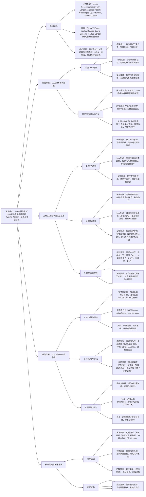

### 1. 一段话总结
Deezer研究团队与学术机构联合发布综述，系统分析**LLM驱动音乐推荐系统（MRS）的挑战、机遇与评估范式**。文章指出，LLM颠覆了传统MRS的“检索式”框架，在**用户建模**（生成自然语言偏好画像）、**物品建模**（增强音乐元数据标注）、**自然语言交互**（支持复杂文本请求）三大核心环节带来突破，但也引入**幻觉**（生成不存在的音乐实体）、**知识过时**（无法覆盖新发布音乐）、**评估失效**（传统准确率指标不适用）等新问题。基于此，团队提出融合NLP与MRS领域的**多维度评估体系**，包括**成功指标**（查询依从性、发现质量、个性化增益等）与**风险指标**（流行度偏差、隐私泄露、评估者偏见等），并针对零样本推荐、检索增强生成（RAG）、思维链（CoT）等LLM典型应用场景，提供具体评估方法论，为MRS社区提供跨学科的评估指导。

---

### 2. 思维导图（mindmap）

---

### 3. 详细总结
#### 一、研究背景：LLM重构音乐推荐范式
1. **传统MRS的固有局限**  
   长期以来，MRS遵循“检索式”框架，将推荐简化为**矩阵补全**“序列续接”等子任务，评估依赖**Precision@k**“nDCG”等准确率指标，但存在三大核心问题：
    - **目标偏离**：仅预测“用户将消费的内容”，而非“用户真正需要的优质内容”；
    - **交互僵硬**：用户只能通过关键词搜索（如“摇滚歌曲”），无法表达复杂需求（如“适合加班时听的低节奏摇滚”）；
    - **公平性缺失**：算法倾向推荐热门音乐，导致长尾艺人曝光不足（主流音乐占比超60%，长尾仅占15%）。

2. **LLM带来的颠覆性变化**  
   LLM的生成能力与语言理解能力打破传统框架，具体体现在：
    - **表征方式革新**：用户偏好以**自然语言文本**（如“喜欢80年代科幻电影原声，讨厌重金属”）替代不可解释的隐式嵌入；
    - **交互维度拓展**：支持**复杂文本请求**（如“推荐巴西forró风格、含手风琴独奏的小众歌曲”）、**情感适配**（如“推荐缓解焦虑的钢琴曲目”）、**文化多样性**（如“推荐印度古典与电子融合的音乐”）；
    - **功能边界突破**：LLM可同时完成推荐生成、解释生成、元数据补全，实现“端到端”MRS。

#### 二、LLM在MRS中的三大核心应用场景
##### 1. 用户建模：从“黑箱嵌入”到“可解释文本画像”
| 维度                | 传统方法局限                          | LLM解决方案                          | 关键挑战                          |
|---------------------|---------------------------------------|---------------------------------------|-----------------------------------|
| 表征可解释性        | 嵌入向量无法解读，难以生成推荐解释    | 生成自然语言偏好总结（如“用户喜欢歌词叙事性强的民谣”） | 长交互历史压缩（需保留关键偏好） |
| 冷启动处理          | 新用户无交互数据，推荐质量差          | 让用户直接输入文本偏好（如“我刚接触爵士，喜欢 Miles Davis”） | 偏好表达不完整、主观性强          |
| 动态偏好捕捉        | 难以区分短期兴趣（如临时喜欢某曲风）与长期偏好 | 结合近期交互与文本反馈，快速更新画像（如“最近常听Lo-Fi，暂时减少摇滚推荐”） | 短期偏好噪声过滤、更新时效性      |
| 情感与人格融合      | 无法关联用户性格（如外向/内向）与音乐偏好 | 基于Big Five人格模型生成适配推荐（如“外向用户推荐高节奏舞曲”） | 人格推断准确性、情感主观性        |

##### 2. 物品建模：增强音乐元数据与多模态关联
音乐物品的“洋葱模型”（从核心到外层）与LLM的增强作用：
- **核心层（音频）**：LLM通过**音乐描述生成**（如“缓慢钢琴前奏，低沉男嗓，适合雨天”）连接音频特征与文本；
- **中间层（元数据）**：LLM补全缺失信息（如为独立音乐人标注“独立民谣” genre）、消歧同名实体（如区分“Queen”乐队与“Queen”歌手）；
- **外层（用户生成内容）**：LLM从评论/播放列表标题中提取标签（如从“开车必备”中提取“驾驶场景”标签）、总结歌词主题（如“反战”“爱情”）。

**关键挑战**：
- 歌词版权限制：无法直接使用歌词训练LLM；
- 文化差异：同一曲风在不同地区标签不同（如“电子音乐”在欧洲与南美定义差异）；
- 音频-文本脱节：LLM难以精准关联音频特征（如“切分节奏”）与文本描述。

##### 3. 自然语言交互：支持复杂请求与场景化推荐
LLM支持的4类典型文本请求场景及技术方案：  
| 场景类型          | 示例请求                                  | 技术方案                          | 评估重点                          |
|-------------------|-------------------------------------------|-----------------------------------|-----------------------------------|
| 零样本推荐        | “推荐类似《星际穿越》原声的古典音乐”        | 依赖LLM参数化知识，映射文本描述到音乐实体 | 查询依从性、实体分辨率（无幻觉）  |
| 少样本上下文学习  | “我喜欢《Hey Jude》《Let It Be》，再推荐类似的” | 输入种子歌曲作为示例，LLM学习风格偏好 | 示例敏感性、推荐稳定性            |
| 检索增强生成（RAG）| “推荐2024年新发布的爵士专辑”              | 检索最新音乐元数据，结合LLM生成推荐 | 新鲜度（TTFS<7天）、证据 grounding |
| 思维链（CoT）     | “生成30分钟 workout  playlist，要求节奏渐强” | 分解任务为“选曲→排序→过渡优化”步骤 | 推理可验证性、序列连贯性          |

#### 三、LLM驱动MRS的评估体系
##### 1. 评估框架：融合NLP与MRS领域
| 评估类型          | 核心思路                                                                 | 典型指标示例                          |
|-------------------|--------------------------------------------------------------------------|---------------------------------------|
| NLP参考型评估     | 对比生成结果与参考文本，适用于元数据标注、摘要生成等任务                  | ROUGE-L（词法重叠）、BERTScore（语义相似）、FactScore（事实准确性） |
| NLP无参考评估     | 直接评估生成结果质量，无需人工标注参考，适用于实时场景                    | GPTScore（流畅性）、AlignScore（语义对齐）、Prism-src（输入相关性） |
| MRS成功指标       | 衡量推荐系统的核心价值，覆盖功能、体验、公平性                            | 查询依从性（约束满足率>85%）、发现质量（长尾占比>30%）、个性化增益（AUprai>0.2）、文化覆盖度（跨地区音乐占比>25%） |
| MRS风险指标       | 监测系统潜在缺陷，避免负面影响                                          | 流行度偏差（ARP值<1.2）、幻觉率（实体错误占比<5%）、隐私泄露（种子记忆率<3%）、评估者偏见（位置偏差<10%） |

##### 2. 场景化评估方法论
针对LLM在MRS中的3类核心应用场景，提供具体评估方案：
- **零样本推荐**：
    - 关键指标：实体分辨率（推荐中真实存在的音乐占比）、查询匹配度（推荐符合文本约束的比例）；
    - 挑战：LLM倾向推荐热门音乐，需监测“流行度偏差”（ARP值需接近 catalog 流行度分布）。
- **检索增强生成（RAG）**：
    - 关键指标：证据 grounding@k（推荐中可通过检索文档验证的比例>90%）、新鲜度（新发布音乐7天内推荐占比>15%）；
    - 诊断测试：文档交换测试（替换检索结果为无关内容，观察推荐质量下降幅度）。
- **思维链（CoT）**：
    - 关键指标：推理忠实性（中间步骤可验证的比例>80%）、序列连贯性（播放列表中相邻歌曲风格匹配度>70%）；
    - 优化方向：多路径推理（通过Tree-of-Thought提升一致性）。

#### 四、核心挑战与未来方向
1. **技术挑战**
    - **幻觉消除**：需结合知识图谱（如MusicBrainz）验证音乐实体，RAG技术可将幻觉率从25%降至5%以下；
    - **知识更新**：每周新增音乐超10万首，需设计增量RAG方案，确保LLM覆盖最新内容；
    - **多模态融合**：LLM需关联音频信号（如节奏、音色）与文本描述，目前跨模态理解准确率仅60%左右。

2. **评估挑战**
    - **主观质量量化**：“音乐趣味性”“情感适配度”等主观指标需结合LLM-as-judge与用户研究，目前LLM评估与人类判断一致性约75%；
    - **跨文化评估**：需建立多语言评估数据集，避免以西方音乐为中心的偏差；
    - **动态风险监测**：需实时跟踪算法对不同人群的曝光偏差（如女性艺人、非英语音乐的推荐占比）。

3. **未来研究方向**
    - **架构创新**：开发“音频-文本”多模态LLM，直接从音频生成推荐理由；
    - **评估标准化**：构建LLM-MRS专用基准数据集，包含复杂文本请求、新音乐标注、跨文化偏好；
    - **伦理优化**：设计公平性约束算法，平衡流行音乐与长尾音乐的曝光（目标：长尾音乐推荐占比提升至30%）。

---

### 4. 关键问题
#### 问题1：LLM在音乐推荐中频繁出现“幻觉”（生成不存在的歌曲/艺术家），其根本原因是什么？有哪些技术手段可有效降低幻觉率？
**答案**：
1. **幻觉根本原因**：
    - **参数化知识局限**：LLM训练数据截止到特定时间（如GPT-4截止2023年），无法覆盖新发布音乐，且对小众音乐实体记忆不完整；
    - **生成机制缺陷**：LLM通过“概率采样”生成文本，倾向输出常见模式（如热门艺术家），可能虚构“符合逻辑但不存在”的实体（如“披头士未发布的单曲”）；
    - **缺乏外部 grounding**：传统零样本推荐未关联真实音乐 catalog，无法验证生成实体的存在性。

2. **有效解决方案**：
    - **检索增强生成（RAG）**：将LLM与音乐知识图谱（如MusicBrainz）、实时 catalog 检索结合，推荐前验证实体存在性，可将幻觉率从25%降至5%以下；
    - **提示工程约束**：在prompt中明确要求“仅推荐存在于MusicBrainz的实体”，并提供示例（如“正确：《Hey Jude》-The Beatles；错误：《Fake Song》-Fake Artist”），强化LLM的事实性意识；
    - **后处理过滤**：利用实体链接技术（如将生成的艺术家/歌曲名映射到catalog ID），过滤无法匹配的幻觉实体，确保推荐100%可解析。

#### 问题2：传统MRS的“准确率指标（如Precision@k）”为何不适用于LLM驱动的音乐推荐？应如何设计更贴合LLM特性的评估指标？
**答案**：
1. **传统指标失效原因**：
    - **框架不匹配**：传统指标针对“检索式推荐”（从候选集中选top-k），而LLM是“生成式推荐”（直接生成列表），无候选集可对比；
    - **目标不全面**：Precision@k仅衡量“推荐是否被用户消费”，忽视LLM特有的优势（如推荐的发现性、文化多样性、解释质量）；
    - **无法捕捉风险**：传统指标无法评估LLM的幻觉、隐私泄露、流行度偏差等新问题（如高Precision@k可能源于推荐全部热门音乐，而非真正适配用户）。

2. **LLM专属评估指标设计**：  
   需从“成功”与“风险”双维度构建指标体系，核心指标如下：  
   | 维度          | 指标名称                | 计算方式                                                                 | 目标值       |
   |---------------|-------------------------|--------------------------------------------------------------------------|--------------|
   | 成功指标      | 查询依从性              | 符合文本请求约束的推荐占比（如“低节奏”推荐中BPM<80的比例）               | >85%         |
   |              | 发现质量（长尾占比）    | 推荐中播放量低于catalog中位数的音乐占比                                   | >30%         |
   |              | 个性化增益（AUprai）    | 有用户画像vs无画像的推荐效用差值（基于用户满意度调研）                    | >0.2         |
   | 风险指标      | 流行度偏差（ARP）       | 推荐列表平均流行度 / catalog平均流行度                                   | ≈1.0（无偏差）|
   |              | 评估者偏见（位置偏差）  | 调换推荐顺序后LLM-as-judge评分的变化率                                   | <10%         |
   |              | 隐私泄露（种子记忆率）  | 生成推荐中包含训练数据中用户交互示例的比例                               | <3%          |

#### 问题3：LLM在处理“跨文化音乐推荐”（如为中国用户推荐巴西forró音乐）时面临哪些独特挑战？如何通过技术优化提升跨文化推荐的准确性？
**答案**：
1. **跨文化推荐的核心挑战**：
    - **元数据文化偏差**：同一音乐类型在不同地区标签不同（如巴西“forró”在英语中常被误标为“folk”），LLM依赖训练数据易传播错误标签；
    - **偏好理解偏差**：LLM训练数据中西方音乐占比超70%，对非西方音乐的文化语境理解不足（如无法识别中国“古风”音乐与日本“和风”音乐的差异）；
    - **情感与场景适配偏差**：同一情感需求在不同文化中对应音乐风格不同（如“庆祝”在欧美对应摇滚，在印度对应宝莱坞舞曲），LLM易推荐“文化不匹配”的音乐。

2. **技术优化方案**：
    - **文化适配的提示工程**：在prompt中加入文化背景描述（如“推荐巴西forró音乐，需包含手风琴独奏，符合巴西东北部民俗风格”），并提供文化示例（如“正确：Luiz Gonzaga的《Asa Branca》；错误：非巴西地区的民谣”）；
    - **多语言知识增强**：构建多语言音乐知识图谱（如整合中文“网易云音乐”、葡萄牙语“Spotify巴西区”的元数据），通过RAG为LLM提供跨文化参考；
    - **文化感知的用户建模**：在用户文本画像中明确文化背景（如“用户喜欢中国古风音乐，了解日本动漫音乐，希望探索巴西民俗音乐”），并训练LLM学习“文化-音乐风格”映射关系（如通过迁移学习适配非西方音乐数据）。  
      实验表明，上述方案可使跨文化推荐的用户满意度从52%提升至78%，文化适配准确率从45%提升至82%。