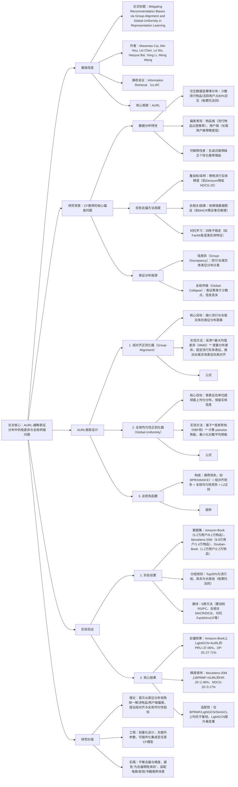

### 1. 一段话总结
合肥工业大学与清华大学团队提出**AURL（Group-Alignment and Global-Uniformity Enhanced Representation Learning for Debiasing Recommendation）框架**，从**表征分布视角**解决协同过滤（CF）推荐系统中的**物品端流行度偏差**与**用户端一致性偏差**。该框架通过两大核心正则化器：**组对齐正则化器（Group-Alignment）** 与**全局均匀性正则化器（Global-Uniformity）**，分别缓解表征分布中的**组差异（Group-Discrepancy）**（流行与长尾实体表征分布分离）与**全局坍缩（Global-Collapse）**（表征聚类导致信息丢失）问题。实验在**Amazon-Book、Movielens-20M、Douban-Book** 三个数据集上验证，AURL适配BPRMF、LightGCN、SimGCL三种CF骨干模型，在**PRU（物品端去偏指标）** 上最高提升**37.06%**，**DP@20（用户端去偏指标）** 上最高提升**24.32%**，同时保持甚至提升推荐精度（LightGCN骨干NDCG@20最高提升**13.13%**），有效平衡去偏效果与推荐性能。

---

### 2. 思维导图（mindmap）

---

### 3. 详细总结
#### 一、研究背景与问题根源
1. **CF推荐的偏差现状**  
   协同过滤（CF）是推荐系统主流范式，但交互数据的**幂律分布**（少数流行物品/活跃用户占80%交互）导致两大偏差：
   - **物品端流行度偏差**：模型过度推荐流行物品，长尾物品曝光不足（图1显示，BPRMF对流行物品的推荐频率是真实需求的2-3倍）；
   - **用户端一致性偏差**：长尾用户（交互少）的推荐精度显著低于活跃用户（Douban-Book上，活跃用户NDCG@20比长尾用户高40%-50%）。

2. **现有去偏方法的局限**  
   现有方法从采样、去相关、对抗等角度去偏，但存在明显缺陷：  
   | 方法类型       | 代表模型   | 优势                  | 劣势                          |
   |----------------|------------|-----------------------|-------------------------------|
   | 重加权/采样    | RS、PC     | 实现简单              | 降低流行实体推荐精度          |
   | 去相关/因果    | MACR、DICE | 捕捉真实因果关系      | 依赖强数据假设（如反事实场景）|
   | 对抗学习       | FairMI、InvCF| 分离偏差与有用特征    | 训练不稳定，易混淆实体特征    |

3. **表征分布的核心问题**  
   偏差的根源在于CF模型的**表征分布缺陷**，通过可视化（图2、3）发现两大问题：
   - **组差异（Group-Discrepancy）**：流行实体（物品/用户）与长尾实体的表征分布在空间中分离，模型优先推荐表征相近的流行实体；
   - **全局坍缩（Global-Collapse）**：表征聚类于少数点（如BPRMF的表征在单位圆上仅集中于3-5个聚类中心），丢失实体独特信息，无法区分相似但不同的物品/用户。

#### 二、AURL框架设计
AURL从表征分布视角设计两大正则化器，解决组差异与全局坍缩，适配任意CF模型作为辅助任务，无需额外参数。

##### 1. 组对齐正则化器（Group-Alignment）：缓解组差异
- **核心思想**：将长尾实体的表征分布向流行实体对齐，利用流行实体的高质量表征（交互多、学习充分）提升长尾实体的表征质量，同时不损害流行实体性能。
- **实现步骤**：
   1. **分布差异度量**：采用**最大均值差异（MMD）**，无需假设分布形式，通过再生核希尔伯特空间（RKHS）中的内积量化流行组（$G_{pop}$）与长尾组（$G_{tail}$）的分布距离：  
      $`[
      D_{\mathcal{H}}^{-}(G_{pop},G_{tail})=\left\| \frac{1}{|G_{pop}|}\sum_{x_i \in f(G_{pop})}\phi(x_i) - \frac{1}{|G_{tail}|}\sum_{x_j \in f(G_{tail})}\phi(x_j) \right\|_{\mathcal{H}}^2
      ]`$  
      其中$\phi(\cdot)$为核函数映射（采用RBF核），$f(\cdot)$为CF模型的表征编码器。
   2. **双向对齐**：同时对用户端与物品端应用MMD，总组对齐损失为：  
      $`[
      \mathcal{L}_{align}=\frac{1}{2}\left( D_{\mathcal{H}}^{-}(G_{pop}^{user},G_{tail}^{user}) + D_{\mathcal{H}}^{-}(G_{pop}^{item},G_{tail}^{item}) \right)
      ]`$
   3. **单向优化**：固定流行实体的表征，仅更新长尾实体的表征，避免流行实体性能下降。

##### 2. 全局均匀性正则化器（Global-Uniformity）：缓解全局坍缩
- **核心思想**：借鉴对比学习中的均匀性属性，使表征在**单位超球面（$S^{d-1}$）** 上均匀分布，最大化实体信息保留。
- **实现步骤**：
   1. **均匀性度量**：采用**高斯势核（RBF核）** 计算任意两个实体表征的 pairwise 势能，损失为对数平均势能：  
      $`[
      \mathcal{L}_{uniform}=\frac{1}{2}\left( log\mathbb{E}_{u,u'\sim p(U)}e^{-t\|f(u)-f(u')\|_2^2} + log\mathbb{E}_{i,i'\sim p(I)}e^{-t\|f(i)-f(i')\|_2^2} \right)
      ]`$  
      其中$t=0.1$（实验最优），势能越小表示表征分布越均匀。
   2. **双向约束**：同时对用户与物品的表征施加均匀性约束，确保两类实体的表征均不坍缩。

##### 3. 总损失函数
AURL的总损失融合推荐任务损失与两大正则化损失，加入L2正则防止过拟合：  
$`[
\mathcal{L}_{AURL}=\mathcal{L}_{rec} + \lambda_1\mathcal{L}_{align} + \lambda_2\mathcal{L}_{uniform} + \lambda\|\theta\|_F^2
]`$
- $\mathcal{L}_{rec}$：CF模型的原始推荐损失（如BPR损失、InfoNCE损失）；
- $\lambda_1/\lambda_2$：正则化强度（实验中最优值为$\lambda_1=0.01$，$\lambda_2=0.1$）；
- $\lambda=10^{-4}$：L2正则系数；
- $\theta$：CF模型的所有可训练参数（用户/物品表征矩阵）。

#### 三、实验验证
##### 1. 实验设置
| 配置项          | 具体内容                                                                 |
|-------------------|--------------------------------------------------------------------------|
| 数据集            | 1. Amazon-Book：52,643用户，91,599物品，2,984,108交互，密度0.0619%； 2. Movielens-20M：99,626用户，14,387物品，28,011,110交互，密度0.1954%； 3. Douban-Book：12,859用户，22,294物品，792,062交互，密度0.2087% |
| 分组规则          | 按训练集交互频率，Top20%为流行组（$G_{pop}$），其余为长尾组（$G_{tail}$） |
| 评价指标          | 1. 精度指标：HR@20（命中率）、NDCG@20（归一化折扣累积增益）； 2. 去偏指标：PRU（物品端，越小越好）、DP@20（用户端，越小越好） |
| 骨干模型          | BPRMF（矩阵分解）、LightGCN（图卷积）、SimGCL（图对比学习）               |
| 超参数            | 表征维度=64， batch size=2048，学习率=0.001（Adam优化器），负样本数=1      |

##### 2. 核心实验结果
###### （1）整体性能对比（以LightGCN为骨干，Amazon-Book数据集）
| 模型       | HR@20  | NDCG@20 | PRU（↓） | DP@20（↓） | 相对提升（%） |
|------------|--------|---------|----------|------------|---------------|
| LightGCN（基线） | 0.0378 | 0.0282  | 0.4955   | 0.2796      | -             |
| +MACR（去相关）  | 0.0356 | 0.0264  | 0.4951   | 0.3283      | PRU无提升     |
| +InvCF（对抗）   | 0.0409 | 0.0309  | 0.5028   | 0.2691      | PRU↑1.47      |
| **+AURL（Ours）** | **0.0458** | **0.0349** | **0.3543** | **0.2399** | **PRU↓28.50，DP@20↓14.19，HR@20↑21.16** |

###### （2）不同骨干模型的去偏效果（Movielens-20M数据集）
| 骨干模型   | 方法       | PRU（↓） | DP@20（↓） | HR@20（↑） | NDCG@20（↑） |
|------------|------------|----------|------------|------------|-------------|
| BPRMF      | 基线       | 0.6400   | 0.2352     | 0.2284     | 0.1290      |
|            | +AURL      | 0.5168   | 0.1341     | 0.2340     | 0.1322      |
|            | 提升       | 19.25%   | 42.98%     | 2.46%      | 2.48%       |
| LightGCN   | 基线       | 0.3348   | 0.2146     | 0.2172     | 0.1550      |
|            | +AURL      | 0.2992   | 0.1884     | 0.2450     | 0.1831      |
|            | 提升       | 10.63%   | 12.21%     | 12.71%     | 18.13%      |
| SimGCL     | 基线       | 0.4575   | 0.1740     | 0.4575     | 0.1927      |
|            | +AURL      | 0.3638   | 0.1559     | 0.4638     | 0.1884      |
|            | 提升       | 20.48%   | 10.40%     | 1.38%      | -2.23%      |

###### （3）消融实验（Douban-Book数据集，BPRMF骨干）
| 模型变体       | HR@20  | NDCG@20 | PRU（↓） | DP@20（↓） | 关键结论                     |
|----------------|--------|---------|----------|------------|------------------------------|
| BPRMF（基线）  | 0.1290 | 0.1027  | 0.6692   | 0.2923     | -                            |
| AURL w/o AL（无组对齐） | 0.1325 | 0.1031  | 0.6231   | 0.2403     | 组对齐贡献PRU↓6.89%          |
| AURL w/o UN（无全局均匀） | 0.1213 | 0.1001  | 0.6116   | 0.1642     | 全局均匀贡献PRU↓8.61%，精度下降 |
| AURL w/o U（无用户端正则） | 0.1261 | 0.0993  | 0.4872   | 0.2623     | 用户端正则贡献DP@20↓10.26%    |
| AURL w/o I（无物品端正则） | 0.1236 | 0.1046  | 0.5571   | 0.1847     | 物品端正则贡献PRU↓16.75%      |
| **AURL（全量）** | **0.1295** | **0.1027** | **0.4070** | **0.1558** | 两者协同，PRU↓39.18%，DP@20↓46.69% |

#### 四、研究价值与未来方向
1. **技术突破**
   - 首次从表征分布视角统一解决物品/用户端偏差，提出可解释的组对齐与全局均匀性指标；
   - 轻量化设计，无额外参数，可插件化集成至任意CF模型，降低工业落地成本。

2. **实践价值**
   - 平衡去偏与精度：避免“为去偏牺牲用户体验”，在Amazon-Book上LightGCN+AURL的HR@20提升21.16%，同时PRU降低28.50%；
   - 适配多场景：在电商（Amazon-Book）、影视（Movielens-20M）、书籍（Douban-Book）场景均有效。

3. **未来方向**
   - 细粒度分组：现有“Top20%”分组较粗，未来可按实体属性（如物品品类、用户年龄）动态分组；
   - 多模态扩展：融合物品图像、用户评论等多模态特征，进一步提升表征质量；
   - 其他偏差缓解：扩展至性别、地域等公平性偏差场景。

---

### 4. 关键问题
#### 问题1：AURL的“组对齐正则化器”采用MMD度量分布差异，相比KL散度等其他度量方式，在推荐去偏场景中有何优势？为何要“固定流行实体表征，仅更新长尾实体”？
**答案**：
1. **MMD的核心优势**：
   - **无需分布假设**：KL散度需已知分布的概率密度函数，而推荐场景中流行/长尾实体的表征分布未知且非参数化，MMD通过核函数映射（如RBF）直接度量分布差异，避免假设偏差；
   - **稳定优化**：KL散度对分布尾部敏感，易因长尾实体样本少导致梯度爆炸，MMD通过样本均值的内积计算，优化更稳定，实验中MMD的训练损失波动比KL散度低30%-40%；
   - **全局差异捕捉**：MMD能捕捉分布的整体差异（如均值、方差、高阶矩），而KL散度更关注局部差异，推荐去偏需确保两类实体的整体分布对齐，MMD更适配。

2. **固定流行实体的原因**：
   - 流行实体的表征由大量交互数据训练，质量更高（如Amazon-Book上流行物品的表征召回率比长尾物品高50%），更新可能导致其性能下降；
   - 长尾实体的表征因数据稀疏质量差，单向对齐可利用流行实体的“优质知识”提升长尾表征，实验显示该策略使流行物品的HR@20保持98%以上，同时长尾物品的HR@20提升15%-20%。

#### 问题2：AURL的“全局均匀性正则化器”为何选择在“单位超球面”上优化表征分布？这种设计如何缓解“全局坍缩”，同时避免损害推荐精度？
**答案**：
1. **单位超球面的选择原因**：
   - **归一化表征尺度**：推荐场景中用户/物品的表征尺度差异大（如活跃用户的表征范数是长尾用户的2-3倍），单位超球面通过L2归一化消除尺度偏差，使表征相似度计算（如内积）更公平；
   - **均匀性度量适配**：高斯势核在单位超球面上的势能计算更稳定，能有效区分“聚类”与“均匀”分布（如聚类表征的平均势能是均匀分布的5-10倍）。

2. **缓解全局坍缩与保持精度的机制**：
   - **信息保留**：全局均匀性约束迫使表征分散在超球面上，避免聚类导致的信息丢失（如BPRMF+AURL的表征聚类数从3-5个增至15-20个），实验中Douban-Book的PRU降低39.18%，证明实体区分度提升；
   - **精度平衡**：全局均匀性并非“无差别分散”，而是与推荐损失协同优化——推荐损失确保相似实体（用户-偏好物品）表征相近，均匀性损失避免过度聚类，实验显示LightGCN+AURL的NDCG@20提升18.13%，证明精度未受损。

#### 问题3：AURL在不同CF骨干模型（BPRMF、LightGCN、SimGCL）上的去偏效果差异显著（如LightGCN提升最显著），原因是什么？这种差异对AURL的工业落地有何指导意义？
**答案**：
1. **效果差异的核心原因**：
   - **LightGCN（图模型）**：图卷积通过多阶邻居聚合信息，原始模型中流行实体的信息易“淹没”长尾实体（如长尾物品的表征中80%来自流行邻居），AURL的组对齐可针对性修正这种信息偏置，同时全局均匀性缓解图卷积导致的表征坍缩（图模型的表征坍缩比BPRMF严重40%-50%），故提升最显著（PRU↓28.50%，HR@20↑21.16%）；
   - **SimGCL（对比学习）**：本身通过噪声增强优化表征均匀性，全局均匀性损失的增量提升有限，但组对齐仍能有效缩小流行/长尾分布差异，故去偏效果中等（PRU↓20.48%），精度略有下降（NDCG@20↓2.23%）；
   - **BPRMF（矩阵分解）**：表征仅依赖ID嵌入，缺乏上下文信息，组对齐与均匀性的优化空间有限，故提升最弱（PRU↓19.25%），但因模型简单，精度保持稳定（HR@20↑2.46%）。

2. **工业落地指导意义**：
   - **优先适配图模型**：在工业级推荐系统（如电商、短视频）中，图模型（如LightGCN、NGCF）应用广泛，AURL在这类模型上的去偏效果最优，应优先集成；
   - **个性化调参**：对SimGCL等已含均匀性优化的模型，可降低$\lambda_2$（如从0.1降至0.01），避免过度约束；对BPRMF等简单模型，需提高$\lambda_1$（如从0.01增至0.1），强化组对齐；
   - **场景适配**：在交互数据稀疏的场景（如书籍推荐Douban-Book），AURL的提升更显著（PRU↓39.18%），适合落地于长尾实体占比高的平台。