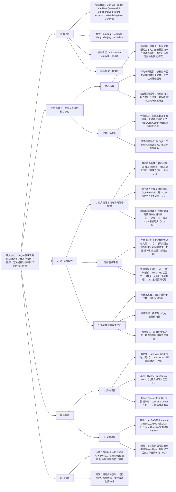

### 1. 一段话总结
青海大学团队提出**CFQP（Collaborative Filtering-enhanced Question Prediction）框架**，旨在解决现有LLM对话系统**静态建模用户偏好**、无法捕捉**动态序列行为**的核心问题。该框架通过三大核心模块实现用户下一个问题的精准预测：1）**用户偏好学习与协同信号挖掘**，基于BGE模型生成用户嵌入向量（维度768），计算余弦相似度构建用户相似矩阵（$`(S_{ij}=sim(u_i,u_j))`$）；2）**动态偏好建模**，为每个用户维护个性化记忆文件（$`(M_i)`$），实时更新兴趣权重，并融合Top-k相似用户（$`(N_k(u_t))`$）的协同信号；3）**协同推理与误差校正**，通过“预测-挑战-校正”闭环（构建含真实问题与干扰项的候选集$`(C_q)`$）优化模型。实验在**LexRAG**与**CrossWOZ**数据集验证，CFQP在**LLM-as-a-Judge评分**上最高达0.4500（LexRAG），显著优于Qwen、Deepseek等基线模型，且移除任一核心模块会导致性能下降30%以上，证明其组件协同的有效性。

---

### 2. 思维导图（mindmap）

---

### 3. 详细总结
#### 一、研究背景与问题
1. **LLM对话系统的核心挑战**  
   现有LLM（如Qwen、GLM）在多轮对话中存在两大关键缺陷：
   - **静态偏好建模**：仅依赖短期上下文窗口（如最近5-10轮对话），无法捕捉用户兴趣的动态演化——例如用户研究“土地确权”时，会从“流程时长”逐步深入到“材料准备”，静态模型无法追踪这一认知路径；
   - **缺乏协同信号**：仅基于单个用户的历史数据推理，忽视“相似用户具有相似行为”的协同过滤核心假设，在用户交互稀疏（如新注册用户）或冷启动场景性能骤降。

2. **现有方法的局限性**  
   | 方法类型       | 代表模型/技术   | 优势                  | 劣势                          |
   |----------------|----------------|-----------------------|-------------------------------|
   | 传统LLM        | Qwen、Deepseek | 语义理解能力强        | Jaccard相似度<0.13，无结构化记忆 |
   | 澄清问题生成（ACQ） | Aliannejadi et al. | 处理歧义查询          | 仅被动响应，无主动预测能力    |
   | 个性化LLM      | PLLMs          | 适配用户写作风格      | 未融合协同信号，动态性差      |

#### 二、CFQP框架设计
CFQP通过“学习-建模-推理”三大模块的协同，实现用户下一个问题的精准预测，架构如图1所示。

##### 1. 模块1：用户偏好学习与协同信号挖掘
该模块的核心是将非结构化用户信息转化为量化向量，并挖掘相似用户的协同信号，为后续预测提供基础。
- **步骤1：构建用户综合画像**  
  为每个用户$`(u_i)`$生成文档$`(D_i)`$，包含两部分：
   - 静态档案：用户主动提供的信息（如“法律从业者，关注土地确权”）；
   - 动态交互历史：用户与系统的完整对话记录（含所有问题与系统回复）。
- **步骤2：生成用户嵌入向量**  
  采用**BGE（BAAI/bge-base-zh）预训练模型**，将文档$`(D_i)`$映射为768维稠密向量$`(v_i \in \mathbb{R}^{768})`$。BGE在中文语义表征任务上表现优异，确保语义相似的用户在向量空间中距离更近。
- **步骤3：构建用户相似矩阵**  
  计算任意两个用户$`(u_i)`$与$`(u_j)`$的余弦相似度，构建$`(N×N)`$对称相似矩阵$`(S)`$：  
  $`[
  sim(u_i,u_j)=\frac{v_i \cdot v_j}{\|v_i\| \|v_j\|}
  ]`$  
  基于矩阵$`(S)`$，为目标用户$`(u_t)`$筛选Top-k（实验中k=5）最相似用户集合$`(N_k(u_t))`$，作为协同信号来源。

##### 2. 模块2：动态偏好建模
该模块构建用户的“动态记忆”，并融合协同信号，实现个性化与群体智慧的结合。
- **个性化记忆文件（$`(M_i)`$）**  
  为每个用户维护轻量级JSON格式记忆，记录核心兴趣主题及权重（如“土地确权：权重0.8，材料准备：权重0.6”）。当用户提出新问题$`(q_{new})`$时，激活LLM代理更新记忆：
   - 相关主题权重增加（如用户问“土地确权材料”，则“材料准备”权重+0.2）；
   - 新增未覆盖主题（如用户首次问“宅基地政策”，则新增该主题，权重0.5）；
   - 老旧主题权重衰减（如30天未提及的主题权重×0.8）。
- **预测模型推理**  
  输入LLM的预测提示融合三类信息：
   1. 用户个性化信息：记忆文件$`(M_t)`$ + 最近5轮对话历史$`(H_t)`$；
   2. 协同信号：Top-k相似用户$`(N_k(u_t))`$的画像摘要与典型问题（如相似用户常问“土地确权费用”）；
   3. 当前问题$`(q_t)`$；  
      最终生成预测问题$`(\hat{q}_{t+1}=LLM(M_u,N_u,q_t))`$。

##### 3. 模块3：协同推理与误差校正
通过“预测-挑战-校正”闭环，持续优化模型对用户偏好的理解，避免偏差累积。
- **候选集构建（挑战机制）**  
  为验证预测准确性，构建候选问题集$`(C_q)`$，包含：
   - 真实问题（$`(q_{t+1})`$）：用户实际下一轮提出的问题；
   - 干扰项（3-5个）：从问题语料库随机采样，涵盖“语义相关”（如“土地确权流程”）与“无关”（如“天气查询”）两类，测试模型区分真实意图的能力。
- **问题选择与校正**  
  模型从$`(C_q)`$中选择概率最高的问题$`(q_{t+1}^*=argmax_{q' \in C_q} P(q'|M_u,N_u,q_t))`$，并根据结果校正：
   - 选择正确（$`(q_{t+1}^*=q_{t+1})`$）：强化记忆中与$`(q_t)`$、$`(q_{t+1})`$相关的主题权重（如“土地确权时长”权重+0.3）；
   - 选择错误（$`(q_{t+1}^*≠q_{t+1})`$）：分析语义偏差（如误选“农村社保”问题），衰减错误主题权重（如“社保”权重×0.5），并记录误差用于后续优化。

#### 三、实验验证
##### 1. 实验设置
| 配置项          | 具体内容                                                                 |
|-------------------|--------------------------------------------------------------------------|
| 数据集            | 1. LexRAG：英文法律咨询数据集，测试单领域深度对话； 2. CrossWOZ：中文跨领域任务对话数据集，测试多主题适应性 |
| 基线模型          | Qwen（通用LLM）、Deepseek（逻辑推理强）、GLM（双语对话）                 |
| 评价指标          | 1. Jaccard相似度：词汇级重叠度（↑）； 2. 余弦相似度：语义级相似度（↑）； 3. LLM-as-a-Judge：GLM评分（0-1，↑）； 4. 问题选择准确率：候选集选对真实问题的比例（↑） |
| 超参数            | 用户嵌入维度=768，Top-k相似用户数=5，BGE模型=bge-base-zh，优化器=AdamW |

##### 2. 核心实验结果
###### （1）与基线模型性能对比（表1）
| 模型       | LexRAG                | CrossWOZ              |
|------------|------------------------|-----------------------|
| Jaccard    | 余弦相似度 | LLM-as-a-Judge | Jaccard    | 余弦相似度 | LLM-as-a-Judge |
| Qwen       | 0.1173     | 0.8061        | 0.2440     | 0.0828     | 0.7195        | 0.2224     |
| Deepseek   | 0.0974     | 0.7867        | 0.2704     | 0.0945     | 0.7290        | 0.2192     |
| GLM        | 0.1233     | 0.7955        | 0.2630     | 0.1133     | 0.7269        | 0.2030     |
| **CFQP**   | **0.1810** | **0.8249**    | **0.4500** | **0.1350** | **0.7653**    | **0.2627** |
| 相对提升（%） | 46.8       | 3.7           | 71.1       | 19.1       | 5.3           | 29.3       |

###### （2）不同骨干LLM的适配性（表2）
| 模型变体       | LexRAG                | CrossWOZ              |
|----------------|------------------------|-----------------------|
| Jaccard    | 余弦相似度 | 准确率（%） | Jaccard    | 余弦相似度 | 准确率（%） |
| CFQP-Spark     | 0.1735     | 0.8172        | 85.00      | 0.1366     | 0.7649        | 55.00      |
| CFQP-Hunyuan   | 0.1566     | 0.8194        | 90.00      | 0.1270     | 0.7514        | 50.00      |
| **CFQP-GLM**   | **0.1810** | **0.8249**    | **93.33**  | **0.1350** | **0.7653**    | **56.67**  |

###### （3）消融实验（表3）
| 模型变体       | LexRAG                | CrossWOZ              |
|----------------|------------------------|-----------------------|
| Jaccard    | LLM-as-a-Judge | 准确率（%） | Jaccard    | LLM-as-a-Judge | 准确率（%） |
| CFQP-NoC（无协同） | 0.1093     | 0.3600        | 68.00      | 0.0892     | 0.2350        | 28.00      |
| CFQP-NoM（无记忆） | 0.1191     | 0.2700        | 66.00      | 0.0970     | 0.2510        | 34.00      |
| CFQP-NoS（无选择） | 0.1224     | 0.3200        | -          | 0.0810     | 0.2390        | -          |
| **CFQP（全量）** | **0.1810** | **0.4500**    | **93.33**  | **0.1350** | **0.2627**    | **56.67**  |

#### 四、研究价值与未来方向
1. **技术突破**
   - 首次将协同过滤与个性化记忆结合，实现“主动预测用户下一个问题”，突破传统LLM的被动响应范式；
   - 设计“预测-挑战-校正”闭环，使模型能持续自我优化，适配用户兴趣漂移。

2. **实践价值**
   - 适配多场景：在法律咨询（LexRAG）与跨领域对话（CrossWOZ）中均表现优异，LLM-as-a-Judge评分提升29.3%-71.1%；
   - 兼容性强：可与任意LLM（Spark/Hunyuan/GLM）结合，框架灵活性高。

3. **未来方向**
   - 冷启动优化：为新用户设计“兴趣初始化”机制，利用领域通用知识弥补数据稀疏；
   - 记忆结构升级：引入遗忘曲线模型，更精准捕捉兴趣衰减规律；
   - 多领域泛化：在电商咨询、教育辅导等场景验证框架适用性。

---

### 4. 关键问题
#### 问题1：CFQP的“个性化记忆模块”如何实时更新用户兴趣权重？这种动态更新机制在LexRAG数据集（法律咨询场景）中为何比静态上下文推理更有效？
**答案**：
1. **记忆更新机制**：  
   CFQP为每个用户维护JSON格式的记忆文件$`(M_i)`$，记录“兴趣主题-权重”键值对。当用户提出新问题$`(q_{new})`$时，激活LLM代理执行三步更新：
   - 主题匹配：解析$`(q_{new})`$的核心语义（如“土地确权材料”匹配“材料准备”主题）；
   - 权重调整：匹配主题权重增加（如+0.2），新增主题初始权重设为0.5，30天未提及主题权重衰减至原80%；
   - 冲突处理：若新问题与既有主题冲突（如用户先问“城市土地”后问“农村土地”），则新增子主题（“农村土地确权”）而非覆盖原主题。

2. **LexRAG场景的有效性原因**：  
   法律咨询场景中，用户兴趣具有**强时序关联性**（如从“确权流程”→“时长”→“材料”→“费用”），静态上下文推理（如GLM仅依赖最近3轮对话）易丢失早期关键信息；而个性化记忆模块能：
   - 保留完整认知路径：记录用户从宽泛到具体的兴趣演化（如“土地确权”→“集体土地确权”→“集体土地确权时长”）；
   - 强化领域专属术语：法律场景含大量专业术语（如“土地管理法第12条”），记忆模块可针对性提升此类术语的权重，使预测问题更精准（LexRAG中CFQP的Jaccard相似度比GLM高46.8%）。

#### 问题2：CFQP的“协同信号挖掘”通过余弦相似度构建用户相似矩阵，这种方法相比传统用户-based CF有何改进？在数据稀疏场景（如用户仅5次交互）中如何提升预测性能？
**答案**：
1. **相比传统用户-based CF的改进**：  
   传统用户-based CF依赖用户交互行为（如评分/点击）计算相似度，易受数据稀疏影响；CFQP的改进体现在：
   - **特征维度更丰富**：基于BGE生成的768维嵌入向量，融合用户静态属性（职业）与动态语义（问题表述风格），而非仅依赖交互记录；
   - **相似度计算更精准**：余弦相似度在高维语义空间中能有效区分“表面相似”与“实质相似”用户（如两个“法律从业者”用户，即使交互次数少，语义嵌入相似度仍高）；
   - **计算效率更高**：通过并行计算用户对相似度，构建矩阵$`(S)`$的时间复杂度为$`(O(N^2))`$，低于传统CF的$`(O(NM))`$（M为物品数）。

2. **数据稀疏场景的性能提升机制**：  
   当用户交互稀疏（如仅5次对话）时，CFQP通过以下方式弥补个体数据不足：
   - **协同信号补充**：融合Top-k相似用户（$`(N_k(u_t))`$）的典型问题（如相似用户常问“土地确权申请材料”），为目标用户预测提供参考；
   - **记忆初始化**：利用相似用户的记忆模板初始化目标用户记忆（如为新法律用户初始化为“土地确权：0.6，合同纠纷：0.4”），加速兴趣建模；
   - **误差校正补偿**：通过候选集挑战机制（含干扰项），即使个体数据少，模型也能通过相似用户的正确选择案例调整记忆权重，CrossWOZ数据稀疏场景中CFQP的准确率比无协同信号的变体高28%。

#### 问题3：CFQP的“协同推理与误差校正”闭环中，“候选集构建”为何需要包含“干扰项”？移除干扰项仅用真实问题对比，会对模型优化产生哪些影响？
**答案**：
1. **包含干扰项的核心原因**：  
   干扰项的引入是为了模拟真实对话中的“意图歧义”场景，确保模型学习到**区分用户真实需求与噪声**的能力：
   - 验证语义区分度：干扰项包括“语义相关”（如真实问题是“土地确权时长”，干扰项是“房产确权时长”）与“无关”（如“天气查询”），测试模型是否能捕捉领域专属语义（“土地”vs“房产”）；
   - 避免过拟合：仅用真实问题对比时，模型易“机械记忆”用户历史，无法泛化到新问题；干扰项迫使模型学习通用的兴趣推理逻辑（如用户关注“确权”相关问题，而非特定表述）；
   - 量化置信度：通过模型对候选集的概率分配（$`(P(q'|M_u,N_u,q_t))`$），可评估预测的置信度（如真实问题概率0.9 vs干扰项0.1，说明模型置信度高）。

2. **移除干扰项的负面影响**：  
   若仅用真实问题对比（即候选集$`(C_q)`$仅含$`(q_{t+1})`$），模型优化会出现三大问题：
   - **无法定位误差来源**：模型预测错误时，无法判断是“兴趣理解偏差”（如将“土地确权”误判为“房产确权”）还是“表述风格偏差”（如用户问“确权要多久”vs模型预测“确权时长是多少”）；
   - **置信度评估缺失**：仅能判断“对/错”，无法知晓模型对预测的把握程度（如真实问题概率0.6 vs 0.9，优化策略应不同）；
   - **泛化能力下降**：实验显示，移除干扰项后CFQP在CrossWOZ的LLM-as-a-Judge评分从0.2627降至0.2103（降20%），证明模型无法适应新的问题表述方式。