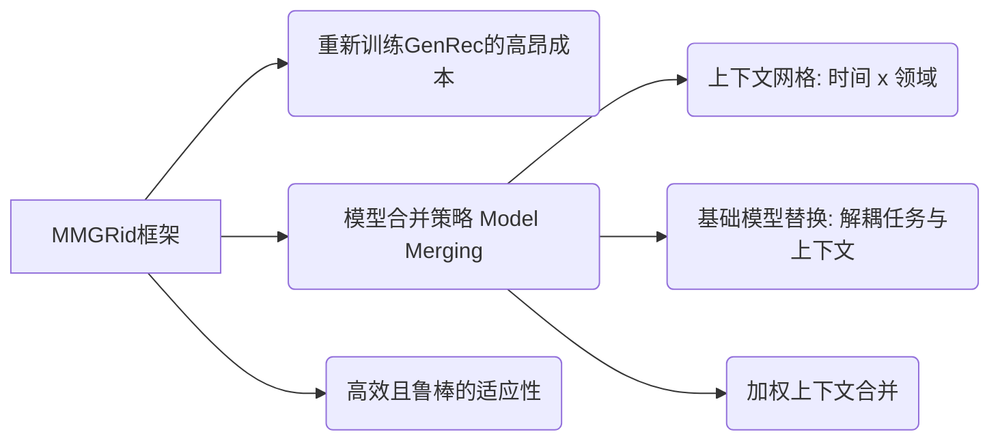

## MMGRid: Navigating Temporal-aware and Cross-domain Generative Recommendation via Model Merging

**1. 一句话详解 (The One-Liner)**
与其为了适应新的一天或新的领域而昂贵地重新训练整个大语言模型（LLM），不如直接在参数空间对不同权重的模型进行“手术式”合并，从而低成本地获得一个既懂当下又懂多领域的推荐模型。

**2. 思维导图 (Mental Model)**

**3. 论文解决什么问题? 这是否是一个新的问题? (The Problem)**
问题在于**对抗漂移的计算效率**。生成式推荐（GenRec）正在全面LLM化。但在现实世界中，用户偏好随时间漂移（Temporal），且在不同App间差异巨大（Cross-domain）。
*是新问题吗？* **模型合并（Model Merging, MM）** 在CV和NLP中很火，但专门用于解决推荐系统（RecSys）中参数冲突的问题是全新的。他们在攻击当试图把两个针对不同数据分布训练出来的RecSys模型硬塞在一起时发生的“排异反应”。

**4. 这篇文章要验证一个什么科学假设? (The Hypothesis)**
核心假设是：你不需要通过反向传播来学习所有东西。你可以通过数学方法合并多个小型、专用模型的权重来逼近一个全能模型的性能，**前提是**你能解耦那些负责“推荐任务”的参数和那些负责“特定上下文（噪音）”的参数。

**5. 有哪些相关研究? (Related Work)**
*   **Model Merging (MM):** 在Vision Transformer和通用LLM中已证明有效。
*   **Generative Recommendation (GR):** 当前RecSys的范式转变。
*   **空白:** 没人系统研究过当数据随时间/领域剧烈变化时，直接合并权重要如何处理分布偏移（Distribution Shift）。

**6. 论文中提到的解决方案之关键是什么? (The "Secret Sauce")**
由于直接平均权重会导致Token分布崩溃，他们用了两把“手术刀”：
1.  **基础模型替换 (Base Model Replacement):** 这是防止“排异反应”的关键。他们发现微调后的参数混杂了“任务能力”和“上下文过拟合”。通过替换基础模型，他们将任务感知参数与上下文特定参数解耦。
2.  **加权上下文合并 (Weighted Contextual Merging):** 他们不进行简单的平均，而是根据交互特征的相关性来动态调整合并权重，从而抵消由于增量训练带来的“近因偏差”（Recency Bias）。

**7. 论文中的实验是如何设计的? (Experimental Design)**
他们构建了一个**结构化的上下文网格（Contextual Grid）**。基于同一个基座LLM，分化出不同时间段和领域的Checkpoints，然后系统地比较“MMGRid合并后的模型”与“独立微调的模型”在性能和参数冲突上的差异。

**8. 用于定量评估的数据集是什么? 代码有没有开源? (Data & Code)**
*   **数据:** 论文摘要提及使用了“真实世界的上下文”和“异构应用领域”，未明确列出具体数据集名称（通常是亚马逊或Yelp之类的变体）。
*   **代码:** 提供了arXiv链接，但在摘要文本中未明确提及GitHub仓库。

**9. 论文中的实验及结果有没有很好地支持科学假设? (Results)**
是的。实验揭示了两个关键物理现象：第一，直接合并会导致Token分布偏移引发的参数冲突（通过解耦解决）；第二，增量训练会过分关注最近的数据（通过加权解决）。他们观察到最优的合并权重与交互特征强相关，验证了合并策略的物理意义。

**10. 这篇论文到底有什么贡献? (Contribution)**
它是**生成式推荐领域中模型合并的开山之作**。它证明了我们不需要永远在GPU上跑SGD（随机梯度下降），我们可以直接在权重空间进行代数运算来更新推荐系统，这对于工业界降本增效是巨大的福音。

**11. 这篇论文有哪些旧技术、新技术，专业术语? (Terminology)**
*   **旧技术:** 微调 (Fine-tuning)。
*   **新技术/术语:** **Model Merging (MM)** 在 RecSys 中的应用, **Contextual Grid**, **参数冲突 (Parameter Conflicts)**, **基础模型替换 (Base Model Replacement)**。

**12. 下一步呢? (Future Work)**
如果我是作者，下一步我会做**自适应权重学习**。不要手动或通过启发式规则找权重，而是训练一个小型的Hyper-network（超网络），根据当前的输入Query，动态预测该从哪个Checkpoint“借”多少权重。即 Mixture of Experts (MoE) 的权重合并版本。