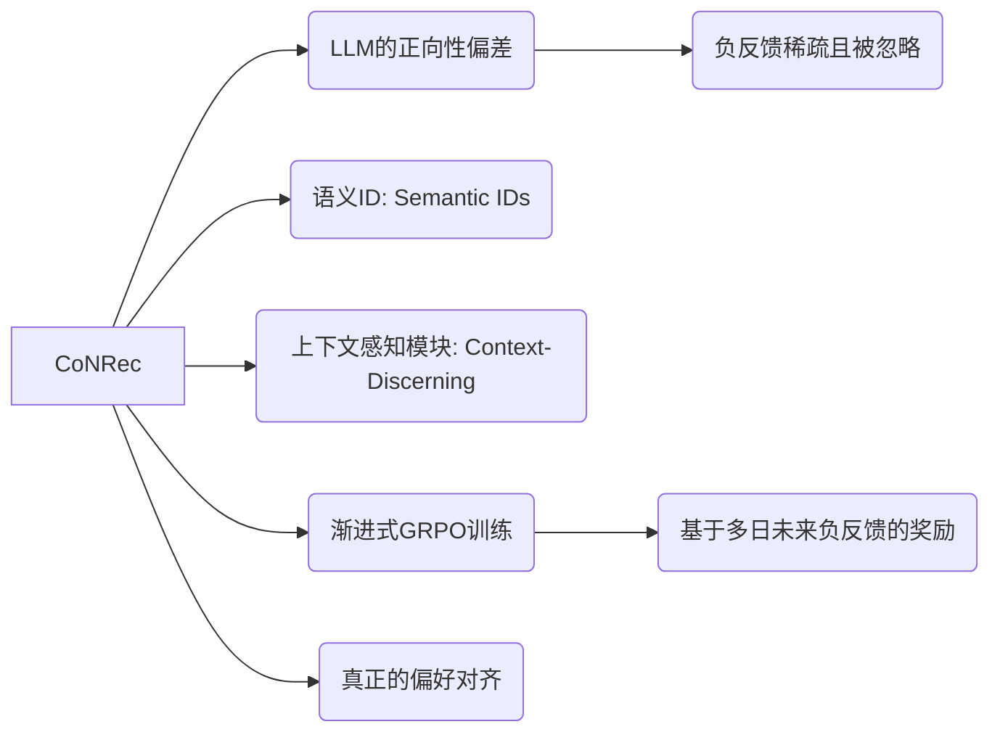

## CoNRec: Context-Discerning Negative Recommendation with LLMs

**1. 一句话详解 (The One-Liner)**
LLM天生只爱预测“下一个正向词”，本文通过引入语义ID和一种类似于推理模型的强化学习方法（Progressive GRPO），强行把“用户讨厌什么”这一负反馈信号注入到模型的价值函数中。

**2. 思维导图 (Mental Model)**

**3. 论文解决什么问题? 这是否是一个新的问题? (The Problem)**
问题是**LLM的盲目乐观（Positivity Bias）**。LLM的训练目标（Next Token Prediction）本质上是模仿正向序列。它不知道“不推荐什么”。现有的方法只把负反馈（用户跳过、点踩）当作弱辅助信号，导致模型经常推荐用户可能“点击但不喜欢”的东西。

**4. 这篇文章要验证一个什么科学假设? (The Hypothesis)**
假设是：如果我们不再把负反馈仅仅当作一个分类标签，而是构建一个基于**语义ID**的表征空间，并使用**强化学习（GRPO）**直接惩罚生成“坏ID”的策略，模型就能学会像理解“喜欢”一样深刻地理解“讨厌”。

**5. 有哪些相关研究? (Related Work)**
*   **负反馈建模:** 传统上作为辅助损失函数。
*   **LLM对齐:** RLHF（基于人类反馈的强化学习）。
*   **GRPO (Group Relative Policy Optimization):** 最近因DeepSeek等模型用于提升推理能力而大火的RL算法，这里被创造性地用于RecSys。

**6. 论文中提到的解决方案之关键是什么? (The "Secret Sauce")**
1.  **Semantic IDs (语义ID):** 放弃纯文本描述，用离散ID代表物品，让LLM更精准地锁定物品层面的负反馈，而不是模糊的文本语义。
2.  **Context-Discerning Module:** 专门设计用来修正由于正向反馈主导上下文而产生的偏差。
3.  **Progressive GRPO:** 这是重头戏。他们没有用标准的PPO，而是用了GRPO，这是一种更适合大模型的策略优化方法。他们设计了一个基于“多日未来负反馈”的奖励函数，强迫模型看长远，而不是只看当下的点击。

**7. 论文中的实验是如何设计的? (Experimental Design)**
设计核心在于验证模型是否真的学到了“拒绝”。他们不仅看准确率，还引入了基于多日未来负反馈的评估指标，专门测试模型在长期维度上规避用户厌恶内容的能力。

**8. 用于定量评估的数据集是什么? 代码有没有开源? (Data & Code)**
*   **数据:** 摘要强调了负反馈在“离线应用”中的价值，使用了含有负反馈的数据集，但未指明具体名称。
*   **代码:** 摘要中未提供GitHub链接。

**9. 论文中的实验及结果有没有很好地支持科学假设? (Results)**
摘要提到，他们的调查揭示了传统“预测下一个正向物品”目标与用户真实偏好之间的**根本性错位 (Fundamental Misalignment)**。实验表明CoNRec通过GRPO有效地缓解了这种错位，平衡了正负行为上下文的利用。

**10. 这篇论文到底有什么贡献? (Contribution)**
它填补了**生成式推荐在负反馈利用上的空白**。它提出了CoNRec，通过引入**语义ID**和**GRPO**，将RecSys从简单的“预测下一个点击”提升到了“理解用户偏好边界”的RL对齐高度。

**11. 这篇论文有哪些旧技术、新技术，专业术语? (Terminology)**
*   **旧技术:** 负采样 (Negative Sampling)。
*   **新技术/术语:** **Semantic IDs**, **Progressive GRPO** (将推理模型的RL技术用于推荐), **Context-Discerning Module**, **Fundamental Misalignment**。

**12. 下一步呢? (Future Work)**
**在线GRPO (Online GRPO)**。现在的RL很多是离线训练的。下一步是能否在用户实时交互（比如刚划走一个视频）的瞬间，就进行一次基于GRPO的In-context update？这需要极高的推理效率。
