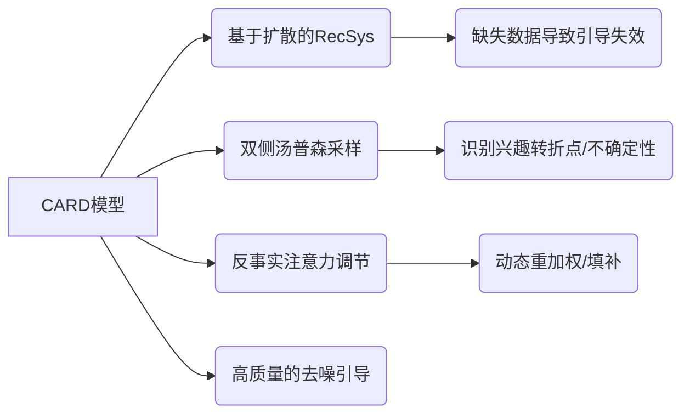

## Enhancing guidance for missing data in diffusion-based sequential recommendation

**1. 一句话详解 (The One-Liner)**
针对扩散模型推荐中用户历史数据缺失的问题，本文利用“反事实注意力”机制，在用户兴趣发生**关键转折**的地方“幻觉”出合理的数据来填补空白，从而引导扩散过程,。

**2. 思维导图 (Mental Model)**

**3. 论文解决什么问题? 这是否是一个新的问题? (The Problem)**
问题是**扩散模型的引导信号（Guidance）缺失**。扩散模型生成推荐序列就像从噪声中雕刻雕像，它需要“条件”（用户历史）作为图纸。如果历史数据有缺失（Missing Data），图纸就是破的。现有的方法只是简单地平滑数据，忽略了**兴趣转折点（Interest Turning Points）**——这些点虽然稀疏，但包含了最大的信息熵,。

**4. 这篇文章要验证一个什么科学假设? (The Hypothesis)**
假设是：数据的价值是不均等的。通过**不确定性估计（Thompson Sampling）**找到那些代表用户兴趣突变的时刻，并用**反事实（Counterfactual）**机制去增强这些时刻的信号（哪怕数据是补全的），比全局去噪更能提升扩散模型的生成质量。

**5. 有哪些相关研究? (Related Work)**
*   **Diffusion Models in RecSys:** 如DiffRec，正在取代传统的分类模型。
*   **序列推荐:** SASRec, BERT4Rec。
*   **数据补全:** 传统方法通常只剔除噪声，没想过要“无中生有”地增强关键信号。

**6. 论文中提到的解决方案之关键是什么? (The "Secret Sauce")**
模型名为 **CARD** (Counterfactual Attention Regulation Diffusion)。
1.  **Dual-side Thompson Sampling (双侧汤普森采样):** 这是一个经典的Bandit算法，这里被用来**侦测**。它通过计算不确定性，找出用户序列中那些“最令人困惑”或“变化最剧烈”的部分（即兴趣转折点）。
2.  **Counterfactual Attention (反事实注意力):** 一旦找到这些点，如果数据缺失，模型通过反事实推断来重新加权交互向量，模拟“如果这里有数据会怎样”，从而为扩散模型提供强有力的引导信号。

**7. 论文中的实验是如何设计的? (Experimental Design)**
不仅对比了推荐准确率，还特别关注了计算成本。他们在真实数据上运行CARD，验证其是否能在不显著增加推理延迟的情况下提升生成质量。

**8. 用于定量评估的数据集是什么? 代码有没有开源? (Data & Code)**
*   **数据:** “Real-world data” (源文本未列出具体名称)。
*   **代码:** **已开源**。地址: `https://github.com/yanqilong3321/CARD`。

**9. 论文中的实验及结果有没有很好地支持科学假设? (Results)**
实验表明CARD在真实数据集上表现良好，并且计算上并不昂贵。这支持了“关键转折点的反事实增强比单纯降噪更有效”的假设。

**10. 这篇论文到底有什么贡献? (Contribution)**
它让基于扩散的推荐系统变得鲁棒。它从单纯的“去噪”思维转变为**“关键信息重构”**思维。它巧妙地结合了经典的概率方法（汤普森采样）和现代生成模型（扩散模型），解决了稀疏序列建模中的痛点。

**11. 这篇论文有哪些旧技术、新技术，专业术语? (Terminology)**
*   **旧技术:** **Thompson Sampling** (贝叶斯优化/Bandit中的经典)。
*   **新技术/术语:** **Diffusion-guided generative paradigm**, **Counterfactual Attention Regulation**, **Interest Turning Points (兴趣转折点)**。

**12. 下一步呢? (Future Work)**
**结合Mamba/SSM**。扩散模型是迭代生成的，速度慢。既然CARD核心在于捕捉“转折点”，这与状态空间模型（SSM）的选择性记忆机制（Selective State Space）非常契合。能否用Mamba的线性复杂度来实现同样的“关键点增强”，从而把推理速度提升10倍？