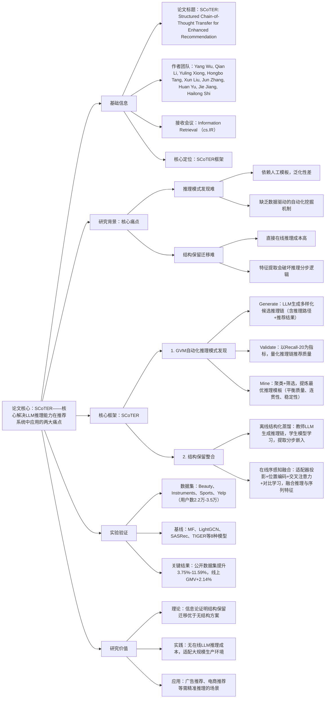

### 1. 一段话总结
腾讯团队提出**SCoTER框架**，核心解决LLM推理能力在推荐系统中应用的两大痛点——缺乏**自动化推理模式发现**与**结构保留迁移**，通过**GVM（Generate-Validate-Mine）自动化模式发现 pipeline**（从数据中挖掘最优推理模板）和**结构保留整合架构**（离线蒸馏分步推理嵌入+在线序感知融合），在4个公开数据集（Beauty、Instruments等）上较TIGER基线提升**3.75%-11.59%**，并在腾讯广告平台落地实现**2.14% GMV提升**，同时消除在线LLM推理成本，为大规模推荐系统融合结构化LLM推理提供了工程可行的方案。

---

### 2. 思维导图（mindmap）

---

### 3. 详细总结
#### 一、研究背景与核心问题
1. **LLM推理在推荐系统中的两大痛点**  
   | 痛点类型               | 具体表现                                                                 | 现有方案局限                          |
   |------------------------|--------------------------------------------------------------------------|---------------------------------------|
   | 推理模式发现难         | 推荐场景无明确真值，用户意图多样，需适配动态交互信号                       | 依赖人工模板，泛化性差，与下游任务脱节 |
   | 结构保留迁移难         | 需保留推理链的分步逻辑，同时满足低延迟生产需求                           | 在线推理成本高，特征提取会坍缩结构    |

2. **关键发现**  
   推荐任务具有**（ρ, δ）-序敏感性**：推理步骤顺序打乱后，预测分布的TV距离变化≥δ的概率达ρ，证明保留推理顺序对性能至关重要。

#### 二、SCoTER框架核心设计
##### 1. GVM自动化推理模式发现（解决“推什么推理模式”）
- **Generate（生成）**：  
  用LLM（如DeepSeek-R1）按结构化prompt生成候选推理链，每个链包含3部分：<cot_path>（简洁推理路径）、<reason>（详细逻辑）、<recommendations>（20个推荐项），通过温度采样和余弦相似度去重保证多样性。
- **Validate（验证）**：  
  以Recall@20为核心指标，计算推理链推荐结果与真实交互的匹配度，定义Score(C)为推理链的期望Recall@20，量化其预测价值。
- **Mine（挖掘）**：
    1. 推理链嵌入聚类，形成候选模式；
    2. 按三大指标筛选最优模式：Quality（平均Recall@20）、Structural Coherence（语义相似度）、Performance Stability（分数方差）；
    3. 提取符号化模板，作为后续蒸馏的指导。

##### 2. 结构保留整合（解决“如何迁移推理模式”）
| 阶段               | 核心目标                                                                 | 实现逻辑                                                                 |
|--------------------|--------------------------------------------------------------------------|--------------------------------------------------------------------------|
| 离线结构化蒸馏     | 保留推理分步逻辑，生成可复用嵌入                                         | 1. 教师LLM按最优模板生成结构化推理链； 2. 学生模型（Qwen3-8B）微调学习该模式； 3. 提取每步推理的文本嵌入，组装为结构化矩阵H（K×D） |
| 在线序感知融合     | 轻量融合推理嵌入与推荐骨干特征，保留顺序依赖                             | 1. 适配器投影推理嵌入至骨干空间； 2. 加入可学习位置编码，标记推理步骤顺序； 3. 交叉注意力融合序列特征与推理特征； 4. InfoNCE对比损失对齐推理与推荐目标 |

3. **训练目标**  
   总损失=推荐损失（RecLoss）+λ×对比损失（InfoNCE），λ=0.1，平衡序列建模与推理对齐。

#### 三、实验验证
##### 1. 实验设置
| 配置项          | 具体内容                                                                 |
|-------------------|--------------------------------------------------------------------------|
| 数据集            | 4个公开数据集： - Beauty：22,363用户、12,101物品、198,502交互； - Instruments：24,772用户、9,922物品、206,153交互； - Sports：35,598用户、18,357物品、296,337交互； - Yelp：30,431用户、20,033物品、316,354交互 |
| 基线模型          | 8种主流模型： - 传统推荐：MF、LightGCN、Caser、HGN、SASRec、Bert4Rec； - 生成式推荐：TIGER（骨干模型） |
| 评估指标          | 离线：Recall@5/10、NDCG@5/10； 线上：GMV、负反馈率、“不感兴趣”率 |
| 关键超参数        | 推理链长度K=5，对比温度τ=0.1，学习率2e-4，权重衰减5e-5，训练轮数200 |

##### 2. 核心实验结果
###### （1）离线性能对比（较TIGER基线提升）
| 数据集       | Recall@5提升 | Recall@10提升 | NDCG@5提升 | NDCG@10提升 |
|--------------|--------------|---------------|------------|-------------|
| Beauty       | 10.71%       | 10.44%        | 7.39%      | 8.10%       |
| Instruments  | 4.97%        | 4.52%         | 3.94%      | 3.75%       |
| Sports       | 11.59%       | 7.12%         | 7.33%      | 6.09%       |
| Yelp         | 7.05%        | 5.45%         | 10.13%     | 8.82%       |

###### （2）关键组件消融实验（Beauty数据集）
| 模型变体                | Recall@5 | 性能下降（%） | 核心结论                     |
|-------------------------|----------|---------------|------------------------------|
| SCoTER（全量）         | 0.0434   | -             | 完整框架效果最优             |
| 无位置编码（w/o Position） | 0.0424 | 2.30          | 位置编码对保留顺序至关重要   |
| 无对比损失（w/o Contrastive） | 0.0413 | 4.84      | 对比损失提升推理-推荐对齐度 |
| 无分步推理嵌入（w/o Step-wise CoT） | 0.0407 | 6.22 | 分步结构是推理能力核心       |

###### （3）线上A/B测试结果（腾讯广告平台）
| 指标                | 相对提升/变化 |
|---------------------|---------------|
| 整体GMV             | +2.14%        |
| 稀疏交互用户GMV     | +4.10%        |
| 密集交互用户GMV     | +1.49%        |
| 负反馈率            | -0.24%        |
| “不感兴趣”率        | -0.25%        |

##### 3. 模式发现有效性验证
GVM挖掘的推理模板较人工模板（2步/3步/5步）表现更优：
- 集成到TIGER后，Recall@5提升7.39%-10.71%；
- 独立LLM生成推荐时，Recall@20较最优人工模板提升2.9%-8.2%。

#### 四、研究价值与应用
1. **理论价值**：信息论证明结构保留迁移的互信息≥无结构方案，为推理迁移提供理论支撑；
2. **实践价值**：离线蒸馏+在线轻量融合，消除在线LLM推理成本（参数规模仅4.12M级），适配大规模生产；
3. **应用场景**：广告推荐、电商跨品类推荐、本地生活服务推荐等需精准用户意图推理的场景。

---

### 4. 关键问题
#### 问题1：SCoTER的GVM pipeline如何实现“数据驱动的推理模式发现”？与人工模板相比，核心优势是什么？
**答案**：
1. 实现逻辑：① Generate阶段：LLM按结构化prompt生成含推理路径、逻辑、推荐结果的多样化候选链；② Validate阶段：以Recall@20为量化指标，筛选高推荐质量的推理链；③ Mine阶段：通过聚类提炼最优模式，平衡质量、连贯性、稳定性三大指标；
2. 核心优势：人工模板依赖领域经验，泛化性差且与下游任务脱节；GVM从数据中自动挖掘适配当前交互信号的推理结构，能捕捉细粒度动态偏好，实验中Recall@5较最优人工模板提升10.71%，且在不同LLM（Qwen3-8B/DeepSeek-R1）上均保持优势。

#### 问题2：SCoTER的“结构保留整合”如何在避免在线LLM推理的同时，保留推理链的分步逻辑？核心技术细节是什么？
**答案**：
1. 核心思路：通过“离线蒸馏+在线融合”拆分推理生成与特征利用，避免实时调用LLM；
2. 技术细节：① 离线蒸馏：教师LLM生成结构化推理链，学生模型微调学习该模式，提取每步推理的文本嵌入并缓存；② 在线融合：加入可学习位置编码标记推理步骤顺序，通过交叉注意力让序列特征选择性关注相关推理步骤，再用InfoNCE损失对齐推理与推荐目标；③ 关键设计：推理嵌入保持K×D矩阵结构（而非坍缩为单向量），确保分步逻辑不丢失。

#### 问题3：SCoTER在生产环境中为何能实现“GMV提升+用户体验优化”的双重收益？稀疏用户与密集用户的性能差异背后的原因是什么？
**答案**：
1. 双重收益原因：① 结构化推理提升推荐精准度（尤其长尾场景），带动GMV增长；② 推理逻辑与用户偏好更对齐，减少无效推荐，降低负反馈率；③ 无在线LLM推理延迟，不影响用户交互体验；
2. 性能差异原因：稀疏用户交互数据少，传统推荐难以捕捉偏好，而SCoTER的推理模式能基于有限交互挖掘潜在意图（如“行为分析→兴趣识别→特征预测”），补充语义信息；密集用户已有充足协同信号，推理带来的增量收益相对温和，因此稀疏用户GMV提升（4.10%）显著高于密集用户（1.49%）。