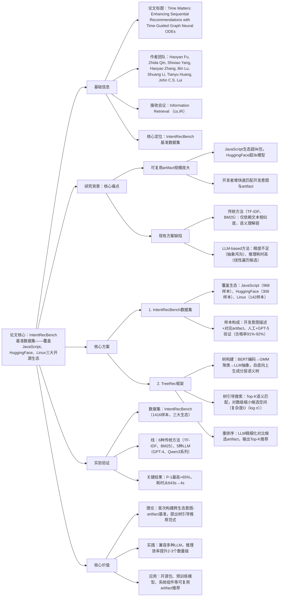

### 1. 一段话总结
北京大学等团队构建了**IntentRecBench基准数据集**（覆盖JavaScript、HuggingFace、Linux三大开源生态，共1416个意图-artifact样本），通过对比6种传统方法与5种LLM的 artifact推荐性能，发现LLM虽优于传统方法但存在**精度不足**与**推理耗时高**的问题，进而提出**TreeRec框架**——通过**分层语义树构建**（自底向上聚类+LLM抽象）、**树引导搜索**（对数级缩小候选空间）与**LLM重排序**（精细化语义对齐），在三大生态中均显著提升LLM性能，**P@1最高提升65%**，推理耗时从数百秒降至数秒，为意图驱动的可复用artifact推荐提供了高效且通用的解决方案。

---

### 2. 思维导图

---

### 3. 详细总结
#### 一、研究背景与核心问题
1. **可复用artifact推荐的核心诉求**  
   开源生态中可复用artifact（包、预训练模型、系统组件）数量激增（JavaScript生态超9k包，HuggingFace超3k模型），开发者需从海量资源中快速匹配“开发意图”与“artifact功能”，但传统方法语义理解不足，LLM方法存在精度与效率瓶颈。

2. **两大核心挑战**  
   | 挑战类型       | 具体表现                                                                 | 现有方案局限                          |
   |----------------|--------------------------------------------------------------------------|---------------------------------------|
   | 精度不足       | 开发意图（高抽象）与artifact描述（低细节）存在“抽象鸿沟”                   | 传统方法依赖文本相似度，LLM易受噪声干扰 |
   | 效率低下       | LLM需遍历所有候选artifact，JavaScript生态中GPT-4单次推理耗时超600秒        | 线性遍历候选空间，难以适配大规模生态    |

#### 二、核心方案设计
##### 1. IntentRecBench基准数据集
- **构建流程**：生态选择→artifact收集→意图-artifact配对→人工+GPT-5质量验证
- **关键特性**：
  | 生态系统   | 样本数量 | 意图平均长度（词） | artifact类型       | 合格率（人工/GPT-5） |
  |------------|----------|--------------------|--------------------|----------------------|
  | JavaScript | 968      | 90                 | 开源包             | 97%/95%              |
  | HuggingFace | 306     | 88                 | 预训练模型         | 88%/87%              |
  | Linux      | 142      | 131                | 功能组件组         | 90%/91%              |
- **核心价值**：首个跨生态、高质量的意图-artifact推荐基准，支持不同方法的公平对比。

##### 2. TreeRec框架三大核心模块
| 模块名称         | 核心逻辑                                                                 | 关键步骤                                                                 |
|------------------|--------------------------------------------------------------------------|--------------------------------------------------------------------------|
| 分层语义树构建   | 自底向上抽象artifact功能，生成多粒度语义树                               | 1. BERT（all-mpnet-base-v2）编码artifact功能描述； 2. UMAP降维+GMM软聚类； 3. LLM总结聚类的公共功能，递归生成树结构（叶节点=原始artifact） |
| 树引导搜索       | 基于语义相似度剪枝，快速定位候选artifact                                 | 1. 编码开发意图； 2. 自上而下遍历树，每级筛选Top-K相似节点； 3. 抵达叶节点，获得候选集（复杂度O(log n)） |
| LLM重排序       | 精细化语义对齐，优化推荐排序                                             | 输入开发意图+候选artifact，LLM按适配度排序，输出Top-K推荐                 |

#### 三、实验验证
##### 1. 实验设置
| 配置项          | 具体内容                                                                 |
|-------------------|--------------------------------------------------------------------------|
| 评估指标          | 精度指标：P@1、P@4、DCG@2、DCG@5；效率指标：单次查询平均耗时（秒）         |
| 基线模型          | 传统方法：TF-IDF、BM25、LSI、JenS、Word2Vec、FastText； LLM：GPT-4、DeepSeek-R1、Qwen3-8B/14B/32B |
| 核心对比对象      | 纯LLM推荐（线性遍历候选）vs TreeRec+LLM                                  |

##### 2. 核心实验结果
###### （1）整体性能对比（GPT-4为基础模型）
| 生态系统   | 指标     | 纯GPT-4 | TreeRec+GPT-4 | 相对提升 | 纯GPT-4耗时（s） | TreeRec耗时（s） |
|------------|----------|---------|--------------|----------|------------------|------------------|
| JavaScript | P@1      | 0.49    | 0.58         | 18%      | 643              | 4.01             |
| JavaScript | DCG@5    | 0.55    | 0.68         | 24%      | 643              | 4.01             |
| HuggingFace | P@1    | 0.20    | 0.28         | 40%      | 525              | 12.14            |
| HuggingFace | DCG@2  | 0.20    | 0.33         | 65%      | 525              | 12.14            |
| Linux      | P@1      | 0.73    | 0.78         | 7%       | 11.39            | 4.05             |

###### （2）LLM兼容性验证（JavaScript生态）
| LLM模型       | P@1（纯模型） | P@1（+TreeRec） | 耗时（纯模型/s） | 耗时（+TreeRec/s） |
|---------------|---------------|-----------------|------------------|--------------------|
| GPT-4         | 0.49          | 0.58            | 643              | 4.01               |
| DeepSeek-R1   | 0.54          | 0.58            | 814              | 8.98               |
| Qwen3-8B      | 0.52          | 0.56            | 80.73            | 1.87               |
| Qwen3-32B     | 0.60          | 0.61            | 61               | 2.78               |

###### （3）消融实验（GPT-4，JavaScript生态）
| 模型变体                | P@1    | DCG@5    | 耗时（s） | 核心结论                     |
|-------------------------|--------|----------|-----------|------------------------------|
| 纯GPT-4                | 0.49   | 0.55     | 643       | 基线性能                     |
| GPT-4 + 树构建（无重排序） | 0.46   | 0.58     | 0.02      | 树构建大幅提升效率，精度略降 |
| GPT-4 + 树构建 + 重排序  | 0.58   | 0.68     | 4.01      | 重排序恢复并提升精度         |

#### 四、研究价值与应用
1. **理论价值**：首次构建跨生态意图-artifact推荐基准，提出“分层语义树+LLM”的混合框架，解决抽象鸿沟与效率瓶颈；
2. **实践价值**：兼容多种LLM与开源生态，推理效率提升2-3个数量级，精度显著改善，已开源数据集与框架代码；
3. **应用场景**：开源包推荐（JavaScript）、预训练模型选择（HuggingFace）、系统组件匹配（Linux）等可复用artifact推荐场景。

---

### 4. 关键问题
#### 问题1：TreeRec的“分层语义树”是如何构建的？与传统检索的索引结构相比，核心优势是什么？
**答案**：
1. 构建流程：① BERT编码器将artifact功能描述转化为稠密语义向量；② UMAP降维后用GMM软聚类（支持artifact多特征归属）分组；③ LLM总结每组的公共功能，生成父节点；④ 递归执行聚类与抽象，直到形成单根节点的分层语义树；
2. 核心优势：传统索引（如倒排索引）仅基于文本关键词，无法捕捉功能语义层级；而分层语义树通过“聚类+LLM抽象”，将artifact按功能粒度分层组织，支持**对数级候选筛选**（复杂度O(log n)），解决了传统线性检索与LLM遍历候选的效率问题，同时通过多粒度语义匹配缓解抽象鸿沟。

#### 问题2：IntentRecBench数据集的核心特点是什么？为何能支撑不同推荐方法的公平对比？
**答案**：
1. 核心特点：① 跨生态覆盖：包含JavaScript（包）、HuggingFace（预训练模型）、Linux（组件组），涵盖不同artifact类型与场景；② 高质量样本：每个样本由“开发意图描述+对应artifact”构成，经人工（合格率92%）与GPT-5（合格率91%）双重验证，语义一致性高；③ 数据丰富：意图平均长度88-131词，artifact功能描述包含详细特性，覆盖不同抽象层级；
2. 公平对比支撑：① 统一任务定义：所有方法均需完成“开发意图→Top-K artifact”映射，评价指标一致（P@k、DCG@k、耗时）；② 固定候选池：每个生态的artifact候选池固定（如JavaScript 9729个包），避免因候选集差异影响结果，确保不同方法的对比公平性。

#### 问题3：TreeRec为何能同时提升LLM的推荐精度与效率？其在不同LLM上的兼容性表现如何？
**答案**：
1. 精度与效率双提升逻辑：① 效率提升：树引导搜索通过语义匹配剪枝，将候选集从数千个缩小至数十个，推理复杂度从O(n)降至O(log n)，耗时从数百秒降至数秒；② 精度提升：重排序阶段LLM仅需聚焦少量高相关候选，避免遍历全量候选导致的注意力分散，精细化语义对齐减少抽象鸿沟；
2. 兼容性表现：TreeRec对不同架构、规模的LLM均有效——在GPT-4、DeepSeek-R1、Qwen3-8B/14B/32B上，P@1提升2%-18%，耗时均降低90%以上，其中弱LLM（如Qwen3-8B）的提升更显著（DCG@2提升48%），证明其模型无关的通用增强能力。