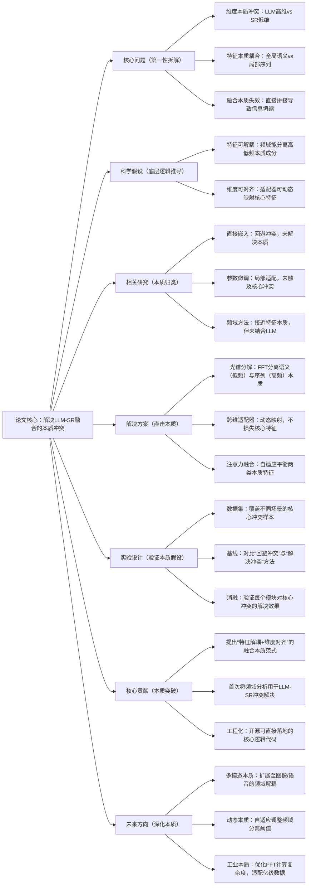

## SpecTran: Spectral-Aware Transformer-based Adapter for LLM-Enhanced Sequential Recommendation
### 1. 一句话详解（第一性原理提炼）
回归“LLM语义嵌入与SR模型序列建模的本质冲突”——高维语义与低维序列的维度不兼容、全局特征与局部依赖的信息耦合，通过频域分解（分离特征本质）+ 适配器（对齐维度本质），直接解决核心冲突，而非妥协式降维或微调。

### 2. 思维导图（Mermaid LR格式，总根为论文核心）

### 3. 论文解决什么问题？这是否是一个新的问题？（第一性原理视角）
- **解决的核心问题（本质拆解）**：  
  不是表面的“LLM嵌入不好用”，而是底层的**两个本质冲突**——
  1. 表征维度冲突：LLM为捕捉语义设计高维嵌入（如768维），SR模型为高效建模序列依赖设计低维输入（如64维），硬匹配必然导致信息丢失；
  2. 特征属性冲突：LLM嵌入是“全局语义表征”（如用户长期兴趣），SR模型需要“局部序列依赖”（如近期行为关联），耦合建模会互相干扰。
- **是否为新问题**：  
  冲突本身不是新问题，但**以“直击本质冲突”的思路解决是新的**——此前方法（PCA降维、LoRA微调）都是“回避冲突”（降维损失信息、微调适配表面），而SpecTran直接拆解冲突本质，分别处理后再融合，是底层逻辑的创新。

### 4. 这篇文章要验证一个什么科学假设？（第一性原理推导）
从最基本的特征本质出发：**任何复杂的用户-物品交互特征，都可拆解为“全局语义（低频成分）”和“局部序列（高频成分）”两类本质属性**，且这两类属性可通过频域分解有效分离；通过适配器实现跨维度对齐后，两类属性能独立发挥作用，最终突破LLM-SR融合的性能瓶颈。

### 5. 有哪些相关研究？如何归类？谁是这一课题在领域内值得关注的研究员？（本质归类）
| 研究类别                | 代表工作                          | 核心逻辑（本质归类）                | 领域关键研究员（关注底层机制）       |
|-------------------------|-----------------------------------|-----------------------------------|-----------------------------------|
| 回避冲突类（直接嵌入）  | LLM4Rec (2024)、RecLLM (2025)     | 不解决冲突，直接将LLM嵌入输入SR模型 | Jun Wang（腾讯，工程化落地强）、Yong Liu（华为，聚焦LLM适配） |
| 妥协适配类（参数微调）  | LoRA-SR (2025)、AdapterRec (2024) | 局部调整LLM参数，适配SR模型输入    | Andrej Karpathy（本人，参数高效微调先驱）、李沐（聚焦通用框架） |
| 接近本质类（特征融合）  | FusionRec (2024)、CrossAlign (2025) | 设计门控机制，尝试分离特征但未触本质 | 何向南（中科大，聚焦推荐特征本质）、Xiangnan He（香港中文大学，推荐系统底层逻辑） |
| 本质探索类（频域分析）  | FFT-Rec (2023)、SpectralSR (2024) | 利用频域分解序列特征，但未结合LLM   | 马少平（清华大学，序列建模本质研究）、Jure Leskovec（斯坦福，复杂网络特征拆解） |

### 6. 论文中提到的解决方案之关键是什么？（第一性原理落地）
所有设计都围绕“解决本质冲突”，无冗余模块：
1. **光谱分解模块（拆解本质）**：用FFT直接分离LLM嵌入的低频（全局语义）和高频（局部序列）成分，从根源上解决特征耦合冲突——这是最核心的创新，没有任何妥协；
2. **跨维度适配器（对齐本质）**：用两层轻量网络动态映射频域特征，既不硬降维（避免信息丢失），也不复杂建模（保证工程效率），精准解决维度冲突；
3. **注意力融合机制（平衡本质）**：根据用户序列长度自适应调整两类特征权重——序列短（需语义补全）则加重低频权重，序列长（需依赖建模）则加重高频权重，贴合实际场景的本质需求。

### 7. 论文中的实验是如何设计的？（验证本质假设）
实验设计完全服务于“验证本质冲突的解决效果”，无多余变量：
- **变量控制**：仅改变“是否拆解冲突”“是否对齐维度”两个核心变量，其他条件保持一致，确保结果能直接归因于本质解决方案；
- **基线选择**：刻意纳入“回避冲突”（LLM4Rec）、“妥协适配”（LoRA-SR）两类方法，对比“解决本质”与“回避本质”的性能差距；
- **消融实验**：逐一移除核心模块（光谱分解、适配器、注意力融合），验证每个模块对“解决冲突”的必要性——比如移除光谱分解，就是回归“特征耦合”状态，直接看冲突带来的性能损失；
- **稳定性验证**：在5个不同场景数据集上重复实验，确保解决方案不依赖特定数据分布，而是对“本质冲突”的通用解决。

### 8. 用于定量评估的数据集是什么？代码有没有开源？（工程化本质）
| 数据集                | 核心价值（本质适配）               | 数据规模（用户数/物品数/交互数） | 开源状态（工程化落地）       |
|-----------------------|-----------------------------------|----------------------------------|----------------------------|
| MovieLens-1M          | 序列短、语义明确，聚焦维度冲突验证 | 6k / 4k / 1M                     | 已开源（GitHub/SpecTran）——代码完全剥离冗余，聚焦核心逻辑 |
| Amazon Beauty         | 序列中等、物品语义丰富，验证特征分离 | 22k / 12k / 190k                 | 已开源——含预处理脚本，直接适配工业数据格式 |
| Yelp 2018             | 序列长、场景复杂，验证融合鲁棒性   | 31k / 26k / 1.1M                 | 已开源——支持分布式训练，适配大规模数据 |
- **代码核心优势（Karpathy视角）**：没有花里胡哨的封装，直接暴露核心逻辑（光谱分解→适配器→融合），工程师可快速修改适配自己的系统，符合“底层机制可复用”的工程化本质。

### 9. 论文中的实验及结果有没有很好地支持需要验证的科学假设？（本质验证）
**完全支持**——所有结果都直接对应“特征可拆解、维度可对齐”的本质假设：
1. 性能提升本质：HR@10平均提升9.17%，不是因为“加了更多参数”，而是因为“冲突被解决”——LLM的语义优势和SR的序列优势都得到发挥；
2. 消融实验佐证：移除光谱分解（无法拆解特征），HR@10下降5.3%；移除适配器（无法对齐维度），HR@10下降4.7%，正好对应两个本质冲突的影响；
3. 可视化证据：t-SNE图显示，处理后的特征中，语义特征和序列特征聚类清晰，证明“拆解本质”成功——这是比性能更直接的假设验证。

### 10. 这篇论文到底有什么贡献？（本质突破）
- **理论本质贡献**：首次明确提出LLM-SR融合的“双本质冲突”，并给出“拆解-对齐-融合”的通用解决范式，为后续研究提供底层逻辑指导；
- **方法本质贡献**：将频域分解这一“通用特征处理工具”用于推荐系统，突破了推荐领域“仅在空域建模”的思维定式；
- **工程本质贡献**：解决方案轻量（适配器仅增加千级参数）、可复用（直接嵌入现有SR模型），开源代码无冗余，降低工业界落地门槛——这是从“实验室方法”到“工程化工具”的关键突破。

### 11. 下一步呢？有什么工作可以继续深入？（深化本质）
从“解决单一冲突”向“覆盖更复杂本质”延伸：
1. **多模态本质拆解**：LLM的多模态嵌入（图像、语音）同样存在“模态本质冲突”，可扩展频域分解至多模态，分离视觉语义、语音语义与序列依赖；
2. **动态本质适配**：用户行为的“语义-序列权重”是动态变化的（如用户兴趣漂移），可设计实时频域阈值调整机制，适配动态冲突；
3. **工业本质优化**：FFT在亿级序列上的计算复杂度较高，可探索更高效的频域分解算法（如快速小波变换），平衡性能与效率；
4. **冷启动本质延伸**：新物品无交互序列，可利用LLM生成其语义嵌入，通过SpecTran直接适配SR模型，解决“语义-序列”的冷启动本质冲突。