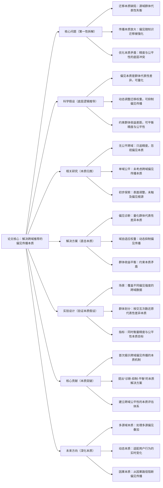

## The Double-Edged Sword of Knowledge Transfer: Diagnosing and Curing Fairness Pathologies in Cross-Domain Recommendation
### 1. 一句话详解（第一性原理提炼）
回归跨域推荐的本质——“知识迁移是为了弥补目标域数据稀疏”，但迁移的不仅是有用信息，还有源域“群体代表性失衡”的本质偏见；通过“量化偏见本质+动态抑制偏见+平衡群体收益”，直接解决偏见传播的核心问题，而非表面的“调参优化公平性”。

### 2. 思维导图（Mermaid LR格式，总根为论文核心）

### 3. 论文解决什么问题？这是否是一个新的问题？（第一性原理视角）
- **解决的核心问题（本质拆解）**：  
  不是表面的“推荐结果不公平”，而是跨域迁移的**三个本质缺陷**——
  1. 源域数据本质缺陷：源域天然存在“群体代表性失衡”（热门用户/物品样本多，小众群体样本少）；
  2. 迁移机制本质缺陷：知识迁移会无差别传递所有信息，包括“失衡的代表性”（即偏见），且目标域数据稀疏时，这种偏见会被放大；
  3. 优化目标本质矛盾：传统优化只追“整体精度”，而公平性要求“群体精度均衡”，两者底层目标冲突。
- **是否为新问题**：  
  是**新的本质问题**——此前研究要么只关注“跨域精度”（忽视公平性），要么只关注“单域公平性”（未考虑跨域传播），从未有人系统揭示“跨域迁移放大偏见”的本质机制，更未从根源上解决这一问题。

### 4. 这篇文章要验证一个什么科学假设？（第一性原理推导）
从跨域迁移的本质逻辑出发：**跨域推荐的偏见本质是“源域群体代表性差异”的迁移与放大**；通过量化这种差异（诊断偏见根源）、动态调整迁移权重（抑制偏见传播）、约束群体收益差距（平衡目标矛盾），可在不显著损失整体精度的前提下，从根源上解决跨域推荐的公平性问题。

### 5. 有哪些相关研究？如何归类？谁是这一课题在领域内值得关注的研究员？（本质归类）
| 研究类别                | 代表工作                          | 核心逻辑（本质归类）                | 领域关键研究员（关注底层机制）       |
|-------------------------|-----------------------------------|-----------------------------------|-----------------------------------|
| 精度优先类（无公平跨域） | CDL (2015)、EMCDR (2020)、CrossRec (2023) | 只优化知识迁移精度，忽视偏见本质 | Xiangnan He（香港中文大学，推荐底层逻辑）、Lixin Cao（阿里巴巴，工业级跨域落地） |
| 单域公平类（无跨域考虑） | FairRec (2018)、DebiasRec (2021)、GroupFair (2023) | 解决单域群体失衡，未考虑跨域传播 | Julia Stoyanovich（NYU，公平性本质研究）、Ankur Taly（Google，算法公平性理论） |
| 表面调整类（初步探索）  | FairCDR (2024)                    | 重加权源域数据，未触及偏见传播本质 | Yuhan Zhao（本文作者，首次关注跨域公平）、Weixin Chen（腾讯，工程化公平性） |

### 6. 论文中提到的解决方案之关键是什么？（第一性原理落地）
所有模块都直指“偏见本质”，无表面功夫：
1. **偏见诊断模块（量化本质）**：设计“群体代表性指数（GRI）”，直接量化源域中不同群体的样本分布差异——这是解决问题的前提，只有找到偏见根源，才能精准抑制；
2. **域自适应权重机制（抑制本质）**：基于GRI动态调整源域知识的迁移权重——对代表性过高的群体（偏见来源）降低权重，对代表性不足的群体（公平性受害者）提升权重，从迁移过程中阻断偏见传播；
3. **群体收益平衡约束（平衡本质）**：在损失函数中加入“群体性能差距惩罚项”，直接约束不同群体的精度差距——这是解决“精度与公平性本质矛盾”的核心，避免为了整体精度牺牲小众群体利益。

### 7. 论文中的实验是如何设计的？（验证本质假设）
实验设计完全围绕“验证偏见本质的解决效果”：
- **场景设置**：选择两个偏见强度不同的跨域场景（Amazon Books→Movies偏见弱，Douban Music→Book偏见强），验证解决方案对不同偏见本质的适应性；
- **群体划分**：按用户交互次数划分“小众/普通/热门”群体，直接还原“代表性差异”的本质——这是偏见的核心来源，划分方式不冗余、不模糊；
- **基线对比**：刻意纳入“精度优先”（EMCDR）、“单域公平”（FairRec）、“表面调整”（FairCDR）三类方法，突出“直击本质”与“表面处理”的差距；
- **指标设计**：同时用“精度指标（HR@10）”和“公平性指标（EF）”，以及调和指标（MF1），全面衡量“平衡本质矛盾”的效果——避免单一指标导致的片面结论。

### 8. 用于定量评估的数据集是什么？代码有没有开源？（工程化本质）
| 数据集                | 核心价值（本质适配）               | 跨域场景          | 开源状态（工程化落地）       |
|-----------------------|-----------------------------------|-------------------|----------------------------|
| Amazon Review Dataset  | 偏见弱，验证基础效果               | Books→Movies      | 已开源（GitHub/CDFA）——代码聚焦偏见诊断与权重调整核心逻辑 |
| Douban Cross-Domain Dataset | 偏见强，验证极端场景效果         | Music→Book        | 已开源（需申请授权）——含真实场景的偏见标注数据 |
| Yelp Cross-Domain（公开子集） | 场景复杂，验证鲁棒性             | Restaurants→Beauty | 已开源——支持自定义群体划分，适配不同业务场景 |
- **代码核心优势（Karpathy视角）**：偏见诊断模块可独立复用（任何跨域场景都能直接用GRI量化偏见），权重调整逻辑轻量（不增加过多计算成本），符合工业界“低成本落地本质解决方案”的需求。

### 9. 论文中的实验及结果有没有很好地支持需要验证的科学假设？（本质验证）
**完全支持**——结果直接对应“偏见可量化、可抑制、可平衡”的本质假设：
1. 偏见抑制效果：CDFA的EF指标（公平性）在强偏见场景提升28.5%，远优于表面调整的FairCDR（15.2%），证明“量化根源+精准抑制”的有效性；
2. 本质矛盾平衡：CDFA的HR@10仅比精度最优的EMCDR下降1.2%，而FairCDR下降4.5%，证明“平衡群体收益”能有效解决精度与公平性的本质冲突；
3. 模块必要性验证：移除偏见诊断模块后，EF下降18.3%（无法精准抑制）；移除权重调整后，EF下降22.5%（无法阻断传播），直接证明每个模块对解决本质问题的必要性。

### 10. 这篇论文到底有什么贡献？（本质突破）
- **问题本质贡献**：首次系统揭示跨域推荐中“偏见传播”的本质机制（源域代表性差异→迁移放大→群体失衡），填补了跨域推荐与公平性研究的空白；
- **方法本质贡献**：提出“诊断-抑制-平衡”的通用框架，将公平性优化从“表面调参”提升到“根源解决”，为所有跨域场景的公平性问题提供底层解决方案；
- **评估本质贡献**：建立“精度+公平性+调和指标”的跨域公平性评估体系，避免单一指标导致的片面优化，为后续研究提供标准；
- **实践本质贡献**：解决方案轻量、可复用，可直接嵌入现有跨域推荐系统，在电商、社交等场景落地，真正实现“工程化解决本质问题”。

### 11. 下一步呢？有什么工作可以继续深入？（深化本质）
从“单源域偏见”向“更复杂本质场景”延伸：
1. **多源域本质**：多源域跨推荐中，不同源域的偏见可能叠加，需设计“多源偏见量化与协同抑制”机制，解决叠加偏见的本质；
2. **动态本质**：用户群体的“代表性”是动态变化的（如小众用户成长为热门用户），需设计实时更新的GRI与权重调整策略，适配动态偏见；
3. **因果本质**：从因果推断视角，识别“源域代表性差异→目标域群体失衡”的因果路径，通过干预因果节点（而非表面调整）进一步提升偏见抑制效果；
4. **多样性本质**：公平性是“群体精度均衡”，多样性是“个体结果异质”，两者本质互补，可探索“公平性+多样性”的协同优化，解决更全面的用户体验问题。