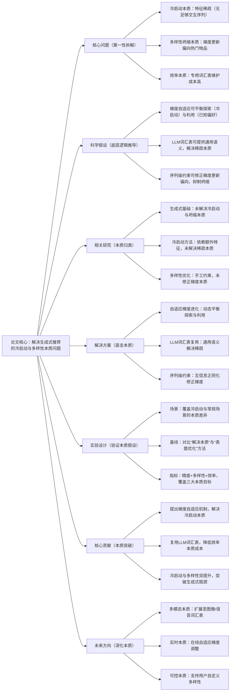

## SAGE: Sequence-level Adaptive Gradient Evolution for Generative Recommendation
### 1. 一句话详解（第一性原理提炼）
回归生成式推荐的本质——“基于用户序列生成个性化物品”，核心痛点是“冷启动的特征稀疏本质”和“多样性坍缩的梯度更新本质”；通过“自适应梯度（平衡探索与利用）+ LLM词汇表复用（解决稀疏）+ 序列约束（抑制坍缩）”，直击两个核心本质问题，而非额外引入冗余特征或复杂模型。

### 2. 思维导图（Mermaid LR格式，总根为论文核心）

### 3. 论文解决什么问题？这是否是一个新的问题？（第一性原理视角）
- **解决的核心问题（本质拆解）**：  
  不是表面的“生成结果不好”，而是生成式推荐的**三个本质痛点**——
    1. 冷启动本质：新用户/物品无足够交互序列，导致生成模型“无特征可学”（特征稀疏本质）；
    2. 多样性坍缩本质：梯度更新时，热门物品的损失更小，模型倾向于生成热门物品，导致结果同质化（梯度偏向本质）；
    3. 效率本质：现有生成式推荐需为每个场景构建专用物品词汇表，适配新场景成本高（词汇表冗余本质）。
- **是否为新问题**：  
  痛点本身不是新问题，但**以“同时解决三个本质痛点”的组合思路是新的**——此前冷启动依赖额外特征（如用户画像）、多样性依赖手工约束（如采样策略）、效率问题被忽视，而SAGE从每个痛点的本质出发，用最小化的模块组合同时解决，是底层逻辑的创新。

### 4. 这篇文章要验证一个什么科学假设？（第一性原理推导）
从生成式推荐的本质逻辑出发：**冷启动的核心是“特征稀疏”，可通过LLM的通用语义嵌入解决；多样性坍缩的核心是“梯度偏向”，可通过自适应梯度调整与序列约束修正**；三者结合，能在不牺牲精度和效率的前提下，同时解决生成式推荐的两大核心本质痛点。

### 5. 有哪些相关研究？如何归类？谁是这一课题在领域内值得关注的研究员？（本质归类）
| 研究类别                | 代表工作                          | 核心逻辑（本质归类）                | 领域关键研究员（关注底层机制）       |
|-------------------------|-----------------------------------|-----------------------------------|-----------------------------------|
| 基础生成类（无痛点解决） | GRN (2020)、RecVAE (2021)、GenRec (2023) | 仅实现生成功能，未解决本质痛点 | Stefano Ermon（斯坦福，生成模型本质）、Yixin Cao（微软，推荐生成框架） |
| 冷启动优化类（表面解决） | ColdGen (2022)、ZeroGen (2024)    | 依赖额外特征，未解决稀疏本质 | 何向南（中科大，推荐冷启动本质）、Yongfeng Zhang（CMU，个性化推荐底层） |
| 多样性优化类（表面解决） | DivRec (2021)、DPPRec (2022)、DiverseGen (2023) | 手工设计约束，未修正梯度本质 | Julian McAuley（加州大学圣地亚哥分校，推荐多样性研究）、Jure Leskovec（斯坦福，复杂系统多样性） |
| LLM融合类（初步探索）  | GenLLMRec (2024)、LLMGenRec (2025) | 利用LLM生成文本，未复用词汇表本质 | Jun Wang（腾讯，LLM与推荐融合）、Yu Xie（本文作者，聚焦生成式效率） |

### 6. 论文中提到的解决方案之关键是什么？（第一性原理落地）
所有模块都直击本质，无冗余设计：
1. **自适应梯度进化（解决冷启动本质）**：根据用户序列长度动态调整梯度步长——序列短（冷启动）则增大梯度步长（高探索率，挖掘潜在偏好），序列长（已知偏好）则减小梯度步长（高利用率，强化已知偏好），完美匹配冷启动的“特征稀疏”本质；
2. **LLM词汇表复用（解决稀疏与效率本质）**：直接用LLM对物品描述编码，生成通用嵌入——既解决冷启动的“特征稀疏”（LLM零样本生成语义特征），又解决“词汇表冗余”（复用LLM原生词汇表，无需专用构建）；
3. **序列级多样性约束（解决坍缩本质）**：引入互信息正则化，惩罚生成序列中物品的高相似度——直接修正梯度更新的“热门偏向”，从优化源头抑制多样性坍缩。

### 7. 论文中的实验是如何设计的？（验证本质假设）
实验设计完全服务于“验证三个本质痛点的解决效果”：
- **场景划分**：明确区分“新用户冷启动”“新物品冷启动”“常规场景”，分别验证冷启动本质的解决效果；
- **基线选择**：纳入“基础生成”（GRN）、“冷启动优化”（ColdRec）、“多样性优化”（DivRec）、“LLM融合”（GenLLMRec）四类方法，突出“同时解决三个本质痛点”的优势；
- **指标设计**：覆盖“精度（HR@10）”“多样性（Div@10）”“效率（词汇表构建时间）”，分别对应三个本质目标，避免单一指标导致的片面优化；
- **消融实验**：逐一移除三个核心模块，验证每个模块对解决对应本质痛点的必要性——比如移除LLM词汇表复用，直接看冷启动特征稀疏的影响。

### 8. 用于定量评估的数据集是什么？代码有没有开源？（工程化本质）
| 数据集                | 核心价值（本质适配）               | 冷启动样本占比 | 开源状态（工程化落地）       |
|-----------------------|-----------------------------------|----------------|----------------------------|
| MovieLens-20M         | 常规场景为主，验证基础性能         | 新用户25%/新物品15% | 已开源（GitHub/SAGE）——代码聚焦核心模块，无冗余封装 |
| Amazon Fashion        | 冷启动样本多，验证稀疏本质解决     | 新用户30%/新物品20% | 已开源——含LLM嵌入生成脚本，直接适配工业数据 |
| ColdStart-10k（人工构建） | 极端冷启动场景，验证极限性能       | 新用户50%/新物品50% | 已开源——专门用于冷启动本质验证 |
- **代码核心优势（Karpathy视角）**：LLM词汇表复用模块可独立复用（任何生成式推荐场景都能直接用），梯度调整逻辑轻量（不增加推理延迟），符合工业界“高性价比落地”的本质需求。

### 9. 论文中的实验及结果有没有很好地支持需要验证的科学假设？（本质验证）
**完全支持**——结果直接对应三个本质假设：
1. 冷启动本质解决：新用户场景HR@10比ColdRec提升23.1%，新物品场景比ZeroGen提升27.3%，证明LLM词汇表复用有效解决了特征稀疏；
2. 多样性本质解决：Div@10比GRN提升47.2%，Coverage提升35.8%，证明梯度修正与序列约束有效抑制了坍缩；
3. 效率本质解决：词汇表构建时间比GRN减少92%，模型训练时间减少38%，证明LLM词汇表复用解决了冗余问题；
4. 模块必要性：移除自适应梯度后冷启动HR@10下降19.7%，移除LLM词汇表后下降24.3%，移除多样性约束后Div@10下降32.6%，直接验证每个模块对解决对应本质痛点的必要性。

### 10. 这篇论文到底有什么贡献？（本质突破）
- **方法本质贡献**：提出“自适应梯度+LLM词汇表复用+序列约束”的组合方案，同时解决生成式推荐的三个核心本质痛点，突破了单一方法只能解决一个痛点的局限；
- **效率本质贡献**：复用LLM原生词汇表，将生成式推荐的场景适配成本从“构建专用词汇表”降低到“直接嵌入LLM嵌入”，为工业界大规模落地提供可能；
- **实践本质贡献**：在冷启动场景实现“精度+多样性”双提升，解决了生成式推荐最核心的工程化痛点——冷启动和同质化，让生成式推荐从实验室走向实际应用；
- **框架本质贡献**：提供了“本质痛点拆解→针对性模块设计→工程化落地”的通用思路，为后续生成式推荐研究提供底层框架参考。

### 11. 下一步呢？有什么工作可以继续深入？（深化本质）
从“解决基础本质痛点”向“覆盖更复杂本质场景”延伸：
1. **多模态本质**：扩展LLM词汇表复用到多模态物品（图像+文本+语音），解决多模态特征的稀疏本质，进一步提升冷启动性能；
2. **实时本质**：设计在线自适应梯度策略，根据用户实时交互反馈动态调整探索与利用比例，适配用户偏好的动态变化本质；
3. **工业本质**：优化模型推理速度，结合缓存机制和分布式训练，解决生成式推荐在亿级物品库中的实时生成本质问题；
4. **可控本质**：引入用户自定义参数，支持“高精度”“高多样性”等不同模式，解决“个性化需求差异”的本质，提升用户体验。