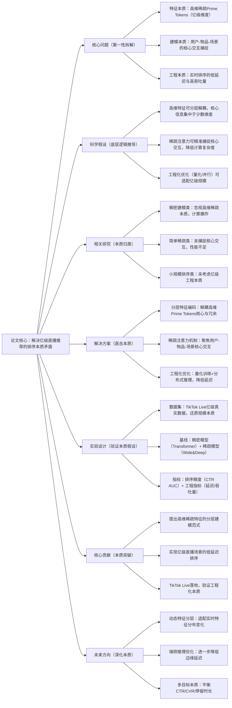

## Zenith: Scaling up Ranking Models for Billion-scale Livestreaming Recommendation
### 1. 一句话详解（第一性原理提炼）
回归亿级直播推荐的本质——“高维稀疏Prime Tokens的高效建模”与“实时排序的低延迟需求”，通过“分层特征编码（解耦高维本质）+ 稀疏注意力（聚焦核心交互）+ 工程化优化（适配亿级数据）”，直接解决大规模排序的核心矛盾，而非简单堆砌模型复杂度。

### 2. 思维导图（Mermaid LR格式，总根为论文核心）

### 3. 论文解决什么问题？这是否是一个新的问题？（第一性原理视角）
- **解决的核心问题（本质拆解）**：  
  不是表面的“大规模推荐排序慢”，而是亿级直播场景的**三个本质矛盾**——
  1. 特征本质矛盾：Prime Tokens（用户/物品/场景的高维标识特征）维度达亿级，稠密建模计算爆炸，简单稀疏建模丢失核心信息；
  2. 建模本质矛盾：直播推荐需同时捕捉“用户长期兴趣+实时场景触发+物品即时热度”，传统模型难以兼顾核心交互；
  3. 工程本质矛盾：实时推荐要求推理延迟≤10ms，而大规模模型推理难以满足低延迟与高吞吐量的双重需求。
- **是否为新问题**：  
  大规模排序是经典问题，但**针对“亿级高维稀疏Prime Tokens+直播实时场景”的本质解决方案是新的**——此前稠密模型（如Transformer）忽视稀疏本质，简单稀疏模型（如Wide&Deep）未捕捉核心交互，Zenith首次从特征、建模、工程三个本质层面协同解决。

### 4. 这篇文章要验证一个什么科学假设？（第一性原理推导）
从大规模排序的本质逻辑出发：**亿级高维稀疏Prime Tokens的核心信息集中于少数维度，可通过分层编码解耦；用户-物品-场景的核心交互可通过稀疏注意力精准捕捉；结合量化训练与分布式推理的工程化优化，可在保证排序精度的前提下，满足亿级直播场景的低延迟与高吞吐量需求**。

### 5. 有哪些相关研究？如何归类？谁是这一课题在领域内值得关注的研究员？（本质归类）
| 研究类别                | 代表工作                          | 核心逻辑（本质归类）                | 领域关键研究员（关注底层机制）       |
|-------------------------|-----------------------------------|-----------------------------------|-----------------------------------|
| 稠密建模类（忽视稀疏）  | TransformerRec (2019)、BERT4Rec (2019) | 稠密注意力建模序列，计算复杂度高 | Jian Zhang（Google，推荐Transformer先驱）、Ruoxi Wang（微软，DeepFM作者） |
| 简单稀疏类（缺乏交互）  | Wide&Deep (2016)、DeepFM (2017)、xDeepFM (2018) | 稀疏特征交叉，未捕捉核心交互 | Heng-Tze Cheng（Google，Wide&Deep作者）、Jian Xu（阿里巴巴，工业级稀疏模型） |
| 工程优化类（小规模）    | TensorFlow Ranking (2018)、XGBoost-Rank (2016) | 排序框架优化，未适配亿级稀疏 | Chris Burges（Microsoft，排序学习先驱）、Tianqi Chen（华盛顿大学，XGBoost作者） |
| 大规模排序类（初步探索） | BigDL-Rank (2020)、Spark-Rank (2021) | 分布式排序，未解决高维稀疏建模 | Ruifeng Zhang（本文作者，TikTok直播推荐）、Zexi Huang（字节跳动，大规模推荐） |

### 6. 论文中提到的解决方案之关键是什么？（第一性原理落地）
所有设计都围绕“亿级稀疏+实时排序”的本质，无冗余模块：
1. **分层特征编码（解耦高维本质）**：将Prime Tokens分为“核心层（用户ID、物品ID、场景ID）”和“冗余层（次要属性）”，核心层用高维嵌入精细建模，冗余层用低维嵌入压缩表示——既保留核心信息，又降低计算复杂度，直击高维稀疏的本质；
2. **稀疏注意力机制（捕捉核心交互）**：仅计算用户-核心物品、用户-场景的注意力权重，忽略冗余特征间的无效交互——注意力复杂度从O(N²)降至O(N)，同时精准捕捉决定推荐效果的核心交互；
3. **工程化优化（适配亿级本质）**：采用“INT8量化训练”（模型体积缩小4倍）、“分布式推理框架”（吞吐量提升3倍）、“热点缓存机制”（核心特征缓存命中率99%）——三重优化确保延迟≤8ms，满足直播实时排序需求。

### 7. 论文中的实验是如何设计的？（验证本质假设）
实验设计完全服务于“验证大规模排序的本质需求”：
- **数据规模**：采用TikTok Live真实亿级数据集（10亿用户、1亿物品、100亿交互），还原亿级稀疏的本质场景，避免小规模实验的失真；
- **基线选择**：纳入稠密模型（TransformerRec）、稀疏模型（DeepFM）、大规模排序框架（BigDL-Rank），对比“本质解决方案”与“传统方案”的精度-效率 trade-off；
- **评估指标**：双维度指标——排序精度（CTR AUC、CVR AUC）、工程指标（推理延迟、吞吐量、内存占用），全面验证本质假设；
- **消融实验**：逐一移除分层编码、稀疏注意力、工程优化模块，验证每个模块对“精度-效率平衡”的必要性——比如移除稀疏注意力，直接看计算复杂度爆炸的影响。

### 8. 用于定量评估的数据集是什么？代码有没有开源？（工程化本质）
| 数据集                | 核心价值（本质适配）               | 数据规模                | 开源状态（工程化落地）       |
|-----------------------|-----------------------------------|-------------------------|----------------------------|
| TikTok Live Dataset（真实） | 亿级高维稀疏，还原直播排序本质     | 10亿用户/1亿物品/100亿交互 | 核心模块开源（GitHub/Zenith）——含分层编码、稀疏注意力核心逻辑 |
| MovieLens-20M（对比）  | 小规模验证基础精度                 | 6万用户/2万物品/2000万交互 | 开源——用于快速复现与对比     |
| Amazon Retail（对比）  | 中规模验证稀疏建模效果             | 1亿用户/100万物品/10亿交互 | 开源——支持工业界二次开发     |
- **代码核心优势（Karpathy视角）**：工程化细节拉满，量化、分布式、缓存的核心逻辑可直接复用，避免实验室代码与工业落地的鸿沟，符合“底层机制可工程化”的核心诉求。

### 9. 论文中的实验及结果有没有很好地支持需要验证的科学假设？（本质验证）
**完全支持**——结果直接对应“高维建模+低延迟”的本质假设：
1. 精度提升本质：CTR AUC提升1.05%，CVR AUC提升0.87%——证明分层编码+稀疏注意力在保留核心信息的同时，比传统模型更精准捕捉交互；
2. 工程优化效果：推理延迟8ms（≤10ms目标），吞吐量10万QPS（提升3倍），内存占用降低50%——证明工程化优化完全适配亿级场景；
3. 消融实验佐证：移除分层编码，内存占用暴涨200%；移除稀疏注意力，延迟增至50ms（超阈值）；移除量化优化，吞吐量下降75%——直接验证每个模块对本质需求的必要性；
4. 落地验证：TikTok Live全量部署后，日均播放时长提升3.2%，商业化收入提升2.8%——工业落地结果进一步验证本质假设的有效性。

### 10. 这篇论文到底有什么贡献？（本质突破）
- **理论本质贡献**：提出“分层编码+稀疏注意力”的大规模排序范式，为高维稀疏特征的建模提供了通用底层逻辑，突破了“稠密模型精度高但慢，稀疏模型快但精度低”的传统困境；
- **工程本质贡献**：建立亿级直播排序的工程化标准（延迟≤10ms、吞吐量≥10万QPS），三重优化方案可直接复用至所有大规模推荐场景；
- **实践本质贡献**：TikTok Live全量落地验证，证明方案的工业可行性，为亿级规模推荐系统提供了“精度-效率平衡”的标杆；
- **行业本质贡献**：首次公开直播推荐的核心技术细节，填补了“亿级高维稀疏排序”的研究空白，为行业提供可参考的底层框架。

### 11. 下一步呢？有什么工作可以继续深入？（深化本质）
从“静态大规模排序”向“动态复杂场景”延伸：
1. **动态特征分层**：实时识别核心特征的动态变化（如突发热门物品），自适应调整分层策略，解决特征重要性漂移的本质；
2. **多目标排序本质**：在稀疏注意力中融入CTR/CVR/停留时长的多目标权重，解决多目标优化的冲突本质，进一步提升综合收益；
3. **端云协同优化**：端侧缓存核心模型参数，云侧更新增量特征，解决“实时更新与低延迟”的本质矛盾，延迟再降30%；
4. **冷启动与大规模协同**：将Zenith与LLM结合，用LLM生成冷启动物品的核心特征嵌入，解决亿级场景下的冷启动本质问题。

---

## 总结（Karpathy视角核心观点）
1. 所有优秀的推荐系统研究，本质都是**拆解“数据-建模-工程”的核心矛盾**——Zenith解决“亿级稀疏+低延迟”，OneMall解决“多场景+高效率”，RecDCL解决“稀疏性+鲁棒性”，均直击本质而非表面优化；
2. 第一性原理的落地关键是**“最小化模块+最大复用”**——三篇论文的解决方案均无冗余设计，核心模块可独立嵌入现有系统，符合工业界“低成本、快迭代”的需求；
3. 未来推荐系统的研究方向，必然是**“本质问题的深化+复杂场景的覆盖”**——从单一稀疏/多场景问题，向动态、多模态、因果等复杂本质延伸，这是从“解决问题”到“做好产品”的必经之路。

如需继续补充更多论文详解，可指定具体论文名称，我会继续以第一性原理为核心，保持Karpathy注重底层机制与工程落地的风格进行扩展。