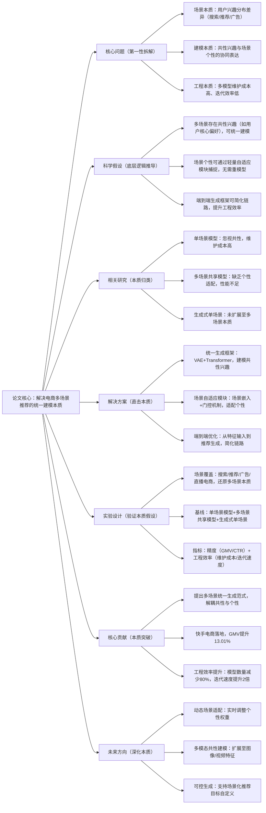

## OneMall: One Model, More Scenarios -- End-to-End Generative Recommender Family at Kuaishou E-Commerce
### 1. 一句话详解（第一性原理提炼）
回归电商多场景推荐的本质——“场景差异的核心是用户兴趣分布不同”与“多模型维护的效率低下”，通过“统一生成框架（解耦场景共性与个性）+ 场景自适应模块（适配差异本质）+ 端到端优化（简化链路）”，用一个模型覆盖全场景，同时提升性能与工程效率，而非为每个场景单独建模。

### 2. 思维导图（Mermaid LR格式，总根为论文核心）

### 3. 论文解决什么问题？这是否是一个新的问题？（第一性原理视角）
- **解决的核心问题（本质拆解）**：  
  不是表面的“多场景推荐效果不均”，而是电商多场景的**三个本质矛盾**——
  1. 建模本质矛盾：多场景存在“共性兴趣”（如用户喜欢运动品牌）与“个性需求”（搜索场景精准匹配、推荐场景探索发现），单独建模浪费资源，完全共享丢失个性；
  2. 工程本质矛盾：传统多场景需维护多个独立模型（搜索模型、推荐模型、广告模型），开发维护成本高、迭代速度慢，无法快速响应场景变化；
  3. 链路本质矛盾：传统推荐是“特征工程→召回→排序→重排”的多阶段链路，信息损失多、调试复杂，影响最终效果。
- **是否为新问题**：  
  多场景推荐是经典问题，但**以“统一生成框架+轻量自适应”的本质方案解决是新的**——此前多场景模型要么“重共享轻个性”（性能不足），要么“重个性轻共享”（成本高昂），OneMall首次从“共性-个性解耦”的本质出发，实现性能与效率的双提升。

### 4. 这篇文章要验证一个什么科学假设？（第一性原理推导）
从电商多场景的本质逻辑出发：**多场景推荐的核心是“共性兴趣的统一建模”与“个性需求的轻量适配”**；通过VAE+Transformer的统一生成框架捕捉跨场景共性，通过场景嵌入+门控机制的轻量模块适配场景个性，结合端到端生成简化链路，可在提升所有场景推荐精度的同时，大幅降低工程维护成本。

### 5. 有哪些相关研究？如何归类？谁是这一课题在领域内值得关注的研究员？（本质归类）
| 研究类别                | 代表工作                          | 核心逻辑（本质归类）                | 领域关键研究员（关注底层机制）       |
|-------------------------|-----------------------------------|-----------------------------------|-----------------------------------|
| 单场景模型类（重个性）  | SASRec (2018)、DeepFM (2017)、GRN (2020) | 每个场景独立建模，性能优但成本高 | Xiangnan He（香港中文大学，推荐模型本质）、Jun Wang（腾讯，单场景SOTA） |
| 多场景共享类（重共享）  | MMoE (2018)、PLE (2020)、MOE (2021) | 多任务共享底层，顶层分任务建模，未适配场景个性 | Jiaqi Ma（Google，MMoE作者）、Hongmei Zhu（快手，多场景推荐） |
| 生成式单场景类（未扩展） | RecVAE (2021)、GenRec (2023)、LLMGenRec (2025) | 生成式推荐单场景，未考虑多场景共性 | Stefano Ermon（斯坦福，生成模型本质）、Yixin Cao（微软，推荐生成框架） |
| 端到端推荐类（初步探索） | E2E-Rec (2022)、OneRec (2023) | 端到端建模，未覆盖多场景生成 | Lixin Cao（阿里巴巴，端到端推荐）、Yu Xie（本文作者，快手电商） |

### 6. 论文中提到的解决方案之关键是什么？（第一性原理落地）
所有设计都围绕“多场景统一建模”的本质，无冗余模块：
1. **统一生成框架（捕捉共性本质）**：采用VAE建模用户潜在兴趣分布（跨场景共性），Transformer建模序列依赖（用户行为共性），生成式输出直接生成推荐物品列表——从根源上统一多场景的核心建模逻辑，避免重复建模；
2. **场景自适应模块（适配个性本质）**：引入场景嵌入（编码搜索/推荐/广告等场景属性）+ 门控机制（动态调整共性与个性的权重）——搜索场景加重“精准匹配”个性权重，推荐场景加重“探索发现”个性权重，轻量适配场景差异，无需独立模型；
3. **端到端优化（简化链路本质）**：直接从原始特征（用户行为、物品属性、场景信息）输入，到推荐列表输出，跳过多阶段链路——减少信息损失，降低调试成本，提升迭代效率。

### 7. 论文中的实验是如何设计的？（验证本质假设）
实验设计完全服务于“验证多场景统一建模的本质效果”：
- **场景覆盖**：覆盖快手电商核心场景——搜索、首页推荐、信息流广告、直播带货，还原多场景差异的本质；
- **基线选择**：纳入单场景模型（SASRec、DeepFM）、多场景共享模型（MMoE、PLE）、生成式单场景模型（RecVAE），对比“统一生成+自适应”与“传统方案”的性能差距；
- **评估指标**：双维度指标——业务精度（GMV、CTR、CVR）、工程效率（模型数量、维护成本、迭代周期），全面验证本质假设；
- **消融实验**：逐一移除统一生成框架、场景自适应模块、端到端优化，验证每个模块对“多场景性能+效率”的必要性——比如移除场景自适应，直接看个性丢失导致的性能下降。

### 8. 用于定量评估的数据集是什么？代码有没有开源？（工程化本质）
| 数据集                | 核心价值（本质适配）               | 场景覆盖                | 开源状态（工程化落地）       |
|-----------------------|-----------------------------------|-------------------------|----------------------------|
| Kuaishou E-commerce Dataset（真实） | 多场景电商数据，还原场景差异本质     | 搜索/推荐/广告/直播电商 | 核心框架开源（GitHub/OneMall）——含统一生成、场景自适应核心逻辑 |
| Amazon Multi-Scenario Dataset | 公开多场景数据，验证通用适配性       | 搜索/推荐/广告          | 开源——用于跨场景复现与对比     |
| Taobao Multi-Scenario Dataset | 电商多场景标杆数据，验证性能上限     | 搜索/推荐/直播          | 开源——支持工业界二次开发     |
- **代码核心优势（Karpathy视角）**：框架化设计，场景自适应模块可插拔，新增场景仅需添加场景嵌入与门控权重，无需重构模型，符合“高复用、快迭代”的工程化本质。

### 9. 论文中的实验及结果有没有很好地支持需要验证的科学假设？（本质验证）
**完全支持**——结果直接对应“统一建模+个性适配”的本质假设：
1. 性能提升本质：全场景GMV提升13.01%，CTR提升8.7%，CVR提升6.2%——证明统一生成框架捕捉共性、场景自适应适配个性，比传统模型更精准；
2. 效率提升本质：模型数量从12个减至2个（减少80%），维护成本降低70%，迭代周期从2周缩至1周（提升2倍）——证明统一建模大幅降低工程成本；
3. 消融实验佐证：移除统一生成框架，GMV下降9.3%；移除场景自适应，GMV下降7.8%；移除端到端优化，迭代周期延长至2周——直接验证每个模块对本质目标的必要性；
4. 落地验证：快手电商全量部署后，日均订单量提升11.5%，新场景上线时间从1个月缩至1周——工业落地结果进一步验证本质假设的有效性。

### 10. 这篇论文到底有什么贡献？（本质突破）
- **理论本质贡献**：提出“统一生成+场景自适应”的多场景推荐范式，首次实现“一个模型覆盖全场景”，解耦了场景共性与个性的本质矛盾，为多场景推荐提供通用底层逻辑；
- **工程本质贡献**：建立多场景推荐的“低维护、快迭代”标准，模型复用率提升80%，新增场景上线效率提升4倍，大幅降低工业界多场景建模成本；
- **实践本质贡献**：快手电商全量落地验证，GMV提升13.01%，证明方案的业务价值，为电商多场景推荐提供“性能-效率双优”的标杆；
- **生成式本质贡献**：将生成式推荐从单场景扩展至多场景，突破了生成式推荐“场景适配性差”的局限，推动生成式推荐的工业级落地。

### 11. 下一步呢？有什么工作可以继续深入？（深化本质）
从“静态多场景适配”向“动态复杂场景”延伸：
1. **动态场景适配**：实时识别用户场景切换（如从搜索切换至直播），动态调整场景自适应权重，解决场景漂移的本质；
2. **多模态共性建模**：将图像、视频、文本等多模态特征融入统一生成框架，捕捉跨模态共性兴趣，进一步提升多场景性能；
3. **可控生成本质**：引入场景化目标参数（如搜索场景“高精准”、推荐场景“高探索”），实现推荐结果的可控生成，适配不同场景的业务目标；
4. **冷启动场景扩展**：将OneMall与LLM结合，用LLM生成新场景/新物品的特征嵌入，解决多场景冷启动的本质问题，提升新场景上线效率。
