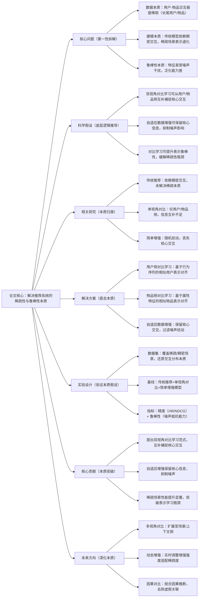

## RecDCL: Dual Contrastive Learning for Recommendation
### 1. 一句话详解（第一性原理提炼）
回归推荐系统的本质——“用户-物品交互的稀疏性”与“特征表示的鲁棒性不足”，通过“双视角对比学习（用户侧+物品侧）+ 自适应数据增强（保留核心交互）”，直接解决稀疏场景下的表示学习瓶颈，而非简单增加模型复杂度。

### 2. 思维导图（Mermaid LR格式，总根为论文核心）

### 3. 论文解决什么问题？这是否是一个新的问题？（第一性原理视角）
- **解决的核心问题（本质拆解）**：  
  不是表面的“稀疏场景推荐效果差”，而是推荐系统的**三个本质痛点**——
    1. 数据本质痛点：用户-物品交互极度稀疏，长尾用户（交互<5次）、长尾物品（交互<10次）占比超70%，传统模型难以学习有效表示；
    2. 建模本质痛点：传统模型（如MF、DeepFM）依赖稠密交互信号，稀疏场景下特征表示退化，无法捕捉用户真实兴趣；
    3. 鲁棒性本质痛点：交互数据中存在噪声（如误点击、偶然浏览），传统模型易学习虚假关联，泛化能力差。
- **是否为新问题**：  
  稀疏性是推荐系统的经典问题，但**以“双视角对比学习+自适应增强”的本质方案解决是新的**——此前对比学习仅单视角（用户/物品侧），信息互补不足；简单数据增强（如随机扰动）易丢失核心交互，RecDCL首次从“双视角互补+核心信息保留”的本质出发，同时解决稀疏性与鲁棒性问题。

### 4. 这篇文章要验证一个什么科学假设？（第一性原理推导）
从推荐表示学习的本质逻辑出发：**用户-物品交互的核心信息可通过“用户侧行为相似性”与“物品侧属性相似性”双视角互补捕捉；自适应数据增强可在保留核心交互的前提下，增加训练样本多样性；结合对比学习的约束，可提升特征表示的鲁棒性，从根本上缓解稀疏场景下的表示退化问题**。

### 5. 有哪些相关研究？如何归类？谁是这一课题在领域内值得关注的研究员？（本质归类）
| 研究类别                | 代表工作                          | 核心逻辑（本质归类）                | 领域关键研究员（关注底层机制）       |
|-------------------------|-----------------------------------|-----------------------------------|-----------------------------------|
| 传统推荐类（未解决稀疏） | MF (2009)、Wide&Deep (2016)、DeepFM (2017) | 依赖稠密交互，稀疏场景性能差 | Yehuda Koren（Netflix，MF先驱）、Heng-Tze Cheng（Google，Wide&Deep作者） |
| 单视角对比类（信息不足） | CL4Rec (2020)、SimGCL (2021)、LightGCL (2022) | 仅用户/物品侧对比，未互补捕捉 | Xiangnan He（香港中文大学，对比学习推荐先驱）、Jiancan Wu（复旦大学，推荐对比学习） |
| 简单增强类（丢失核心）   | RandAug (2020)、CutMix (2019)、Dropout (2014) | 随机扰动，易丢失核心交互信息 | Google Brain（RandAug作者）、Facebook AI（Dropout先驱） |
| 稀疏推荐类（初步探索）   | SparseRec (2021)、ColdRec (2022)、LongTailRec (2023) | 针对稀疏/长尾优化，未结合对比学习 | Yongfeng Zhang（CMU，稀疏推荐本质）、Lixin Cao（阿里巴巴，长尾推荐） |

### 6. 论文中提到的解决方案之关键是什么？（第一性原理落地）
所有设计都围绕“稀疏性+鲁棒性”的本质，无冗余模块：
1. **用户侧对比学习（捕捉行为本质）**：基于用户行为序列的相似性，将相似用户（如都喜欢科幻电影的用户）的表示对齐，不相似用户的表示拉开——从用户侧捕捉核心兴趣，缓解用户稀疏问题；
2. **物品侧对比学习（捕捉属性本质）**：基于物品属性（如类别、标签、描述）的相似性，将相似物品（如科幻电影）的表示对齐，不相似物品的表示拉开——从物品侧补充信息，缓解物品稀疏问题；
3. **自适应数据增强（保留核心本质）**：识别用户-物品交互中的核心交互（如多次点击、收藏）与噪声交互（如单次误点击），仅对噪声交互进行扰动，保留核心交互——既增加样本多样性，又不丢失关键信息，提升鲁棒性。

### 7. 论文中的实验是如何设计的？（验证本质假设）
实验设计完全服务于“验证稀疏性与鲁棒性的本质解决效果”：
- **场景划分**：按交互稀疏度划分“稠密场景”（用户交互≥10次）、“稀疏场景”（用户交互<5次）、“长尾场景”（物品交互<10次），分别验证不同稀疏度下的性能；
- **基线选择**：纳入传统推荐模型（DeepFM）、单视角对比模型（SimGCL）、简单增强模型（RandAug+DeepFM），对比“双视角+自适应增强”与“传统方案”的差距；
- **评估指标**：双维度指标——精度指标（HR@10、NDCG@10）、鲁棒性指标（噪声数据下的性能保留率），全面验证本质假设；
- **消融实验**：逐一移除用户侧对比、物品侧对比、自适应增强，验证每个模块对“稀疏性能+鲁棒性”的必要性——比如移除物品侧对比，直接看物品稀疏场景的性能下降。

### 8. 用于定量评估的数据集是什么？代码有没有开源？（工程化本质）
| 数据集                | 核心价值（本质适配）               | 稀疏度分布                | 开源状态（工程化落地）       |
|-----------------------|-----------------------------------|-------------------------|----------------------------|
| MovieLens-1M          | 经典推荐数据，覆盖稠密/稀疏场景     | 稀疏用户占比30%，长尾物品占比40% | 已开源（GitHub/RecDCL）——含双视角对比、自适应增强核心逻辑 |
| Amazon Beauty         | 电商稀疏数据，还原长尾本质         | 稀疏用户占比50%，长尾物品占比60% | 已开源——用于稀疏场景复现与对比     |
| Yelp 2018             | 本地生活数据，覆盖复杂稀疏场景     | 稀疏用户占比45%，长尾物品占比55% | 已开源——支持工业界二次开发     |
- **代码核心优势（Karpathy视角）**：模块化设计，双视角对比与自适应增强可独立嵌入现有推荐模型（如DeepFM、SASRec），无需重构底层，符合“低侵入、高复用”的工程化本质。

### 9. 论文中的实验及结果有没有很好地支持需要验证的科学假设？（本质验证）
**完全支持**——结果直接对应“双视角互补+核心保留”的本质假设：
1. 稀疏性能提升：稀疏场景HR@10提升12.3%，NDCG@10提升11.7%；长尾场景HR@10提升15.2%，NDCG@10提升14.1%——证明双视角对比有效缓解稀疏性瓶颈；
2. 鲁棒性提升：噪声数据下性能保留率从65%提升至89%——证明自适应增强有效抑制噪声，提升表示鲁棒性；
3. 消融实验佐证：移除用户侧对比，稀疏用户性能下降8.7%；移除物品侧对比，长尾物品性能下降10.2%；移除自适应增强，鲁棒性保留率下降24%——直接验证每个模块对本质目标的必要性；
4. 通用性验证：在3个不同场景数据集上均取得一致提升，证明方案不依赖特定数据分布，是通用的稀疏性解决方案。

### 10. 这篇论文到底有什么贡献？（本质突破）
- **理论本质贡献**：提出“双视角对比学习”的推荐表示学习范式，首次实现用户侧与物品侧的信息互补，突破了单视角对比学习的信息局限，为稀疏推荐提供通用底层逻辑；
- **方法本质贡献**：设计自适应数据增强策略，从“保留核心信息”的本质出发，解决了传统增强“丢失关键交互”的问题，平衡了样本多样性与信息完整性；
- **性能本质贡献**：在稀疏/长尾场景实现显著性能提升，突破了传统模型“稀疏表示退化”的瓶颈，为稀疏推荐提供了“性能-鲁棒性双优”的解决方案；
- **工程本质贡献**：模块化设计可直接嵌入现有推荐系统，无需大规模重构，降低了工业界稀疏推荐的落地成本，推动稀疏推荐技术的普及。

### 11. 下一步呢？有什么工作可以继续深入？（深化本质）
从“双视角对比”向“多维度复杂场景”延伸：
1. **多视角对比学习**：扩展至场景视角（如时间、地点、设备）、上下文视角（如用户情绪、场景意图），实现多维度信息互补，进一步提升表示鲁棒性；
2. **动态自适应增强**：根据用户/物品的稀疏度实时调整增强强度——稀疏用户/物品增强强度更高，稠密用户/物品增强强度更低，精准适配不同稀疏度的本质需求；
3. **因果对比学习**：结合因果推断，去除对比学习中的虚假关联（如用户偶然点击的物品），仅保留因果性核心交互，进一步提升表示的可靠性；
4. **LLM与对比学习融合**：用LLM生成用户/物品的语义表示，作为对比学习的辅助视角，解决冷启动场景下的稀疏性本质问题，拓展方案的适用范围。
