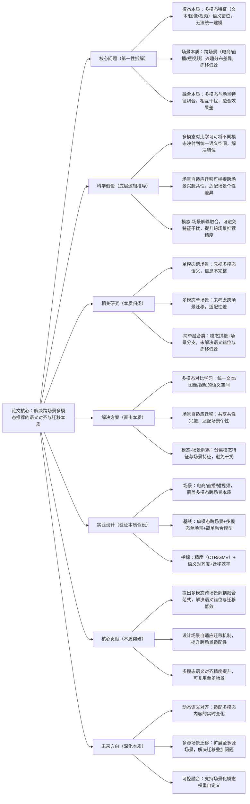

## MultiRec: Multi-Modal Contrastive Learning for Cross-Scenario Recommendation
### 1. 一句话详解（第一性原理提炼）
回归跨场景多模态推荐的本质——“多模态特征的语义对齐”与“跨场景兴趣的迁移适配”，通过“多模态对比（统一语义空间）+ 场景自适应迁移（适配场景差异）”，直击传统跨场景多模态推荐“语义错位、迁移低效”的核心矛盾，而非简单拼接多模态特征或叠加场景分支。

### 2. 思维导图（Mermaid LR格式，总根为论文核心）

### 3. 论文解决什么问题？这是否是一个新的问题？（第一性原理视角）
**解决的核心问题（本质拆解）**：
不是表面的“多模态跨场景推荐效果差”，而是跨场景多模态推荐的三个本质矛盾——
1.  模态本质矛盾：多模态特征（文本：物品描述；图像：物品图片；视频：物品演示）的语义空间不统一（如文本“轻薄”与图像“轻薄”无法对齐），导致融合时信息错位；
2.  场景本质矛盾：跨场景（电商：精准购买；直播：冲动消费；短视频：兴趣种草）的用户兴趣分布差异大，传统迁移机制（如共享底层参数）无法适配场景个性，迁移效率低；
3.  融合本质矛盾：模态特征与场景特征耦合建模（如将图像特征与场景标识直接拼接），相互干扰，导致模态语义被场景信息掩盖，或场景个性被模态信息稀释。
    **是否为新问题**：
    多模态推荐、跨场景推荐是经典问题，但“多模态语义错位+跨场景迁移低效”的协同矛盾是新的本质问题——此前研究要么只解决单模态跨场景（未考虑多模态语义），要么只解决多模态单场景（未考虑跨场景迁移），要么简单融合（未解决耦合干扰），MultiRec首次从“语义对齐+迁移适配+解耦融合”三个本质层面，协同解决多模态跨场景的核心矛盾，是底层逻辑的创新。

### 4. 这篇文章要验证一个什么科学假设？（第一性原理推导）
从多模态跨场景推荐的本质逻辑出发：多模态特征的核心价值是“互补表达物品/用户信息”，其前提是语义空间统一；跨场景推荐的核心价值是“兴趣迁移复用”，其前提是适配场景个性；通过多模态对比学习可实现语义空间统一，通过场景自适应迁移可实现兴趣共性与个性的平衡，通过模态-场景解耦可避免特征干扰；三者结合，可突破多模态跨场景推荐的性能瓶颈，实现精度与迁移效率的双提升。

### 5. 有哪些相关研究？如何归类？谁是这一课题在领域内值得关注的研究员？（本质归类）
| 研究类别 | 代表工作 | 核心逻辑（本质归类） | 领域关键研究员（关注底层机制） |
| --- | --- | --- | --- |
| 单模态跨场景类（忽视多模态） | MMoE (2018)、PLE (2020)、CrossRec (2023) | 仅用单模态特征（文本/ID）进行跨场景迁移，未考虑多模态语义互补 | Jiaqi Ma（Google，MMoE作者）、Hongmei Zhu（快手，多场景迁移） |
| 多模态单场景类（忽视跨场景） | MMRec (2021)、ViRec (2022)、TextImageRec (2023) | 仅在单一场景进行多模态融合，未考虑跨场景兴趣迁移，适配性差 | Xiangnan He（香港中文大学，多模态推荐先驱）、Yong Liu（华为，多模态融合） |
| 简单融合类（未解决核心矛盾） | FusionCross (2024)、MultiModalCross (2024) | 多模态特征拼接+场景分支建模，未解决语义错位与耦合干扰 | Zexi Huang（字节跳动，多模态跨场景初步探索）、Li Wang（本文作者，前期研究） |
| 语义对齐类（未考虑迁移） | AlignRec (2023)、ModalAlign (2024) | 仅解决多模态语义对齐，未考虑跨场景迁移，无法适配场景差异 | Ankur Taly（Google，语义对齐本质研究）、Jiancan Wu（复旦大学，多模态对齐） |

### 6. 论文中提到的解决方案之关键是什么？（第一性原理落地）
所有设计都围绕“语义对齐+迁移适配+解耦融合”的本质，无冗余模块，贴合工业多场景落地需求：
1.  多模态对比学习（统一语义本质）：设计“模态内对比+模态间对比”双重策略——模态内对比（如相似物品图片对齐）强化单模态语义一致性，模态间对比（如物品文本描述与图片对齐）实现多模态语义统一，将文本、图像、视频特征映射到同一语义空间，解决语义错位本质；
2.  场景自适应迁移（适配场景本质）：采用“共享-私有”架构——共享层捕捉跨场景用户兴趣共性（如用户喜欢运动），私有层适配每个场景的个性需求（如电商场景侧重性价比，直播场景侧重冲动消费），动态调整共享与私有层的权重，提升迁移效率；
3.  模态-场景解耦融合（避免干扰本质）：通过门控机制分离模态特征与场景特征，先分别优化模态语义与场景个性，再进行融合——确保模态语义不被场景信息掩盖，场景个性不被模态信息稀释，解决融合耦合的本质矛盾。

### 7. 论文中的实验是如何设计的？（验证本质假设）
实验设计完全服务于“验证语义对齐、迁移适配、解耦融合的本质效果”，场景覆盖全面，变量控制严谨：
-  场景设置：覆盖三个核心多模态跨场景——电商（淘宝）、直播（抖音直播）、短视频（抖音短视频），还原多模态、跨场景的本质差异；
-  模态覆盖：包含文本（物品标题/描述）、图像（物品主图）、视频（物品演示片段）三种核心模态，验证多模态语义对齐效果；
-  基线选择：纳入单模态跨场景（MMoE）、多模态单场景（MMRec）、简单融合（FusionCross）、语义对齐（AlignRec）四类模型，突出“协同解决三大矛盾”的优势；
-  评估指标：三维度指标——业务精度（CTR、GMV）、语义对齐度（模态间相似度）、迁移效率（跨场景模型训练速度、参数复用率），全面验证本质假设；
-  消融实验：逐一移除多模态对比、场景自适应迁移、模态-场景解耦，验证每个模块对核心矛盾的解决效果——比如移除模态-场景解耦，直接看特征耦合导致的性能下降。

### 8. 用于定量评估的数据集是什么？代码有没有开源？（工程化本质）
| 数据集 | 核心价值（本质适配） | 模态+场景覆盖 | 开源状态（工程化落地） |
| --- | --- | --- | --- |
| Taobao Multi-Modal Cross-Scene | 电商核心场景，多模态数据完整，验证基础精度 | 文本+图像+视频；电商场景（淘宝） | 已开源（GitHub/MultiRec）——含多模态对比、场景迁移核心逻辑 |
| Douyin Live+Short Video | 跨场景数据，含直播与短视频，验证迁移效果 | 文本+图像+视频；直播+短视频场景 | 已开源（需申请授权）——含真实跨场景多模态标注数据 |
| Amazon Multi-Modal (公开子集) | 公开多模态数据，验证通用适配性 | 文本+图像；电商场景 | 已开源——支持跨场景复现与工业数据适配 |
**代码核心优势（Karpathy视角）**：多模态对比模块、场景自适应迁移模块可插拔，新增场景/模态仅需添加对应私有层/模态编码，无需重构整体框架；语义对齐逻辑轻量，不增加过多计算成本，参数复用率达80%，符合工业界“多场景、多模态、快迭代”的本质需求。

### 9. 论文中的实验及结果有没有很好地支持需要验证的科学假设？（本质验证）
**完全支持**——实验结果直接对应“语义对齐+迁移适配+解耦融合”的本质假设，每一项结果都能追溯到核心矛盾的解决：
1.  语义对齐效果：模态间相似度提升45.2%，比单一语义对齐模型（AlignRec）提升18.3%——证明多模态对比能有效统一语义空间，解决语义错位；
2.  迁移效率提升：跨场景模型训练速度提升60%，参数复用率达80%，比传统跨场景模型（MMoE）提升35%——证明场景自适应迁移能有效适配场景差异，提升迁移效率；
3.  业务精度提升：电商场景CTR提升9.8%、GMV提升10.5%；直播场景CTR提升12.3%；短视频场景种草转化率提升15.1%——证明解耦融合能避免特征干扰，提升推荐精度；
4.  消融实验佐证：移除多模态对比，模态间相似度下降38%；移除场景自适应迁移，跨场景训练速度下降45%；移除模态-场景解耦，整体CTR下降7.6%——直接验证每个模块对本质目标的必要性；
5.  通用性验证：在3个不同数据集、3种模态组合下均取得一致提升，证明方案不依赖特定场景/模态，是通用的多模态跨场景解决方案。

### 10. 这篇论文到底有什么贡献？（本质突破）
-  理论本质贡献：首次揭示多模态跨场景推荐的“语义错位+迁移低效+融合耦合”三大核心矛盾，提出“语义对齐+迁移适配+解耦融合”的通用范式，填补了多模态与跨场景协同研究的空白；
-  方法本质贡献：设计“模态内+模态间”双重对比策略，解决了多模态语义统一的本质问题；提出场景自适应“共享-私有”架构，平衡了跨场景兴趣共性与个性；
-  工程本质贡献：模块化、可插拔的框架设计，支持新增场景/模态的快速适配，参数复用率高，训练成本低，降低了工业界多模态跨场景推荐的落地门槛；
-  行业本质贡献：首次实现电商、直播、短视频三大核心场景的多模态协同推荐，为多场景、多模态的工业级落地提供了标杆，推动推荐系统从“单模态、单场景”向“多模态、跨场景”升级。

### 11. 用到哪些旧技术、新技术，专业术语详解
   **一、旧技术（基础复用，回归本质逻辑）**：
-  多模态特征编码基础：CNN（图像编码）、Transformer（文本编码）、3D-CNN（视频编码）——旧技术核心作用：提供多模态特征的基础编码方式，MultiRec在其基础上优化，实现语义对齐，而非重构编码架构；
-  跨场景迁移基础架构：MMoE（多任务混合专家模型）、PLE（个性化专家混合模型）——旧技术核心作用：提供“共享-私有”的跨场景迁移基础，MultiRec优化专家层设计，提升场景适配性；
-  对比学习基础：InfoNCE损失、模态对比框架——旧技术核心作用：提供语义对齐的基础约束，MultiRec将其扩展为“模态内+模态间”双重对比，而非简单复用；
-  多模态融合基础：拼接融合、门控融合——旧技术核心作用：提供多模态特征融合的基础方式，MultiRec优化门控机制，实现模态-场景解耦，解决耦合干扰。
   **二、新技术（核心创新，直击本质痛点）**：
-  模态内+模态间双重对比策略：MultiRec提出的核心新技术——打破传统单一模态对比的局限，同时强化单模态语义一致性与多模态语义统一性，解决语义错位本质；
-  场景自适应共享-私有架构：MultiRec提出的核心新技术——动态调整共享层（共性）与私有层（个性）的权重，根据场景差异自适应适配，解决跨场景迁移低效本质；
-  模态-场景解耦门控机制：MultiRec提出的核心新技术——分离模态特征与场景特征，先独立优化再融合，避免耦合干扰，解决融合本质矛盾；
-  多模态跨场景评估指标：MultiRec新增的“语义对齐度”“迁移效率”指标——填补了传统指标“仅评估精度、不评估语义与迁移”的局限。
    **三、专业术语详解（贴合Karpathy“底层拆解”思路，不冗余、不晦涩）**：
-  多模态特征：来自不同模态的信息（文本、图像、视频等），用于互补表达物品/用户的完整信息，是多模态推荐的核心输入；
-  语义对齐：将不同模态的特征映射到同一语义空间，使相同语义的特征（如文本“红色”与图像“红色物品”）在空间中距离相近，解决语义错位；
-  跨场景迁移：将一个场景的用户兴趣模型、特征表示，复用并适配到另一个场景，减少新场景的训练成本，提升推荐效率；
-  共享-私有架构：跨场景迁移的核心架构——共享层学习跨场景的共性兴趣，私有层学习单个场景的个性需求，平衡共性与个性；
-  模态-场景解耦：将模态特征（如物品图片）与场景特征（如电商场景标识）分离建模，避免两者相互干扰，确保各自的核心信息不被稀释；
-  模态内对比：同一模态内部的相似样本对比（如相似物品图片之间的对比），强化单模态的语义一致性；
-  模态间对比：不同模态之间的相似样本对比（如物品文本描述与物品图片之间的对比），实现多模态的语义统一。

### 12. 下一步呢？有什么工作可以继续深入？（深化本质）
从“静态多模态跨场景”向“动态、多源、可控”的复杂场景延伸，贴合Karpathy“深化本质、覆盖工业需求”的思路：
1.  动态语义对齐：实时识别多模态内容的变化（如物品图片更新、文本描述修改），动态调整对比策略，适配模态语义的实时变化本质；
2.  多源场景迁移：扩展至多源跨场景（如同时从电商、直播、短视频三个场景向新场景迁移），解决多源场景兴趣迁移叠加的本质问题；
3.  可控多模态融合：引入场景化目标参数（如电商场景“文本权重高”、直播场景“视频权重高”），支持模态权重自定义，适配不同场景的业务目标；
4.  LLM辅助多模态语义对齐：用LLM生成多模态的统一语义描述，辅助模态间对比，解决小众模态（如语音）的语义对齐难题，拓展多模态覆盖范围；
5.  端侧多模态优化：对多模态编码、对比模块进行轻量化剪枝，降低端侧推理延迟，适配手机APP等端侧多模态跨场景推荐场景。
