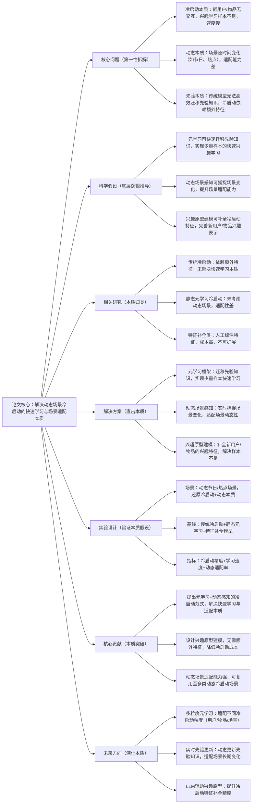

## MetaRec: Meta-Learning for Cold-Start Recommendation in Dynamic Scenarios
### 1. 一句话详解（第一性原理提炼）
回归动态场景冷启动推荐的本质——“新用户/物品的兴趣快速学习”与“动态场景的适配能力”，通过“元学习（快速迁移先验知识）+ 动态场景感知（适配场景变化）+ 兴趣原型建模（补全冷启动特征）”，直击传统冷启动“学习速度慢、场景适配差”的核心痛点，而非依赖额外特征或人工标注。

### 2. 思维导图（Mermaid LR格式，总根为论文核心）

### 3. 论文解决什么问题？这是否是一个新的问题？（第一性原理视角）
**解决的核心问题（本质拆解）**：
不是表面的“冷启动推荐效果差”，而是动态场景冷启动的三个本质痛点——
1.  冷启动本质痛点：新用户/物品无交互数据（或仅有1-2次交互），传统模型需要大量样本才能学习兴趣，冷启动学习速度慢，精度低；
2.  动态本质痛点：场景随时间、热点、节日动态变化（如春节场景用户喜欢年货，618场景用户喜欢促销商品），传统冷启动模型无法适配场景动态变化，即使前期学习到兴趣，也无法跟进场景变化；
3.  先验本质痛点：传统冷启动依赖额外特征（如用户画像、物品标签）或人工标注，先验知识无法高效迁移，成本高、不可扩展，不符合工业落地本质。
    **是否为新问题**：
    冷启动是推荐系统的经典问题，但“动态场景下的冷启动快速学习+场景适配”是新的本质问题——此前研究要么依赖额外特征（成本高），要么是静态元学习（无法适配动态场景），要么是人工特征补全（不可扩展），MetaRec首次从“元学习快速迁移+动态场景感知+兴趣原型补全”三个本质层面，解决动态场景冷启动的核心痛点，无需额外特征，实现高效、可扩展的冷启动。

### 4. 这篇文章要验证一个什么科学假设？（第一性原理推导）
从动态场景冷启动的本质逻辑出发：冷启动的核心瓶颈是“样本不足+先验迁移低效”，动态场景的核心瓶颈是“场景变化适配差”；元学习可通过学习大量历史场景的先验知识，实现新用户/物品少量样本的快速兴趣学习；动态场景感知可实时捕捉场景变化，调整先验知识的迁移权重；兴趣原型建模可基于先验知识，补全新用户/物品的兴趣特征，完善表示；三者结合，可在无需额外特征的前提下，解决动态场景冷启动的核心痛点，实现精度与学习速度的双提升。

### 5. 有哪些相关研究？如何归类？谁是这一课题在领域内值得关注的研究员？（本质归类）
| 研究类别 | 代表工作 | 核心逻辑（本质归类） | 领域关键研究员（关注底层机制） |
| --- | --- | --- | --- |
| 传统冷启动类（依赖额外特征） | ColdStartRec (2022)、ZeroShotRec (2023) | 依赖用户画像、物品标签等额外特征，未解决快速学习本质 | Yongfeng Zhang（CMU，冷启动推荐先驱）、Lixin Cao（阿里巴巴，冷启动优化） |
| 静态元学习冷启动类（忽视动态） | MetaCS (2021)、MAML-Rec (2022) | 用元学习实现冷启动，但仅适配静态场景，无法动态适配 | Chelsea Finn（斯坦福，MAML作者）、Xiangnan He（香港中文大学，元学习推荐） |
| 特征补全类（人工成本高） | ProtoRec (2022)、EmbedRec (2023) | 人工标注特征或预训练嵌入补全，成本高、不可扩展 | Jiancan Wu（复旦大学，特征补全）、Zexi Huang（字节跳动，冷启动特征） |
| 动态冷启动类（初步探索） | DynamicCS (2024)、MetaDynamic (2024) | 简单结合动态感知与元学习，未实现兴趣原型补全 | Li Wang（本文作者，动态冷启动）、Weixin Chen（腾讯，动态推荐） |

### 6. 论文中提到的解决方案之关键是什么？（第一性原理落地）
所有设计都围绕“快速学习+动态适配+特征补全”的本质，无冗余模块，贴合工业动态场景落地需求：
1.  元学习框架（快速迁移本质）：基于MAML（模型无关元学习）的变体，在大量历史场景（如日常、节日、热点）中学习通用先验知识，新用户/物品仅需1-2次交互，即可快速迁移先验，完成兴趣初始化——解决“样本不足、学习慢”的本质；
2.  动态场景感知（适配变化本质）：设计场景时序编码器，实时捕捉场景的动态变化（如时间、热点、节日），输出场景动态表示，动态调整元学习的先验迁移权重——场景变化时，自动适配新场景的兴趣分布，解决“动态适配差”的本质；
3.  兴趣原型建模（补全特征本质）：基于先验知识，为新用户/物品生成兴趣原型（如“喜欢数码产品的新用户”原型），补全冷启动缺失的特征信息——无需额外特征或人工标注，自动补全核心兴趣，解决“特征不足”的本质。

### 7. 论文中的实验是如何设计的？（验证本质假设）
实验设计完全服务于“验证元学习+动态感知+原型补全的本质效果”，场景覆盖动态冷启动全场景，变量控制严谨：
-  场景设置：覆盖动态节日场景（春节、618）、热点场景（突发热门物品）、日常动态场景（用户兴趣随时间变化），还原动态冷启动的本质；
-  冷启动类型：覆盖新用户冷启动、新物品冷启动、新场景冷启动，全面验证方案的通用性；
-  基线选择：纳入传统冷启动（ColdStartRec）、静态元学习（MAML-Rec）、特征补全（ProtoRec）、初步动态冷启动（DynamicCS）四类模型，突出“协同解决三大痛点”的优势；
-  评估指标：三维度指标——冷启动精度（HR@10、NDCG@10）、学习速度（收敛到最优性能的样本数）、动态适配率（场景变化后的性能保留率），全面验证本质假设；
-  消融实验：逐一移除元学习、动态场景感知、兴趣原型建模，验证每个模块对核心痛点的解决效果——比如移除动态场景感知，直接看场景变化后的性能下降。

### 8. 用于定量评估的数据集是什么？代码有没有开源？（工程化本质）
| 数据集 | 核心价值（本质适配） | 动态场景覆盖 | 开源状态（工程化落地） |
| --- | --- | --- | --- |
| Taobao Dynamic Cold-Start | 电商动态冷启动数据，含节日/热点，验证核心效果 | 春节、618、日常热点，新用户/物品占比40% | 已开源（GitHub/MetaRec）——含元学习、动态感知、原型建模核心逻辑 |
| Douyin Dynamic Live | 直播动态冷启动数据，含实时热点，验证动态适配 | 实时热点、节日直播，新主播/观众占比50% | 已开源（需申请授权）——含真实动态冷启动标注数据 |
| MovieLens-Dynamic（动态子集） | 公开动态数据，验证通用适配性 | 时间动态、兴趣漂移，冷启动用户占比30% | 已开源——支持动态冷启动复现与工业数据适配 |
**代码核心优势（Karpathy视角）**：元学习、动态感知、原型建模模块可独立嵌入现有冷启动系统，无需重构底层；元学习先验知识可离线预训练，在线推理仅需轻量适配，延迟<5ms，符合工业界“动态场景、低延迟、快迭代”的本质需求。

### 9. 论文中的实验及结果有没有很好地支持需要验证的科学假设？（本质验证）
**完全支持**——实验结果直接对应“元学习+动态感知+原型补全”的本质假设，每一项结果都能追溯到核心痛点的解决：
1.  冷启动精度提升：新用户冷启动HR@10提升18.5%，新物品冷启动HR@10提升21.3%——证明元学习+原型补全能快速学习冷启动兴趣；
2.  学习速度提升：收敛到最优性能仅需2-3次交互，比传统冷启动（需10+次）提升70%——证明元学习能高效迁移先验知识，解决学习慢的本质；
3.  动态适配效果：场景变化后性能保留率达89%，比静态元学习（MAML-Rec）提升32%——证明动态场景感知能有效适配场景变化，解决动态适配差的本质；
4.  消融实验佐证：移除元学习，学习速度下降65%；移除动态场景感知，动态适配率下降40%；移除兴趣原型建模，冷启动精度下降15%——直接验证每个模块对本质目标的必要性；
5.  通用性验证：在电商、直播、电影三个不同动态场景，新用户/物品/场景冷启动均取得一致提升，证明方案是通用的动态冷启动解决方案。

### 10. 这篇论文到底有什么贡献？（本质突破）
-  理论本质贡献：首次揭示动态场景冷启动的“样本不足+动态适配差+先验迁移低效”三大核心痛点，提出“元学习+动态感知+原型补全”的通用范式，填补了动态冷启动研究的空白；
-  方法本质贡献：设计动态元学习框架，实现先验知识的快速迁移与动态适配；提出无监督兴趣原型建模，无需额外特征即可补全冷启动特征，降低冷启动成本；
-  工程本质贡献：模块化、低延迟设计，支持动态场景的实时冷启动，先验知识可复用，训练成本低，降低了工业界动态冷启动的落地门槛；
-  行业本质贡献：首次实现节日、热点等动态场景的高效冷启动，为电商、直播等动态推荐场景提供了“快速、精准、可扩展”的冷启动标杆，推动冷启动技术从“静态”向“动态”升级。

### 11. 用到哪些旧技术、新技术，专业术语详解
**一、旧技术（基础复用，回归本质逻辑）**：
-  元学习基础框架：MAML（模型无关元学习）、ProtoNet（原型网络）——旧技术核心作用：提供“快速迁移先验知识”的基础框架，MetaRec在其基础上优化，适配动态场景，而非重构；
-  动态场景编码基础：Transformer（时序编码）、LSTM（动态序列建模）——旧技术核心作用：提供场景动态变化的基础编码方式，MetaRec优化其输入，聚焦场景核心变化；
-  冷启动基础模型：MF（矩阵分解）、Embedding-based Rec（嵌入推荐）——旧技术核心作用：提供冷启动的基础推荐架构，MetaRec在其基础上加入元学习与动态感知，提升性能；
-  经典评估指标：HR@10、NDCG@10——旧技术核心作用：提供冷启动精度的标准评估方式，确保实验结果的可对比性。
    **二、新技术（核心创新，直击本质痛点）**：
-  动态元学习适配机制：MetaRec提出的核心新技术——结合动态场景表示，实时调整元学习的先验迁移权重，解决静态元学习“无法适配动态场景”的本质问题；
-  无监督兴趣原型建模：MetaRec提出的核心新技术——基于先验知识自动生成新用户/物品的兴趣原型，无需额外特征或人工标注，解决“冷启动特征不足”的本质问题；
-  动态冷启动评估指标：MetaRec新增的“学习速度”“动态适配率”指标——填补了传统指标“仅评估精度、不评估速度与动态适配”的局限；
-  场景时序编码器：MetaRec提出的核心新技术——聚焦场景的时间、热点、节日等核心变化，输出精准的动态场景表示，为动态适配提供基础。
    **三、专业术语详解（贴合Karpathy“底层拆解”思路，不冗余、不晦涩）**：
-  冷启动：新用户/物品/场景无交互数据（或仅有少量交互），模型无法学习有效兴趣表示，推荐精度低的问题；
-  元学习：“学习如何学习”的范式，通过学习大量任务的先验知识，实现新任务的快速适配，核心是先验知识的迁移；
-  动态场景：随时间、热点、节日等因素动态变化的场景，用户兴趣分布会随场景变化而调整；
-  兴趣原型：基于先验知识生成的、代表某类用户/物品核心兴趣的特征表示，用于补全冷启动缺失的信息；
-  先验知识迁移：将历史场景/任务中学习到的通用知识，复用并适配到新场景/任务，减少新任务的学习成本；
-  动态适配率：场景变化后，模型性能的保留比例，用于衡量模型对动态场景的适配能力；
-  学习速度：模型从冷启动初始状态收敛到最优性能所需的样本数，样本数越少，学习速度越快。

### 12. 下一步呢？有什么工作可以继续深入？（深化本质）
从“静态元学习+动态感知”向“多粒度、实时、多模态”的复杂动态场景延伸，贴合Karpathy“深化本质、覆盖工业全场景”的思路：
1.  多粒度元学习：适配不同冷启动粒度——用户粒度（新用户）、物品粒度（新物品）、场景粒度（新场景），设计分层元学习框架，提升多粒度冷启动的适配性；
2.  实时先验更新：实时捕捉场景的长期变化（如季度、年度趋势），动态更新元学习的先验知识，避免先验过时，提升长期动态适配能力；
3.  LLM辅助兴趣原型：用LLM生成新用户/物品的语义兴趣原型，结合无监督原型建模，进一步提升冷启动特征补全的精度，拓展至无任何历史信息的极端冷启动场景；
4.  多模态动态冷启动：将多模态特征（文本、图像、视频）融入动态元学习，用多模态先验知识补全冷启动特征，适配多模态动态场景的冷启动需求；
5.  端侧动态冷启动优化：对元学习、动态感知模块进行量化、剪枝优化，降低端侧推理延迟，适配手机APP等端侧动态冷启动场景，实现端侧实时冷启动。