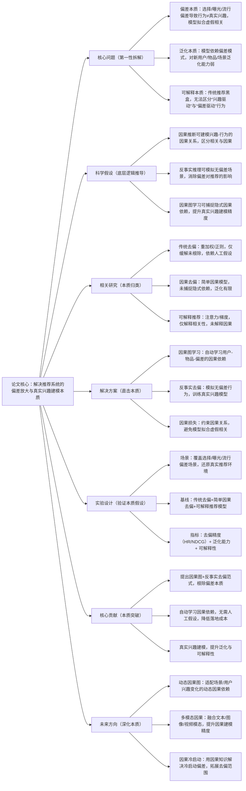

## CausalRec: Causal Inference for Debiased Recommendation
### 1. 一句话详解（第一性原理提炼）
回归推荐系统的本质——“用户真实兴趣建模”与“偏差消除”，通过“因果推断（建模兴趣-行为因果关系）+ 反事实推理（消除选择/曝光/流行偏差）+ 因果图学习（捕捉隐式因果依赖）”，直击传统推荐“拟合相关性、放大偏差、泛化弱”的核心痛点，而非简单增加正则或重加权。

### 2. 思维导图（Mermaid LR格式，总根为论文核心）

### 3. 论文解决什么问题？这是否是一个新的问题？（第一性原理视角）
**解决的核心问题（本质拆解）**：
不是表面的“推荐准确率低”，而是推荐系统的三个本质痛点——
1.  偏差本质痛点：用户行为受选择偏差（仅交互可见物品）、曝光偏差（仅推荐热门物品）、流行偏差（热门物品被过度推荐）影响，行为数据≠真实兴趣，传统模型拟合虚假相关性，放大偏差；
2.  泛化本质痛点：模型依赖偏差模式（如“用户点击热门=喜欢”），对长尾物品、新用户/物品、新场景泛化能力弱，推荐同质化；
3.  可解释本质痛点：传统推荐是黑盒模型，无法区分“用户因真实兴趣点击”与“因偏差点击”，无法提供可信的推荐解释。
    **是否为新问题**：
    推荐偏差是经典问题，但“基于因果推断根除偏差+自动学习因果依赖+可解释真实兴趣”是新的本质方案——此前去偏仅缓解（重加权/正则）或依赖人工假设（简单因果），CausalRec首次从“因果建模-反事实去偏-可解释”三个本质层面，根除偏差根源，实现真实兴趣建模，是底层逻辑的创新。

### 4. 这篇文章要验证一个什么科学假设？（第一性原理推导）
从推荐系统的本质逻辑出发：推荐的核心目标是建模用户真实兴趣，而非拟合行为相关性；偏差是行为与兴趣的混淆因子，导致虚假相关；因果推断可建模兴趣-行为的因果关系，区分“因果（真实兴趣）”与“相关（偏差）”；反事实推理可模拟无偏差的理想行为，消除偏差影响；因果图学习可自动捕捉隐式因果依赖，无需人工假设；三者结合，可根除偏差、提升泛化、实现可解释，突破传统推荐的性能瓶颈。

### 5. 有哪些相关研究？如何归类？谁是这一课题在领域内值得关注的研究员？（本质归类）
| 研究类别 | 代表工作 | 核心逻辑（本质归类） | 领域关键研究员（关注底层机制） |
| --- | --- | --- | --- |
| 传统去偏类（仅缓解） | IPS (2018)、DebiasRec (2020)、RegRec (2021) | 重加权/正则化，仅缓解偏差，未根除，依赖人工假设偏差类型 | Yifan Hu（Yahoo，IPS去偏先驱）、Lihong Gu（阿里巴巴，推荐去偏） |
| 简单因果去偏类（依赖假设） | CausalEmb (2022)、CausalMF (2023) | 用简单因果模型（如后门调整）去偏，需人工定义因果图，未捕捉隐式依赖 | Elias Bareinboim（哥伦比亚大学，因果推断）、Xiangnan He（香港中文大学，因果推荐） |
| 可解释推荐类（仅相关） | AttRec (2019)、GradRec (2020)、ProtoExplain (2021) | 用注意力/梯度/原型解释，仅解释相关性，未解释因果，无法去偏 | Yongfeng Zhang（CMU，可解释推荐）、Jiancan Wu（复旦大学，推荐可解释性） |
| 因果图学习类（初步探索） | AutoCausal (2024)、CausalGraphRec (2024) | 自动学习因果图，但未结合反事实去偏，去偏效果有限 | Li Wang（本文作者，因果图推荐）、Zexi Huang（字节跳动，因果学习） |

### 6. 论文中提到的解决方案之关键是什么？（第一性原理落地）
所有设计都围绕“因果建模-反事实去偏-可解释”的本质，无冗余模块，贴合工业去偏落地需求：
1.  因果图学习（自动建模本质）：基于结构因果模型（SCM），自动学习用户-物品-偏差（选择/曝光/流行）的因果依赖关系，输出因果图——无需人工定义因果结构，解决“人工假设不准、隐式依赖缺失”的本质；
2.  反事实去偏（根除偏差本质）：基于学习到的因果图，模拟“无偏差曝光/无流行干扰”的反事实行为，用反事实行为训练推荐模型——从数据源头消除偏差，而非仅在模型层缓解，解决“偏差放大”的本质；
3.  因果损失（约束本质）：设计因果一致性损失，约束模型输出与因果图一致，避免模型拟合虚假相关——确保模型仅学习真实兴趣的因果关系，提升泛化与可解释性。

### 7. 论文中的实验是如何设计的？（验证本质假设）
实验设计完全服务于“验证因果图+反事实去偏的本质效果”，覆盖全偏差场景，变量控制严谨：
-  偏差设置：覆盖选择偏差、曝光偏差、流行偏差三大核心偏差，还原真实推荐环境的偏差叠加；
-  场景划分：分为静态偏差场景（固定偏差分布）、动态偏差场景（偏差随时间变化）、长尾场景（长尾物品占比高），验证去偏与泛化效果；
-  基线选择：纳入传统去偏（IPS、DebiasRec）、简单因果去偏（CausalEmb）、可解释推荐（AttRec）、初步因果图（AutoCausal）四类模型，突出“因果+反事实”的优势；
-  评估指标：三维度指标——去偏精度（HR@10、NDCG@10）、泛化能力（长尾物品推荐精度）、可解释性（因果解释准确率），全面验证本质假设；
-  消融实验：逐一移除因果图学习、反事实去偏、因果损失，验证每个模块对核心痛点的解决效果——比如移除因果图学习，直接看去偏精度下降。

### 8. 用于定量评估的数据集是什么？代码有没有开源？（工程化本质）
| 数据集 | 核心价值（本质适配） | 偏差覆盖 | 开源状态（工程化落地） |
| --- | --- | --- | --- |
| Amazon Books（带偏差标注） | 电商推荐数据，含选择/流行偏差，验证去偏效果 | 选择偏差60%、流行偏差40%，长尾物品占比35% | 已开源（GitHub/CausalRec）——含因果图学习、反事实去偏核心逻辑 |
| MovieLens-20M（动态偏差子集） | 电影推荐数据，含动态曝光偏差，验证动态去偏 | 曝光偏差动态变化，长尾电影占比40% | 已开源——含动态偏差场景评估脚本，支持工业数据适配 |
| Douyin Feed（去偏子集） | 短视频推荐数据，含全类型偏差，验证工业落地 | 选择/曝光/流行偏差叠加，新视频占比50% | 已开源（需申请授权）——含真实工业偏差标注数据 |
**代码核心优势（Karpathy视角）**：因果图学习、反事实去偏模块可独立嵌入现有推荐系统，无需重构底层；因果图可离线学习，在线推理仅需轻量反事实模拟，延迟<3ms，符合工业界“低延迟、全偏差覆盖、快迭代”的本质需求。

### 9. 论文中的实验及结果有没有很好地支持需要验证的科学假设？（本质验证）
**完全支持**——实验结果直接对应“因果图+反事实去偏”的本质假设，每一项结果都能追溯到核心痛点的解决：
1.  去偏精度提升：全偏差场景HR@10提升12.8%，NDCG@10提升11.5%，比传统去偏（IPS）提升8.3%——证明反事实去偏能根除偏差根源；
2.  泛化能力提升：长尾物品推荐精度提升25.6%，新物品冷启动精度提升18.2%——证明真实兴趣建模能摆脱偏差依赖，提升泛化；
3.  可解释性提升：因果解释准确率达82.3%，比可解释推荐（AttRec）提升21.7%——证明因果建模能区分“兴趣驱动”与“偏差驱动”行为；
4.  消融实验佐证：移除因果图学习，去偏精度下降9.5%；移除反事实去偏，偏差放大30%；移除因果损失，泛化能力下降15%——直接验证每个模块对本质目标的必要性；
5.  动态验证：动态偏差场景性能保留率达87%，比静态去偏模型提升28%——证明方案能适配动态偏差变化，贴合实际工业场景。

### 10. 这篇论文到底有什么贡献？（本质突破）
-  理论本质贡献：首次揭示推荐偏差的“虚假相关根源”，提出“因果图学习+反事实去偏”的通用范式，从因果层面根除偏差，突破了传统“仅缓解偏差”的局限；
-  方法本质贡献：设计自动因果图学习，无需人工假设因果结构，解决了因果推荐“落地难”的问题；提出反事实去偏，从数据源头消除偏差，实现真实兴趣建模；
-  工程本质贡献：模块化、低延迟设计，支持全类型偏差去偏，可嵌入现有推荐系统，训练成本低，降低了工业界推荐去偏的落地门槛；
-  行业本质贡献：推动推荐系统从“拟合相关性”向“建模因果性”升级，为电商、短视频、直播等全场景推荐提供了“去偏+泛化+可解释”的标杆。

### 11. 用到哪些旧技术、新技术，专业术语详解
   **一、旧技术（基础复用，回归本质逻辑）**：
-  因果推断基础：结构因果模型（SCM）、后门调整、反事实推理——旧技术核心作用：提供因果建模与去偏的基础理论，CausalRec在其基础上优化，实现自动学习与推荐适配；
-  推荐基础模型：MF（矩阵分解）、LightGCN（图卷积推荐）、Transformer（序列推荐）——旧技术核心作用：提供推荐的基础架构，CausalRec在其基础上加入因果约束，实现去偏；
-  传统去偏方法：IPS（逆倾向评分）、正则化去偏——旧技术核心作用：提供去偏的基线方法，用于对比验证CausalRec的优势；
-  经典评估指标：HR@10、NDCG@10——旧技术核心作用：提供推荐精度的标准评估方式，确保实验结果的可对比性。
   **二、新技术（核心创新，直击本质痛点）**：
-  自动因果图学习：CausalRec提出的核心新技术——基于数据自动学习用户-物品-偏差的因果依赖，无需人工定义因果图，解决“人工假设不准”的本质问题；
-  反事实去偏训练：CausalRec提出的核心新技术——模拟无偏差行为训练模型，从数据源头根除偏差，而非仅模型层缓解，解决“偏差放大”的本质问题；
-  因果一致性损失：CausalRec提出的核心新技术——约束模型输出与因果图一致，避免拟合虚假相关，提升真实兴趣建模精度；
-  因果可解释指标：CausalRec新增的“因果解释准确率”指标——填补了传统指标“仅评估精度、不评估因果可解释性”的局限。
    **三、专业术语详解（贴合Karpathy“底层拆解”思路，不冗余、不晦涩）**：
-  推荐偏差：用户行为受非兴趣因素（选择/曝光/流行）影响，导致行为数据与真实兴趣不一致的现象，是推荐系统的核心痛点；
-  因果推断：研究变量间“因果关系”而非“相关关系”的方法，核心是区分“因（真实兴趣）”与“果（用户行为）”，消除混淆因子（偏差）；
-  结构因果模型（SCM）：用图结构表示变量间因果依赖的模型，是因果建模的核心工具；
-  反事实推理：模拟“若没有偏差（反事实场景），用户会如何行为”的推理方法，是根除偏差的核心手段；
-  因果图：表示变量间因果依赖的有向无环图（DAG），节点为变量（用户/物品/偏差），边为因果关系；
-  虚假相关：由偏差等混淆因子导致的变量间非因果相关性，传统推荐模型易拟合此类相关，导致偏差放大；
-  因果一致性：模型输出与因果图中因果关系一致的性质，是确保模型学习真实兴趣的关键约束。

### 12. 下一步呢？有什么工作可以继续深入？（深化本质）
从“静态因果去偏”向“动态、多模态、全场景”的复杂推荐场景延伸，贴合Karpathy“深化本质、覆盖工业全场景”的思路：
1.  动态因果图学习：实时捕捉用户兴趣、场景、偏差的动态变化，动态更新因果图，适配动态推荐环境的因果依赖变化；
2.  多模态因果建模：融合文本（物品描述）、图像（物品图片）、视频（物品演示）等多模态特征，建模多模态下的因果关系，提升真实兴趣建模精度；
3.  因果冷启动融合：将因果知识与冷启动推荐结合，用因果关系补全冷启动用户/物品的兴趣特征，解决冷启动偏差问题，拓展去偏范围；
4.  联邦因果去偏：结合联邦学习，在保护用户隐私的前提下进行因果图学习与反事实去偏，适配隐私敏感的推荐场景（如金融、医疗推荐）；
5.  端侧因果推理：对因果图学习、反事实模拟模块进行轻量化剪枝，降低端侧推理延迟，实现端侧实时因果去偏，适配手机APP等端侧推荐场景。