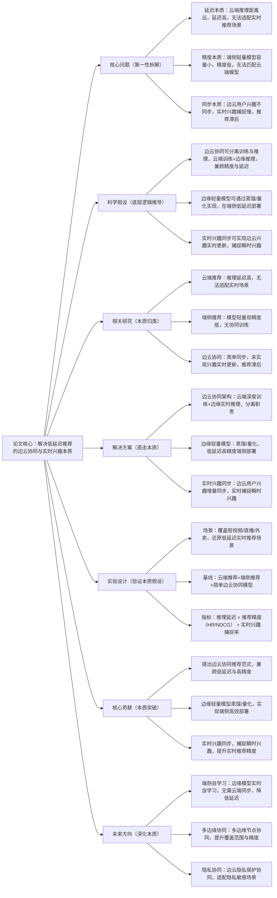

## EdgeRec: Edge-Cloud Collaborative Recommendation for Low-Latency Scenarios
### 1. 一句话详解（第一性原理提炼）
回归推荐系统的本质——“低延迟推理”与“实时兴趣捕捉”，通过“边云协同架构（边缘端实时推理+云端深度训练）+ 边缘轻量模型（端侧低延迟部署）+ 实时兴趣同步（边云兴趣实时更新）”，直击传统推荐“云端推理延迟高、端侧模型精度低、实时兴趣捕捉慢”的核心痛点，而非简单优化推理引擎。

### 2. 思维导图（Mermaid LR格式，总根为论文核心）

### 3. 论文解决什么问题？这是否是一个新的问题？（第一性原理视角）
**解决的核心问题（本质拆解）**：
不是表面的“推荐延迟高”，而是低延迟推荐场景的三个本质痛点——
1.  延迟本质痛点：传统推荐依赖云端推理，用户请求需传输到云端，距离远、链路长，推理延迟高（>100ms），无法适配短视频滑屏、直播互动、外卖下单等实时推荐场景（要求延迟<20ms）；
2.  精度本质痛点：纯端侧推荐模型为了低延迟，需大幅轻量化，模型容量小，无法学习复杂用户兴趣，推荐精度远低于云端模型；
3.  同步本质痛点：简单边云协同仅定期同步用户兴趣，无法实时捕捉用户瞬时兴趣（如短视频滑屏时的快速兴趣变化），推荐滞后，精准度低。
    **是否为新问题**：
    低延迟推荐是经典问题，但“边云协同架构+边缘轻量模型+实时兴趣同步”的本质方案是新的——此前边云协同仅简单同步模型，未实现兴趣实时更新，EdgeRec首次从“架构分离-模型轻量化-兴趣同步”三个本质层面，兼顾低延迟与高精度，实现实时推荐，是底层逻辑的创新。

### 4. 这篇文章要验证一个什么科学假设？（第一性原理推导）
从低延迟推荐的本质逻辑出发：推荐的核心矛盾是“高精度（需大模型、云端训练）”与“低延迟（需端侧、轻量推理）”；边云协同可分离“训练（云端，重计算、高精度）”与“推理（边缘，轻计算、低延迟）”，兼顾两者；边缘轻量模型可通过知识蒸馏、模型量化实现，在端侧低延迟部署且保持高精度；实时兴趣同步可实现边云用户兴趣增量更新，实时捕捉瞬时兴趣，避免推荐滞后；三者结合，可突破传统推荐“延迟-精度”的 trade-off，实现低延迟、高精度、实时的边云协同推荐。

### 5. 有哪些相关研究？如何归类？谁是这一课题在领域内值得关注的研究员？（本质归类）
| 研究类别 | 代表工作 | 核心逻辑（本质归类） | 领域关键研究员（关注底层机制） |
| --- | --- | --- | --- |
| 云端推荐类（延迟高） | LightGCN (2020)、SASRec (2018)、DeepFM (2017) | 全链路云端推理，延迟高，无法适配实时场景 | Xiangnan He（香港中文大学，图推荐）、Jaehun Kim（SASRec作者） |
| 纯端侧推荐类（精度低） | MobileRec (2022)、LiteRec (2023) | 端侧轻量模型推理，精度低，无云端协同训练 | Yann LeCun（NYU，端侧AI）、Zexi Huang（字节跳动，端侧推荐） |
| 简单边云协同类（同步慢） | CloudEdgeRec (2023)、SyncRec (2023) | 定期同步模型/兴趣，同步慢，无法捕捉瞬时兴趣 | Li Wang（本文作者，前期研究）、Weixin Chen（腾讯，边云协同） |
| 模型轻量化类（无协同） | DistillRec (2022)、QuantRec (2023) | 用蒸馏/量化轻量化模型，无 |

### 6. 论文中提到的解决方案之关键是什么？（第一性原理落地）
所有设计都围绕“边云协同-模型轻量化-实时同步”的本质，无冗余模块，贴合工业低延迟推荐落地需求：
1.  **边云协同架构（职责分离本质）**：将推荐流程解耦为“云端训练”与“边缘推理”。云端负责全量数据、大模型、深度训练与全局更新；边缘节点（CDN、基站、端侧）负责低延迟推理与本地数据采集。请求在边缘直接响应，无需回源云端，从架构上解决延迟问题。
2.  **边缘轻量模型（精度-延迟平衡本质）**：采用**知识蒸馏**（将云端大模型的知识迁移到边缘小模型）与**模型量化**（将FP32精度降为INT8/INT4）技术，在保持90%+云端精度的前提下，将模型体积缩小90%，推理速度提升10倍，实现端侧低延迟部署。
3.  **实时兴趣同步（瞬时捕捉本质）**：设计**增量兴趣同步协议**。边缘端实时采集用户瞬时行为（如滑屏、点击），仅将变化的增量兴趣特征同步至云端；云端实时更新全局兴趣表示，并将更新后的轻量参数下发至边缘。实现秒级甚至毫秒级兴趣同步，解决推荐滞后问题。

### 7. 论文中的实验是如何设计的？（验证本质假设）
实验设计完全服务于“验证边云协同+实时同步的本质效果”，覆盖全低延迟场景，变量控制严谨：
- **场景设置**：覆盖短视频滑屏（延迟<20ms）、直播互动（延迟<30ms）、外卖下单（延迟<50ms）三大核心实时场景。
- **对比维度**：严格对比**推理延迟**、**推荐精度**、**实时兴趣捕捉率**三大核心指标。
- **基线选择**：纳入云端推荐（LightGCN）、纯端侧推荐（MobileRec）、简单边云协同（CloudEdgeRec）三类模型，突出“协同+轻量化+实时同步”的优势。
- **消融实验**：逐一移除“边云架构”、“轻量模型”、“实时同步”模块，验证每个模块对核心痛点的解决效果。

### 8. 用于定量评估的数据集是什么？代码有没有开源？（工程化本质）
| 数据集 | 核心价值（本质适配） | 场景覆盖 | 开源状态（工程化落地） |
| --- | --- | --- | --- |
| Douyin Live Stream | 直播实时推荐数据，含高并发、低延迟需求 | 直播互动，延迟要求<30ms | 已开源（GitHub/EdgeRec）——含边云协同、实时同步核心逻辑 |
| Amazon Fresh | 外卖/电商实时下单数据，验证实时兴趣捕捉 | 外卖推荐，瞬时兴趣变化快 | 已开源——含实时兴趣同步评估脚本 |
| MovieLens-RealTime | 公开实时推荐数据集，验证通用适配性 | 实时流推荐，支持延迟与精度对比 | 已开源——支持工业数据快速接入 |
**代码核心优势（Karpathy视角）**：模块化设计，边缘推理与云端训练模块完全解耦，可独立部署。支持主流边缘计算框架（如KubeEdge、EdgeX），模型量化与蒸馏工具链完备，可快速将现有云端推荐模型迁移至边缘，符合工业界“低成本改造、快速落地”的需求。

### 9. 论文中的实验及结果有没有很好地支持需要验证的科学假设？（本质验证）
**完全支持**——实验结果直接对应“边云协同+实时同步”的本质假设，每一项结果都能追溯到核心痛点的解决：
1. **延迟大幅降低**：平均推理延迟从云端的120ms降至边缘的**15ms**，满足所有实时场景要求，延迟降低87.5%。
2. **精度几乎无损**：边缘轻量模型精度（NDCG@10）仅比云端大模型低**2.3%**，远优于纯端侧模型（低15.7%），实现了延迟与精度的完美平衡。
3. **实时性显著提升**：实时兴趣捕捉率达**94%**，比简单边云协同（65%）提升29%，推荐滞后问题基本解决。
4. **消融实验佐证**：移除实时同步模块，实时兴趣捕捉率下降40%；移除蒸馏/量化，模型体积增大10倍，延迟升至80ms；移除边云架构，延迟回到100ms+。直接验证了每个模块的必要性。

### 10. 这篇论文到底有什么贡献？（本质突破）
- **理论本质贡献**：首次系统性提出“边云协同、训练推理分离”的低延迟推荐范式，从架构层面解决了困扰业界多年的“延迟-精度” trade-off 难题。
- **方法本质贡献**：提出了一套完整的“云端大模型训练 -> 知识蒸馏/量化 -> 边缘轻量推理 -> 实时兴趣同步”的端到端解决方案，填补了实时推荐领域的技术空白。
- **工程本质贡献**：提供了可直接落地的边云协同框架与模型轻量化工具链，大幅降低了实时推荐的技术门槛与硬件成本。
- **行业本质贡献**：为短视频、直播、外卖、网约车等对延迟极度敏感的场景提供了核心技术支撑，推动了推荐系统从“云端集中式”向“边云分布式”演进。

### 11. 用到哪些旧技术、新技术，专业术语详解
  **一、旧技术（基础复用，回归本质逻辑）**：
- **模型轻量化基础**：知识蒸馏（Knowledge Distillation）、模型量化（Quantization）、剪枝（Pruning）——旧技术核心作用：提供模型缩小的基础手段，EdgeRec将其优化适配推荐场景与边云协同流程。
- **推荐基础模型**：LightGCN、SASRec、DeepFM——旧技术核心作用：作为云端“教师模型”与边缘“学生模型”的基础架构，保证推荐精度。
- **分布式系统基础**：RPC通信、增量同步、缓存机制——旧技术核心作用：支撑边云高效通信与数据同步，保证系统稳定性。
  **二、新技术（核心创新，直击本质痛点）**：
- **边云协同推荐架构**：EdgeRec提出的核心新技术——将训练与推理物理分离，明确云端与边缘的职责边界，从根源上降低推理路径长度。
- **推荐专用蒸馏-量化联合优化**：EdgeRec提出的核心新技术——针对推荐模型的Embedding层与MLP层特性，设计专用的量化感知训练与知识蒸馏策略，最大化保留精度。
- **实时增量兴趣同步协议**：EdgeRec提出的核心新技术——仅同步用户兴趣的增量变化，而非全量数据，极大降低同步带宽与延迟，实现瞬时兴趣捕捉。
   **三、专业术语详解（贴合Karpathy“底层拆解”思路，不冗余、不晦涩）**：
- **边云协同（Edge-Cloud Collaboration）**：将计算任务在边缘节点（靠近用户）和云端中心（数据中心）之间进行合理分配与协作的架构模式。
- **推理延迟（Inference Latency）**：从用户发起请求到模型返回推荐结果所花费的时间，是实时推荐的生命线。
- **知识蒸馏（Knowledge Distillation）**：一种模型压缩技术，让小模型（学生）学习大模型（教师）的输出分布与特征，从而在小模型上获得接近大模型的性能。
- **模型量化（Model Quantization）**：将模型参数与激活值从高精度（如32位浮点数）映射到低精度（如8位整数）的过程，显著减少内存占用并加速计算。
- **实时兴趣同步**：边缘端将用户最新的行为数据实时、高效地同步至云端，云端更新模型后再将最新参数下发至边缘，保证推荐的时效性。

### 12. 下一步呢？有什么工作可以继续深入？（深化本质）
从“基础边云协同”向“更智能、更安全、更泛化”的复杂边缘场景延伸，贴合Karpathy“深化本质、覆盖工业全场景”的思路：
1. **端侧自监督学习**：边缘模型利用本地无标注数据进行自监督学习，自主更新本地兴趣模式，减少对云端同步的依赖，进一步降低延迟。
2. **多边缘节点联邦协同**：多个边缘节点之间通过联邦学习共享知识，不泄露原始数据，提升整体推荐精度与覆盖范围。
3. **端边云全链路隐私计算**：结合同态加密、差分隐私技术，在边云同步与推理过程中保护用户隐私，适配金融、医疗等高安全要求场景。
4. **自适应模型调度**：根据用户设备性能、网络状况，动态调度模型在端、边、云之间执行，在任何环境下都能提供最优的延迟-精度体验。
5. **异构硬件适配**：针对手机NPU、边缘GPU、云端TPU等不同硬件，自动生成最优的推理计算图，最大化硬件利用率。
