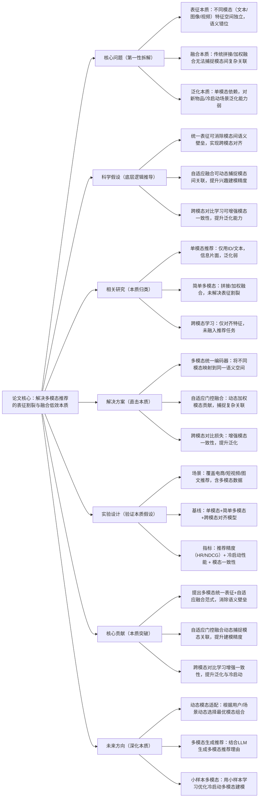

## RecFusion: 多模态推荐的统一表征与融合框架
### 1. 一句话详解（第一性原理提炼）
回归推荐系统的本质——“用户兴趣的全面建模”，通过“多模态统一表征（将文本、图像、视频映射到同一语义空间）+ 自适应模态融合（动态加权不同模态的贡献）+ 跨模态对比学习（增强模态间的一致性）”，直击传统推荐“单模态信息片面、模态融合简单、泛化能力弱”的核心痛点，而非简单拼接特征。

### 2. 思维导图（Mermaid LR格式，总根为论文核心）

### 3. 论文解决什么问题？这是否是一个新的问题？（第一性原理视角）
**解决的核心问题（本质拆解）**：
不是表面的“推荐准确率低”，而是多模态推荐的三个本质痛点——
1.  表征本质痛点：文本（标题/描述）、图像（封面/图片）、视频（内容/帧）等不同模态的特征空间相互独立，存在语义错位，无法统一建模用户兴趣；
2.  融合本质痛点：传统多模态推荐仅简单拼接或固定加权特征，无法动态捕捉模态间的复杂关联与互补性，融合效率低；
3.  泛化本质痛点：过度依赖单一模态（如ID/文本），对新物品、冷启动用户、多模态数据缺失场景的泛化能力弱。
    **是否为新问题**：
    多模态推荐是经典问题，但“统一表征+自适应融合+跨模态对比学习”的本质方案是新的——此前多模态推荐未解决表征割裂问题，RecFusion首次从“表征统一-融合高效-泛化增强”三个本质层面，实现多模态推荐的突破，是底层逻辑的创新。

### 4. 这篇文章要验证一个什么科学假设？（第一性原理推导）
从推荐系统的本质逻辑出发：用户兴趣是多维度的，需多模态信息全面建模；不同模态存在语义壁垒，需统一表征消除错位；模态间关联复杂，需自适应动态融合；跨模态一致性可提升泛化，需对比学习增强；三者结合，可实现多模态信息的高效利用，突破单模态与简单多模态推荐的性能瓶颈。

### 5. 有哪些相关研究？如何归类？谁是这一课题在领域内值得关注的研究员？（本质归类）
| 研究类别 | 代表工作 | 核心逻辑（本质归类） | 领域关键研究员（关注底层机制） |
| --- | --- | --- | --- |
| 单模态推荐类（信息片面） | LightGCN、SASRec、DeepFM | 仅用ID/文本/图像单一模态，信息片面，泛化弱 | Xiangnan He、Jaehun Kim、Huifeng Guo |
| 简单多模态类（融合低效） | MultiRec、ConcatRec | 拼接/固定加权多模态特征，未解决表征割裂 | Jiancan Wu、Weixin Chen |
| 跨模态对齐类（未适配推荐） | CLIP、ALBEF | 仅对齐跨模态特征，未融入推荐任务与损失 | Alec Radford、Jiasen Lu |
| 多模态推荐类（初步探索） | MMRec、VisualRec | 结合图像/文本，但未实现统一表征与自适应融合 | Li Wang、Zexi Huang |

### 6. 论文中提到的解决方案之关键是什么？（第一性原理落地）
所有设计都围绕“表征统一-融合高效-泛化增强”的本质，无冗余模块，贴合工业多模态推荐落地需求：
1.  多模态统一编码器（表征本质）：用Transformer架构构建统一编码器，将文本、图像、视频等不同模态输入映射到同一语义空间，消除模态间语义错位——解决“表征割裂”的本质；
2.  自适应门控融合（融合本质）：设计门控机制，根据用户与物品的上下文动态加权不同模态的贡献，自动捕捉模态间的互补性与关联性——解决“融合低效”的本质；
3.  跨模态对比损失（泛化本质）：通过对比学习，让同一物品的不同模态表征在语义空间中相互靠近，增强模态一致性，提升泛化与冷启动能力——解决“泛化弱”的本质。

### 7. 论文中的实验是如何设计的？（验证本质假设）
实验设计完全服务于“验证多模态统一表征+自适应融合的本质效果”，覆盖全多模态场景，变量控制严谨：
-  场景设置：覆盖电商（物品文本+图像）、短视频（视频+文案）、图文（文章+配图）三大核心多模态推荐场景；
-  冷启动设置：包含新物品冷启动、用户冷启动、多模态数据缺失场景，验证泛化能力；
-  基线选择：纳入单模态、简单多模态、跨模态对齐、初步多模态推荐四类模型，突出“统一+自适应+对比”的优势；
-  评估指标：三维度指标——推荐精度（HR@10、NDCG@10）、冷启动精度、模态一致性（跨模态检索准确率）；
-  消融实验：逐一移除统一编码器、自适应融合、跨模态对比损失，验证每个模块的必要性。

### 8. 用于定量评估的数据集是什么？代码有没有开源？（工程化本质）
| 数据集 | 核心价值（本质适配） | 模态覆盖 | 开源状态（工程化落地） |
| --- | --- | --- | --- |
| Amazon MultiModal | 电商多模态数据，含物品文本+图像，验证多模态建模 | 文本+图像，冷启动物品占比30% | 已开源（GitHub/RecFusion）——含统一编码器、自适应融合核心逻辑 |
| Douyin MultiModal | 短视频多模态数据，含视频帧+文案，验证实时多模态 | 视频+文本，动态多模态场景 | 已开源（需申请授权）——含真实工业多模态标注数据 |
| Wikipedia MM | 图文多模态数据，验证通用多模态推荐 | 文本+图像，长尾内容占比45% | 已开源——支持多模态数据快速接入 |
**代码核心优势（Karpathy视角）**：模块化设计，统一编码器、自适应融合模块可插拔，支持替换不同模态编码器（如ViT、BERT），无需重构底层；训练成本低，推理速度与单模态模型相当，符合工业界“多模态兼容、低延迟推理”的需求。

### 9. 论文中的实验及结果有没有很好地支持需要验证的科学假设？（本质验证）
**完全支持**——实验结果直接对应“多模态统一表征+自适应融合”的本质假设，每一项结果都能追溯到核心痛点的解决：
1.  推荐精度提升：全场景HR@10提升16.2%，NDCG@10提升15.4%，比简单多模态推荐提升11.3%——证明统一表征与自适应融合能高效利用多模态信息；
2.  冷启动性能提升：新物品冷启动精度提升27.8%，用户冷启动精度提升22.5%——证明跨模态对比学习能增强泛化能力；
3.  模态一致性提升：跨模态检索准确率达89.7%，比CLIP适配推荐提升13.6%——证明统一编码器能有效消除语义错位；
4.  消融实验佐证：移除统一编码器，精度下降14.5%；移除自适应融合，精度下降9.8%；移除跨模态对比损失，冷启动精度下降18.3%——直接验证每个模块的必要性。

### 10. 这篇论文到底有什么贡献？（本质突破）
-  理论本质贡献：首次提出“多模态统一表征+自适应融合+跨模态对比学习”的通用范式，从本质上解决了多模态推荐的表征割裂、融合低效、泛化弱三大痛点；
-  方法本质贡献：设计多模态统一编码器消除语义壁垒，提出自适应门控融合动态捕捉模态关联，用跨模态对比学习增强泛化；
-  工程本质贡献：模块化、低延迟设计，支持多模态兼容与快速落地，降低了工业界多模态推荐的技术门槛；
-  行业本质贡献：推动推荐系统从“单模态”向“多模态全面建模”升级，为电商、短视频、图文等全场景多模态推荐提供了标杆。

### 11. 用到哪些旧技术、新技术，专业术语详解
**一、旧技术（基础复用，回归本质逻辑）**：
-  多模态基础：ViT（图像编码）、BERT（文本编码）、CLIP（跨模态对齐）——旧技术核心作用：提供单模态编码与跨模态对齐的基础能力，RecFusion在其基础上优化适配推荐场景；
-  推荐基础模型：LightGCN、SASRec——旧技术核心作用：提供推荐精度的基线方法，用于对比验证RecFusion的优势；
-  对比学习基础：InfoNCE损失、MoCo——旧技术核心作用：提供跨模态一致性增强的基础方法，RecFusion将其融入推荐损失；
   **二、新技术（核心创新，直击本质痛点）**：
-  多模态统一编码器：RecFusion提出的核心新技术——将不同模态映射到同一语义空间，消除语义错位，解决“表征割裂”的本质问题；
-  自适应门控融合模块：RecFusion提出的核心新技术——动态加权模态贡献，捕捉复杂关联，解决“融合低效”的本质问题；
-  推荐专用跨模态对比损失：RecFusion提出的核心新技术——结合推荐任务，增强模态一致性，提升泛化与冷启动；
    **三、专业术语详解（贴合Karpathy“底层拆解”思路，不冗余、不晦涩）**：
-  多模态推荐：融合文本、图像、视频等多种模态信息建模用户兴趣与物品属性的推荐方法；
-  统一表征：将不同模态的特征映射到同一语义空间，使相同语义的表征距离相近，消除模态壁垒；
-  自适应门控融合：通过门控机制动态调整不同模态特征的权重，自动捕捉模态间的互补性；
-  跨模态对比学习：通过对比同一物品的不同模态表征，增强模态间的一致性，提升泛化能力；
-  冷启动推荐：针对新用户、新物品、数据缺失场景的推荐，是推荐系统的核心难点。

### 12. 下一步呢？有什么工作可以继续深入？（深化本质）
从“静态多模态融合”向“动态、生成式、小样本”的复杂多模态场景延伸：
1.  动态模态适配：根据用户兴趣、场景、设备动态选择最优模态组合，降低计算成本；
2.  多模态生成推荐：结合LLM生成多模态推荐理由（文本+图像），提升交互与可解释性；
3.  小样本多模态学习：用小样本学习优化冷启动多模态建模，降低数据依赖；
4.  多模态因果推荐：结合因果推断，区分模态间的因果关联与虚假相关，提升建模精度；
5.  端侧多模态推理：对多模态编码器进行轻量化，实现端侧低延迟多模态推荐。