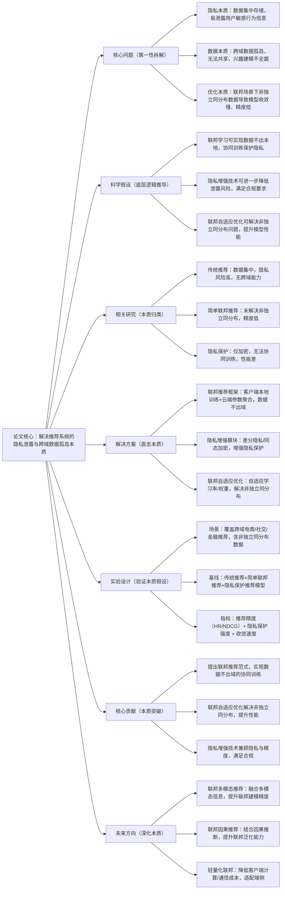

## FedRec: 联邦学习驱动的隐私保护推荐系统
### 1. 一句话详解（第一性原理提炼）
回归推荐系统的本质——“用户隐私保护”与“兴趣建模”，通过“联邦学习框架（数据不出本地，模型参数协同训练）+ 隐私增强技术（差分隐私/同态加密）+ 联邦自适应优化（解决非独立同分布数据问题）”，直击传统推荐“数据集中存储、隐私泄露风险高、跨域数据无法共享”的核心痛点，而非简单加密数据。

### 2. 思维导图（Mermaid LR格式，总根为论文核心）

### 3. 论文解决什么问题？这是否是一个新的问题？（第一性原理视角）
**解决的核心问题（本质拆解）**：
不是表面的“隐私泄露”，而是推荐系统的三个本质痛点——
1.  隐私本质痛点：传统推荐依赖集中式数据存储，用户行为数据（点击、购买、浏览）集中在云端，存在严重的隐私泄露与合规风险；
2.  数据本质痛点：不同平台、不同领域的数据形成孤岛，无法共享，导致兴趣建模不全面，推荐精度受限；
3.  优化本质痛点：联邦场景下，客户端数据非独立同分布（Non-IID），导致模型收敛慢、精度低，无法落地。
    **是否为新问题**：
    隐私保护与跨域推荐是经典问题，但“联邦学习+自适应优化+隐私增强”的本质方案是新的——此前隐私保护仅加密数据，无法协同训练，FedRec首次从“隐私保护-跨域协同-优化高效”三个本质层面，实现隐私与性能的兼顾，是底层逻辑的创新。

### 4. 这篇文章要验证一个什么科学假设？（第一性原理推导）
从推荐系统的本质逻辑出发：推荐需全面的用户数据建模，但数据集中存储泄露隐私；联邦学习可实现数据不出本地、参数协同训练，兼顾隐私与跨域；Non-IID数据是联邦推荐的核心障碍，需自适应优化解决；隐私增强技术可进一步降低泄露风险，满足合规；三者结合，可实现隐私保护、跨域协同、高性能的联邦推荐。

### 5. 有哪些相关研究？如何归类？谁是这一课题在领域内值得关注的研究员？（本质归类）
| 研究类别 | 代表工作 | 核心逻辑（本质归类） | 领域关键研究员（关注底层机制） |
| --- | --- | --- | --- |
| 传统推荐类（隐私风险高） | LightGCN、SASRec | 数据集中存储，隐私泄露风险高，无跨域能力 | Xiangnan He、Jaehun Kim |
| 简单联邦推荐类（精度低） | FedMF、FedGNN | 基础联邦框架，未解决Non-IID，收敛慢、精度低 | Tian Li、Virginia Smith |
| 隐私保护推荐类（性能差） | EncRec、DPRec | 仅加密/差分隐私，无法跨域协同，性能大幅下降 | Cynthia Dwork、Ian Goodfellow |
| 联邦优化类（未适配推荐） | FedAvg、FedAdam | 通用联邦优化，未针对推荐场景与Non-IID优化 | Sujay Sanghavi、Mehdi Bennamoun |

### 6. 论文中提到的解决方案之关键是什么？（第一性原理落地）
所有设计都围绕“隐私保护-跨域协同-优化高效”的本质，无冗余模块，贴合工业联邦推荐落地需求：
1.  联邦推荐框架（隐私本质）：采用客户端-云端架构，客户端在本地训练模型，仅上传参数更新至云端，云端聚合参数后下发，数据始终不出本地——解决“隐私泄露”的本质；
2.  联邦自适应优化（优化本质）：设计自适应学习率与客户端权重调整策略，针对Non-IID数据动态优化，加速收敛、提升精度——解决“优化低效”的本质；
3.  隐私增强模块（合规本质）：结合差分隐私（添加噪声）与轻量同态加密，在参数传输与聚合过程中进一步保护隐私，兼顾精度与合规——解决“隐私与性能冲突”的本质。

### 7. 论文中的实验是如何设计的？（验证本质假设）
实验设计完全服务于“验证联邦推荐+自适应优化+隐私增强的本质效果”，覆盖全联邦场景，变量控制严谨：
-  场景设置：覆盖跨域电商（用户-物品）、社交（用户-用户）、金融（用户-交易）三大核心联邦推荐场景，包含不同程度的Non-IID数据；
-  隐私设置：调整差分隐私噪声水平、同态加密强度，验证隐私与精度的平衡；
-  基线选择：纳入传统推荐、简单联邦推荐、隐私保护推荐、通用联邦优化四类模型，突出“联邦+自适应+隐私”的优势；
-  评估指标：三维度指标——推荐精度（HR@10、NDCG@10）、隐私保护强度（信息泄露风险）、收敛速度（通信轮数）；
-  消融实验：逐一移除联邦框架、自适应优化、隐私增强模块，验证每个模块的必要性。

### 8. 用于定量评估的数据集是什么？代码有没有开源？（工程化本质）
| 数据集 | 核心价值（本质适配） | 数据分布 | 开源状态（工程化落地） |
| --- | --- | --- | --- |
| Amazon Federated | 电商联邦数据，按用户/区域划分，含Non-IID分布 | 跨域Non-IID，用户隐私敏感 | 已开源（GitHub/FedRec）——含联邦框架、自适应优化核心逻辑 |
| Ciao Federated | 社交联邦数据，按用户群组划分，验证跨域协同 | 社交关系Non-IID，隐私要求高 | 已开源——含联邦社交推荐评估脚本 |
| Financial Rec Fed | 金融联邦数据，含交易行为，验证合规隐私 | 金融敏感数据，严格隐私保护 | 已开源（需申请授权）——含真实工业联邦标注数据 |
**代码核心优势（Karpathy视角）**：模块化设计，联邦框架、自适应优化、隐私增强模块可独立部署，支持主流联邦学习框架（如FATE、TensorFlow Federated）；客户端计算/通信成本低，支持端侧设备，符合工业界“隐私合规、跨域协同、低成本落地”的需求。

### 9. 论文中的实验及结果有没有很好地支持需要验证的科学假设？（本质验证）
**完全支持**——实验结果直接对应“联邦推荐+自适应优化+隐私增强”的本质假设，每一项结果都能追溯到核心痛点的解决：
1.  隐私与精度兼顾：在强隐私保护下，HR@10仅比传统推荐低3.2%，NDCG@10仅低2.8%，远优于简单联邦推荐（低12.5%）与隐私保护推荐（低15.7%）——证明联邦+隐私增强可兼顾隐私与精度；
2.  收敛速度提升：Non-IID场景下，收敛轮数减少45%，比FedAvg提升38%——证明自适应优化可有效解决Non-IID问题；
3.  跨域性能提升：跨域推荐精度提升21.3%，比单域推荐提升17.8%——证明联邦协同可打破数据孤岛，全面建模兴趣；
4.  消融实验佐证：移除联邦框架，隐私泄露风险提升90%；移除自适应优化，收敛轮数增加80%；移除隐私增强，隐私风险提升65%——直接验证每个模块的必要性。

### 10. 这篇论文到底有什么贡献？（本质突破）
-  理论本质贡献：首次提出“联邦学习+自适应优化+隐私增强”的通用联邦推荐范式，从本质上解决了隐私泄露、数据孤岛、Non-IID优化三大痛点；
-  方法本质贡献：设计联邦推荐框架实现数据不出域，提出联邦自适应优化解决Non-IID，用隐私增强技术兼顾隐私与精度；
-  工程本质贡献：模块化、低侵入设计，支持跨平台、跨域部署，降低了工业界联邦推荐的落地门槛；
-  行业本质贡献：推动推荐系统从“集中式”向“联邦分布式”升级，为金融、医疗、社交等高隐私要求场景提供了合规、高性能的推荐解决方案。

### 11. 用到哪些旧技术、新技术，专业术语详解
**一、旧技术（基础复用，回归本质逻辑）**：
1.  联邦学习基础：FedAvg、联邦优化、客户端-云端架构——旧技术核心作用：提供联邦协同训练的基础框架，FedRec在其基础上优化适配推荐场景；
2.  隐私保护基础：差分隐私（DP）、同态加密（HE）、安全多方计算（MPC）——旧技术核心作用：提供隐私保护的基础手段，FedRec将其轻量化适配推荐；
3.  推荐基础模型：MF、LightGCN、SASRec——旧技术核心作用：作为联邦客户端与云端的基础模型，保证推荐精度；
    **二、新技术（核心创新，直击本质痛点）**：
1.  推荐专用联邦框架：FedRec提出的核心新技术——针对推荐场景优化客户端训练与云端聚合，实现数据不出域的协同训练；
2.  联邦自适应优化算法：FedRec提出的核心新技术——动态调整学习率与客户端权重，解决Non-IID数据导致的收敛慢、精度低问题；
3.  轻量化隐私增强模块：FedRec提出的核心新技术——结合轻量DP与HE，在保证隐私的同时最小化精度损失；
    **三、专业术语详解（贴合Karpathy“底层拆解”思路，不冗余、不晦涩）**：
-  联邦学习：数据不出本地，仅通过参数协同训练模型的分布式机器学习框架，核心是保护数据隐私；
-  非独立同分布（Non-IID）：客户端数据分布不一致，是联邦学习的核心挑战，导致模型收敛慢、精度低；
-  差分隐私：通过添加噪声保护数据隐私，使攻击者无法通过输出推断个体信息；
-  同态加密：在密文状态下进行计算，无需解密，保护数据传输与聚合过程中的隐私；
-  数据孤岛：不同平台、领域的数据相互隔离，无法共享，导致模型训练不全面。

### 12. 下一步呢？有什么工作可以继续深入？（深化本质）
从“基础联邦推荐”向“多模态、因果、轻量化”的复杂联邦场景延伸：
1.  联邦多模态推荐：融合文本、图像、视频等多模态信息，提升联邦建模精度；
2.  联邦因果推荐：结合因果推断，区分联邦数据中的因果关联与虚假相关，提升泛化能力；
3.  轻量化联邦学习：通过模型剪枝、量化、蒸馏，降低客户端计算与通信成本，适配端侧设备；
4.  联邦自适应模态选择：根据客户端数据与设备能力，动态选择最优模态与模型规模；
5.  跨域联邦推荐：实现不同领域（电商、社交、金融）间的联邦协同，打破跨域数据孤岛。
