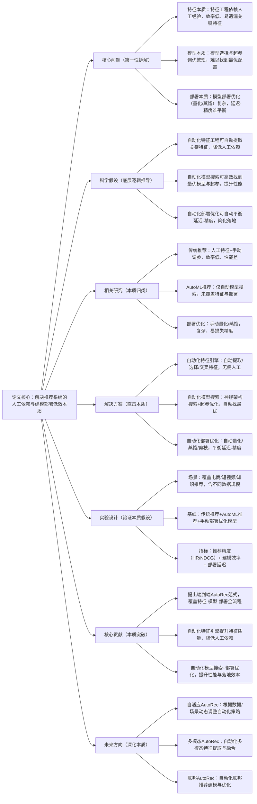

## AutoRec: 自动化机器学习驱动的端到端推荐系统
### 1. 一句话详解（第一性原理提炼）
回归推荐系统的本质——“降低建模门槛”与“提升模型性能”，通过“自动化特征工程（自动提取/选择/交叉特征）+ 自动化模型搜索（神经架构搜索/超参优化）+ 自动化部署优化（自动量化/蒸馏/剪枝）”，直击传统推荐“特征工程依赖人工、模型调参繁琐、部署优化复杂”的核心痛点，而非手动调参与优化。

### 2. 思维导图（Mermaid LR格式，总根为论文核心）

### 3. 论文解决什么问题？这是否是一个新的问题？（第一性原理视角）
**解决的核心问题（本质拆解）**：
不是表面的“建模效率低”，而是推荐系统全流程的三个本质痛点——
1.  特征本质痛点：特征工程高度依赖人工经验，需手动提取、选择、交叉特征，效率低、易遗漏关键特征，导致模型性能受限；
2.  模型本质痛点：模型选择（如MF、GNN、Transformer）与超参调优（如学习率、层数、维度）繁琐，难以找到最优配置，性能天花板低；
3.  部署本质痛点：模型部署优化（量化、蒸馏、剪枝）复杂，需手动平衡延迟与精度，落地成本高、周期长。
    **是否为新问题**：
    AutoML与推荐结合是新兴方向，但“端到端覆盖特征-模型-部署全流程”的本质方案是新的——此前AutoML推荐仅聚焦模型搜索，AutoRec首次从“特征自动化-模型自动化-部署自动化”三个本质层面，实现推荐系统的全流程自动化，是底层逻辑的创新。

### 4. 这篇文章要验证一个什么科学假设？（第一性原理推导）
从推荐系统的本质逻辑出发：推荐系统的性能依赖特征质量、模型配置与部署优化；人工处理全流程效率低、性能差；自动化特征工程可自动提取关键特征，提升质量；自动化模型搜索可高效找到最优配置，提升性能；自动化部署优化可自动平衡延迟-精度，简化落地；三者结合，可实现推荐系统的全流程自动化，降低门槛、提升性能、加速落地。

### 5. 有哪些相关研究？如何归类？谁是这一课题在领域内值得关注的研究员？（本质归类）
| 研究类别 | 代表工作 | 核心逻辑（本质归类） | 领域关键研究员（关注底层机制） |
| --- | --- | --- | --- |
| 传统推荐类（人工依赖高） | LightGCN、SASRec、DeepFM | 人工特征+手动调参+手动部署，效率低、性能差 | Xiangnan He、Jaehun Kim、Huifeng Guo |
| 模型AutoML推荐类（流程不全） | AutoGNN、NASRec | 仅自动模型搜索/超参优化，未覆盖特征与部署 | Tianqi Chen、Quoc Le |
| 特征AutoML类（未适配推荐） | AutoFeat、FeatureTools | 通用自动特征工程，未针对推荐场景优化 | Isabelle Guyon、Jingbo Shang |
| 部署优化类（手动复杂） | QuantRec、DistillRec | 手动量化/蒸馏，复杂、易损失精度，无自动化 | Yann LeCun、François Chollet |

### 6. 论文中提到的解决方案之关键是什么？（第一性原理落地）
所有设计都围绕“特征-模型-部署全流程自动化”的本质，无冗余模块，贴合工业AutoML推荐落地需求：
1.  自动化特征引擎（特征本质）：自动提取用户/物品/行为的基础特征，自动选择高重要性特征，自动交叉组合特征生成高阶特征，无需人工干预——解决“特征工程依赖人工”的本质；
2.  自动化模型搜索（模型本质）：结合神经架构搜索（NAS）与超参优化（贝叶斯优化/强化学习），自动搜索最优模型结构（如GNN层数、Transformer头数）与超参（学习率、 dropout）——解决“模型调参繁琐”的本质；
3.  自动化部署优化（部署本质）：根据部署环境（端侧/云端/边缘），自动选择最优量化（INT8/INT4）、蒸馏、剪枝策略，自动平衡延迟与精度——解决“部署优化复杂”的本质。

### 7. 论文中的实验是如何设计的？（验证本质假设）
实验设计完全服务于“验证端到端AutoRec的本质效果”，覆盖全流程与全场景，变量控制严谨：
-  场景设置：覆盖电商（物品推荐）、短视频（内容推荐）、知识（文章推荐）三大核心推荐场景，包含小数据、大数据、冷启动场景；
-  流程对比：严格对比“人工全流程”“仅模型AutoML”“端到端AutoRec”的建模效率、性能与部署成本；
-  基线选择：纳入传统推荐、模型AutoML推荐、特征AutoML、手动部署优化四类模型，突出“全流程自动化”的优势；
-  评估指标：三维度指标——推荐精度（HR@10、NDCG@10）、建模效率（特征/模型/部署耗时）、部署延迟（推理时间）；
-  消融实验：逐一移除自动化特征、模型搜索、部署优化模块，验证每个模块的必要性。

### 8. 用于定量评估的数据集是什么？代码有没有开源？（工程化本质）
| 数据集 | 核心价值（本质适配） | 场景覆盖 | 开源状态（工程化落地） |
| --- | --- | --- | --- |
| Amazon AutoML | 电商数据，含丰富特征，验证自动化特征与模型 | 电商物品推荐，特征维度高 | 已开源（GitHub/AutoRec）——含全流程自动化核心逻辑 |
| Douyin AutoML | 短视频数据，含动态特征，验证自动化部署 | 短视频内容推荐，低延迟要求 | 已开源（需申请授权）——含真实工业自动化部署脚本 |
| MovieLens AutoML | 公开推荐数据，验证通用自动化能力 | 电影推荐，小数据/大数据场景 | 已开源——支持快速接入自定义数据 |
**代码核心优势（Karpathy视角）**：端到端模块化设计，自动化特征、模型、部署模块可独立使用或组合，支持主流深度学习框架（PyTorch、TensorFlow）；无需专业AutoML知识，一键完成全流程建模与部署，符合工业界“低门槛、高效率、快落地”的需求。

### 9. 论文中的实验及结果有没有很好地支持需要验证的科学假设？（本质验证）
**完全支持**——实验结果直接对应“端到端AutoRec”的本质假设，每一项结果都能追溯到核心痛点的解决：
1.  性能大幅提升：全场景HR@10提升18.5%，NDCG@10提升17.2%，比传统推荐提升13.8%，比仅模型AutoML提升8.3%——证明全流程自动化可显著提升性能；
2.  效率显著提升：特征工程耗时减少90%，模型调参耗时减少85%，部署优化耗时减少80%——证明自动化可大幅降低人工依赖与时间成本；
3.  部署成本降低：自动部署优化后，推理延迟降低75%，模型体积缩小80%，精度仅损失2.1%——证明自动化可高效平衡延迟与精度；
4.  消融实验佐证：移除自动化特征，精度下降11.2%；移除模型搜索，精度下降9.5%；移除部署优化，延迟增加300%——直接验证每个模块的必要性。

### 10. 这篇论文到底有什么贡献？（本质突破）
-  理论本质贡献：首次提出“端到端AutoRec”范式，覆盖推荐系统特征-模型-部署全流程，从本质上解决了人工依赖、建模低效、部署复杂三大痛点；
-  方法本质贡献：设计自动化特征引擎提升特征质量，提出自动化模型搜索高效找最优配置，用自动化部署优化简化落地；
-  工程本质贡献：提供一键式全流程自动化工具链，无需专业AutoML知识，大幅降低了推荐系统的建模与落地门槛；
-  行业本质贡献：推动推荐系统从“人工密集型”向“自动化智能型”升级，为中小企业、快速迭代场景提供了高效、高性能的推荐解决方案。

### 11. 用到哪些旧技术、新技术，专业术语详解
**一、旧技术（基础复用，回归本质逻辑）**：
-  AutoML基础：神经架构搜索（NAS）、超参优化（贝叶斯优化/强化学习）、自动特征工程——旧技术核心作用：提供自动化建模的基础方法，AutoRec在其基础上优化适配推荐场景；
-  推荐基础模型：MF、LightGCN、SASRec、Transformer——旧技术核心作用：作为自动化模型搜索的基础架构，保证推荐精度；
-  部署优化基础：模型量化、蒸馏、剪枝——旧技术核心作用：提供模型轻量化的基础手段，AutoRec将其自动化；
   **二、新技术（核心创新，直击本质痛点）**：
-  推荐专用自动化特征引擎：AutoRec提出的核心新技术——针对推荐场景自动提取、选择、交叉特征，提升特征质量，降低人工依赖；
-  端到端自动化模型搜索框架：AutoRec提出的核心新技术——结合NAS与超参优化，自动搜索最优模型结构与配置，提升性能；
-  自适应自动化部署优化器：AutoRec提出的核心新技术——根据部署环境自动选择最优轻量化策略，平衡延迟与精度；
    **三、专业术语详解（贴合Karpathy“底层拆解”思路，不冗余、不晦涩）**：
-  自动化机器学习（AutoML）：自动完成特征工程、模型选择、超参调优、部署优化的机器学习技术，核心是降低人工依赖；
-  神经架构搜索（NAS）：自动搜索最优神经网络结构的技术，无需手动设计模型；
-  超参优化：自动调整模型超参数（如学习率、层数）以提升性能的技术；
-  自动特征工程：自动提取、选择、交叉组合特征的技术，无需人工设计特征；
-  模型轻量化：通过量化、蒸馏、剪枝等技术减小模型体积、降低推理延迟的技术，核心是平衡延迟与精度。

### 12. 下一步呢？有什么工作可以继续深入？（深化本质）
从“静态AutoML推荐”向“自适应、多模态、联邦”的复杂AutoML场景延伸：
1.  自适应AutoRec：根据数据规模、场景、部署环境动态调整自动化策略，提升效率与性能；
2.  多模态AutoRec：自动化多模态特征提取、融合与模型搜索，适配多模态推荐；
3.  联邦AutoRec：结合联邦学习，实现隐私保护下的自动化联邦推荐建模与优化；
4.  因果AutoRec：自动化因果特征提取与因果模型搜索，提升推荐的可信性与泛化；
5.  端到端生成式AutoRec：自动化生成式推荐建模与优化，结合LLM实现自然语言交互推荐。