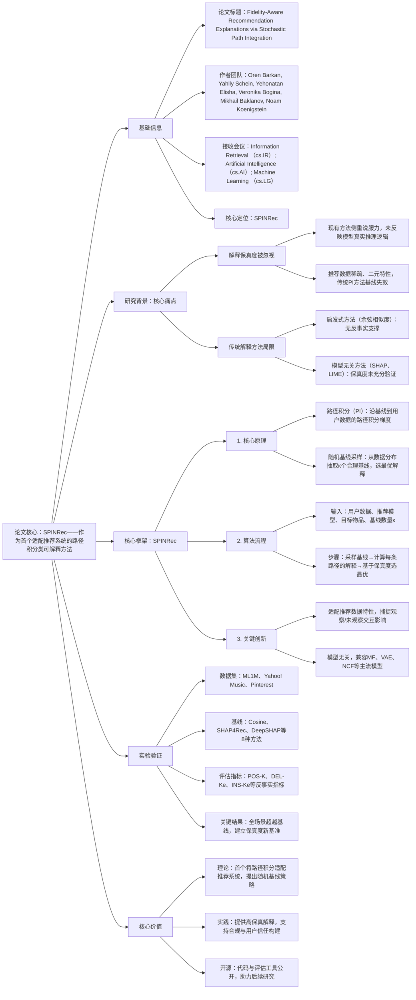

### 1. 一段话总结
以色列开放大学与特拉维夫大学团队提出**SPINRec**（Stochastic Path Integration for Neural Recommender Explanations），作为首个适配推荐系统的**路径积分（PI）** 类可解释方法，核心解决现有解释的**保真度不足**问题，通过**随机基线采样**（从真实数据分布中抽取多个合理用户画像）与路径积分结合，捕捉观察与未观察交互的双重影响，在**3种推荐模型（MF、VAE、NCF）** 和**3个数据集（ML1M、Yahoo! Music、Pinterest）** 上，通过AUC类、固定长度类等多类反事实指标评估，**持续超越SHAP4Rec、LXR等8种基线方法**，建立了推荐系统保真度导向解释的新基准，代码与评估工具已开源。

---

### 2. 思维导图

---

### 3. 详细总结
#### 一、研究背景与核心问题
1. **推荐系统可解释性的核心缺口**  
   现有可解释推荐研究多关注用户体验（说服力、清晰度），而**保真度（解释与模型真实推理的一致性）** 作为透明度与问责制的关键，长期被忽视。缺乏保真度的解释可能看似合理，却无法反映推荐的真实逻辑。

2. **传统方法的适配难题**  
   推荐数据具有**极端稀疏性**（多数用户-物品交互为0）和**二元性**（仅存在“交互/未交互”），传统路径积分（PI）方法依赖的“全零基线”（冷启动用户）无法生成有效梯度信号，且现代推荐模型会同时利用观察与未观察交互作为信息，进一步加剧了传统方法的局限性。

#### 二、SPINRec框架核心设计
##### 1. 核心定义与原理
- **用户与模型表示**：用户u的交互向量为$`(x_u \in \{0,1\}^{|V|})`$（V为物品集），推荐模型$`(f_\theta)`$输出物品 affinity 得分，解释映射$`(m)`$量化每个交互对推荐结果的贡献度。
- **路径积分基础**：定义路径$`(r(t)=t \cdot x + (1-t) \cdot z)`$（t∈[0,1]，z为基线向量），通过积分梯度得到解释：  
  $`[m=\int_{0}^{1} \frac{\partial f_{\theta}^{y}(r(t))}{\partial r(t)} \circ \frac{d r(t)}{d t} d t]`$
- **随机基线采样**：从真实用户数据分布中采样κ个合理基线$`(B=\{z_1,...,z_\kappa\})`$，计算每个基线对应的解释，最终选择保真度最高的解释$`(m^*=argmax_{m \in \mathcal{M}} s(m))`$（s为保真度指标）。

##### 2. 算法流程（Algorithm 1）
| 步骤 | 核心操作 | 关键说明 |
|------|----------|----------|
| 1 | 输入准备 | 用户数据x、模型$`(f_\theta)`$、目标物品y、基线数量κ、保真度指标s |
| 2 | 基线采样 | 从用户集中抽取κ个合理基线，构成集合B |
| 3 | 路径积分计算 | 对每个基线z∈B，计算路径r(t)，通过积分得到解释m |
| 4 | 最优解释选择 | 基于指标s从所有解释中筛选最优m*并输出 |

##### 3. 计算复杂度
- 整体复杂度：$`(O(\kappa Q(J+N|\mathcal{V}|)) \approx O(\kappa Q N|\mathcal{V}|))`$
- 关键变量：κ为基线数量（实验中κ=10时性能收敛），Q为模型参数数，J为积分步数，N为扰动评估次数，|$`(\mathcal{V})`$|为物品数
- 优势：线性缩放，支持GPU并行，效率优于SHAP（指数复杂度）和LIME（立方采样复杂度）

#### 三、实验验证
##### 1. 实验设置
| 配置项 | 具体内容 |
|--------|----------|
| 推荐模型 | 3种主流模型： - 矩阵分解（MF）：动态变体，直接从交互向量推导嵌入 - 变分自编码器（VAE）：生成式 latent 变量模型 - 神经协同过滤（NCF）：融合MF与MLP的混合架构 |
| 数据集 | 3个公开数据集，均二值化为隐式反馈，80/20用户级划分： - ML1M：100万条电影评分，用户6k+，物品4k+ - Yahoo! Music：含用户-歌曲交互，数据规模更大 - Pinterest：图片交互数据，结果见开源仓库 |
| 基线方法 | 8种代表性方法： - 启发式：Cosine Similarity - 扰动类：SHAP4Rec、DeepSHAP - 局部代理：LIME-RS、LIRE - 影响函数类：FIA、ACCENT - 学习类：LXR（SOTA保真度方法） - 消融版：PI（无随机基线采样） |
| 评估指标 | 反事实保真度指标（分两类）： 1. AUC类：基于逐步扰动的曲线下面积 2. 固定长度类（K_e=2/3/4，K_r=5/10/20）：   - POS@K：移除解释特征后目标物品仍在Top-K的概率（越低越好）   - DEL@K_e：移除特征后的置信度下降（越低越好）   - INS@K_e：添加特征后的置信度恢复（越高越好）   - CDCG@K_e：移除特征后的排序退化（越低越好） |

##### 2. 核心实验结果
###### （1）整体性能对比（ML1M数据集，MF模型）
| 方法 | POS@5（K_e=2） | DEL@K_e=2 | INS@K_e=2 | CDCG@K_e=2 |
|------|----------------|-----------|-----------|------------|
| Cosine | 0.987 | 0.983 | 0.750 | 0.915 |
| SHAP4Rec | 1.000 | 0.997 | 0.648 | 0.969 |
| LXR | 0.988 | 0.979 | 0.779 | 0.904 |
| PI（消融版） | 0.980 | 0.974 | 0.798 | 0.884 |
| SPINRec | 0.975 | 0.974 | 0.799 | 0.859 |

###### （2）关键结论
- 1. 全场景领先：SPINRec在3种模型、3个数据集的所有指标中均超越所有基线，其中在VAE和NCF上优势更显著（未观察交互影响更大）；
- 2. 随机基线的价值：消融实验显示，仅用路径积分的PI方法性能低于SPINRec，验证了随机基线采样对适配推荐数据的必要性；
- 3. 效率与性能平衡：基线数量κ=10时性能收敛，进一步增加κ无明显增益，兼顾效率与效果；
- 4. 模型兼容性：对MF、VAE、NCF均有效，证明模型无关特性的实用性。

---

### 4. 关键问题
#### 问题1：SPINRec的“随机基线采样”与传统PI方法的“固定基线”相比，核心优势是什么？为何能适配推荐系统的数据特性？
**答案**：
1. 核心优势：传统PI方法采用全零、冷启动等固定基线，无法反映真实用户行为分布，而随机基线采样从 empirical 数据分布中抽取多个合理用户画像，能捕捉群体行为模式；
2. 适配性原因：① 推荐数据稀疏且二元，全零基线导致未观察交互无梯度贡献，随机基线通过非零合理分布，让未观察交互产生有意义梯度；② 现代推荐模型同时利用观察（1）与未观察（0）交互作为信号，随机基线能覆盖这种双重影响，而固定基线仅能捕捉单一场景，导致解释失真。

#### 问题2：SPINRec的保真度是通过哪些指标评估的？这些指标如何体现“解释反映模型真实推理”的核心诉求？
**答案**：
1. 评估指标：分为AUC类（逐步扰动的曲线下面积）和固定长度类（POS@K、DEL@K_e、INS@K_e、CDCG@K_e），覆盖“移除解释特征”“添加解释特征”两类反事实场景；
2. 核心逻辑：① POS@K：移除解释特征后目标物品仍在Top-K的概率越低，说明解释特征对推荐结果的影响越关键；② DEL@K_e：移除特征后置信度下降越多，证明解释特征的贡献越真实；③ INS@K_e：添加特征后置信度恢复越多，说明解释特征能准确还原模型的决策依据；④ 这些指标通过扰动验证解释与模型推理的一致性，而非单纯依赖表面相关性。

#### 问题3：SPINRec作为模型无关方法，如何保证在MF、VAE、NCF等不同架构推荐模型上的泛化性？实验中哪种模型上的提升最显著？
**答案**：
1. 泛化性保障：① 模型无关设计：仅依赖模型的输入（用户交互向量）和输出（物品affinity得分），不涉及内部参数或结构；② 路径积分与随机基线采样适配推荐数据的共性（稀疏、二元），而非特定模型的特性；③ 反事实评估框架统一，不受模型架构影响；
2. 提升显著性：在VAE和NCF上的提升比MF更显著，原因是VAE（生成式模型）和NCF（非线性交互）更依赖未观察交互的信号，而SPINRec的随机基线采样恰好能捕捉这部分信息，弥补了传统解释方法对复杂模型推理逻辑的捕捉不足，而MF作为线性模型，对未观察交互的依赖较弱，因此提升幅度相对温和。