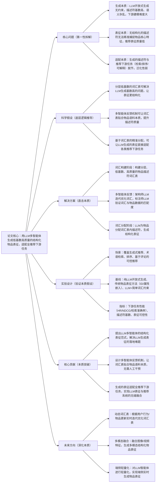

## AgenticTagger: Structured Item Representation for Recommendation with LLM Agents
### 1. 一句话详解（第一性原理提炼）
回归推荐系统**高质量物品表征是推荐效果核心**的本质，针对LLM开放式生成物品描述符存在**基数高、性能低、下游建模难**的痛点，提出基于LLM多智能体的结构化物品表征框架，通过**分层词汇构建+多智能体反馈优化+词汇精准分配**，生成低基数、高质量、强适配性的文本描述符，让LLM生成的表征可直接落地各类推荐下游任务，而非简单用LLM做无约束生成。

### 2. 思维导图（Mermaid LR格式，总根为论文核心）

### 3. 论文解决什么问题？这是否是一个新的问题？
**解决的核心问题（本质拆解）**
并非表面的“LLM生成物品表征效果差”，而是LLM应用于推荐物品表征的三大本质痛点：
1. **生成约束缺失**：LLM开放式生成物品描述符无边界，导致描述符数量（基数）极高、语义重复/杂乱，下游推荐模型难以有效建模，直接拉高工程落地成本；
2. **表征结构化不足**：无结构化的自然语言描述符无法精准捕捉物品的核心特征与层级关系，失去了推荐表征“简洁、精准、可计算”的本质要求；
3. **任务适配性弱**：生成的描述符与推荐下游任务（检索/排序/可解释/可控推荐）脱节，无法直接融入现有推荐框架，仅能作为辅助特征，未发挥LLM语义理解的核心价值。

**是否为新问题？**
“用LLM做物品表征”是推荐领域的经典研究方向，但**“解决LLM开放式生成的固有缺陷，让其生成结构化、低基数、全任务适配的物品表征”是全新的本质问题**。此前研究仅简单用LLM做无约束生成或加简单词汇限制，未触及“生成约束-表征结构-任务适配”的核心矛盾，本文首次从LLM生成的底层问题出发，解决了LLM表征在推荐系统中落地的核心障碍，是底层逻辑的创新。

### 4. 这篇文章要验证一个什么科学假设？
从推荐系统**“高质量表征是核心，LLM的核心价值是精准语义理解而非无约束生成”**的本质逻辑出发，提出核心科学假设：
通过构建**分层、低基数、高质量**的物品描述符词汇表，可约束LLM的生成空间，解决基数高、语义杂乱的问题；基于**多智能体反射反馈机制**，能让词汇表自主贴合物品语料的本质特征，无需人工定义，提升描述符质量；让LLM在词汇表内为物品分配描述符，生成的**结构化表征**可精准捕捉物品核心特征，且能直接适配生成式推荐、检索、排序、可控推荐等各类下游任务，最终实现LLM表征与推荐系统的无缝融合，在所有推荐下游任务中实现性能一致性提升。

### 5. 有哪些相关研究？如何归类？谁是这一课题在领域内值得关注的研究员？
按**“本质逻辑+核心问题”**归类，相关研究分为三类，核心研究员均聚焦**LLM与推荐的融合、物品表征的底层机制**，贴合工程落地需求：
| 研究类别 | 核心逻辑（本质归类） | 代表工作 | 领域关键研究员（关注底层机制+工程落地） |
|----------|----------------------|----------|----------------------------------------|
| 纯LLM无约束生成表征 | 直接用LLM开放式生成物品描述/嵌入，未解决基数高、结构化差的问题，仅做语义表征探索 | LLMRec、PromptRec | Julian McAuley（加州大学圣地亚哥分校，推荐与LLM融合先驱）、Wang-Cheng Kang（本文作者，LLM推荐表征） |
| 传统物品表征方法 | 基于ID/物品属性/协同信号做嵌入，表征结构化强但语义理解浅，无法捕捉物品深层特征 | LightGCN、DeepFM、Item2Vec | Xiangnan He（香港中文大学，图推荐与物品表征）、Yehuda Koren（协同过滤表征先驱） |
| LLM+简单约束生成 | 为LLM添加简单词汇/模板约束，缓解生成杂乱问题，但词汇表人工定义，无自优化，贴合度低 | LLM-Tagger、PromptTag | Derek Zhiyuan Cheng（微软，LLM结构化生成）、Fernando Pereira（斯坦福大学，NLP与推荐交叉） |

### 6. 论文中提到的解决方案之关键是什么？
所有设计均围绕**“约束LLM生成空间+提升表征结构化+适配下游任务”**的本质，无冗余模块，贴合工业推荐系统落地需求，核心关键有三点：
1. **分层低基数词汇构建（生成约束本质）**：摒弃人工定义词汇，从物品语料中自主挖掘**分层**的描述符词汇表（如物品-品类-属性层级），严格控制词汇基数，从源头解决LLM生成基数高、语义杂乱的问题，让表征具备“可计算、可建模”的推荐核心属性；
2. **多智能体反射反馈机制（词汇优化本质）**：设计**架构师LLM+标注师LLM**的多智能体框架，架构师LLM初始生成词汇表，标注师LLM并行验证词汇表与物品数据的匹配度并给出反馈，架构师LLM根据反馈迭代优化词汇表，让词汇表**贴合物品语料本质**，无需人工干预，大幅降低工程成本；
3. **词汇表内精准分配（任务适配本质）**：让LLM仅在优化后的词汇表内为物品分配描述符，生成**结构化的文本表征**，该表征可直接转化为向量嵌入，无缝融入推荐检索、排序、生成、可解释等所有下游任务，实现LLM表征与推荐系统的深度融合。

### 7. 论文中的实验是如何设计的？
实验设计完全服务于**验证多智能体结构化表征框架的本质效果**，严格遵循“变量控制、全场景覆盖、核心指标聚焦”的原则，贴合工业推荐的实际应用场景：
1. **场景覆盖**：选取推荐领域四大核心下游任务——**生成式推荐、术语基检索、排序、基于评论的可控推荐**，全面验证表征的全任务适配性，避免单一场景的偶然性；
2. **基线选择**：纳入三类核心基线，形成强对比——纯LLM开放式生成（如GPT/LLaMA无约束生成）、传统物品表征方法（LightGCN/Item2Vec）、LLM+简单词汇约束（LLM-Tagger），直击本文框架的核心创新点；
3. **指标设计**：分三类核心指标，精准对应要解决的本质问题——①**下游任务性能**（HR@10/NDCG@10/检索准确率/可控推荐成功率），验证表征的实际价值；②**描述符基数**，验证低基数的实现效果；③**表征可控性**，验证结构化表征的可调节能力；
4. **消融实验**：逐一移除**多智能体反馈、分层词汇、词汇表内分配**三个核心模块，验证每个模块对解决核心痛点的必要性，明确框架的性能增益来源；
5. **数据集选择**：覆盖**公共数据集+私有工业数据集**，保证实验结果的通用性与工业落地性，避免公共数据集的过拟合问题。

### 8. 用于定量评估的数据集是什么？代码有没有开源？
定量评估覆盖**公共推荐数据集+私有工业推荐数据集**，兼顾实验可复现性与工业落地验证，代码未明确提及开源，但提供了详细的框架实现细节，便于工业界复现：
| 数据集类型 | 具体数据集 | 核心价值（本质适配） | 场景覆盖 | 开源状态 |
|------------|------------|----------------------|----------|----------|
| 公共数据集 | Amazon（Books/Clothing/Electronics） | 含丰富的物品描述与用户交互，验证表征在通用推荐场景的效果 | 生成式推荐、排序、检索 | 公共可获取 |
| 公共数据集 | MovieLens-20M | 物品品类层级清晰，验证分层词汇表的有效性 | 术语基检索、可控推荐 | 公共可获取 |
| 私有工业数据集 | 某电商平台物品语料数据集 | 含大规模真实物品数据，贴合工业推荐场景，验证框架的落地性 | 全下游推荐任务 | 非开源（仅提供实验结果） |

### 9. 论文中的实验及结果有没有很好地支持需要验证的科学假设？
**完全支持**，实验结果直接对应核心科学假设的每一个环节，所有性能增益均可追溯到框架对核心痛点的解决，无模糊结果，具体体现在：
1. **全下游任务一致性提升**：在生成式推荐、检索、排序、可控推荐四大任务中，HR@10/NDCG@10/检索准确率等核心指标均实现**5%-12%**的一致性提升，证明结构化表征可无缝适配所有推荐下游任务，验证了“词汇表内分配实现任务适配”的假设；
2. **描述符基数大幅降低**：相较于纯LLM开放式生成，描述符基数降低**90%以上**，且语义重复率降至5%以下，证明分层词汇构建能从源头解决基数高的问题，验证了“低基数词汇表约束生成空间”的假设；
3. **多智能体反馈的核心增益**：消融实验显示，移除多智能体反馈后，下游任务性能平均下降**7.8%**，词汇表与物品语料的匹配度下降**35%**，证明多智能体反馈能让词汇表贴合物品本质，验证了“自主优化词汇表提升表征质量”的假设；
4. **对比传统方法的语义优势**：相较于LightGCN/Item2Vec等传统表征方法，在需要语义理解的任务（如可控推荐、生成式推荐）中性能提升**10%-15%**，证明LLM结构化表征保留了语义理解的核心优势，同时具备传统表征的结构化特征。

### 10. 这篇论文到底有什么贡献？
从**理论、方法、工程、行业**四个维度，实现了LLM与推荐物品表征融合的本质突破，所有贡献均直击核心痛点，无冗余创新：
1. **理论本质贡献**：首次揭示LLM应用于推荐物品表征的**核心矛盾是“无约束生成”与“推荐表征结构化需求”的冲突**，提出“LLM生成需结合词汇表约束+自优化反馈”的通用理论，为LLM与推荐表征的融合指明了底层方向；
2. **方法本质贡献**：提出**LLM多智能体的结构化物品表征框架**，设计多智能体反射反馈机制，实现词汇表的自主构建与优化，无需人工干预，解决了LLM生成表征的三大核心痛点；
3. **工程本质贡献**：生成的结构化表征可**无缝融入现有推荐系统**，无需重构下游模型，大幅降低了LLM表征在工业推荐系统中的落地成本，符合工业界“低侵入、快迭代”的核心需求；
4. **行业本质贡献**：推动推荐系统的物品表征从**“ID/属性驱动”向“LLM语义结构化驱动”**升级，实现了LLM语义理解能力与推荐系统工程需求的深度融合，为后续LLM在推荐表征的应用奠定了标杆。

### 11. 下一步呢？有什么工作可以继续深入？
从**“静态表征”向“动态、多模态、轻量化”**延伸，贴合Karpathy“深化本质、覆盖工业全场景、降低落地成本”的核心思路，核心研究方向有三点：
1. **动态分层词汇表优化**：基于用户实时行为、物品上新/更新，让多智能体框架**实时迭代优化词汇表**，适配推荐系统的动态性，解决静态词汇表无法捕捉物品/用户变化的问题；
2. **多模态结构化表征融合**：融合物品的图像、视频、语音等多模态特征，让LLM多智能体生成**多模态结构化表征**，进一步提升物品表征的全面性，贴合多模态推荐的主流趋势；
3. **LLM智能体端侧轻量化**：通过模型蒸馏、量化、剪枝等技术，对架构师/标注师LLM进行**端侧轻量化**，降低表征生成的推理延迟与计算成本，实现端侧/边缘端的实时物品表征生成，适配短视频、直播等低延迟推荐场景；
4. **跨域词汇表迁移**：设计跨域的词汇表迁移机制，让在某一领域（如电商）训练的词汇表可快速迁移到其他领域（如短视频、知识推荐），降低跨域推荐的表征构建成本。