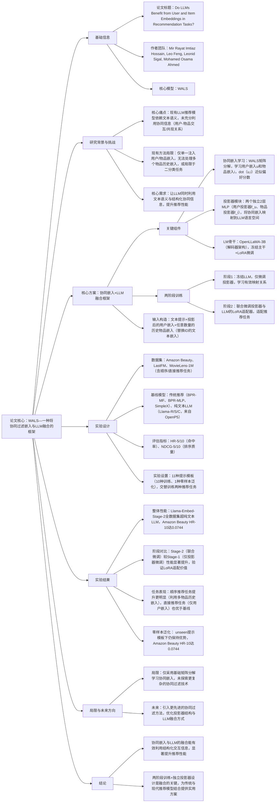

# 1. 一段话总结
为解决现有LLM推荐模型仅依赖文本语义、未充分利用用户-物品交互的协同信息（或仅单一注入用户/物品嵌入）的问题，研究团队提出一种将协同过滤嵌入与LLM融合的框架：通过加权交替最小二乘法（WALS）学习用户和物品的协同嵌入，再通过两个独立的轻量级MLP投影器将其映射到LLM的语言空间，最后与文本token一同输入LLM，经“投影器预训练+LoRA联合微调”两阶段训练完成推荐；在Amazon Beauty、LastFM、MovieLens-1M三个数据集的顺序推荐和直接推荐任务中，该框架（Llama-Embed-Stage-2）显著优于纯文本LLM基线，Amazon Beauty数据集上HR@10达0.0744（超Llama-S近11倍），部分场景（如Amazon Beauty顺序推荐）甚至超越SASRec等传统推荐模型，为传统协同过滤与现代生成式推荐的融合提供了实用路径。

---

# 2. 思维导图（mindmap）

---

# 3. 详细总结
## 一、研究背景与核心问题
### 1. LLM推荐的现有缺陷
LLM在推荐领域的应用虽有进展，但存在明显不足：
- 仅依赖文本语义：忽视用户-物品交互产生的协同信息（如共现关系、偏好模式），推荐性能有限；
- 协同信息利用不足：部分方法虽注入嵌入，但仅单一注入用户或物品嵌入，无法处理多个物品历史嵌入，或局限于二分类任务，无法适配生成式推荐场景。

### 2. 研究目标
构建一种简单有效的框架，让LLM同时利用文本语义和结构化协同信息（用户-物品交互），通过独立投影器注入用户和物品的协同嵌入，提升推荐的准确性与泛化性。

## 二、核心方案：框架设计与训练流程
### 1. 整体架构（图1）
框架包含五大组件：文本tokenizer、协同过滤查找表、用户嵌入投影器、物品嵌入投影器、LLM骨干，核心逻辑是“协同嵌入学习→投影映射→LLM融合”。

| 组件 | 功能详情 |
|------|----------|
| 协同嵌入学习 | 采用WALS矩阵分解（Weighted Alternating Least Squares），从用户-物品交互数据中学习用户嵌入u和物品嵌入i，通过dot(u,i)近似用户对物品的偏好分数 |
| 投影器模块 | 两个独立的2层MLP（用户投影器f_u、物品投影器f_i），分别将用户嵌入u映射为emb(u)=f_u(u)，物品嵌入i映射为emb(i)=f_i(i)，确保映射到LLM可理解的语言空间 |
| LLM骨干 | 选用OpenLLaMA-3B（解码器架构，复刻LLaMA-2），训练中冻结主干网络，仅通过LoRA适配器适配推荐任务 |
| 输入构造 | 遵循OpenP5的提示模板（如“考虑{数据集}用户{user_id}交互过{history}物品，推荐下一个物品”），其中user_id和history的物品ID替换为“投影后的用户嵌入+历史物品嵌入”，其余文本保留token化嵌入 |

### 2. 两阶段训练策略
- **阶段1：投影器预训练**  
  冻结LLM的所有参数，仅微调两个投影器。目的是让投影器学习到“协同嵌入→LLM语言空间”的有效映射，确保嵌入信息能被LLM理解。
- **阶段2：联合微调**  
  解冻LLM的LoRA适配器，与投影器一起联合微调。目的是让LLM适配推荐任务，将文本语义、用户偏好、历史物品信息融合，优化推荐生成逻辑。

## 三、实验设计详情
### 1. 数据集与任务
| 数据集 | 任务类型 | 任务描述 |
|--------|----------|----------|
| Amazon Beauty | 顺序推荐、直接推荐 | 顺序推荐：用用户信息+历史交互预测下一个物品；直接推荐：仅用用户ID预测下一个物品 |
| LastFM | 顺序推荐、直接推荐 | 同上 |
| MovieLens-1M | 顺序推荐、直接推荐 | 同上 |
- 提示模板：每个任务11种模板，10种用于训练，1种用于零样本泛化（unseen场景）。

### 2. 基线与评估指标
#### （1）基线模型
- 传统推荐模型：BPR-MF、BPR-MLP、SimpleX；
- 纯文本LLM模型：Llama-R（随机索引）、Llama-S（顺序索引）、Llama-C（协同索引，来自OpenP5）。

#### （2）评估指标
- HR@5/10：前5/10推荐列表中包含真实下一个物品的比例，衡量命中率；
- NDCG@5/10：考虑物品相关性与排名位置的加权分数，衡量排序质量。

### 3. 实验配置
- 硬件/框架：未明确提及，采用标准LLM微调流程；
- 关键参数：LLM为OpenLLaMA-3B，投影器为2层MLP，LoRA适配，训练时交替进行两个推荐任务。

## 四、实验结果与分析
### 1. 核心性能对比
#### （1）顺序推荐任务（主要场景）
| 模型 | Amazon Beauty HR@10 | LastFM HR@10 | MovieLens-1M HR@10 |
|------|---------------------|--------------|--------------------|
| Llama-S（纯文本基线） | 0.0065 | 0.0220 | 0.0210 |
| SimpleX（传统模型） | 0.0471 | 0.0523 | 0.0596 |
| Llama-Embed-Stage-2（Ours） | 0.0744 | 0.0725 | 0.0412 |
- 关键结论：Ours在Amazon Beauty上显著超越传统模型和纯文本LLM，HR@10超Llama-S近11倍；LastFM上也大幅领先基线，MovieLens-1M因数据特性提升相对温和。

#### （2）直接推荐任务（仅用户ID输入）
- Ours仍优于纯文本LLM基线，证明用户嵌入的有效注入能让LLM仅通过用户ID捕捉偏好，弥补文本信息的不足。

### 2. 两阶段训练有效性
- 阶段2（联合微调）较阶段1（仅投影器微调）性能提升显著：Amazon Beauty的HR@10从0.0389（Stage-1）升至0.0744（Stage-2），说明LLM适配推荐任务的必要性。

### 3. 零样本泛化能力
- 在unseen提示模板下，Ours保持优势：Amazon Beauty HR@10达0.0744，仅略低于训练模板的0.0730，证明框架的泛化性良好。

## 五、局限与未来方向
### 1. 现有局限
- 协同嵌入学习仅采用基础的WALS矩阵分解，未探索更复杂的协同过滤技术（如GraphSAGE、MF的变体）；
- 投影器设计较为简单（2层MLP），未验证更复杂的映射结构（如Transformer层）的效果；
- 仅在3个标准数据集验证，未测试大规模或多模态场景的性能。

### 2. 未来方向
- 引入更先进的协同过滤方法学习高质量协同嵌入；
- 优化投影器与LLM的融合方式，探索更高效的嵌入注入策略；
- 扩展至多模态推荐场景（如结合物品图片嵌入），进一步提升性能。

---

# 4. 关键问题
## 问题1：该框架为何需要两个独立的投影器（用户/物品分开），而非单一投影器？与现有“单一注入嵌入”的方法相比，核心优势是什么？
### 答案
- 独立投影器的必要性：用户嵌入和物品嵌入的语义空间与分布不同（用户嵌入反映偏好倾向，物品嵌入反映属性特征），独立投影器能分别学习最优映射，避免单一投影器导致的语义混淆，确保两种嵌入在LLM语言空间中保持互补性。
- 核心优势：
    1. 支持多物品历史嵌入输入：现有方法多只能处理单一目标物品嵌入，该框架可注入任意数量的历史物品嵌入，更贴合真实推荐场景（用户有多次交互历史）；
    2. 兼顾协同信息完整性：同时注入用户和物品嵌入，充分利用“用户偏好-物品属性”的交互关系，而非单一依赖某类嵌入；
    3. 适配生成式推荐：通过文本提示+嵌入融合，自然融入LLM的生成流程，而非局限于二分类任务。

## 问题2：两阶段训练（投影器预训练+LoRA联合微调）的设计逻辑是什么？若直接跳过阶段1，仅进行联合微调，会导致什么问题？
### 答案
- 设计逻辑：
    1. 阶段1（投影器预训练）：冻结LLM可避免其被初始随机的协同嵌入干扰，让投影器先学习到“协同嵌入→LLM语言空间”的有效映射（如让用户嵌入的语义与“偏好”相关、物品嵌入与“属性”相关），为后续融合打下基础；
    2. 阶段2（联合微调）：LoRA适配LLM能让模型将文本语义、用户嵌入、物品嵌入深度融合，针对性优化推荐任务的下一个token预测损失。
- 直接跳过阶段1的问题：
  投影器初始参数随机，协同嵌入无法被LLM有效理解，联合微调时LLM可能过度关注文本语义，忽视协同嵌入的价值，导致性能提升有限，甚至低于纯文本LLM基线。

## 问题3：该框架在Amazon Beauty数据集上表现突出（超越传统模型），但在MovieLens-1M上提升相对温和，可能的原因是什么？这对后续研究有何启示？
### 答案
- 可能原因：
    1. 数据特性差异：Amazon Beauty的物品属性（如美妆品类）与文本描述的关联性较弱，纯文本LLM难以捕捉有效偏好，而协同嵌入能弥补这一缺口；MovieLens-1M的电影有丰富的文本描述（剧情、演员等），纯文本LLM已能捕捉部分偏好，协同嵌入的增益被稀释；
    2. 协同信息密度：MovieLens-1M用户交互更密集（平均交互数166），传统协同过滤模型已能充分利用信息，LLM融合的边际增益较小；Amazon Beauty交互相对稀疏，LLM+协同嵌入的组合更能挖掘潜在偏好。
- 启示：
    1. 场景适配：该框架更适用于物品文本信息稀缺、交互稀疏的推荐场景；
    2. 优化方向：针对文本信息丰富的数据集，可增强文本与协同嵌入的对齐机制（如增加对比损失），进一步释放融合优势；
    3. 数据平衡：未来研究需关注不同数据特性（稀疏度、文本丰富度）对框架性能的影响，提升模型的适应性。