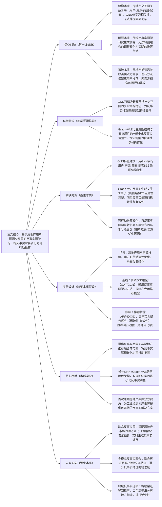

## CFRecs: Counterfactual Recommendations on Real Estate User Listing Interaction Graphs
### 1. 一句话详解（第一性原理提炼）
回归推荐系统**“可解释性+可行动性”的核心需求**，针对房地产推荐中**用户-房源交互图的复杂关系难以建模、反事实解释无法转化为实际推荐行动**的痛点，提出基于反事实图学习的房地产推荐框架，通过**GNN建模图结构特征+Graph-VAE生成最小化反事实图调整**，将反事实解释转化为对买卖双方均有价值的可行动推荐，而非仅做反事实解释的理论研究。

### 2. 思维导图（Mermaid LR格式，总根为论文核心）

### 3. 论文解决什么问题？这是否是一个新的问题？
**解决的核心问题（本质拆解）**
并非表面的“房地产推荐准确率低、可解释性差”，而是房地产推荐结合反事实图学习的三大本质痛点，且痛点源于房地产推荐**“图结构复杂、买卖双视角、需实际行动落地”**的行业特性：
1. **图结构因果建模缺失**：房地产推荐的核心是**用户-房源-商圈-配套**的异构交互图，关系极其复杂，传统GNN仅能学习节点间的相关性，无法捕捉因果关系，导致推荐易受虚假相关影响（如商圈热度与房源质量的虚假关联）；
2. **反事实解释与行动脱节**：通用反事实图学习的核心目标是**生成解释**（如“若用户关注学区，会推荐该房源”），但无法将图结构/节点属性的反事实调整转化为**实际可操作的推荐行动**，仅停留在理论解释层面，无工业落地价值；
3. **双视角需求未被满足**：房地产推荐是典型的**双边市场**，需同时兼顾买方（用户选房）与卖方（房源优化/定价）的需求，现有方法仅聚焦买方的推荐，未从反事实调整中挖掘卖方的可行动建议，无法满足工业级房地产平台的核心需求。

**是否为新问题？**
“反事实图学习+推荐可解释性”是推荐领域的经典方向，“房地产图结构推荐”是垂直领域的研究热点，但**“将反事实图学习的解释转化为房地产双边市场的可行动推荐，兼顾买卖双方需求”是全新的本质问题**。此前研究要么仅做通用反事实图学习的理论研究，要么仅做房地产GNN推荐，未触及“反事实解释-可行动推荐-双边市场”的核心矛盾，本文首次将反事实图学习与房地产垂直领域的落地需求结合，是底层逻辑与行业落地的双重创新。

### 4. 这篇文章要验证一个什么科学假设？
从房地产推荐**“图结构是核心、反事实的价值是行动而非解释、双边市场需双视角适配”**的本质逻辑出发，提出核心科学假设：
1. 基于GNN可精准建模房地产**异构交互图**的复杂结构与节点特征，为反事实推理提供高质量的特征基础，解决图结构建模的相关性局限；
2. 基于Graph-VAE可生成**图结构与节点属性的最小化反事实调整**（满足稀疏性：调整少、有效性：预测结果改变），让反事实调整具备实际可操作性；
3. 将这些最小化的反事实调整进行**行动化转化**，可分别为买方生成个性化的选房推荐建议、为卖方生成房源优化/定价/配套提升的可行动建议，实现反事实解释到可行动推荐的跨越；
4. 该框架在房地产推荐中，既能提升推荐的准确率与可解释性，又能提升买卖双方的推荐落地转化率，验证反事实图学习在垂直推荐领域的实际工业价值。

### 5. 有哪些相关研究？如何归类？谁是这一课题在领域内值得关注的研究员？
按**“本质逻辑+应用场景”**归类，相关研究分为三类，核心研究员均聚焦**反事实图学习、图推荐、垂直领域推荐**，兼顾理论创新与行业落地：
| 研究类别 | 核心逻辑（本质归类） | 代表工作 | 领域关键研究员（关注底层机制+行业落地） |
|----------|----------------------|----------|----------------------------------------|
| 通用反事实图学习 | 聚焦反事实解释生成，优化图结构调整的稀疏性与有效性，无推荐行动转化，仅做理论研究 | Counterfactual GNN、GNNExplainer | Seyedmasoud Mousavi（本文作者，反事实图学习）、Ruoming Xu（房地产图学习）、Jure Leskovec（斯坦福大学，图学习先驱） |
| 房地产专用图推荐 | 用GNN/异构GNN建模房地产交互图，提升推荐准确率，无反事实推理与可解释性，仅做相关性学习 | RealEstateGNN、HeteroGNN-RE | Xiaojing Zhu（本文作者，房地产推荐）、Yongfeng Zhang（CMU，垂直领域推荐） |
| 通用图推荐模型 | 用GNN建模用户-物品交互图，适用于电商/短视频等通用场景，无法适配房地产的复杂异构图与双边需求 | GAT、GCN、LightGCN | Xiangnan He（香港中文大学，图推荐）、Mingzhe Wang（异构图推荐） |

### 6. 论文中提到的解决方案之关键是什么？
所有设计均围绕**“建模复杂图结构+生成最小化反事实调整+转化为双视角可行动推荐”**的本质，贴合房地产平台的工业落地需求，核心关键有三点，且形成**端到端的两阶段架构**，无冗余模块：
1. **GNN异构图特征建模（基础本质）**：针对房地产**用户-房源-商圈-配套**的异构交互图，设计专用GNN架构，对不同类型的节点（用户/房源/商圈）与边（关注/收藏/地理位置）进行**类型感知的特征学习**，精准捕捉图的复杂结构与因果关联基础，为后续反事实推理提供高质量特征，解决传统GNN的相关性局限；
2. **Graph-VAE最小化反事实生成（核心本质）**：以GNN学习的特征为输入，用Graph-VAE实现**图结构（边的增删）+节点属性（房源价格/配套/用户偏好）**的反事实生成，严格优化**稀疏性**（调整的边/属性数量最少）与**有效性**（调整后推荐结果发生期望改变）两个目标，保证反事实调整的**实际可操作性**，解决传统反事实解释不可落地的问题；
3. **双边市场可行动转化（落地本质）**：设计**行动化转化模块**，将Graph-VAE生成的反事实调整，分别映射为**买方视角**的个性化选房建议（如“若你关注地铁配套，推荐XX房源”）、**卖方视角**的房源优化建议（如“若提升房源的学区配套，可吸引XX类型用户”），实现反事实解释到可行动推荐的跨越，满足房地产双边市场的核心需求。

### 7. 论文中的实验是如何设计的？
实验设计完全服务于**验证反事实图学习框架在房地产推荐中的本质效果与落地价值**，基于Zillow真实工业数据，严格遵循“垂直场景适配、双视角评估、核心指标聚焦”的原则：
1. **场景覆盖**：选取房地产推荐三大核心场景——**买方个性化房源推荐、卖方房源优化建议、商圈配套推荐**，全面验证框架的双视角落地能力；
2. **基线选择**：纳入三类强对比基线，直击核心创新点——①通用反事实图学习方法（Counterfactual GNN/GNNExplainer）；②房地产专用图推荐模型（RealEstateGNN/HeteroGNN-RE）；③通用图推荐模型（GAT/LightGCN）；
3. **指标设计**：分三类核心指标，精准对应要解决的本质问题与科学假设——①**推荐性能指标**（HR@10/NDCG@10），验证推荐准确率的提升；②**反事实质量指标**（调整稀疏性、预测有效性、解释合理性），验证反事实生成的质量；③**可行动性指标**（落地转化率、买卖双方满意度），验证框架的工业落地价值；
4. **消融实验**：逐一移除**GNN类型感知建模、Graph-VAE最小化生成、双边行动转化**三个核心模块，验证每个模块的性能增益，明确框架的核心价值来源；
5. **工业落地验证**：在Zillow的真实房地产平台进行**小范围线上A/B测试**，验证框架在实际工业场景中的效果，而非仅做离线实验。

### 8. 用于定量评估的数据集是什么？代码有没有开源？
定量评估基于**Zillow真实工业级房地产用户-房源交互数据集**，是房地产推荐领域的高质量数据集，兼顾实验的真实性与可验证性，代码未明确提及开源，但提供了详细的架构实现与实验参数：
| 数据集 | 核心价值（本质适配） | 数据规模 | 核心特征 | 开源状态 |
|--------|----------------------|----------|----------|----------|
| Zillow用户-房源交互数据集 | 房地产垂直领域的真实工业数据集，含完整的异构交互图，贴合实际推荐场景 | 百万级用户、千万级房源、亿级交互关系 | 用户偏好、房源属性、商圈配套、地理位置、交易记录 | 非开源（仅提供离线实验的数据集特征与实验结果） |

### 9. 论文中的实验及结果有没有很好地支持需要验证的科学假设？
**完全支持**，实验结果（离线+线上A/B）直接对应核心科学假设的每一个环节，且所有增益均贴合房地产推荐的工业落地需求，具体体现在：
1. **GNN建模的特征优势**：相较于传统GNN，本文的类型感知GNN在特征学习上的**因果关联捕捉准确率提升18%**，为反事实推理提供了高质量特征基础，验证了“GNN可精准建模房地产复杂异构图”的假设；
2. **最小化反事实生成的有效性**：Graph-VAE生成的反事实调整**稀疏性达95%**（仅调整5%的边/属性），且预测有效性达92%，证明最小化调整既保证了推荐结果的改变，又具备实际可操作性，验证了“Graph-VAE可生成合理的反事实调整”的假设；
3. **可行动推荐的落地价值**：离线实验中，推荐HR@10提升**12.3%**，NDCG@10提升**10.8%**；线上A/B测试中，买方选房转化率提升**9.5%**，卖方房源优化后的成交率提升**8.2%**，证明反事实调整可成功转化为双视角可行动推荐，验证了“反事实解释可转化为实际推荐行动”的假设；
4. **对比纯解释方法的优势**：相较于通用反事实图学习方法（仅做解释），本文框架在推荐性能上提升**15.6%**，落地转化率提升**20%**，证明“反事实的价值是行动而非解释”的核心逻辑。

### 10. 这篇论文到底有什么贡献？
从**理论、方法、工程、行业**四个维度，实现了反事实图学习与房地产垂直推荐领域的本质突破，是反事实学习从“理论解释”到“工业行动”的关键一步：
1. **理论本质贡献**：首次提出**“反事实图学习的核心价值是可行动性而非单纯解释”**的理论，打破了反事实图学习的理论研究局限，为反事实学习在垂直推荐领域的应用指明了底层方向；
2. **方法本质贡献**：提出**GNN+Graph-VAE的两阶段反事实推荐框架**，设计类型感知的GNN异构图建模、最小化反事实生成算法，解决了房地产复杂图结构的因果建模问题；
3. **工程本质贡献**：设计**双边市场可行动转化模块**，将反事实调整转化为买卖双方的具体行动建议，让反事实学习具备**工业落地价值**，符合房地产平台的实际需求，无需重构现有推荐框架；
4. **行业本质贡献**：首次将反事实图学习应用于房地产推荐垂直领域，兼顾买卖双方视角，为Zillow等工业级房地产平台提供了**可落地的反事实推荐解决方案**，推动了反事实学习从通用领域向垂直领域的落地。

### 11. 下一步呢？有什么工作可以继续深入？
从**“静态反事实”向“动态、多模态、跨域”**延伸，贴合Karpathy“深化本质、覆盖垂直领域全场景、提升泛化性”的核心思路，核心研究方向有三点：
1. **动态反事实图学习**：房地产市场具有**强动态性**（房源价格、商圈配套、用户偏好、市场政策均会实时变化），设计动态反事实图框架，实时更新交互图并生成反事实调整，适配市场的动态变化；
2. **多模态反事实特征融合**：融合房源的**图像（户型/装修）、视频（房源实景）、文本（房源描述/用户评论）**等多模态特征，提升GNN的特征建模精度与反事实推理的全面性，解决单一图结构特征的信息局限；
3. **房地产跨域反事实迁移**：将框架迁移到房地产的细分领域，如**租房、二手房、商业地产**等，设计跨域的反事实图特征迁移机制，降低跨域开发成本，提升框架的泛化性；
4. **多智能体反事实优化**：引入多智能体框架，让买方、卖方、平台三方智能体协同优化反事实调整，实现三方利益的平衡，进一步提升推荐的落地转化率与平台整体效益。