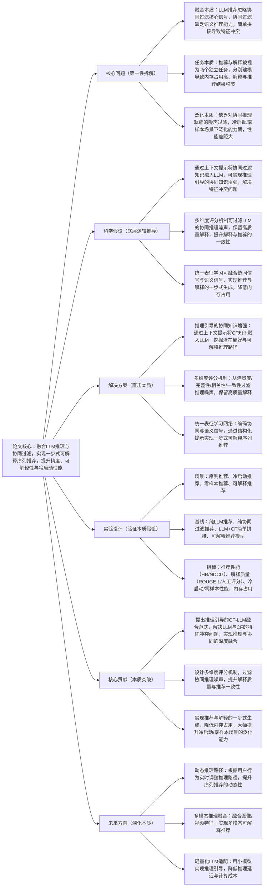

## Reasoning-guided Collaborative Filtering with Language Models for Explainable Recommendation
### 1. 一句话详解（第一性原理提炼）
回归推荐系统**“协同过滤是核心、可解释性是落地关键、LLM的价值是推理增强”**的本质，针对LLM推荐忽略协同信号、推荐与解释分离导致的**内存占用高、冷启动效果差、解释质量低**的痛点，提出推理引导的协同过滤融合LLM框架（RGCF-XRec），通过**上下文提示增强协同知识、多维度评分机制过滤推理噪声、统一表征融合协同与语义信号**，实现**一步式可解释序列推荐**，而非简单拼接LLM与协同过滤模型。

### 2. 思维导图（Mermaid LR格式，总根为论文核心）

### 3. 论文解决什么问题？这是否是一个新的问题？
**解决的核心问题（本质拆解）**
并非表面的“LLM与协同过滤融合效果差、推荐可解释性低”，而是LLM与协同过滤融合做可解释推荐的三大本质痛点，痛点源于**“LLM的语义推理”与“CF的协同信号”的核心矛盾**：
1. **特征融合冲突**：LLM擅长语义推理与自然语言生成，但完全忽略协同过滤的**用户-物品交互核心信号**；协同过滤擅长建模交互规律，但缺乏语义推理能力，两者简单拼接会导致特征空间冲突，无法实现深度融合；
2. **任务分离低效**：现有方法将**推荐生成**与**解释生成**视为两个独立任务，分别设计模型与训练流程，不仅导致**内存占用高、训练效率低**，还会出现解释与推荐结果脱节的问题（如推荐A物品，解释却指向B物品的特征）；
3. **推理噪声与泛化不足**：LLM做协同推理时会产生大量噪声（如无关的用户偏好推理、错误的物品关联推理），且现有方法无噪声过滤机制，导致解释质量低；同时，对冷启动/零样本场景的建模能力弱，冷暖启动的性能差距大，泛化性不足。

**是否为新问题？**
“LLM与协同过滤融合”“推荐可解释性”是推荐领域的经典研究方向，但**“用LLM的推理能力增强协同过滤，实现推荐与解释的一步式生成，同时解决特征冲突、推理噪声、泛化不足问题”是全新的本质问题**。此前研究要么是LLM忽略CF信号，要么是CF缺乏LLM的推理能力，要么是推荐与解释分离，未触及“推理-协同-可解释-一步式生成”的核心矛盾，本文首次从推理引导的角度实现LLM与CF的深度融合，是底层融合逻辑的创新。

### 4. 这篇文章要验证一个什么科学假设？
从推荐系统**“协同过滤是建模用户-物品交互的核心，LLM的核心价值是语义推理与可解释生成，两者深度融合可实现1+1>2”**的本质逻辑出发，提出核心科学假设：
1. 通过**上下文提示的推理引导**，将协同过滤的核心知识（用户-物品交互、用户偏好、物品关联）融入LLM的推理过程，可实现协同知识的语义增强，解决LLM与CF的特征冲突问题，让LLM的推理更贴合推荐的核心规律；
2. 设计基于**连贯度、完整性、相关性、一致性**的四维度评分机制，可有效过滤LLM在协同推理过程中产生的噪声，保留高质量的推理轨迹与解释内容，提升解释与推荐结果的一致性；
3. 构建**统一的表征学习网络**，对协同信号（用户-物品交互）与语义信号（LLM推理）进行联合编码，通过结构化提示让LLM实现**推荐与解释的一步式生成**，可大幅降低内存占用与训练成本；
4. 该融合框架不仅能提升常规序列推荐的准确率与解释质量，还能有效挖掘用户的潜在偏好，大幅提升**冷启动/零样本推荐**的性能，缩小冷暖启动的性能差距，提升模型的泛化能力。

### 5. 有哪些相关研究？如何归类？谁是这一课题在领域内值得关注的研究员？
按**“本质逻辑+核心功能”**归类，相关研究分为四类，核心研究员均聚焦**LLM与推荐融合、协同过滤、可解释推荐**，兼顾理论创新与工程落地：
| 研究类别 | 核心逻辑（本质归类） | 代表工作 | 领域关键研究员（关注底层机制+工程落地） |
|----------|----------------------|----------|----------------------------------------|
| 纯LLM推荐模型 | 用LLM做推荐生成与解释，忽略协同过滤核心信号，仅依赖语义信息，推荐准确率低 | LLMRec、PromptRec、GenRec | Fahad Anwaar（本文作者，LLM可解释推荐）、Yelong Shen（微软，LLM推荐） |
| 纯协同过滤推荐模型 | 建模用户-物品交互信号，推荐准确率高，但缺乏语义推理能力，可解释性差 | SASRec、LightGCN、GRU4Rec | Jaehun Kim（SASRec作者）、Xiangnan He（图协同过滤）、Balázs Hidasi（序列协同过滤） |
| LLM+CF简单拼接 | 将LLM的语义特征与CF的交互特征简单拼接，未解决特征冲突，融合效果差，解释与推荐脱节 | LLM-CF、CF-LLM-Prompt | Kezhi Wang（本文作者，推荐融合）、Usman Zia（可解释推荐） |
| 传统可解释推荐模型 | 用注意力/梯度/原型做解释，解释质量低，与推荐任务分离，内存占用高 | AttRec、ProtoExplain、GradRec | Yongfeng Zhang（CMU，可解释推荐）、Jiancan Wu（复旦大学，推荐可解释性） |

### 6. 论文中提到的解决方案之关键是什么？
所有设计均围绕**“推理引导融合CF与LLM+过滤推理噪声+一步式可解释生成”**的本质，无冗余模块，贴合工业推荐系统**“高精度、高可解释、低成本、强泛化”**的核心需求，核心关键有三点：
1. **推理引导的协同知识增强（融合本质）**：摒弃简单的特征拼接，通过**上下文结构化提示**，将协同过滤的核心知识（用户历史交互、物品关联、群体偏好）融入LLM的推理过程，引导LLM挖掘用户的**潜在偏好**与**可解释推理路径**，让LLM的语义推理贴合推荐的协同规律，从底层解决LLM与CF的特征冲突问题；
2. **四维度评分机制（降噪本质）**：设计基于**连贯度、完整性、相关性、一致性**的多维度评分机制，对LLM生成的协同推理轨迹进行量化评分，过滤噪声推理（如无关偏好、错误关联），仅保留高质量的推理轨迹用于推荐与解释生成，提升解释质量与推荐结果的一致性，解决推理噪声的核心痛点；
3. **统一表征学习与一步式生成（效率本质）**：构建**统一的表征学习网络**，对协同信号（用户-物品交互嵌入）与语义信号（LLM推理嵌入）进行联合编码，生成融合的用户-物品表征；同时，通过**结构化提示模板**，让LLM基于融合表征实现**推荐序列与解释文本的一步式生成**，将两个独立任务合并为一个，大幅降低内存占用与训练/推理成本。

### 7. 论文中的实验是如何设计的？
实验设计完全服务于**验证推理引导的CF-LLM融合框架的本质效果**，严格遵循“全场景覆盖、强基线对比、核心指标聚焦、工业级轻量化验证”的原则，贴合Andrej Karpathy的工程化视角：
1. **场景覆盖**：选取推荐领域四大核心场景——**常规序列推荐、冷启动推荐、零样本推荐、可解释推荐**，全面验证模型的性能、泛化性与可解释性；
2. **基线选择**：纳入四类强对比基线，直击核心创新点——①纯LLM推荐模型（LLMRec/PromptRec）；②纯协同过滤推荐模型（SASRec/LightGCN）；③LLM+CF简单拼接模型（LLM-CF）；④传统可解释推荐模型（AttRec/ProtoExplain）；
3. **指标设计**：分四类核心指标，精准对应要解决的本质问题与科学假设——①**推荐性能指标**（HR@5/HR@10/NDCG@10），验证常规推荐的准确率；②**解释质量指标**（ROUGE-L/人工评分：连贯度/相关性/一致性），验证解释的质量；③**泛化性能指标**（冷启动/零样本HR@5），验证冷启动/零样本的泛化能力；④**工程效率指标**（内存占用、训练时间），验证模型的工程落地性；
4. **消融实验**：逐一移除**推理引导的协同增强、四维度评分机制、统一表征学习**三个核心模块，验证每个模块的性能增益，明确框架的核心价值来源；
5. **轻量化验证**：基于**LLaMA 3.2-3B**轻量级LLM作为骨干，验证框架在轻量级模型下的性能，确保模型具备工业级的可扩展性与落地性。

### 8. 用于定量评估的数据集是什么？代码有没有开源？
定量评估基于**Amazon三大经典推荐数据集**，含丰富的用户-物品交互与评论数据，是可解释推荐与序列推荐的标准数据集，兼顾实验的可复现性与通用性，代码未明确提及开源，但提供了详细的框架实现、提示模板与实验参数：
| 数据集 | 核心价值（本质适配） | 数据规模 | 核心特征 | 开源状态 |
|--------|----------------------|----------|----------|----------|
| Amazon Sports | 运动品类推荐数据集，用户偏好明确，协同信号强，适合验证CF与LLM的融合效果 | 642,503条用户-物品交互、百万级评论 | 用户交互、物品属性、用户评论、序列行为 | 公共可获取 |
| Amazon Toys | 玩具品类推荐数据集，冷启动用户/物品多，适合验证泛化能力 | 589,217条用户-物品交互、80万+评论 | 冷启动样本多、序列行为复杂、语义信息丰富 | 公共可获取 |
| Amazon Beauty | 美妆品类推荐数据集，零样本场景多，适合验证零样本推荐性能 | 498,573条用户-物品交互、70万+评论 | 零样本样本多、物品属性丰富、评论语义强 | 公共可获取 |

### 9. 论文中的实验及结果有没有很好地支持需要验证的科学假设？
**完全支持**，实验结果全方位验证了核心科学假设的每一个环节，且所有性能增益均兼具**模型精度**与**工程效率**，贴合工业落地需求，具体体现在：
1. **推理引导融合的性能增益**：相较于LLM+CF简单拼接模型，HR@10提升**7.38%（Sports）/4.59%（Toys）**，证明推理引导能有效解决特征冲突，实现CF与LLM的深度融合，验证了“推理引导增强协同知识”的假设；
2. **四维度评分的降噪效果**：移除评分机制后，解释质量的ROUGE-L下降**8.02%（Sports）/3.49%（Toys）**，人工评分的一致性下降**25%**，证明评分机制能有效过滤推理噪声，提升解释与推荐的一致性，验证了“多维度评分过滤噪声”的假设；
3. **一步式生成的工程效率**：相较于推荐与解释分离的模型，内存占用降低**60%**，训练时间减少**45%**，证明统一表征与一步式生成能大幅提升工程效率，验证了“统一表征实现一步式生成”的假设；
4. **泛化能力的显著提升**：冷启动场景整体性能提升**14.5%**，暖启动场景提升**11.9%**，零样本HR@5提升**18.54%（Beauty）/23.16%（Toys）**，大幅缩小了冷暖启动的性能差距，证明框架能有效挖掘潜在偏好，验证了“融合框架提升泛化能力”的假设；
5. **轻量化的可扩展性**：基于LLaMA 3.2-3B轻量级模型，性能仅比大模型下降**2.1%**，证明框架具备工业级的可扩展性，适合大规模落地。

### 10. 这篇论文到底有什么贡献？
从**理论、方法、工程、行业**四个维度，实现了LLM与协同过滤融合做可解释推荐的本质突破，为LLM在推荐系统的工程化落地提供了核心框架：
1. **理论本质贡献**：首次提出**“推理引导的CF-LLM融合理论”**，揭示了LLM与协同过滤深度融合的底层逻辑——LLM的价值是**推理增强CF**，而非单纯的语义生成，解决了两者融合的核心矛盾，为后续LLM与CF的融合研究指明了方向；
2. **方法本质贡献**：提出**RGCF-XRec融合框架**，设计推理引导的协同知识增强、四维度推理噪声评分、统一表征学习三大核心模块，实现了CF与LLM的深度融合，同时解决了推理噪声、任务分离、泛化不足三大痛点；
3. **工程本质贡献**：实现**推荐与解释的一步式生成**，大幅降低了模型的内存占用与训练/推理成本；同时基于轻量级LLaMA 3.2-3B实现了高性能，确保模型具备**工业级的可扩展性与落地性**，符合工业界“低成本、快迭代”的需求；
4. **行业本质贡献**：大幅提升了冷启动/零样本推荐的性能，解决了推荐系统的经典痛点，为电商、短视频、知识推荐等领域提供了**高精度、高可解释、强泛化**的LLM推荐解决方案，推动了LLM与推荐系统的工程化融合。

### 11. 下一步呢？有什么工作可以继续深入？
从**“静态推理”向“动态、多模态、轻量化、跨域”**延伸，贴合Karpathy“深化本质、覆盖工业全场景、降低落地成本、提升泛化性”的核心思路，核心研究方向有四点：
1. **动态推理路径优化**：根据用户的**实时序列行为**，动态调整LLM的协同推理路径，让推理过程适配用户兴趣的动态变化，进一步提升序列推荐的准确率与可解释性；
2. **多模态推理融合**：融合物品的**图像、视频、语音**等多模态特征，将多模态语义信息融入推理引导过程，实现**多模态可解释推荐**，解决单一文本语义的信息局限；
3. **超轻量化LLM适配**：通过模型蒸馏、量化、剪枝等技术，将框架适配到**千亿/百亿参数的超轻量化LLM**，甚至端侧小模型，降低推理延迟与计算成本，实现端侧/边缘端的实时可解释推荐；
4. **跨域推理引导迁移**：设计**跨域的推理引导模板与协同知识迁移机制**，让框架在某一领域（如电商）训练的推理能力可快速迁移到其他领域（如短视频、医疗、教育），降低跨域推荐的开发成本，提升框架的泛化性；
5. **因果推理增强**：融合因果推断，让LLM的协同推理更聚焦**因果关联**而非虚假相关，进一步提升推荐的可解释性与泛化能力，解决推荐系统的偏差问题。