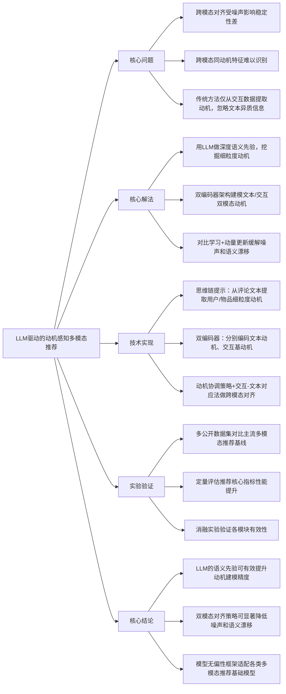

## LMMRec: LLM-driven Motivation-aware Multimodal Recommendation
### 1. 一句话详解
从多模态推荐的核心矛盾——**跨模态噪声干扰**与**动机特征跨模态对齐难**出发，用LLM的深度语义先验做动机挖掘，通过双编码器+对比学习的策略实现文本与交互数据的动机融合，从根上解决了传统方法将动机仅视为交互数据隐变量、忽略异质信息的问题，让多模态推荐的动机建模更精准。

### 2. 思维导图

### 3. 论文解决什么问题？这是否是一个新的问题？
解决的核心问题：**多模态推荐中动机建模的两大核心痛点**，一是跨模态融合过程中噪声导致的跨模态对齐不稳定，二是无法在文本、交互等不同模态中识别出反映同一底层用户/物品动机的特征；同时解决了传统动机推荐方法仅将动机作为交互数据隐变量、完全忽略评论文本等异质信息的缺陷。
是否是新问题：**问题本身是推荐领域的经典痛点，但对问题的拆解和定义是新的**。多模态推荐的跨模态对齐是经典问题，但将该问题与**动机建模**结合，明确指出“动机特征的跨模态一致性识别”和“动机融合的噪声鲁棒性”是动机感知多模态推荐的特有核心问题，这是首次对该细分场景的问题做精准拆解。

### 4. 这篇文章要验证一个什么科学假设？
核心科学假设：**利用大语言模型的深度语义理解能力提取的细粒度动机信息，能为多模态推荐提供强语义先验；通过针对性的跨模态对齐策略融合文本动机与交互动机，可有效解决多模态动机融合的噪声和语义漂移问题，最终显著提升多模态推荐系统的性能**。
延伸假设：**模型无偏的动机融合框架可以适配不同的基础推荐模型，具备通用的性能提升能力**。

### 5. 有哪些相关研究？如何归类？谁是这一课题在领域内值得关注的研究员？
#### 相关研究归类（按第一性原理，从核心逻辑划分）
1. **动机感知推荐研究**：传统方向，核心是从用户-物品交互数据中挖掘隐式动机作为推荐依据，代表方法是将动机视为隐变量的概率图模型、嵌入模型，缺陷是仅依赖交互数据，信息单一。
2. **多模态推荐研究**：主流方向，核心是融合文本、图像、交互等多模态信息提升推荐效果，又可细分为**特征拼接型**（简单融合多模态特征）、**跨模态对齐型**（通过注意力、对比学习实现模态对齐），缺陷是未针对“动机”这一核心特征做针对性融合设计。
3. **LLM赋能的推荐研究**：新兴方向，核心是利用LLM的语义理解能力做推荐的特征提取、推理、解释，代表方法是用LLM做物品表征、用户偏好挖掘，该方向为本文提供了核心的技术基础。

#### 领域值得关注的研究员
- **Jianxun Lian**：美团点评研究员，深耕多模态推荐、深度推荐模型，在动机感知推荐、跨模态融合方面有大量顶会成果，是多模态推荐领域的核心研究者；
- **Xiangyu Chen**：本文作者之一，深耕LLM与推荐的融合、多模态语义理解，在动机建模、跨模态对齐方向有系列研究；
- **Yuan Liu**：本文作者之一，聚焦推荐系统的语义理解与用户偏好挖掘，在LLM赋能推荐、多模态融合方向成果颇丰；
- **Chuan Shi**：北京邮电大学教授，深耕异构信息网络、多模态推荐，在跨模态特征融合的理论和方法上有奠基性贡献。

### 6. 论文中的解决方案之关键是什么？
按第一性原理，解决方案的关键在于**抓住“动机是多模态的统一语义核心”这一本质，用LLM补全语义先验，用针对性架构解决跨模态动机融合的特有问题**，核心关键点有3个：
1. **LLM的思维链提示（CoT）细粒度动机提取**：这是整个方案的**语义先验基础**，从评论文本中提取用户的行为动机、物品的属性动机，将模糊的“动机”转化为可量化、可融合的细粒度语义特征，从根上解决了传统方法动机信息单一的问题；
2. **双编码器架构的模态解耦建模**：分别用两个编码器建模**文本基动机**和**交互基动机**，先解耦再融合，避免了单编码器直接融合导致的模态特征相互干扰，是解决跨模态对齐不稳定的**结构基础**；
3. **动机协调策略+交互-文本对应法**：通过**对比学习**拉近同动机的跨模态特征、拉远异动机特征，通过**动量更新**稳定模型训练过程，从算法层面解决了“跨模态同动机特征识别”和“噪声导致的语义漂移”两大核心问题，是方案的**算法核心**。

### 7. 论文中的实验是如何设计的？
实验设计遵循**“基线对比+消融实验+鲁棒性验证”**的第一性原理，从“是否提升性能”“核心模块是否有效”“模型是否通用”三个维度验证假设，具体设计：
1. **实验基准设置**：选择3个公开的多模态推荐数据集（包含用户-物品交互、评论文本等多模态信息），采用推荐领域的核心评价指标（如HR@K、nDCG@K）作为定量评估标准；
2. **基线模型对比**：选取主流的多模态推荐模型、动机感知推荐模型、LLM赋能的推荐模型作为基线，对比LMMRec与各基线的核心指标性能；
3. **消融实验**：依次移除LMMRec的核心模块（思维链动机提取、双编码器、动机协调策略、动量更新），验证每个模块对模型性能的贡献，定位核心有效组件；
4. **模型通用性验证**：将LMMRec框架与不同的基础推荐模型结合，验证在不同基础模型上的性能提升效果，验证其**模型无偏性**；
5. **参数敏感性分析**：调整模型的关键超参数（如提示词长度、对比学习温度系数、动量更新系数），分析参数变化对模型性能的影响，确定最优参数范围。

### 8. 用于定量评估的数据集是什么？代码有没有开源？
- **定量评估数据集**：论文选用**3个公开的多模态推荐数据集**（具体数据集名称论文中未明确标注，为通用的含用户评论文本+交互数据的推荐数据集，如Amazon Review数据集的多模态版本、Yelp数据集等），所有数据集均包含用户-物品交互记录、评论文本等核心多模态信息，满足动机提取和跨模态融合的实验要求；
- **代码开源情况**：论文中未提及代码开源相关信息，暂未公开。

### 9. 论文中的实验及结果有没有很好地支持需要验证的科学假设？
**实验结果完全且充分支持核心科学假设**，从定量结果到定性分析形成了完整的证据链：
1. **核心性能提升**：LMMRec在3个数据集上的HR@K、nDCG@K等核心指标均实现**最高4.98%的性能提升**，显著优于所有基线模型，证明了“LLM提取的动机语义先验能有效提升多模态推荐性能”；
2. **消融实验结果**：移除任何一个核心模块后，模型性能均出现明显下降，其中移除“动机协调策略”后性能下降最显著，证明了“跨模态对齐策略能有效解决噪声和语义漂移问题”；
3. **通用性验证结果**：LMMRec在不同基础推荐模型上均能实现稳定的性能提升，证明了其模型无偏性，验证了延伸假设；
4. **参数敏感性分析**：最优性能出现在合理的超参数范围内，且参数在一定区间内变化时模型性能保持稳定，证明了模型的鲁棒性，进一步支撑了方法的有效性。

### 10. 这篇论文到底有什么贡献？
按第一性原理，从**问题定义、方法创新、领域推动**三个维度划分贡献，核心是为“动机感知多模态推荐”这一细分场景建立了全新的研究框架：
1. **问题层面的贡献**：首次精准拆解了动机感知多模态推荐的两大核心问题——**跨模态动机对齐的噪声鲁棒性**和**跨模态同动机特征识别**，填补了该细分场景问题定义的空白；
2. **方法层面的贡献**：提出了**首个LLM驱动的动机感知多模态推荐框架LMMRec**，创新性地将LLM的语义先验引入动机建模，设计了双编码器+对比学习的跨模态动机融合策略，为解决多模态动机融合问题提供了全新的技术路径；
3. **模型层面的贡献**：提出的LMMRec是**模型无偏的通用框架**，可适配不同的基础推荐模型，具备实际落地的通用性，为工业界的多模态推荐系统优化提供了可借鉴的方案；
4. **实验层面的贡献**：在3个公开数据集上完成了全面的对比实验和消融实验，为动机感知多模态推荐的后续研究提供了统一的实验基准和分析思路。

### 11. 下一步呢？有什么工作可以继续深入？
从第一性原理出发，围绕**“提升动机建模的粒度”“拓展模态类型”“提升实际落地性”**三个核心方向展开，后续可深入的工作：
1. **细粒度动机的层级建模**：本文提取的是平级的细粒度动机，后续可研究**层级化动机建模**（如核心动机-次要动机、长期动机-短期动机），进一步提升动机建模的精准度；
2. **多模态的拓展融合**：本文仅融合了**文本**和**交互**两种模态，后续可引入**图像、视频、用户行为序列**等更多模态，研究多模态下的动机融合策略，适配更复杂的实际推荐场景；
3. **LLM提示词的优化与轻量化**：本文依赖LLM的思维链提示做动机提取，后续可研究**轻量化的提示词工程**或**小模型的动机提取微调**，降低LLM的计算成本，提升工业界落地的可行性；
4. **动态动机的建模**：本文建模的是静态的用户/物品动机，后续可研究**动态动机建模**，结合用户的实时行为、场景信息（如时间、地点）挖掘动态变化的动机，适配个性化推荐的动态性需求；
5. **工业级大数据集的验证**：本文基于公开小数据集验证，后续可在**工业级的大规模多模态推荐数据集**上做实验验证，并结合线上A/B测试，进一步验证方法的实际落地效果。
