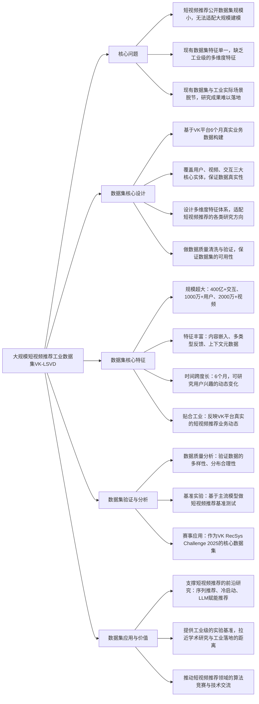

## VK-LSVD: A Large-Scale Industrial Dataset for Short-Video Recommendation
### 1. 一句话详解
从短视频推荐研究的核心矛盾——**公开数据集的规模和真实性远落后于工业实际场景**出发，基于VK平台的真实业务数据，构建并发布了目前最大的短视频推荐工业数据集VK-LSVD，从根上解决了短视频推荐研究缺乏大规模、高真实性、多特征基准数据集的问题，为短视频推荐的前沿研究提供了贴近工业的实验基础。

### 2. 思维导图

### 3. 论文解决什么问题？这是否是一个新的问题？
解决的核心问题：**短视频推荐研究领域的核心基础设施痛点**，一是现有公开数据集的**规模远小于工业实际场景**，无法支撑大规模的序列推荐、冷启动、LLM赋能推荐等前沿研究；二是现有数据集的**特征单一**，仅包含简单的用户-视频交互，缺乏工业级的内容嵌入、多类型反馈、上下文元数据等特征；三是现有数据集与**工业实际业务动态脱节**，导致学术研究成果难以在工业界落地。
是否是新问题：**问题是短视频推荐领域长期存在的核心痛点，并非新问题，但本文首次从工业级视角彻底解决了该问题**。短视频推荐缺乏大规模公开数据集是自该领域兴起以来就存在的问题，众多研究均受限于小数据集，而本文发布的VK-LSVD是**目前最大的短视频推荐工业公开数据集**，从规模、特征、真实性三个维度全面填补了该领域的数据集空白。

### 4. 这篇文章要验证一个什么科学假设？
作为数据集论文，核心科学假设并非算法类假设，而是**数据集的有效性假设**：**基于VK平台真实业务数据构建的大规模工业数据集VK-LSVD，具备高质量、高多样性、高真实性的特征，能作为短视频推荐领域的通用基准数据集，有效支撑序列推荐、冷启动、下一代推荐系统等前沿研究方向，同时能拉近学术研究与工业实际落地的距离**。
延伸假设：**大规模、多特征的工业数据集能推动短视频推荐领域的算法创新和技术落地**。

### 5. 有哪些相关研究？如何归类？谁是这一课题在领域内值得关注的研究员？
#### 相关研究归类（按第一性原理，从核心逻辑划分）
1. **推荐系统数据集构建研究**：基础方向，核心是为各类推荐场景构建公开基准数据集，可细分为**通用推荐数据集**（如MovieLens、Amazon Review）、**垂直领域推荐数据集**（如短视频、电商、社交），本文属于**短视频领域的工业级数据集**，是该方向的重要补充；
2. **短视频推荐算法研究**：主流方向，核心是研究短视频的序列推荐、冷启动、兴趣建模等算法，该方向是VK-LSVD的核心服务对象，现有研究因缺乏大规模数据集而存在局限性；
3. **工业级推荐系统研究**：新兴方向，核心是研究工业界的大规模推荐系统建模、工程落地，该方向对数据集的规模和真实性要求最高，VK-LSVD为该方向提供了关键的实验基础。

#### 领域值得关注的研究员
- **Aleksandr Poslavsky**：本文第一作者，VK公司的研究员，深耕工业级推荐系统、短视频推荐，在数据集构建、大规模推荐算法落地方面有丰富的工业经验；
- **Yuriy Dorn**：本文作者之一，VK公司的推荐系统负责人，聚焦工业级短视频推荐系统的设计与优化，在大规模数据集构建和算法竞赛组织方面成果颇丰；
- **Xiang Li**：微软亚洲研究院研究员，深耕推荐系统数据集、序列推荐，在构建工业级推荐数据集、推动学术与工业结合方面有大量成果；
- **Ruiming Tang**：阿里达摩院研究员，深耕大规模推荐系统、深度学习推荐算法，在工业级推荐数据集的构建、落地方面有里程碑式贡献（如阿里的公开推荐数据集）；
- **Jianfeng Gao**：微软研究院副院长，聚焦自然语言处理、推荐系统，在推动工业级数据集开源、拉近学术与工业距离方面有重要推动作用。

### 6. 论文中的解决方案之关键是什么？
作为数据集论文，解决方案的核心是**抓住“工业级数据集的核心价值是规模、真实性、特征丰富性”这一本质，基于真实工业业务数据，做标准化的数据集构建、清洗、特征设计**，核心关键点有4个：
1. **基于工业真实业务数据的全量采集**：这是数据集的**真实性基础**，基于VK平台6个月的**真实短视频业务数据**采集，覆盖平台的主流用户、视频和交互行为，保证数据集能真实反映工业级短视频推荐的业务动态，从根上解决了现有数据集与工业脱节的问题；
2. **超大规模的样本量设计**：这是数据集的**规模核心**，采集超**400亿次用户-视频交互、1000万+用户、2000万+视频**，是目前最大的短视频推荐公开数据集，能支撑大规模的序列推荐、冷启动、LLM赋能推荐等前沿研究，解决了现有数据集规模小的问题；
3. **多维度的工业级特征体系设计**：这是数据集的**价值核心**，除了基础的交互数据，还提供**内容嵌入、多类型反馈信号（点击、点赞、转发、观看时长）、上下文元数据（时间、设备、地域）**等工业级特征，满足短视频推荐各类研究方向的特征需求，解决了现有数据集特征单一的问题；
4. **严格的数据质量清洗与验证**：这是数据集的**可用性基础**，对原始工业数据做了去重、去噪声、异常值处理、数据分布均衡化等清洗操作，同时做了数据多样性、分布合理性的质量验证，保证数据集能直接作为学术研究的基准数据集。

### 7. 论文中的实验是如何设计的？
作为数据集论文，实验设计并非传统的算法对比，而是遵循**“数据质量分析+基准算法测试+赛事应用验证”**的第一性原理，从“数据集是否高质量”“数据集是否能支撑各类研究”“数据集是否有实际应用价值”三个维度验证假设，具体设计：
1. **数据质量分析实验**：从**数据规模、特征分布、用户/视频多样性、交互行为合理性**四个维度对VK-LSVD做全面的统计分析，验证数据集的高质量和高真实性；
2. **基准算法测试实验**：选取短视频推荐领域的**主流基准算法**（如SASRec、BERT4Rec、GRU4Rec等序列推荐模型，以及传统的CF、GNN推荐模型），在VK-LSVD上做全面的基准测试，给出各算法的核心指标（HR@K、nDCG@K、MRR）基线结果，验证数据集能有效支撑各类短视频推荐研究；
3. **赛事应用验证**：将VK-LSVD作为**VK RecSys Challenge 2025**（VK推荐系统算法竞赛）的核心数据集，通过赛事的实际应用验证数据集的可操作性和实际价值；
4. **细分场景测试**：在VK-LSVD上对**序列推荐、冷启动、用户兴趣漂移**等短视频推荐的核心细分场景做专项测试，验证数据集能支撑这些前沿研究方向。

### 8. 用于定量评估的数据集是什么？代码有没有开源？
- **本论文是数据集论文，核心是发布VK-LSVD数据集**，该数据集是论文的核心研究成果，用于短视频推荐领域的各类定量评估；
- **数据集与代码开源情况**：VK-LSVD作为**VK RecSys Challenge 2025**的核心数据集，已面向竞赛参与者开放，同时论文中说明将**面向学术界全面开源**；配套的基准算法测试代码、数据处理代码也将随数据集一同开源，为短视频推荐研究提供完整的实验工具链。

### 9. 论文中的实验及结果有没有很好地支持需要验证的科学假设？
**实验结果完全且充分地支持数据集的有效性假设和延伸假设**，从数据质量、基准测试、赛事应用三个维度形成了完整的验证链：
1. **数据质量分析结果**：VK-LSVD在规模、特征、多样性、分布合理性等方面均表现出极高的质量，用户/视频的分布符合工业实际场景，交互行为的规律与短视频平台的真实用户行为一致，证明了数据集的**高真实性和高质量**；
2. **基准算法测试结果**：所有主流短视频推荐算法均能在VK-LSVD上稳定运行，且指标结果呈现出合理的梯度差异（先进算法优于传统算法），证明了数据集能**有效支撑各类短视频推荐研究**，并能为后续研究提供统一的基准；
3. **赛事应用验证结果**：VK-LSVD已成功作为VK RecSys Challenge 2025的核心数据集，吸引了全球众多研究团队和工业界团队参与，证明了数据集的**实际应用价值和行业认可度**；
4. **细分场景测试结果**：VK-LSVD能有效支撑序列推荐、冷启动、用户兴趣漂移等前沿细分场景的研究，证明了数据集的**通用性和前瞻性**，验证了延伸假设。

### 10. 这篇论文到底有什么贡献？
按第一性原理，从**短视频推荐领域、推荐系统整体领域、学术与工业结合**三个维度划分贡献，核心是为短视频推荐研究提供了全新的工业级基础设施，推动了该领域的研究向工业实际落地靠拢：
1. **短视频推荐领域的里程碑贡献**：发布了**目前全球最大的短视频推荐工业公开数据集VK-LSVD**，从规模（400亿+交互）、特征（工业级多维度特征）、真实性（VK平台真实业务数据）三个维度全面填补了该领域的数据集空白，解决了短视频推荐研究长期受限于小数据集的核心痛点；
2. **推荐系统数据集领域的贡献**：构建了**工业级短视频推荐数据集的标准化设计框架**，包括数据采集、特征设计、质量清洗、基准测试的全流程规范，为后续其他垂直领域的工业级推荐数据集构建提供了可借鉴的模板；
3. **学术与工业结合的贡献**：VK-LSVD拉近了短视频推荐的**学术研究与工业落地的距离**，让学术研究能基于贴近工业实际的数据集开展，大幅提升了研究成果的工业可落地性，推动了学术研究与工业实践的深度融合；
4. **行业技术交流的贡献**：将VK-LSVD作为VK RecSys Challenge 2025的核心数据集，为全球的推荐系统研究者和工程师提供了统一的竞赛平台，推动了短视频推荐领域的算法创新和技术交流；
5. **前沿研究的支撑贡献**：VK-LSVD为短视频推荐的**前沿研究方向**（如大规模序列推荐、冷启动、LLM赋能的短视频推荐、下一代推荐系统）提供了关键的实验基础，为这些方向的算法创新奠定了数据基础。

### 11. 下一步呢？有什么工作可以继续深入？
从第一性原理出发，围绕**“丰富数据集特征”“拓展数据集场景”“构建动态数据集”“完善工具链”**四个核心方向展开，后续可深入的工作：
1. **数据集特征的持续丰富**：目前VK-LSVD包含了内容嵌入、交互、上下文等特征，后续可加入**视频的多模态特征**（如视觉特征、音频特征、文本标题/评论特征）、**用户的社交关系特征**，进一步提升数据集的丰富性，适配多模态短视频推荐、社交化短视频推荐等前沿研究；
2. **细分场景的数据集子库构建**：基于VK-LSVD构建**细分场景的子库**（如冷启动用户子库、冷启动视频子库、用户兴趣漂移子库、不同地域/年龄段用户子库），为短视频推荐的细分方向研究提供更精准的实验数据；
3. **动态时序数据集的构建**：目前VK-LSVD是6个月的静态数据集，后续可构建**实时更新的动态时序数据集**，捕捉短视频平台的实时业务动态和用户兴趣的快速变化，适配动态推荐、实时推荐等工业级研究方向；
4. **配套实验工具链的完善**：围绕VK-LSVD完善**开源工具链**，包括数据预处理工具、特征工程工具、基准算法库、指标评估工具，降低研究者的使用门槛，让更多研究者能快速基于VK-LSVD开展研究；
5. **跨平台的数据集融合与对比**：后续可与其他主流短视频平台（如抖音、TikTok、快手）合作，构建跨平台的短视频推荐数据集，开展跨平台的算法对比研究，挖掘不同平台的用户行为规律和推荐算法的适配性；
6. **数据集的轻量化版本发布**：针对小型实验室、学生研究者的计算资源限制，发布VK-LSVD的**轻量化版本**（如10%、20%规模的子集），让不同资源条件的研究者都能基于该数据集开展研究，进一步推动短视频推荐领域的普及和创新。