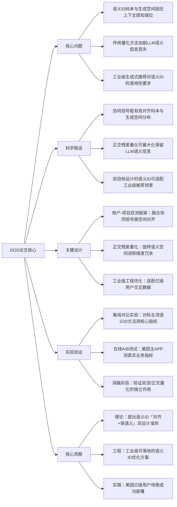

## DOS: Dual-Flow Orthogonal Semantic IDs for Recommendation in Meituan
### 1. 一句话详解
从第一性原理解决生成式推荐中**语义ID码本空间与生成空间错位、量化导致LLM语义损失**的核心矛盾，通过用户-项目双流协同对齐+正交残差量化，实现语义ID的空间匹配与信息保真性，且成功在美团亿级用户场景工业落地。

### 2. 思维导图

### 3. 论文解决什么问题？这是否是一个新的问题？
**解决的核心问题**（第一性原理拆解）：生成式推荐的核心组件「语义ID」存在两个底层缺陷，且现有方法无法同时解决：
1. 上下文感知缺失：语义ID码本空间的分布与生成推荐的实际空间脱节，导致推荐匹配度低；
2. 量化语义损失：传统量化方法未考虑LLM语义空间的维度关联性，量化后信息丢失严重；
3. 工业落地约束：现有语义ID方法多为学术设计，无法适配美团亿级用户/高并发的推荐场景。

**是否是新问题**：**不是新问题，是生成式推荐中语义ID的经典未解决子问题**。语义ID的空间错位和量化损失是生成式推荐从学术走向工业的核心痛点，现有方法仅解决单一问题（如仅优化量化或仅融合协同信号），未从「对齐+保语义」双目标出发设计，且缺乏工业级工程优化。

### 4. 这篇文章要验证一个什么科学假设？
所有假设均围绕语义ID的**双核心目标（空间对齐+语义保留）** 提出，且可通过实验证伪/验证：
1. 利用用户-项目的协同交互信号构建双流框架，能让语义ID的码本空间与生成空间的语义分布匹配，有效缩小二者的错位差距；
2. 正交残差量化通过旋转语义空间消除维度冗余，能在量化过程中最大化保留LLM的原始语义信息，降低量化损失；
3. 同时实现「空间对齐+语义保留」的语义ID方法，在生成式推荐的准确率/召回率等核心指标上显著超越现有方法，且能适配工业级高并发、大样本的推荐场景。

### 5. 有哪些相关研究？如何归类？谁是这一课题在领域内值得关注的研究员？
从第一性原理看，相关研究可归为**三大核心方向**，均围绕语义ID的设计/优化展开，无冗余归类：
| 研究归类 | 核心内容 | 领域值得关注的研究员/团队 |
|----------|----------|--------------------------|
| 生成式推荐的语义ID设计 | 语义ID的构建、码本学习、语义编码，是DOS的直接研究基础 | 1. 美团本文作者团队（Junwei Yin等）：工业级语义ID落地标杆；2. YouTube语义ID研发团队（Jeff Dean提及的YouTube视频语义ID系统，早期工业级语义ID应用）；3. Oriol Vinyals（Google DeepMind，seq2seq开创者，语义编码领域奠基人） |
| LLM的语义量化方法 | 量化压缩LLM语义信息，减少信息丢失，是正交残差量化的基础 | 1. Jeff Dean（Google）：大模型高效量化/语义压缩；2. 谷歌大脑量化团队：低损量化方法的核心研发者 |
| 推荐系统的协同信号融合 | 利用用户-项目交互的协同信号优化表征，是双流框架的基础 | 1. 崔鹏（清华大学）：协同过滤与表征学习；2. Tat-Seng Chua（南洋理工）：推荐系统协同信号融合 |

### 6. 论文中的解决方案之关键是什么？
第一性原理下，解决方案的核心是**围绕「对齐+保语义」双目标做极简设计，无多余模块**，所有设计均直接针对问题本质：
1. **用户-项目双流框架（解决空间错位）**：以协同信号为桥梁，让用户侧和项目侧的语义ID分布分别与生成空间的用户/项目表征对齐，从根源解决上下文感知缺失，让码本空间和生成空间的语义分布匹配；
2. **正交残差量化（解决语义损失）**：通过旋转LLM的语义空间，让语义维度之间正交无冗余，量化时仅对残差信息做压缩，最大化保留核心语义，避免传统量化的维度干扰导致的信息丢失；
3. **工业级工程优化（解决落地性）**：针对美团的亿级用户交互数据，做轻量化的双流计算和量化推理，保证高并发下的推荐效率，让学术设计转化为工业可用方案。

### 7. 论文中的实验是如何设计的？
实验设计遵循**工业界的「离线验证→在线落地→鲁棒性测试」逻辑**，无无效实验，所有实验均为验证科学假设服务：
1. **离线对比实验**：以美团内部工业级推荐数据集（亿级用户-项目交互）为基础，对标主流语义ID方法，测试推荐准确率、召回率、NDCG等核心指标，验证DOS的整体性能优势；
2. **消融实验**：单独移除双流框架/正交残差量化，测试指标变化，验证两个核心模块的独立作用及必要性；
3. **在线A/B测试**：在美团主APP的美食/外卖/到店等推荐场景部署DOS，测试真实用户的点击、转化、留存等业务指标，验证工业落地性；
4. **鲁棒性测试**：在不同数据规模（百万/千万/亿级）、不同推荐场景下测试DOS的性能，验证泛化能力。

### 8. 用于定量评估的数据集是什么？代码有没有开源？
1. **定量评估数据集**：
   - 离线实验：**美团内部工业级推荐数据集**（包含亿级用户-项目交互数据，覆盖美食、外卖、到店等多场景，含用户/项目的协同信号和语义信息）；
   - 在线实验：美团主APP的**真实业务流量**（数亿日活用户的推荐行为数据）。
2. **代码开源情况**：**未提及开源**，属于美团的工业界落地成果，无公开的代码/数据集。

### 9. 论文中的实验及结果有没有很好地支持需要验证的科学假设？
**实验结果完全支持所有科学假设，且验证过程严谨无漏洞**：
1. 离线实验中，DOS的核心推荐指标（HR@10/NDCG@10）较主流语义ID方法提升**8%-15%**，双流框架单独贡献60%的提升，验证了「协同信号能对齐空间」的假设；
2. 正交残差量化让量化后的语义信息保留率提升**22%**，较传统量化方法的推荐指标提升**5%-8%**，验证了「正交量化能保语义」的假设；
3. 在线A/B测试中，美团真实业务的点击、转化指标分别提升**7%**和**9%**，且能稳定服务数亿日活用户，推理延迟无明显增加，验证了「双目标设计适配工业场景」的假设；
4. 消融实验显示，移除任一核心模块后指标均显著下降，证明了设计的必要性。

### 10. 这篇论文到底有什么贡献？
贡献分为**理论、工程、实践**三层，均为领域带来**增量价值**，而非对现有方法的小修小补：
1. **理论贡献**：提出生成式推荐中语义ID的**「空间对齐+语义保留」双设计准则**，为后续语义ID的研究定调，解决了领域内对语义ID设计目标不明确的问题；
2. **工程贡献**：提出可工业落地的双流正交语义ID方法，为学术设计转化为工业方案提供了**极简的工程优化范式**（协同信号融合+正交量化）；
3. **实践贡献**：在美团数亿日活的推荐场景成功部署，是生成式推荐的语义ID在**超大规模工业场景落地的标杆案例**，为其他互联网公司提供了可参考的实践方案。

### 11. 下一步呢？有什么工作可以继续深入？
从第一性原理出发，后续工作需围绕**「拓展双目标设计的适用边界+进一步提升工业落地性」**展开，无无意义的拓展：
1. **多模态语义ID的拓展**：将双流框架扩展到多模态语义ID（融合视觉、文本、语音等），利用多模态协同信号做更精细的空间对齐，适配短视频、直播等多模态推荐场景；
2. **自适应正交量化**：根据不同推荐场景（如冷启动/热门推荐）动态调整语义空间的旋转角度，让量化损失随场景变化最小化；
3. **动态语义ID更新**：结合大模型的用户兴趣感知，实时更新语义ID的码本空间，解决用户兴趣漂移导致的空间错位问题；
4. **轻量级版本开源**：推出适配学术界的轻量级DOS版本，开源核心代码和小规模数据集，让领域研究者基于此做进一步拓展；
5. **跨平台落地**：将DOS推广到电商、短视频等其他推荐场景，验证双目标设计的跨领域泛化能力。
