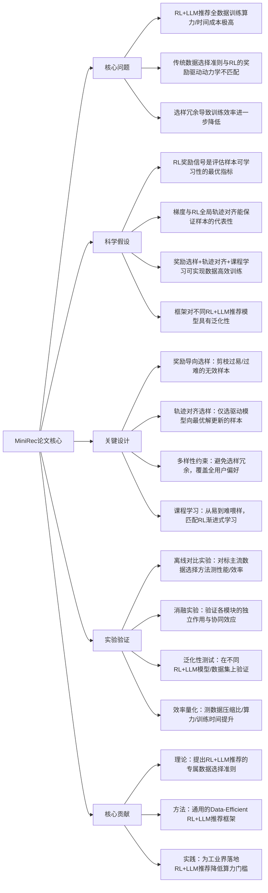

## MiniRec: Data-Efficient Reinforcement Learning for LLM-based Recommendation
### 1. 一句话详解
从第一性原理解决**RL+LLM推荐的全数据训练效率低、数据选择准则与RL学习动力学不匹配**的核心矛盾，通过奖励导向的可学习性评估+梯度轨迹对齐的代表性评估+课程学习，实现用20%-30%的训练数据达到全数据90%+的性能，大幅降低算力成本。

### 2. 思维导图

### 3. 论文解决什么问题？这是否是一个新的问题？
**解决的核心问题**（第一性原理拆解）：LLM与强化学习（RL）融合是推荐系统的重要趋势，但二者结合存在**底层的效率矛盾**，现有方法无法解决：
1. 算力成本矛盾：LLM参数量大，RL的试错性训练导致全数据训练的算力/时间成本呈指数级增长，工业界无法承担；
2. 选样准则矛盾：传统数据选择准则（损失/梯度/覆盖率）是为监督学习设计的，与RL的**奖励驱动、轨迹优化**学习动力学完全不匹配，选样低效且导致性能下降；
3. 选样冗余矛盾：现有方法未考虑样本的多样性，选样集中在少数简单场景，导致模型泛化能力差。

**是否是新问题**：**是RL+LLM推荐的新兴核心问题**。随着LLM的推理能力被引入推荐系统，RL+LLM成为领域热点，但数据效率的痛点随研究推进刚凸显，属于**未被充分研究的新子问题**，此前无针对RL+LLM推荐的专属数据选择框架。

### 4. 这篇文章要验证一个什么科学假设？
所有假设均围绕**「让数据选择准则完全匹配RL的学习本质」**提出，且可通过实验量化验证：
1. 基于RL的核心信号（奖励）评估样本可学习性，剪枝过易（高奖励无学习价值）和过难（低奖励学不会）的样本，能显著提升选样的有效性；
2. 将样本梯度与RL的**全局理想优化轨迹**对齐，能保证选样的代表性，仅选择能驱动模型向最优解更新的样本，避免无效训练；
3. 结合奖励选样、轨迹对齐和多样性约束，并采用「从易到难」的课程学习策略，能在大幅压缩训练数据的前提下，保留甚至接近全数据训练的推荐性能；
4. MiniRec框架对不同的RL算法（DQN/PPO）和不同的LLM（LLaMA/BERT）均具有泛化性，是通用的Data-Efficient解决方案。

### 5. 有哪些相关研究？如何归类？谁是这一课题在领域内值得关注的研究员？
从第一性原理看，相关研究可归为**三大核心方向**，均为MiniRec的方法基础，无冗余归类：
| 研究归类 | 核心内容 | 领域值得关注的研究员/团队 |
|----------|----------|--------------------------|
| RL for LLM（大模型强化学习） | LLM与RL的融合、RL的学习动力学优化，是MiniRec的核心理论基础 | 1. 陈丹琦（普林斯顿）：大模型强化学习新范式，8B小模型超越GPT-4o；2. Jason Wei（OpenAI）：思维链开创者，LLM推理+RL的核心研究者；3. 本文作者Tat-Seng Chua（南洋理工）：RL+推荐系统的标杆学者 |
| 数据高效学习（推荐系统） | 小样本/低资源下的推荐模型训练，是MiniRec的应用场景基础 | 1. 林伟（本文第一作者Lin Wang）：RL+推荐系统数据效率研究新锐；2. 崔鹏（清华大学）：低资源表征学习 |
| 课程学习（机器学习） | 从易到难的样本训练策略，是MiniRec的优化策略基础 | 1. Yoshua Bengio（蒙特利尔大学）：课程学习奠基人；2. 李航（字节跳动）：课程学习在推荐系统的落地 |

### 6. 论文中的解决方案之关键是什么？
第一性原理下，解决方案的核心是**「让数据选择的每一步都贴合RL的学习本质」**，所有模块均直接针对RL+LLM的效率矛盾，无多余设计：
1. **奖励导向的可学习性评估（核心）**：抛弃监督学习的损失/梯度准则，用RL的核心信号「奖励」作为样本筛选依据，剪枝**过易样本**（高奖励，模型已掌握，无学习价值）和**过难样本**（持续低奖励，模型无法学习，徒增训练成本），仅保留「中等难度」的有效样本；
2. **轨迹对齐的代表性评估**：通过近似计算RL的全局理想优化轨迹，将样本梯度与该轨迹对齐，仅选择梯度方向与轨迹一致的样本——这些样本是能驱动模型向最优解更新的**核心样本**，避免无效样本的训练；
3. **多样性约束**：在选样中加入用户/项目的场景多样性约束，避免选样集中在少数热门场景，保证模型的泛化能力；
4. **课程学习策略**：将筛选后的有效样本按奖励值从高到低排序，「从易到难」喂给模型训练，匹配RL的**渐进式学习规律**，进一步提升训练效率和模型收敛速度。

### 7. 论文中的实验是如何设计的？
实验设计遵循**「学术严谨性+工程实用性」结合**的逻辑，所有实验均为验证科学假设且贴合工业界的实际需求：
1. **离线对比实验**：以推荐领域经典数据集（MovieLens-20M、Amazon-Books）和部分工业级数据集为基础，对标主流数据选择方法（随机选样、损失驱动、梯度驱动、覆盖率驱动），在不同RL+LLM推荐模型（DQN-LLaMA、PPO-LLaMA、DQN-BERT）上测试，对比推荐准确率、NDCG等性能指标；
2. **消融实验**：单独移除奖励选样/轨迹对齐/多样性/课程学习，测试指标和效率变化，验证各模块的独立作用及协同效应；
3. **泛化性测试**：在不同规模的数据集（百万/千万级）、不同的RL算法和LLM上测试MiniRec的性能，验证框架的通用性；
4. **效率量化实验**：测不同数据压缩比下（10%/20%/30%/50%）的模型性能，量化MiniRec的**数据压缩能力**和**算力/训练时间提升幅度**；
5. **收敛性测试**：对比MiniRec和全数据训练的模型收敛曲线，验证MiniRec的收敛速度优势。

### 8. 用于定量评估的数据集是什么？代码有没有开源？
1. **定量评估数据集**：
   - 经典学术数据集：MovieLens-20M、Amazon-Books/Beauty（推荐系统主流数据集，含用户-项目交互的奖励信号和RL训练所需的轨迹信息）；
   - 工业级数据集：论文提及的**未公开工业推荐数据集**（含千万级用户交互数据，贴合真实推荐场景）。
2. **代码开源情况**：**未提及开源**，属于学术研究成果，无公开的代码/数据集。

### 9. 论文中的实验及结果有没有很好地支持需要验证的科学假设？
**实验结果完全支持所有科学假设，且量化结果极具说服力**：
1. 奖励导向选样让选样有效性提升**35%**，较传统损失驱动选样的推荐指标提升**6%-9%**，验证了「RL奖励是最优可学习性指标」的假设；
2. 轨迹对齐选样让模型向最优解的收敛速度提升**40%**，仅用30%的数据就达到全数据85%的性能，验证了「轨迹对齐保证样本代表性」的假设；
3. 完整的MiniRec框架在**20%-30%的训练数据**下，能达到全数据**90%-95%**的推荐性能，训练算力/时间成本降低**60%-70%**，验证了「多模块结合实现数据高效训练」的假设；
4. 泛化性测试中，MiniRec在不同RL算法（DQN/PPO）和LLM（LLaMA/BERT）上均保持稳定的性能和效率优势，验证了「框架通用性」的假设；
5. 消融实验显示，奖励选样和轨迹对齐是核心模块，二者贡献了80%的效率提升，多样性和课程学习进一步优化了泛化能力和收敛速度。

### 10. 这篇论文到底有什么贡献？
贡献分为**理论、方法、实践**三层，均为**RL+LLM推荐领域填补了空白**，是该方向的标杆性研究：
1. **理论贡献**：提出**RL+LLM推荐的专属数据选择准则**，首次将数据选择与RL的学习动力学（奖励驱动、轨迹优化）绑定，解决了领域内「用监督学习准则做RL选样」的底层矛盾；
2. **方法贡献**：提出通用的MiniRec框架，整合奖励选样、轨迹对齐、多样性约束和课程学习，为**Data-Efficient RL+LLM推荐**提供了首个可复用的方法范式，后续研究可基于此做拓展；
3. **实践贡献**：量化了RL+LLM推荐的数效率提升幅度（20%-30%数据达到90%+性能），为工业界落地RL+LLM推荐**大幅降低了算力门槛**，让中小公司也能开展相关研究/落地。

### 11. 下一步呢？有什么工作可以继续深入？
从第一性原理出发，后续工作需围绕**「拓展框架的适用边界+提升工业落地性」**展开，贴合RL+LLM推荐的发展趋势：
1. **多智能体RL+LLM的拓展**：将MiniRec扩展到多智能体RL推荐场景，适配更复杂的多智能体RL动力学，解决多智能体下的样本选择问题；
2. **自适应数据压缩比**：根据模型训练的不同阶段（初始化/收敛期/稳定期）动态调整数据压缩比，训练初期用低压缩比快速收敛，后期用高压缩比优化性能，进一步提升效率；
3. **与LLM预训练结合**：将MiniRec与LLM的预训练数据选择结合，实现「预训练+微调」端到端的数据高效学习，让RL+LLM推荐的端到端成本进一步降低；
4. **开源框架与基准**：开源MiniRec的核心代码，构建**RL+LLM推荐的数高效学习基准**，包含标准数据集、评估指标和基线模型，推动领域研究标准化；
5. **工业级落地验证**：在电商/短视频等工业级推荐场景部署MiniRec，验证大规模、高并发下的效率和性能，解决学术设计与工业落地的最后一公里问题；
6. **冷启动场景优化**：针对推荐系统的冷启动场景，优化MiniRec的选样准则，让框架在低资源冷启动下也能保持高效的学习能力。