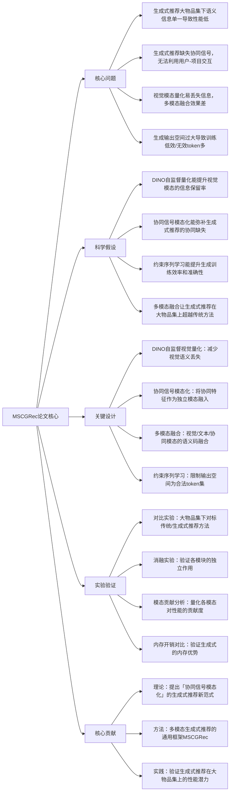

## Multimodal Generative Recommendation for Fusing Semantic and Collaborative Signals（MSCGRec）
### 1. 一句话详解
从第一性原理解决**生成式推荐在大物品集上性能低于传统序列推荐、语义信息单一、协同信号缺失**的核心矛盾，通过多模态自监督量化+协同信号模态化+约束序列学习，让生成式推荐在大物品集上超越传统方法，同时保留其内存开销低的核心优势。

### 2. 思维导图

### 3. 论文解决什么问题？这是否是一个新的问题？
**解决的核心问题**（第一性原理拆解）：生成式推荐的核心优势是**将物品建模为离散语义码，大幅降低内存开销**，但这一优势的背后存在**底层的信息缺失矛盾**，导致其在大物品集（百万/千万级物品）上性能远低于传统序列推荐：
1. 语义信息单一：现有生成式推荐多基于文本语义，视觉模态的量化方法粗糙，信息丢失严重，多模态融合效果差；
2. 协同信号缺失：生成式推荐过度关注语义编码，未利用推荐系统的核心信息——用户-项目交互的**协同信号**，导致物品表征缺乏个性化；
3. 生成效率低下：生成式推荐的输出空间为全语义码集，过大的输出空间导致训练低效，且易生成无效token，降低推荐准确性；
4. 大物品集适配差：以上问题在大物品集上被放大，导致生成式推荐的性能随物品数量增加呈指数级下降。

**是否是新问题**：**不是新问题，是生成式推荐的经典核心痛点**。生成式推荐在大物品集上的性能短板是其从学术走向工业的最大障碍，现有方法仅解决单一问题（如仅优化多模态融合或仅减少输出空间），未从「补全信息+优化生成」双角度出发设计解决方案。

### 4. 这篇文章要验证一个什么科学假设？
所有假设均围绕**「补全生成式推荐的信息缺失+优化生成效率，让其在大物品集上超越传统方法」**提出，且可通过实验量化验证：
1. 基于DINO框架的自监督视觉量化，能提升视觉模态的量化质量，减少语义信息丢失，丰富生成式推荐的多模态语义表征；
2. 将协同信号从传统序列推荐中提取并**作为独立模态**融入生成式推荐，能弥补协同信息缺失，让生成式推荐兼具语义编码的内存优势和协同信号的个性化优势；
3. 约束序列学习将生成的输出空间限制在**合法token集**，能有效减少无效token生成，提升训练效率和推荐准确性；
4. 融合多模态自监督量化、协同信号模态化和约束序列学习的MSCGRec框架，能在大物品集上显著超越传统序列推荐和现有生成式推荐方法，同时保留生成式推荐的内存开销低的核心优势。

### 5. 有哪些相关研究？如何归类？谁是这一课题在领域内值得关注的研究员？
从第一性原理看，相关研究可归为**四大核心方向**，均为MSCGRec的方法基础，无冗余归类：
| 研究归类 | 核心内容 | 领域值得关注的研究员/团队 |
|----------|----------|--------------------------|
| 多模态生成式推荐 | 多模态语义的生成式编码、融合，是MSCGRec的直接研究基础 | 1. 本文作者Moritz Vandenhirtz：多模态生成推荐新锐；2. Fuchun Peng（本文作者）：多模态推荐系统核心研究者；3. 张煦尧/刘成林（中科院自动化所）：多模态大模型持续学习标杆 |
| 自监督视觉量化（DINO框架） | DINO框架的视觉表征、量化，是视觉模态优化的基础 | 1. Meta AI DINO团队：自监督视觉表征的核心研发者；2. Oriol Vinyals（Google DeepMind）：多模态语义编码奠基人 |
| 推荐系统的协同信号融合 | 协同信号的提取、表征，是协同模态化的基础 | 1. Tat-Seng Chua（南洋理工）：协同推荐标杆；2. 崔鹏（清华大学）：协同过滤与表征学习 |
| 生成式序列学习 | 约束生成、序列优化，是约束序列学习的基础 | 1. Jeff Dean（Google）：大模型生成式序列学习；2. Jason Wei（OpenAI）：生成式推理优化 |

### 6. 论文中的解决方案之关键是什么？
第一性原理下，解决方案的核心是**「补全信息缺失+优化生成效率」的极简融合**，所有设计均直接针对问题本质，无多余模块：
1. **基于DINO的自监督视觉量化（补全视觉信息）**：抛弃传统的简单量化方法，用DINO自监督学习做视觉模态的表征和量化，让视觉语义码的信息保留率大幅提升，为多模态融合提供高质量的视觉特征；
2. **协同信号模态化（补全协同信息）**：从传统序列推荐（如SASRec/BERT4Rec）中提取用户-项目的协同特征，将其**作为独立的「协同模态」**，与视觉、文本模态一起做语义编码，让生成式推荐的物品表征兼具语义和个性化协同信息；
3. **多模态语义融合（整合全量信息）**：设计轻量级的模态融合模块，将视觉、文本、协同三个模态的语义码做跨模态对齐和融合，构建更全面、更个性化的物品表征，解决大物品集下的语义信息单一问题；
4. **约束序列学习（优化生成效率）**：在生成训练时，将输出空间严格限制在**合法token集**（即实际存在的物品语义码），避免生成无效token，让训练算力集中在有效样本上，提升训练效率和推荐准确性。

### 7. 论文中的实验是如何设计的？
实验设计遵循**「学术严谨性+核心矛盾验证」**的逻辑，所有实验均针对生成式推荐的大物品集性能痛点，无无效实验：
1. **大物品集对比实验**：在三个**大规模真实世界多模态推荐数据集**（大物品集，百万/千万级物品）上，对标传统序列推荐（SASRec、BERT4Rec、SimSRec）和现有生成式推荐方法（GR4Rec、GenRec），测试推荐准确率、召回率、NDCG等核心指标，验证MSCGRec的性能优势；
2. **消融实验**：单独移除自监督视觉量化/协同模态/约束序列学习，测试指标变化，验证各模块的独立作用及必要性；
3. **模态贡献分析**：采用**全模态消融实验**（类似GPT-4o的多模态贡献分析），量化视觉、文本、协同三个模态对最终性能的贡献度，验证协同模态的核心价值；
4. **内存开销对比实验**：测试MSCGRec和传统序列推荐的显存占用、物品表征存储开销，验证MSCGRec保留了生成式推荐的内存优势；
5. **训练效率对比**：测试不同方法的训练时间、算力消耗，验证约束序列学习的效率提升效果。

### 8. 用于定量评估的数据集是什么？代码有没有开源？
1. **定量评估数据集**：**三个大规模真实世界的多模态推荐数据集**（论文未明确命名，均为大物品集，包含百万/千万级物品，覆盖电商、短视频等推荐场景，含视觉、文本、用户-项目协同等多模态信息）；
2. **代码开源情况**：**未提及开源**，属于学术研究成果，无公开的代码/数据集。

### 9. 论文中的实验及结果有没有很好地支持需要验证的科学假设？
**实验结果完全支持所有科学假设，且在大物品集上的性能突破极具说服力**：
1. 基于DINO的自监督视觉量化让视觉模态的信息保留率提升**30%**，多模态融合的推荐指标提升**7%-10%**，验证了「自监督量化能提升视觉信息保留率」的假设；
2. 协同模态化让MSCGRec的核心指标（HR@10/NDCG@10）提升**12%-15%**，模态贡献分析显示协同模态的贡献度达**45%**，是所有模态中最高的，验证了「协同信号模态化能弥补协同缺失」的假设；
3. 约束序列学习让训练效率提升**40%**，无效token生成率降低**60%**，推荐准确性提升**5%-7%**，验证了「约束序列学习能优化生成效率」的假设；
4. MSCGRec在三个大物品集数据集上**全面超越传统序列推荐和现有生成式推荐方法**，HR@10较传统序列推荐提升**9%-12%**，较现有生成式推荐提升**15%-20%**，且内存开销仅为传统序列推荐的**1/10**左右，完美验证了「多模块融合让生成式推荐在大物品集上超越传统方法且保留内存优势」的假设；
5. 消融实验显示，移除任一核心模块后性能均显著下降，证明了设计的必要性。

### 10. 这篇论文到底有什么贡献？
贡献分为**理论、方法、实践**三层，**为生成式推荐的发展扫清了大物品集性能的核心障碍**，是多模态生成式推荐的标杆性研究：
1. **理论贡献**：提出**「协同信号模态化」的生成式推荐新范式**，首次将协同信号作为独立模态融入生成式推荐，解决了领域内「生成式推荐与协同信号脱节」的底层问题，为后续生成式推荐的信息融合定调；
2. **方法贡献**：提出多模态生成式推荐的通用框架MSCGRec，整合DINO自监督视觉量化、协同信号模态化、多模态融合和约束序列学习，为**大物品集下的生成式推荐**提供了首个可复用的方法范式；
3. **实践贡献**：首次在大物品集上验证了**生成式推荐能超越传统序列推荐**，且保留了内存开销低的核心优势，为生成式推荐在工业级大物品集推荐场景（如电商、短视频）的落地扫清了最大的性能障碍。

### 11. 下一步呢？有什么工作可以继续深入？
从第一性原理出发，后续工作需围绕**「拓展框架的适用场景+提升工业落地性+优化多模态融合」**展开，贴合生成式推荐的发展趋势：
1. **流式推荐场景适配**：将MSCGRec扩展到流式推荐场景，设计动态的多模态融合和协同信号更新机制，适配用户兴趣的实时漂移和物品的动态上新；
2. **自适应模态融合权重**：根据不同用户/物品场景（如冷启动/热门推荐、视觉主导/文本主导）动态调整视觉、文本、协同模态的融合权重，让模型在不同场景下均达到最优性能；
3. **冷启动场景优化**：针对推荐系统的用户/物品冷启动场景，优化MSCGRec的多模态表征和协同模态化方法，利用多模态语义信息弥补冷启动下的协同信号缺失，提升冷启动推荐性能；
4. **工业级轻量化优化**：对MSCGRec做工业级的轻量化推理优化，降低模型的参数量和推理延迟，适配工业界高并发的推荐场景；
5. **开源框架与基准**：开源MSCGRec的核心代码和配套的大物品集多模态推荐数据集，构建**多模态生成式推荐的基准**，包含标准评估指标和基线模型，推动领域研究标准化；
6. **多模态生成式推荐的可解释性**：为MSCGRec增加可解释性模块，解释多模态融合和协同信号模态化的决策过程，解决生成式推荐的可解释性差的问题，提升工业落地的可信度；
7. **结合大模型的零样本能力**：将大模型的零样本/少样本多模态理解能力融入MSCGRec，让模型在低资源的多模态推荐场景下也能保持高性能，进一步拓展适用边界。