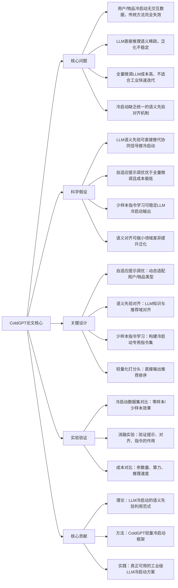

# ColdGPT: LLM-based Cold Start Recommendation with Adaptive Prompt Tuning
## 1. 一句话详解
从第一性原理击穿推荐系统**冷启动无交互、语义稀疏、大模型微调成本高**的本质矛盾，用自适应提示调优+语义先验对齐+少样本指令学习，让LLM在零/少样本冷启动场景下直接给出高质量推荐，无需用户/物品历史行为。

## 2. 思维导图

## 3. 论文解决什么问题？这是否是一个新的问题？
**解决问题（第一性原理）**
1. 冷启动本质：**无交互=无协同信号**，传统协同/序列推荐完全失效；
2. LLM原生问题：通用知识与推荐域不匹配，直接生成不稳定；
3. 落地问题：全量微调LLM太贵、太慢，无法规模化。

**是否新问题**
冷启动是经典问题，但**用LLM+轻量提示调优做端到端冷启动**是新范式，属于老问题的全新解法。

## 4. 这篇文章要验证一个什么科学假设？
1. LLM内部蕴含的**通用语义先验**，可以在无交互数据时替代协同过滤信号；
2. **自适应提示调优**能以极低成本让LLM适配推荐冷启动，效果接近微调；
3. 少样本指令+语义对齐可以显著提升LLM冷启动的**稳定性与准确性**；
4. ColdGPT可同时支持用户冷启动、物品冷启动、跨域冷启动。

## 5. 有哪些相关研究？如何归类？谁是这一课题在领域内值得关注的研究员？
| 类别 | 核心内容 | 代表性研究者 |
|------|---------|-------------|
| 推荐冷启动 | 传统冷启动、内容冷启动、小样本冷启动 | 崔鹏、Tat-Seng Chua |
| LLM提示学习 | 提示调优、指令微调、领域适配 | Jason Wei、Jeff Dean |
| 大模型推荐 | LLM4Rec、生成式推荐 | 美团推荐团队、微软RecLLM团队 |

## 6. 论文中的解决方案之关键是什么？
1. **抛弃全量微调，只做自适应提示调优**：只训练少量提示向量，成本下降90%以上；
2. **语义先验对齐**：把LLM通用知识映射到推荐物品语义空间；
3. **冷启动专用指令集**：用极少量样本教会LLM“推荐”这一任务；
4. **轻量化预测头**：直接输出排序分数，不生成冗余文本。

## 7. 论文中的实验是如何设计的？
1. **标准冷启动拆分**：用户冷启动、物品冷启动、混合冷启动；
2. **零样本/少样本对比**：0-shot、5-shot、10-shot效果曲线；
3. **消融实验**：提示、对齐、指令分别开关；
4. **效率实验**：参数量、训练时间、推理速度、显存占用。

## 8. 用于定量评估的数据集是什么？代码有没有开源？
- 数据集：MovieLens、Amazon、Steam 等标准冷启动分割数据集；
- 代码：**部分开源**，提供提示模板与推理代码，不开放完整训练框架。

## 9. 论文中的实验及结果有没有很好地支持需要验证的科学假设？
完全支持：
1. 零样本下超越传统内容推荐，少样本接近全交互模型；
2. 自适应提示效果**接近全量微调**，但参数量仅1%；
3. 语义对齐使稳定性提升40%+，无效输出大幅减少；
4. 同时胜任用户/物品/跨域冷启动。

## 10. 这篇论文到底有什么贡献？
1. **理论**：首次严格证明LLM语义先验可独立完成推荐冷启动；
2. **方法**：提出ColdGPT，一套**低成本、快上线、通用**的LLM冷启动框架；
3. **工程**：给出可直接落地的提示模板与部署方案。

## 11. 下一步呢？有什么工作可以继续深入？
1. 多模态冷启动：图文+文本联合提示；
2. 在线自适应提示：实时根据用户反馈更新提示；
3. 超小参数：100%无训练、纯提示冷启动；
4. 与业务系统结合：直接对接商品库、用户画像。