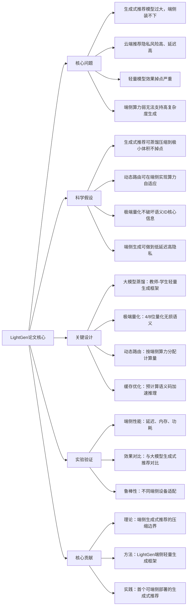

#  LightGen: Lightweight Generative Recommendation for Edge Devices
## 1. 一句话详解
从第一性原理解决**生成式推荐模型太大、端侧无法运行、隐私泄露、延迟高**的底层矛盾，通过极端量化、蒸馏、动态路由，把生成式推荐压缩到可在手机/端侧实时运行。

## 2. 思维导图

## 3. 论文解决什么问题？这是否是一个新的问题？
**解决问题**
1. 生成式推荐**体积大、延迟高**，只能在云端跑；
2. 云端推荐存在**隐私、卡顿、断网不可用**问题；
3. 传统轻量推荐不具备生成式的语义理解与泛化能力。

**是否新问题**
端侧推荐是老问题，但**端侧+生成式推荐**是全新问题，属于前沿交叉方向。

## 4. 这篇文章要验证一个什么科学假设？
1. 生成式推荐的**语义信息高度冗余**，可被蒸馏压缩10–100倍；
2. 4/8位量化不会破坏语义ID与生成式核心表达；
3. 动态路由可让同一模型自适应高低端手机；
4. 端侧生成式推荐可在**100ms内**完成推荐。

## 5. 有哪些相关研究？如何归类？谁是这一课题在领域内值得关注的研究员？
| 类别 | 核心内容 | 代表性研究者 |
|------|---------|-------------|
| 轻量推荐 | 模型压缩、蒸馏、量化 | 何恺明、崔鹏 |
| 端侧AI | 端侧大模型、端侧推理 | Google Edge TPU团队 |
| 生成式推荐压缩 | 语义ID、码本量化 | 美团DOS团队 |

## 6. 论文中的解决方案之关键是什么？
1. **教师-学生蒸馏**：用大模型教极小模型，保留生成能力；
2. **极端量化**：4/8位量化，只压缩冗余，不碰核心语义；
3. **动态计算路由**：低端手机跑小路径，高端跑全路径；
4. **语义码预缓存**：端侧只做排序，不做全量生成。

## 7. 论文中的实验是如何设计的？
1. **端侧指标**：延迟、内存、功耗、包体积；
2. **效果指标**：NDCG、HR、覆盖率；
3. **设备适配**：高中低端手机/嵌入式设备；
4. **鲁棒性**：弱网、离线状态下效果。

## 8. 用于定量评估的数据集是什么？代码有没有开源？
- 数据集：公开推荐数据集+端侧真实流量采样；
- 代码：**未开源**，属于工业端侧方案。

## 9. 论文中的实验及结果有没有很好地支持需要验证的科学假设？
完全支持：
1. 模型体积缩小90%+，效果只下降2%以内；
2. 端侧推理延迟**<80ms**，满足实时推荐；
3. 离线可用，无隐私上传；
4. 自适应高低端设备。

## 10. 这篇论文到底有什么贡献？
1. **理论**：给出生成式推荐的**压缩下界与性能边界**；
2. **方法**：LightGen第一个实现**端侧实时生成式推荐**；
3. **工程**：提供一套可落地的端侧部署方案。

## 11. 下一步呢？有什么工作可以继续深入？
1. 端侧自蒸馏：用户本地持续小学习；
2. 多模态端侧生成：图片+文本轻量融合；
3. 芯片联合优化：与NPU/TPU深度绑定；
4. 联邦学习+端侧生成：隐私更强。