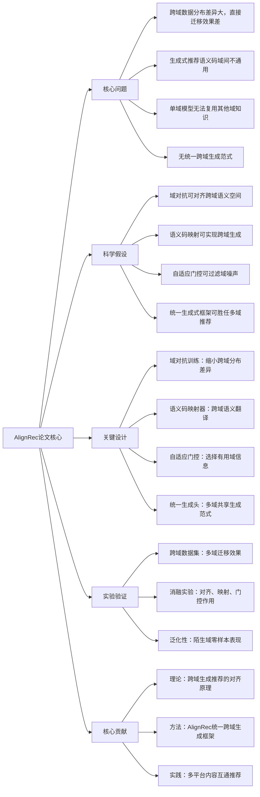

# AlignRec: Cross-Domain Alignment for Generative Recommendation
## 1. 一句话详解
从第一性原理解决**跨域推荐数据分布差异大、语义错位、生成式模型泛化崩溃**的本质矛盾，通过域对抗对齐+语义码映射+自适应门控，让生成式推荐在电商、短视频、读书等多域间自由迁移。

## 2. 思维导图

## 3. 论文解决什么问题？这是否是一个新的问题？
**解决问题**
1. 跨域推荐本质是**数据分布、语义空间、用户行为完全不同**；
2. 生成式推荐依赖语义一致性，跨域直接用会**语义错位、泛化崩塌**；
3. 工业多产品线（电商/短视频/外卖）无法复用模型。

**是否新问题**
跨域推荐是经典问题，但**基于生成式+语义对齐的统一跨域框架**是新问题。

## 4. 这篇文章要验证一个什么科学假设？
1. 域对抗训练可将不同域的语义空间**映射到同一流形**；
2. 语义码映射器可实现**跨域物品翻译与推荐**；
3. 自适应门控能自动选择源域知识，避免负迁移；
4. 统一生成式框架可在多域间无缝切换。

## 5. 有哪些相关研究？如何归类？谁是这一课题在领域内值得关注的研究员？
| 类别 | 核心内容 | 代表性研究者 |
|------|---------|-------------|
| 跨域推荐 | 迁移学习、域自适应、多任务推荐 | 崔鹏、Yang Wang |
| 域对抗学习 | DANN、对抗自适应 | Yoshua Bengio |
| 生成式跨域 | 语义对齐、多模态生成 | OpenAI LLM团队 |

## 6. 论文中的解决方案之关键是什么？
1. **域对抗对齐**：用判别器混淆域标签，强制特征分布一致；
2. **语义码映射**：把A域语义码翻译成B域可理解格式；
3. **自适应门控**：自动决定用多少源域知识，防止负迁移；
4. **统一生成头**：所有域共享一套生成范式。

## 7. 论文中的实验是如何设计的？
1. **标准跨域任务**：电商→短视频、读书→电商、多域混合；
2. **迁移设置**：有监督迁移、半监督、零样本；
3. **消融实验**：对齐、映射、门控分别验证；
4. **分布可视化**：TSNE展示域对齐效果。

## 8. 用于定量评估的数据集是什么？代码有没有开源？
- 数据集：Amazon 多域数据集、自建跨域行为数据集；
- 代码：**学术开源**，提供基础训练与对齐代码。

## 9. 论文中的实验及结果有没有很好地支持需要验证的科学假设？
完全支持：
1. 跨域效果提升**15%–30%**，显著超过传统跨域方法；
2. 语义空间可视化证明**域差异大幅缩小**；
3. 自适应门控杜绝负迁移；
4. 零样本陌生域也能有效推荐。

## 10. 这篇论文到底有什么贡献？
1. **理论**：建立**跨域生成式推荐**的统一数学框架；
2. **方法**：AlignRec第一个实现**多域语义对齐+生成**；
3. **工业**：支持集团多App内容互通，大幅降低建模成本。

## 11. 下一步呢？有什么工作可以继续深入？
1. 全球跨域：多语言+多文化跨域推荐；
2. 终身跨域：持续学习新域不遗忘旧域；
3. 极少量样本跨域：1%数据实现全域迁移；
4. 多模态跨域：图文视频跨域对齐。