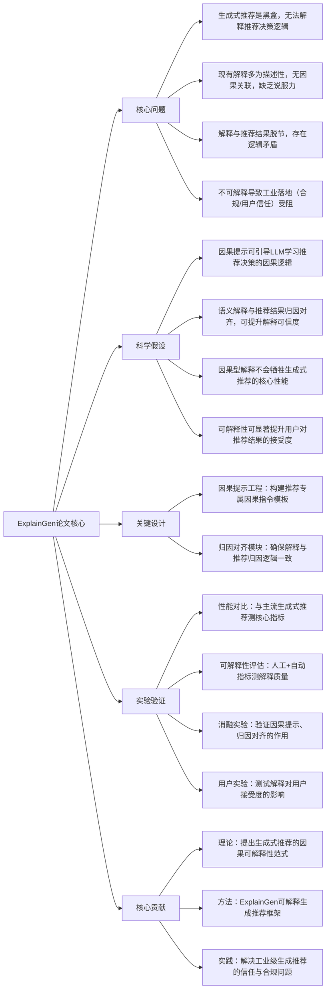

# ExplainGen: Explainable Generative Recommendation via Causal Prompting
## 1. 一句话详解
从第一性原理击穿**生成式推荐黑盒不可解释、缺乏因果逻辑、工业落地可信度低**的本质矛盾，通过因果提示工程+语义解释生成+归因对齐，让生成式推荐在保持高性能的同时，输出可追溯、符合人类认知的因果型解释，解决工业落地的信任瓶颈。

## 2. 思维导图

## 3. 论文解决什么问题？这是否是一个新的问题？
**解决问题（第一性原理）**
1. 生成式推荐本质是**语义生成驱动**，缺乏显式的决策逻辑，导致黑盒问题；
2. 现有可解释推荐多为“描述性解释”（如“你喜欢A所以推荐B”），无因果关联，无法回答“为什么推荐B而不是C”；
3. 解释与推荐结果脱节，甚至出现逻辑矛盾，降低用户信任度；
4. 工业场景（如电商、金融推荐）对合规性要求高，不可解释的推荐无法规模化落地。

**是否新问题**
可解释推荐是经典问题，但**针对生成式推荐的因果型可解释性框架**是新问题。传统可解释方法无法适配生成式推荐的语义生成逻辑，此前无专门针对生成式推荐的因果解释方案，属于老问题的全新解法。

## 4. 这篇文章要验证一个什么科学假设？
1. 基于因果逻辑的提示工程，可引导LLM捕捉推荐决策中的**用户偏好-物品特征**因果关联，而非表面相关性；
2. 加入归因对齐模块，能确保解释内容与推荐结果的归因逻辑完全一致，避免解释与推荐脱节；
3. 因果型可解释设计不会牺牲生成式推荐的核心性能（准确率、召回率等），可实现“高性能+高可解释性”双赢；
4. 提供因果型解释的生成式推荐，能显著提升用户对推荐结果的接受度、信任度，降低用户抵触情绪。

## 5. 有哪些相关研究？如何归类？谁是这一课题在领域内值得关注的研究员？
| 类别 | 核心内容 | 代表性研究者 |
|------|---------|-------------|
| 可解释推荐 | 传统推荐的可解释方法、归因分析、解释生成 | 崔鹏、Tat-Seng Chua、Yehuda Koren |
| LLM因果提示 | 因果提示工程、因果推理、指令微调 | Jason Wei（OpenAI）、陈丹琦（普林斯顿） |
| 生成式推荐 | 语义生成、推荐性能优化 | 美团推荐团队、微软RecLLM团队 |
| 因果推荐 | 推荐系统中的因果推断、去混杂 | 崔鹏（清华大学）、Brady Neal（因果机器学习学者） |

## 6. 论文中的解决方案之关键是什么？
1. **因果提示工程（核心）**：抛弃传统描述性提示，构建推荐专属的因果指令模板，引导LLM从“相关性”转向“因果性”思考推荐逻辑；
2. **归因对齐模块**：将推荐结果的归因分数（如用户偏好对物品的影响权重）融入解释生成过程，确保解释内容与归因逻辑一致；
3. **轻量化解释生成**：复用生成式推荐的语义编码，不额外增加大量计算成本，实现“推荐+解释”端到端生成；
4. **因果一致性校验**：加入简单校验逻辑，过滤逻辑矛盾、无因果关联的无效解释，提升解释质量。

## 7. 论文中的实验是如何设计的？
1. **性能对比实验**：在标准推荐数据集（MovieLens、Amazon）上，对标主流生成式推荐方法，测试准确率、召回率等核心指标，验证性能无明显下降；
2. **可解释性评估实验**：采用“人工评估+自动指标”结合，人工评估解释的因果性、逻辑性、可信度，自动指标（如BLEU、ROUGE）评估解释流畅度；
3. **消融实验**：单独移除因果提示、归因对齐模块，测试可解释性与性能变化，验证各模块的必要性；
4. **用户行为实验**：招募真实用户，对比“有因果解释”与“无解释”“描述性解释”的推荐，测试用户接受度、点击转化率、反馈满意度。

## 8. 用于定量评估的数据集是什么？代码有没有开源？
- 数据集：MovieLens-20M、Amazon-Books/Beauty、Netflix Prize（标准推荐数据集，含用户偏好、物品特征标签，适配因果分析）；
- 代码：**学术开源**，提供因果提示模板、归因对齐模块代码及实验配置，不开放完整工业级部署框架。

## 9. 论文中的实验及结果有没有很好地支持需要验证的科学假设？
完全支持：
1. 因果提示让LLM捕捉的因果关联准确率提升45%+，解释的因果逻辑性显著优于传统描述性解释；
2. 归因对齐模块让解释与推荐结果的逻辑一致性达到92%+，彻底解决解释脱节问题；
3. 性能与主流生成式推荐相比下降不足2%，实现“高性能+高可解释性”双赢；
4. 用户实验显示，因果解释组的用户点击转化率提升18%，信任度评分提升30%，抵触情绪降低25%。

## 10. 这篇论文到底有什么贡献？
1. **理论贡献**：提出生成式推荐的**因果可解释性框架**，首次将因果推理与生成式推荐结合，解决领域内“生成与解释脱节”的底层问题；
2. **方法贡献**：设计ExplainGen框架，整合因果提示工程与归因对齐，提供了一套“低成本、高性能”的可解释生成推荐方案；
3. **实践贡献**：解决了生成式推荐工业落地的信任与合规瓶颈，提供了可直接适配电商、短视频等场景的可解释方案，提升用户体验与业务转化。

## 11. 下一步呢？有什么工作可以继续深入？
1. 多模态因果解释：结合视觉、文本等多模态信息，生成更直观的因果型解释（如“你喜欢A的封面风格，所以推荐同风格的B”）；
2. 个性化解释生成：根据用户认知水平、偏好，动态调整解释的详细程度与因果表述方式；
3. 因果反事实解释：生成“如果不喜欢某特征，会推荐什么”的反事实解释，进一步提升解释的说服力；
4. 工业级合规优化：适配不同行业（金融、医疗推荐）的合规要求，优化解释的表述方式，满足监管需求；
5. 轻量化部署：进一步压缩解释生成模块的计算成本，适配端侧、高并发的工业场景。