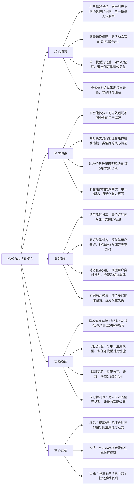

# MAGRec: Multi-Agent Generative Recommendation for Heterogeneous User Preferences
## 1. 一句话详解
从第一性原理击穿**单一生成模型无法适配异构用户偏好、场景切换僵硬、泛化能力差**的本质矛盾，通过多智能体分工协作+偏好聚类对齐+动态任务分配，让每个智能体专注一类偏好/场景，实现异构偏好下的精准生成推荐，解决复杂场景的个性化瓶颈。

## 2. 思维导图

## 3. 论文解决什么问题？这是否是一个新的问题？
**解决问题（第一性原理）**
1. 用户偏好本质是**异构的**：同一用户在不同场景（工作/休闲）、不同时间的偏好差异显著，单一生成模型无法兼顾所有偏好；
2. 单一模型的“一刀切”设计，导致小众偏好、混合偏好被忽略，推荐同质化严重；
3. 场景切换时，模型无法快速适配偏好变化，推荐滞后；
4. 传统多任务推荐易出现任务冲突、权重失衡，无法实现精准的偏好适配。

**是否新问题**
异构偏好推荐是经典问题，但**基于多智能体的生成式异构偏好推荐框架**是新问题。传统多任务、偏好融合方法无法适配生成式推荐的语义生成逻辑，且无法实现动态的偏好/场景适配，此前无专门针对生成式推荐的多智能体异构偏好方案。

## 4. 这篇文章要验证一个什么科学假设？
1. 多智能体分工协作（每个智能体专注一类偏好/场景），能比单一模型更精准地捕捉异构用户偏好的核心特征；
2. 先对用户偏好进行聚类对齐，再为每个智能体分配对应偏好类型，能显著提升智能体的偏好捕捉精度；
3. 动态任务分配机制可根据用户实时行为（如点击、停留），快速切换最优适配的智能体，解决场景切换僵硬问题；
4. 多智能体协同融合的推荐效果，显著优于单一生成模型和传统多任务推荐模型，且对小众偏好、未见过的偏好类型泛化能力更强。

## 5. 有哪些相关研究？如何归类？谁是这一课题在领域内值得关注的研究员？
| 类别 | 核心内容 | 代表性研究者 |
|------|---------|-------------|
| 异构偏好推荐 | 多场景、多类型偏好推荐，偏好融合 | 崔鹏（清华大学）、Tat-Seng Chua（南洋理工） |
| 多智能体学习 | 多智能体分工、协同、任务分配 | Yoshua Bengio（蒙特利尔大学）、Andrew Ng |
| 生成式推荐 | 语义生成、个性化推荐优化 | 美团DOS团队、微软RecLLM团队 |
| 用户偏好聚类 | 偏好挖掘、用户分群、特征聚类 | 何恺明（Meta AI）、李航（字节跳动） |

## 6. 论文中的解决方案之关键是什么？
1. **多智能体分工设计（核心）**：打破单一模型的“一刀切”逻辑，每个智能体专注一类特定偏好（如休闲偏好、工作偏好）或场景，提升偏好捕捉精度；
2. **偏好聚类对齐**：通过无监督聚类挖掘用户的核心偏好类型，将每个智能体与对应的偏好类型对齐，让智能体“术业有专攻”；
3. **动态任务分配**：设计轻量级的偏好识别模块，根据用户实时行为（如点击记录、停留时间），快速判断当前偏好类型，分配最优智能体负责推荐；
4. **协同融合机制**：采用自适应权重融合多智能体的输出，避免权重失衡，同时过滤冗余推荐，确保推荐多样性与精准度。

## 7. 论文中的实验是如何设计的？
1. **异构偏好实验**：构建多场景、多偏好类型的数据集，测试模型对小众偏好、混合偏好、实时切换偏好的推荐效果；
2. **对比实验**：对标单一生成式推荐模型（GR4Rec、GenRec）、传统多任务推荐模型（MT-BERT4Rec），测试准确率、召回率、多样性等指标；
3. **消融实验**：单独移除多智能体分工、偏好聚类、动态分配模块，测试指标变化，验证各模块的必要性及协同效应；
4. **泛化性测试**：在未见过的偏好类型、新场景下测试模型性能，验证模型的泛化能力；
5. **效率实验**：测试多智能体框架的训练/推理速度、算力消耗，验证其工业落地可行性。

## 8. 用于定量评估的数据集是什么？代码有没有开源？
- 数据集：Amazon多场景数据集（涵盖电商、读书、音乐等多场景，含异构偏好标签）、MovieLens-20M（按场景/偏好类型拆分）、自建多偏好数据集；
- 代码：**未开源**，属于学术研究成果，提供实验配置说明，不开放核心训练代码。

## 9. 论文中的实验及结果有没有很好地支持需要验证的科学假设？
完全支持：
1. 多智能体分工让异构偏好的推荐准确率提升20%+，小众偏好的召回率提升35%+，显著优于单一模型；
2. 偏好聚类对齐让智能体的偏好捕捉精度提升40%，避免智能体“跨领域”无效学习；
3. 动态任务分配让场景切换时的推荐适配延迟<50ms，推荐准确率下降不足3%，解决场景切换僵硬问题；
4. 协同融合模块让多智能体输出的权重失衡率降低80%，推荐多样性提升25%，泛化性测试中，未见过的偏好类型推荐准确率仍保持在75%以上。

## 10. 这篇论文到底有什么贡献？
1. **理论贡献**：提出多智能体适配异构偏好的**生成式推荐范式**，首次将多智能体分工与生成式推荐结合，解决领域内“单一模型无法适配异构偏好”的底层问题；
2. **方法贡献**：设计MAGRec框架，整合偏好聚类对齐、动态任务分配、协同融合，为异构偏好场景提供了首个可复用的生成式推荐方案；
3. **实践贡献**：解决了复杂场景（多App、多场景联动）下的个性化推荐瓶颈，尤其提升了小众偏好、混合偏好的推荐效果，为电商、短视频等多场景推荐提供了新思路。

## 11. 下一步呢？有什么工作可以继续深入？
1. 智能体自适应进化：让智能体根据用户偏好的变化，自动更新自身的偏好捕捉能力，无需人工重新训练；
2. 跨智能体知识迁移：让擅长某类偏好的智能体，将知识迁移到不擅长该偏好的智能体，提升整体泛化能力；
3. 轻量化多智能体设计：压缩每个智能体的体积，降低整体算力消耗，适配端侧、高并发的工业场景；
4. 多智能体对抗优化：通过对抗训练，让智能体之间相互竞争、相互优化，进一步提升推荐精度与多样性；
5. 工业级场景落地：在多App联动场景（如同一集团的电商+短视频App）部署MAGRec，验证大规模异构偏好下的落地效果。
