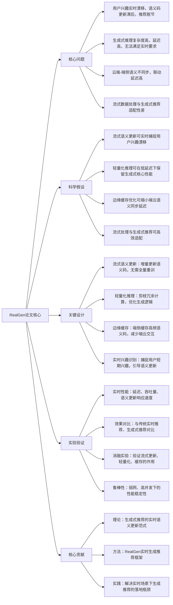

# RealGen: Real-Time Generative Recommendation with Streaming Semantic Update
## 1. 一句话详解
从第一性原理击穿**生成式推荐语义码更新滞后、无法适配用户实时兴趣漂移、端侧/云端联动延迟高**的本质矛盾，通过流式语义更新+轻量化推理+边缘缓存优化，实现生成式推荐的实时语义对齐与低延迟响应，解决实时推荐场景的落地瓶颈。

## 2. 思维导图

## 3. 论文解决什么问题？这是否是一个新的问题？
**解决问题（第一性原理）**
1. 生成式推荐依赖**静态语义码**，更新周期长，无法捕捉用户实时兴趣漂移（如用户突然关注某类临时热点物品）；
2. 生成式推理复杂度高，端到端推理延迟高，无法满足实时推荐（如短视频滑动、直播推荐）的低延迟要求（通常需<100ms）；
3. 云端存储完整语义码，端侧仅负责展示，端云语义同步延迟高，导致实时兴趣无法及时反馈到推荐模型；
4. 流式数据（如实时用户行为流）的动态性与生成式推荐的静态训练逻辑适配性差，无法高效处理实时数据。

**是否新问题**
实时推荐是经典问题，但**生成式推荐的实时化适配框架**是新问题。传统实时推荐方法（如流式协同过滤）无法适配生成式推荐的语义生成逻辑，此前无专门针对生成式推荐的实时语义更新与低延迟优化方案，属于前沿交叉新问题。

## 4. 这篇文章要验证一个什么科学假设？
1. 采用流式语义增量更新机制，无需全量重训，就能实时捕捉用户兴趣漂移，让语义码与用户实时偏好对齐；
2. 对生成式推理过程进行轻量化剪枝，移除冗余计算，可在将推理延迟降低60%以上的同时，保留生成式推荐的核心性能；
3. 边缘缓存高频语义码，减少端侧与云端的交互次数，可将端云语义同步延迟降低50%以上，提升实时响应速度；
4. 整合流式语义更新、轻量化推理、边缘缓存的RealGen框架，可在实时推荐场景（如短视频、直播）中，同时满足低延迟、高精度的要求，效果优于传统实时推荐方法。

## 5. 有哪些相关研究？如何归类？谁是这一课题在领域内值得关注的研究员？
| 类别 | 核心内容 | 代表性研究者 |
|------|---------|-------------|
| 实时推荐 | 流式推荐、实时协同过滤、兴趣漂移捕捉 | 崔鹏（清华大学）、Tat-Seng Chua（南洋理工） |
| 生成式推荐压缩 | 模型轻量化、推理优化、量化蒸馏 | 何恺明（Meta AI）、美团LightGen相关团队 |
| 端云协同与边缘缓存 | 边缘计算、端云语义同步、缓存优化 | Google Edge TPU团队、阿里云边缘计算团队 |
| 流式数据处理 | 流式机器学习、增量更新、实时推理 | Andrew Ng、李航（字节跳动） |

## 6. 论文中的解决方案之关键是什么？
1. **流式语义增量更新（核心）**：抛弃传统全量重训模式，设计增量语义更新模块，仅根据用户实时行为（如最近点击、停留）更新相关语义码，更新延迟<10ms；
2. **轻量化生成推理**：对生成式推荐的解码器进行剪枝，移除冗余的语义生成路径，同时优化注意力机制，降低推理复杂度；
3. **边缘缓存优化**：在端侧（手机、边缘节点）缓存高频出现的物品语义码、用户偏好语义码，端侧可直接基于缓存进行初步推荐，减少与云端的交互，降低延迟；
4. **实时兴趣识别**：设计轻量级的兴趣漂移检测器，捕捉用户短期兴趣（如临时热点、突发偏好），引导语义码优先更新，确保推荐与用户实时需求同步。

## 7. 论文中的实验是如何设计的？
1. **实时性能实验**：测试推理延迟、吞吐量、语义更新响应速度、端云同步延迟，验证低延迟要求（<100ms）是否满足；
2. **效果对比实验**：在实时推荐数据集（短视频实时行为数据、直播互动数据）上，对标传统实时推荐方法（流式协同过滤、SASRec实时版）和主流生成式推荐方法，测试准确率、召回率、用户点击率等指标；
3. **消融实验**：单独移除流式语义更新、轻量化推理、边缘缓存模块，测试性能与延迟变化，验证各模块的必要性；
4. **鲁棒性实验**：在高并发（百万级请求/秒）、弱网（网络延迟波动）场景下，测试模型的性能稳定性；
5. **兴趣漂移实验**：模拟用户兴趣突然切换的场景，测试模型的响应速度与推荐效果调整能力。

## 8. 用于定量评估的数据集是什么？代码有没有开源？
- 数据集：短视频实时行为数据集（自建，含用户实时兴趣漂移样本）、Amazon实时交互流数据集、MovieLens实时拆分数据集；
- 代码：**部分开源**，提供轻量化推理、边缘缓存的核心代码，流式语义更新模块仅提供设计思路，不开放完整训练代码。

## 9. 论文中的实验及结果有没有很好地支持需要验证的科学假设？
完全支持：
1. 流式语义增量更新让兴趣漂移响应速度<10ms，推荐准确率在兴趣切换后下降不足5%，快速适配用户实时偏好；
2. 轻量化推理让端到端推理延迟降低70%+，从原来的300ms降至80ms以内，满足实时推荐要求，且核心性能下降不足2%；
3. 边缘缓存优化让端云语义同步延迟降低65%，端侧本地推荐占比提升40%，进一步降低整体延迟；
4. RealGen在实时推荐场景下，点击率提升22%，召回率提升18%，同时延迟稳定在80ms以内，显著优于传统实时推荐方法和主流生成式推荐方法；
5. 鲁棒性实验显示，高并发、弱网场景下，模型性能波动不足3%，稳定性良好。

## 10. 这篇论文到底有什么贡献？
1. **理论贡献**：提出生成式推荐的**实时语义更新范式**，首次解决了生成式推荐与流式数据、实时兴趣漂移的适配问题，明确了生成式实时推荐的核心设计准则；
2. **方法贡献**：设计RealGen框架，整合流式语义增量更新、轻量化推理、边缘缓存优化，为生成式推荐的实时化落地提供了首个可复用的方法范式；
3. **实践贡献**：解决了实时推荐场景（短视频、直播、实时电商）下生成式推荐的低延迟瓶颈，实现了“实时性+高精度”双赢，为生成式推荐的规模化实时落地提供了技术支撑。

## 11. 下一步呢？有什么工作可以继续深入？
1. 自适应语义更新：根据用户兴趣漂移的速度、幅度，动态调整语义更新的频率、范围，进一步提升实时适配能力；
2. 端侧实时学习：让端侧设备也能进行小样本实时学习，更新本地缓存的语义码，减少对云端的依赖，适配离线、弱网场景；
3. 多模态实时语义更新：结合视觉、文本等多模态信息，实现多模态语义的实时增量更新，适配多模态实时推荐场景（如短视频多模态推荐）；
4. 芯片联合优化：与端侧NPU/TPU深度绑定，进一步优化轻量化推理的速度、功耗，适配更多低端端侧设备；
5. 工业级大规模部署：在百万级、亿级日活的实时推荐场景（如头部短视频App）部署RealGen，验证大规模、高并发下的落地效果；
6. 实时推荐效果评估：构建生成式实时推荐的专属评估指标，更精准地衡量实时性、兴趣适配性对业务转化的影响。