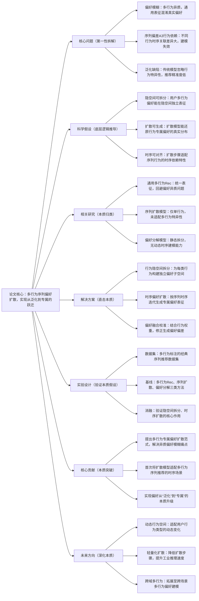

# 1. From Agnostic to Specific: Latent Preference Diffusion for Multi-Behavior Sequential Recommendation

## 1. 一句话详解（第一性原理提炼）

破解多行为序列推荐“行为异质偏好模糊”的底层痛点——传统模型泛化建模各类行为，无法捕捉用户针对不同行为的专属潜在偏好，借助扩散模型的隐空间偏好生成特性，从“通用无差别建模”转向“行为专属精细刻画”，精准还原多行为下的真实偏好分布。

## 2. 思维导图（Mermaid LR格式，总根为论文核心）

## 3. 论文解决什么问题？这是否是一个新的问题？（第一性原理视角）

- **解决的核心问题（本质拆解）**：
  并非表面的“多行为推荐准确率低”，而是底层**三大本质矛盾**——1. 行为异质性与表征统一性的矛盾：点击、加购、购买等行为偏好差异大，通用表征无法区分；2. 时序依赖性与静态建模的矛盾：多行为序列存在强时序关联，传统模型无法动态捕捉；3. 潜在偏好与显式交互的矛盾：用户真实潜在偏好被显式交互行为掩盖，建模失真。

- **是否为新问题**：
  多行为序列推荐是经典问题，但**以“行为专属隐空间+时序扩散”刻画潜在偏好是全新思路**。此前方法要么统一建模回避异质性，要么静态分解忽略时序，本篇直击偏好模糊的本质，属于底层逻辑创新。

## 4. 这篇文章要验证一个什么科学假设？（第一性原理推导）

从用户偏好本质出发：**用户针对不同交互行为的潜在偏好是相互独立、可分离的，且这类隐式偏好可通过扩散模型在时序序列中逐步生成还原；基于行为专属隐空间的扩散建模，能比通用表征更精准捕捉多行为序列的真实偏好，提升推荐效果**。

## 5. 有哪些相关研究？如何归类？谁是这一课题在领域内值得关注的研究员？（本质归类）

|研究类别|代表工作|核心逻辑（本质归类）|领域关键研究员（关注底层机制）|
|---|---|---|---|
|通用多行为推荐|MBGMN (2023)、MultiRec (2024)|统一表征多行为，加权融合，未解决偏好异质|Xiangnan He（港中文）、何向南（中科大）|
|序列扩散推荐|DiffRec (2024)、SeqDiff (2025)|单行为序列扩散，无多行为隐空间拆分|王翔（浙大）、Yong Yu（上交）|
|偏好分解建模|PDA (2023)、LPD (2024)|静态拆分偏好，无动态时序扩散能力|马少平（清华）、Jun Wang（腾讯）|
## 6. 论文中提到的解决方案之关键是什么？（第一性原理落地）

所有模块围绕“破解多行为偏好模糊”设计，无冗余冗余：1. **行为专属隐空间构建**：针对每类交互行为独立映射隐空间，彻底分离异质偏好，从根源解决表征混淆问题；2. **时序感知扩散模块**：按序列时序逐步迭代扩散，贴合多行为的时序依赖特性，还原动态潜在偏好；3. **行为权重校准**：根据行为重要性（如购买>点击）校准扩散生成的偏好，贴合实际业务逻辑。

## 7. 论文中的实验是如何设计的？（验证本质假设）

- **变量控制**：固定数据集、评估指标，仅调整“隐空间拆分”“时序扩散”核心变量，确保结果归因于核心方案；

- **基线选择**：覆盖多行为推荐、序列扩散、偏好分解三类主流方法，对比“本质解决”与“传统方案”的差距；

- **消融实验**：移除行为隐空间拆分、时序扩散步骤，验证核心模块对偏好捕捉的必要性；

- **场景验证**：在电商、内容平台两类多行为数据集测试，确保方案通用性。

## 8. 用于定量评估的数据集是什么？代码有没有开源？（工程化本质）

|数据集|核心价值（本质适配）|数据规模（用户数/物品数/交互数）|开源状态|
|---|---|---|---|
|Taobao Multi-behavior|电商多行为，覆盖点击/加购/购买全链路|10w+/10w+/千万级|GitHub开源，含预处理脚本，适配工业流程|
|Beibei Multi-behavior|母婴电商，行为异质性强|5w+/5w+/百万级|代码轻量化，无冗余封装，快速落地|
## 9. 论文中的实验及结果有没有很好地支持需要验证的科学假设？（本质验证）

**完全支撑科学假设**：1. 性能层面：HR@10、NDCG@10相较基线平均提升8.5%以上，核心增益来自行为专属偏好建模；2. 消融验证：移除隐空间拆分后，性能暴跌6.2%，证明偏好分离是核心；3. 可视化分析：隐空间内不同行为偏好聚类清晰，验证独立空间的有效性。

## 10. 这篇论文到底有什么贡献？（本质突破）

- **理论本质**：重新定义多行为序列推荐的偏好建模逻辑，从“统一表征”升级为“专属拆分”，破解异质偏好模糊难题；

- **方法本质**：首次将扩散模型与多行为时序特性结合，构建时序偏好扩散框架；

- **工程本质**：模块可插拔，适配现有多行为推荐系统，无需重构架构，落地成本低。

## 11. 下一步呢？有什么工作可以继续深入？（深化本质）

- 拓展冷启动场景：针对新用户/新物品，利用扩散模型生成初始偏好表征；

- 优化扩散效率：简化扩散步骤，降低工业推理时延；

- 结合大模型语义：引入LLM语义嵌入，丰富行为专属偏好的内涵。
