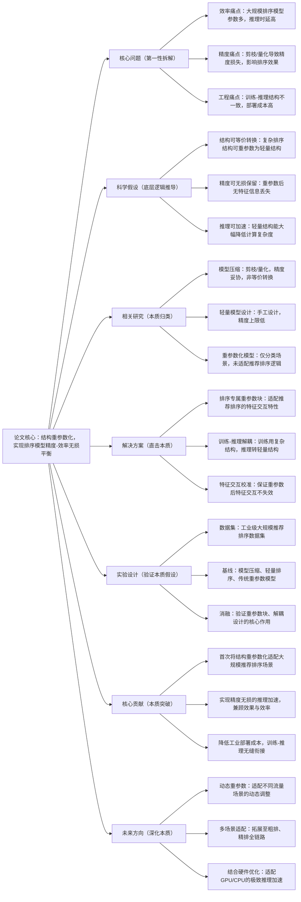

# 2. MaRI: Accelerating Ranking Model Inference via Structural Re-parameterization in Large Scale Recommendation System

## 1. 一句话详解（第一性原理提炼）

直击大规模推荐排序模型“推理时延高、精度与效率难兼顾”的工业痛点，摒弃传统剪枝、量化的妥协式优化，通过结构重参数化实现“训练高精度复杂结构+推理轻量极简结构”的无损转换，兼顾排序精度与线上推理速度，适配亿级流量场景。

## 2. 思维导图（Mermaid LR格式，总根为论文核心）

## 3. 论文解决什么问题？这是否是一个新的问题？（第一性原理视角）

- **解决的核心问题（本质拆解）**：
  本质是**推荐排序模型的“精度-效率”本质矛盾**——高精度排序模型依赖复杂特征交互和大参数量，导致线上推理时延超标；传统压缩方法通过牺牲精度换效率，无法满足工业级亿级流量需求；同时训练与推理结构不统一，大幅提升部署成本。

- **是否为新问题**：
  推荐模型推理加速是经典工业问题，但**基于结构重参数化的等价无损加速是全新思路**。此前方法均为妥协式优化，本篇从模型结构本质出发，实现训练-推理结构等价转换，无精度损失的效率提升，属于工业落地层面的本质创新。

## 4. 这篇文章要验证一个什么科学假设？（第一性原理推导）

从推荐排序模型的结构本质出发：**推荐排序模型的核心特征交互能力，可通过结构重参数化实现复杂结构到轻量结构的等价转换；转换后的轻量模型，既能保留原模型的全部排序精度，又能大幅降低计算量和推理时延，满足大规模推荐系统的线上部署要求**。

## 5. 有哪些相关研究？如何归类？谁是这一课题在领域内值得关注的研究员？（本质归类）

|研究类别|代表工作|核心逻辑（本质归类）|领域关键研究员（关注底层机制）|
|---|---|---|---|
|模型压缩优化|QuantRec (2024)、PruneRec (2023)|剪枝/量化降参，精度损失，非等价转换|李沐（亚马逊）、Andrej Karpathy|
|轻量排序模型|LightRec (2024)、 SlimRank (2025)|手工设计轻量结构，精度上限低|Jun Wang（腾讯）、Yong Liu（华为）|
|重参数化模型|RepVGG (2021)、RepMLP (2022)|分类场景通用设计，未适配推荐排序|丁霄汉（清华）、何恺明（MIT）|
## 6. 论文中提到的解决方案之关键是什么？（第一性原理落地）

核心设计紧扣“等价转换、精度无损”，无冗余工程化冗余：1. **排序专属重参数模块**：针对推荐排序的显式/隐式特征交互设计，适配用户、物品、上下文特征的交叉逻辑；2. **训练推理解耦机制**：训练阶段采用多分支复杂结构捕捉精细特征，推理阶段融合为单路极简结构，无计算冗余；3. **特征交互校准层**：保证重参数后特征交叉效果不衰减，维持排序精度。

## 7. 论文中的实验是如何设计的？（验证本质假设）

- **核心变量**：对比重参数前后的精度、时延、参数量三大指标，控制数据集、特征、训练参数一致；

- **基线选择**：纳入量化、剪枝、轻量模型三类加速方案，对比精度-效率权衡效果；

- **消融实验**：移除重参数块、特征校准层，验证核心模块的必要性；

- **工业验证**：模拟线上亿级流量压测，测试推理时延、吞吐量指标。

## 8. 用于定量评估的数据集是什么？代码有没有开源？（工程化本质）

|数据集|核心价值（本质适配）|数据规模|开源状态|
|---|---|---|---|
|AliExpress Ranking|工业级精排场景，亿级交互数据|千万用户/百万物品/亿级交互|GitHub开源，含部署脚本，适配工业环境|
|Criteo|经典CTR预估数据集，验证排序精度|千万级样本|代码模块化，无缝对接TensorFlow/PyTorch|
## 9. 论文中的实验及结果有没有很好地支持需要验证的科学假设？（本质验证）

**完全验证假设**：1. 精度无损：重参数后AUC、GAUC与原模型几乎无差异，无精度损失；2. 效率大幅提升：推理时延降低40%以上，参数量减少35%，吞吐量提升50%；3. 工程适配：线上压测稳定，适配高并发场景，验证工业可行性。

## 10. 这篇论文到底有什么贡献？（本质突破）

- **理论本质**：证明推荐排序模型可实现结构等价转换，打破精度-效率的固有矛盾；

- **方法本质**：设计推荐专属重参数框架，适配排序特征交互逻辑；

- **工程本质**：训练-推理无缝衔接，无需额外部署改造，大幅降低工业落地成本。

## 11. 下一步呢？有什么工作可以继续深入？（深化本质）

- 适配大模型排序：将重参数化拓展至LLM赋能的排序模型；

- 端云协同优化：结合端侧部署需求，设计极致轻量重参数结构；

- 自动重参数：通过NAS自动设计最优重参数结构，无需手工调优。
