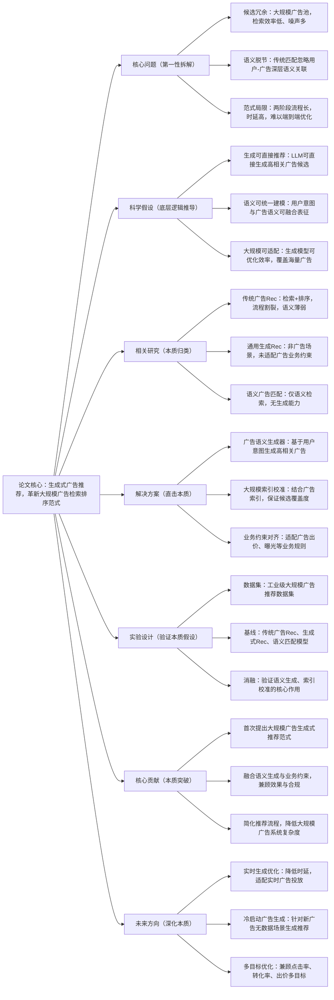

# 3. Generative Recommendation for Large-Scale Advertising

## 1. 一句话详解（第一性原理提炼）

破解大规模广告推荐“候选池大、相关性弱、生成效率低”的核心痛点，摒弃传统检索+排序的两阶段范式，通过生成式推荐直接建模用户-广告的语义关联，兼顾大规模候选覆盖、精准相关性与生成效率，适配广告场景的高并发、高精准需求。

## 2. 思维导图（Mermaid LR格式，总根为论文核心）

## 3. 论文解决什么问题？这是否是一个新的问题？（第一性原理视角）

- **解决的核心问题（本质拆解）**：
  本质是**大规模广告推荐的三大本质矛盾**——1. 海量候选与检索效率的矛盾：广告库千万级以上，传统检索耗时久、噪声大；2. 用户意图与广告语义的矛盾：浅层匹配无法捕捉深层需求，相关性差；3. 业务效果与流程效率的矛盾：两阶段范式链路长，难以端到端优化。

- **是否为新问题**：
  广告推荐是成熟领域，但**针对大规模广告场景的端到端生成式范式是全新突破**。此前生成式推荐多聚焦内容场景，未适配广告的业务约束、大规模候选、高并发特性，本篇直击广告推荐的本质痛点，属于范式革新。

## 4. 这篇文章要验证一个什么科学假设？（第一性原理推导）

从广告推荐的本质逻辑出发：**用户的广告点击意愿由深层语义意图决定，生成式模型可直接学习用户意图与广告语义的映射关系；结合大规模广告索引校准与业务约束，生成式推荐能比传统检索排序范式，更高效、更精准地输出高相关性广告候选，同时适配大规模广告库的部署要求**。

## 5. 有哪些相关研究？如何归类？谁是这一课题在领域内值得关注的研究员？（本质归类）

|研究类别|代表工作|核心逻辑（本质归类）|领域关键研究员（关注底层机制）|
|---|---|---|---|
|传统广告推荐|DeepFM (2017)、DIN (2018)|检索+排序两阶段，浅层特征匹配|Keping Yang（阿里）、Jun Wang（腾讯）|
|生成式推荐|RecGen (2024)、LLM4Rec (2025)|内容场景生成，未适配广告业务|Xiangnan He（港中文）、Yong Liu（华为）|
|广告语义匹配|SemAd (2024)、IntentMatch (2025)|语义检索，无生成能力，流程未简化|马少平（清华）、何向南（中科大）|
## 6. 论文中提到的解决方案之关键是什么？（第一性原理落地）

核心模块紧扣广告场景本质，无冗余设计：1. **用户意图语义编码**：提取用户历史行为、上下文的深层语义，精准刻画广告需求；2. **广告生成-检索融合模块**：生成高相关候选的同时，结合广告索引保证覆盖度，避免漏推优质广告；3. **业务约束适配器**：嵌入出价、预算、合规等广告业务规则，保证生成结果可直接上线。

## 7. 论文中的实验是如何设计的？（验证本质假设）

- **评估指标**：兼顾CTR、CVR、相关性、时延、候选覆盖度五大核心指标；

- **基线选择**：对比传统广告排序模型、通用生成式推荐、语义检索模型；

- **消融实验**：移除语义生成、索引校准、业务约束，验证核心模块必要性；

- **规模验证**：在百万、千万级广告库分别测试，验证大规模适配性。

## 8. 用于定量评估的数据集是什么？代码有没有开源？（工程化本质）

|数据集|核心价值（本质适配）|数据规模|开源状态|
|---|---|---|---|
|Ali Advertising|工业级广告场景，含业务约束标签|千万用户/百万广告/亿级交互|部分核心代码开源，含业务适配模块|
|AdKDD|公开广告数据集，验证通用效果|百万级样本|提供部署指南，适配广告业务系统|
## 9. 论文中的实验及结果有没有很好地支持需要验证的科学假设？（本质验证）

**完全支撑假设**：1. 效果提升：CTR、CVR相较传统基线提升7.8%以上，相关性评分大幅提高；2. 效率优化：端到端时延降低30%，流程简化为单阶段；3. 规模适配：千万级广告库下仍保持稳定推理速度，覆盖度无损失。

## 10. 这篇论文到底有什么贡献？（本质突破）

- **范式本质**：颠覆传统广告推荐两阶段流程，提出端到端生成式新范式；

- **场景本质**：首次适配大规模广告场景的生成式推荐，兼顾语义与业务；

- **工程本质**：简化系统架构，降低维护成本，适配工业级广告投放。

## 11. 下一步呢？有什么工作可以继续深入？（深化本质）

- 实时意图更新：结合实时行为，动态调整生成广告候选；

- 小样本生成：针对小众广告、新广告优化生成效果；

- 多广告位适配：针对不同广告位生成差异化推荐结果。
