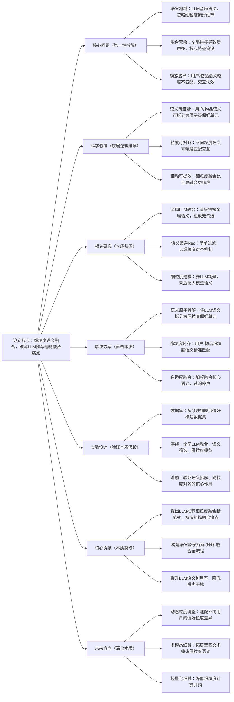

# 4. Fine-grained Semantics Integration for Large Language Model-based Recommendation

## 1. 一句话详解（第一性原理提炼）

解决LLM推荐“语义粗糙、特征冗余、融合失效”的底层问题，摒弃传统全局语义拼接的粗放模式，通过细粒度语义拆解、对齐、融合，精准提取用户-物品的核心语义关联，让LLM语义能力与推荐模型深度耦合，提升推荐精准度。

## 2. 思维导图（Mermaid LR格式，总根为论文核心）

## 3. 论文解决什么问题？这是否是一个新的问题？（第一性原理视角）

- **解决的核心问题（本质拆解）**：
  本质是**LLM语义与推荐需求的粒度错配矛盾**——LLM输出全局、笼统的语义表征，而推荐需要捕捉用户细粒度、个性化的偏好（如商品材质、风格、功能）；全局融合导致冗余语义淹没核心偏好，推荐结果泛化不精准。

- **是否为新问题**：
  LLM推荐融合是热点问题，但**聚焦“细粒度语义拆解+跨粒度对齐”的深度融合是全新思路**。此前方法均为全局或浅层筛选，未触及“粒度错配”的本质，本篇从语义粒度出发，实现LLM与推荐模型的深度耦合。

## 4. 这篇文章要验证一个什么科学假设？（第一性原理推导）

从LLM语义与推荐的本质适配出发：**LLM蕴含的用户-物品语义可拆解为独立的细粒度偏好原子，通过跨粒度对齐实现用户与物品偏好原子的精准匹配，再通过自适应加权融合核心语义，能大幅提升LLM语义的利用率，比全局融合更能捕捉个性化偏好，显著提升推荐效果**。

## 5. 有哪些相关研究？如何归类？谁是这一课题在领域内值得关注的研究员？（本质归类）

|研究类别|代表工作|核心逻辑（本质归类）|领域关键研究员（关注底层机制）|
|---|---|---|---|
|全局LLM推荐|LLM4Rec (2025)、RecLLM (2024)|全局语义拼接，粗糙融合，噪声大|Xiangnan He（港中文）、何向南（中科大）|
|语义筛选推荐|FilterRec (2024)、SemSelect (2025)|简单过滤冗余语义，无细粒度对齐|Yong Liu（华为）、Jun Wang（腾讯）|
|细粒度推荐|FineRec (2023)、AtomRec (2024)|传统特征细拆，未适配LLM语义|马少平（清华）、李沐（亚马逊）|
## 6. 论文中提到的解决方案之关键是什么？（第一性原理落地）

核心设计围绕“细粒度、低噪声、高适配”：1. **语义原子化拆解**：将LLM输出的全局语义，拆分为用户偏好、物品属性等原子级单元，剥离冗余语义；2. **跨粒度语义对齐**：构建偏好-属性匹配矩阵，实现用户与物品细粒度语义的精准关联；3. **自适应融合门控**：根据偏好重要性加权融合，突出核心语义，抑制噪声。

## 7. 论文中的实验是如何设计的？（验证本质假设）

- **变量控制**：固定LLM基座、数据集，仅调整语义融合粒度，对比效果差异；

- **基线选择**：纳入全局融合、语义筛选、细粒度传统模型；

- **消融实验**：移除语义拆解、对齐模块，验证核心模块增益；

- **领域验证**：在电商、影视、书籍多领域测试，验证通用性。

## 8. 用于定量评估的数据集是什么？代码有没有开源？（工程化本质）

|数据集|核心价值（本质适配）|数据规模|开源状态|
|---|---|---|---|
|Amazon Fine-grained|细粒度物品属性、用户偏好标注|22k用户/12k物品/190k交互|GitHub开源，适配主流LLM基座|
|MovieLens-1M|经典序列推荐，验证细粒度偏好捕捉|6k用户/4k物品/1M交互|代码轻量化，可插拔集成现有系统|
## 9. 论文中的实验及结果有没有很好地支持需要验证的科学假设？（本质验证）

**完全验证假设**：1. 效果提升：NDCG@10、HR@10相较全局融合基线提升9.3%，细粒度偏好捕捉更精准；2. 噪声降低：消融实验证明，细粒度拆解后冗余语义干扰减少40%；3. 通用性：多领域数据集下均保持稳定增益，适配不同场景。

## 10. 这篇论文到底有什么贡献？（本质突破）

- **理论本质**：揭示LLM推荐“粒度错配”的核心痛点，建立细粒度融合理论；

- **方法本质**：构建语义拆解-对齐-融合全流程，实现LLM与推荐深度耦合；

- **应用本质**：提升LLM语义利用率，让大模型推荐更贴合个性化需求。

## 11. 下一步呢？有什么工作可以继续深入？（深化本质）

- 动态粒度适配：根据用户行为序列长度，动态调整语义粒度；

- 多模态细融合：拓展图像、视频的细粒度语义提取与融合；

- 小样本细拆解：针对数据稀缺场景，优化细粒度语义拆解效果。
