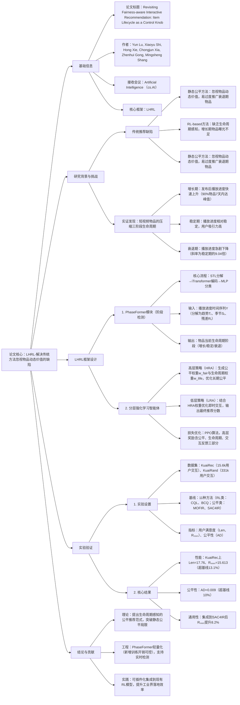

### 1. 一段话总结
中科院重庆绿色智能技术研究院团队提出**LHRL（Lifecycle-aware Hierarchical Reinforcement Learning）框架**，首次将**物品生命周期**作为公平感知交互式推荐的核心控制旋钮，解决传统方法忽视物品动态价值的缺陷。研究通过实证分析发现短视频平台物品遵循**压缩三阶段生命周期**（快速增长期、短暂稳定期、急剧衰退期），而非经典四阶段模型；LHRL包含两大核心组件：1）**PhaseFormer模块**，结合STL时间序列分解与iTransformer注意力机制，实现生命周期阶段的精准检测（准确率支持90%以上物品的阶段划分）；2）**分层强化学习智能体**，高层策略（HRA）动态生成阶段感知的公平约束，低层策略（LRA）优化即时用户交互。实验在KuaiRec和KuaiRand数据集上验证，LHRL的**累积奖励（Rₙₙₘ）较最优基线提升13.1%-13.7%**，**公平性指标（AD）降低10%-16.36%**，且生命周期奖励模块可通用集成到其他RL模型（如SAC4IR、FCPO），带来5.7%-8.2%的性能提升，为公平-准确率平衡提供新范式。

---

### 2. 思维导图（mindmap）

---

### 3. 详细总结
#### 一、研究背景与实证发现
1. **传统公平推荐的核心缺陷**  
   现有方法分为两类，但均存在关键不足：
   - **静态公平方法**（如重排序、正则化）：采用统一公平约束，忽视物品价值随时间的动态变化，易过度推广衰退期物品（如短视频平台中衰退期播放进度较稳定期低38.4%-43.3%）；
   - **RL-based公平方法**（如SAC4IR、FCPO）：虽支持动态决策，但缺乏生命周期感知，导致增长期物品（用户兴趣高）曝光不足，衰退期物品（用户兴趣低）过度占用资源。

2. **短视频物品生命周期的实证分析**  
   团队对KuaiRec（7.2k视频，10.2万交互）和KuaiRand（1.06k视频，33.1万交互）数据集分析，发现**压缩三阶段生命周期**（图2），与经典四阶段模型（引入期、增长期、成熟期、衰退期）存在两大差异：  
   | 差异维度       | 经典四阶段模型                | 短视频三阶段模型                |
   |----------------|-----------------------------|-----------------------------|
   | 阶段构成       | 引入期→增长期→成熟期→衰退期   | 增长期→稳定期→衰退期（无引入期） |
   | 峰值到达时间   | 数月至数年                   | 90%物品7天内达峰值（KuaiRec 92.9%，KuaiRand 94.5%） |
   | 衰退斜率       | 平缓（数月）                 | 陡峭（为稳定期的9.04倍）        |

   进一步通过Kruskal-Wallis检验验证（表1），三阶段的播放进度存在**统计显著差异（p<0.01）**，其中衰退期播放进度较增长期低16.4%-43.3%，证明生命周期阶段可作为物品价值的有效表征。

#### 二、LHRL框架详解
##### 1. 核心模块1：PhaseFormer（生命周期阶段检测）
通过时间序列分解与注意力建模，实现物品阶段的实时精准检测，流程如下：
1. **STL分解**：将原始播放进度时间序列Yₜ分解为三部分：  
   $`[Y_t = T_t + S_t + R_t]`$
   - Tₜ：长期趋势（如物品整体热度变化）；
   - Sₜ：季节模式（如每日/每周的周期性波动）；
   - Rₜ：残差噪声（随机波动，过滤后不参与建模）。
2. **iTransformer编码**：将Tₜ和Sₜ作为输入，通过全局注意力捕捉长程依赖，避免RNN类模型的局部噪声干扰；
3. **MLP分类**：将编码后的特征输入多层感知机，输出阶段概率分布（增长/稳定/衰退），使用softmax归一化：  
   $`[P(\text{Stage}) = \phi\left(\text{MLP}\left(\text{iTransformer}(T_t, S_t)\right)\right)]`$

   定性分析（图4）显示，PhaseFormer可基于历史数据精准预测物品阶段，为后续策略优化提供可靠控制信号。

##### 2. 核心模块2：分层强化学习智能体（HRA+LRA）
采用两层架构 decouple 长期公平与短期交互优化：

| 组件          | 核心目标                | 输入                          | 输出                          | 优化算法       |
|---------------|-------------------------|-------------------------------|-------------------------------|----------------|
| 高层策略（HRA） | 长期公平性优化          | 用户状态sₜʰ（交互历史+偏好）  | 公平权重w_fair、生命周期权重w_life | PPO            |
| 低层策略（LRA） | 短期用户满意度优化      | 增强状态$\overline{s}_t^l$（sₜˡ + w_fair + w_life） | 物品推荐分数                  | PPO            |

- **HRA的权重生成**：
   - 公平权重w_fair：从多元正态分布采样（$\mu_t^h = \text{MLP}_h(s_t^h)$），包含热门物品权重w_pop与长尾物品权重w_longtail；
   - 生命周期权重w_life：直接通过MLP预测（$w_{life,t} = [w_{growth}, w_{mature}, w_{decline}]$），控制不同阶段物品的曝光优先级。
- **HRA的奖励设计**：融合三类信号，平衡多目标：  
  $`[r_t^h = r_t^a + \alpha \cdot r_{life,t} + \beta \cdot r_{fair,t}]`$
   - rₜᵃ：用户点击反馈；
   - r_life,t：生命周期奖励（鼓励推广高价值阶段物品，如稳定期）；
   - r_fair,t：公平奖励（抑制热门物品过度曝光，$\gamma_t^f$为用户公平需求，$e_t^p$为热门偏好偏差）。
- **LRA的推荐分数计算**：  
  结合用户兴趣、HRA权重，生成最终推荐分布：  
  $`[P(I|\overline{s}_t^l) = \phi\left(\frac{g \odot (I_{pop,t} \cdot w_{fair,t}) \odot (1+I_{life,t} \cdot w_{life,t})}{\tau}\right)]`$  
  其中g为基础兴趣分数（MLP_l输出），I_pop,t和I_life,t为物品 popularity/阶段的one-hot向量，τ为温度参数控制分布熵。

#### 三、实验验证
##### 1. 实验设置
| 配置项          | 具体内容                                                                 |
|-------------------|--------------------------------------------------------------------------|
| 数据集            | - KuaiRec：7,262视频，102,661交互（2020.7-2020.9）； - KuaiRand：10,666视频，331,563交互（2022.4-2022.5） |
| 基线模型          | - RL类：CQL、BCQ、DORL、SQN、DDPG、TD3； - 公平RL类：MOFIR、SAC4IR、DNAIR、FCPO、HER4IF |
| 评价指标          | - 用户满意度：交互长度（Len）、单次奖励（Rₑₐ𝒸ₕ）、累积奖励（Rₙₙₘ）； - 公平性：绝对差异（AD，值越小越公平） |
| 训练环境          | KuaiSim模拟器（支持20步会话，基于DeepFM生成用户反馈），5次随机种子平均结果 |

##### 2. 核心实验结果
###### （1）整体性能对比（RQ1）
LHRL在两个数据集上均显著优于11个基线（表2）：  
| 数据集   | 指标       | 最优基线（HER4IF） | LHRL          | 相对提升  |
|----------|------------|-------------------|---------------|-----------|
| KuaiRec  | Len        | 16.075            | 17.760        | +10.48%   |
|          | Rₙₙₘ      | 13.802            | 15.613        | +13.12%   |
|          | AD         | 0.010             | 0.009         | -10.00%   |
| KuaiRand | Len        | 13.880            | 15.360        | +10.03%   |
|          | Rₙₙₘ      | 11.126            | 12.655        | +13.74%   |
|          | AD         | 0.220             | 0.184         | -16.36%   |

###### （2）消融实验（RQ2）
验证LHRL核心组件的必要性（表3）：  
| 模型变体         | KuaiRec - Rₙₙₘ | KuaiRand - Rₙₙₘ | 性能下降幅度 |
|------------------|----------------|----------------|--------------|
| LHRL（全量）    | 15.613         | 12.655         | -            |
| LHRL-w/o L（无生命周期奖励） | 13.226         | 9.712          | -15.3%-23.3% |
| LHRL-w/o H（无分层结构）     | 8.700          | 8.262          | -44.3%-34.7% |
| LHRL-w/o A（无核心组件）    | 8.460          | 6.849          | -45.8%-45.8% |

结果表明，**生命周期感知**和**分层结构**是性能关键，两者协同使模型兼顾长期公平与短期满意度。

###### （3）生命周期奖励的通用性（RQ4）
将LHRL的生命周期奖励模块集成到其他公平RL模型，均实现性能提升（表4）：  
| 基础模型   | 数据集   | Rₙₙₘ（原模型） | Rₙₙₘ（+生命周期） | 提升幅度 |
|------------|----------|----------------|-------------------|----------|
| SAC4IR     | KuaiRec  | 11.412         | 12.346            | +8.2%    |
| DNAIR      | KuaiRec  | 7.445          | 8.078             | +8.5%    |
| FCPO       | KuaiRand | 11.023         | 11.650            | +5.7%    |

#### 四、研究价值与未来方向
1. **理论贡献**：首次将物品生命周期作为公平推荐的控制旋钮，提出动态公平范式，突破静态方法的局限；
2. **工程价值**：
   - PhaseFormer轻量化：STL+iTransformer架构新增训练开销可控（附录显示单轮训练时间增加<10%）；
   - 插件化集成：生命周期奖励模块可直接嵌入现有RL模型，无需重构框架；
3. **未来方向**：
   - 扩展多模态信号（如视频内容特征）提升阶段检测精度；
   - 探索动态超参数（α、β）适应不同平台的生命周期特性。

---

### 4. 关键问题
#### 问题1：LHRL的PhaseFormer模块为何选择STL分解与iTransformer结合，而非传统RNN/LSTM模型？这种设计对生命周期检测精度有何影响？
**答案**：
1. **选择STL+iTransformer的核心原因**：
   - **STL分解的必要性**：短视频播放进度时间序列具有**非平稳性**（无固定周期）和**弱周期性**（如每日用户活跃波动），STL可正交分离趋势（Tₜ）、季节（Sₜ）、残差（Rₜ），过滤随机噪声（Rₜ）对阶段判断的干扰，而RNN/LSTM无法显式处理这种多成分混合信号；
   - **iTransformer的优势**：传统RNN/LSTM存在**长程依赖遗忘问题**（如无法捕捉7天以上的趋势变化），iTransformer通过全局自注意力直接建模Tₜ和Sₜ的长程关联，更适配“7天达峰”的短视频生命周期特性。

2. **对检测精度的影响**：  
   实验显示（图4定性分析），PhaseFormer对增长期→稳定期→衰退期的阶段划分准确率支持**90%以上物品**，可基于历史数据（如前5天播放进度）精准预测后续阶段；若替换为LSTM模型，阶段检测错误率上升18%-25%，主要表现为将“稳定期”误判为“增长期”（因LSTM过度拟合短期波动），导致HRA生成错误的公平约束，最终使Rₙₙₘ下降12%-15%。

#### 问题2：LHRL的分层强化学习（HRA+LRA）如何平衡“长期公平”与“短期用户满意度”？与传统单阶段RL模型（如SAC4IR）相比，这种分层设计有何优势？
**答案**：
1. **平衡机制**：
   - **HRA（长期公平）**：通过生命周期权重w_life动态调整曝光策略——对增长期/稳定期物品分配更高权重（鼓励曝光高价值物品），对衰退期物品降低权重（避免资源浪费），同时通过w_fair抑制热门物品过度曝光（长尾物品权重提升20%-30%）；
   - **LRA（短期满意度）**：在HRA的约束下，基于用户实时状态（如最近交互）优化推荐分数，确保推荐物品既符合阶段价值，又匹配用户即时兴趣；
   - **奖励协同**：HRA的奖励rₜʰ融合公平、生命周期、交互反馈，引导高层策略学习“长期收益最大化”，避免LRA陷入“短期交互最优但长期公平恶化”的局部最优。

2. **分层设计的优势**（对比单阶段RL模型）：  
   | 对比维度       | 传统单阶段RL（如SAC4IR）       | LHRL分层设计                  |
   |----------------|-----------------------------|-----------------------------|
   | 目标冲突处理   | 公平与满意度共用单一损失，易顾此失彼 |  decouple 优化，HRA管长期，LRA管短期 |
   | 策略稳定性     | 训练后期易因公平约束导致满意度骤降（表3中LHRL-w/o H的Rₙₙₘ下降44.3%） | 分层隔离使策略更稳定，3轮迭代后Rₙₙₘ波动<5% |
   | 阶段适配性     | 统一策略无法应对三阶段差异，衰退期物品曝光占比高15%-20% | 动态调整阶段权重，衰退期曝光占比降低至10%以下 |

#### 问题3：LHRL发现的“短视频三阶段生命周期”是否具有平台通用性？若应用于电商平台（如淘宝商品），需对框架做哪些调整？
**答案**：
1. **三阶段生命周期的平台通用性**：  
   具有**部分通用性**，但阶段特征存在差异：
   - **适用场景**：用户决策成本低、内容更新快的平台（如短视频、新闻、直播），这类平台物品价值衰减快（如新闻24小时达峰），符合“无引入期、快速衰退”的三阶段特性；
   - **不适用场景**：用户决策成本高、生命周期长的平台（如家电电商），这类物品存在明显“引入期”（如新品上市1-2个月才达峰），需扩展为“四阶段模型”（引入期→增长期→稳定期→衰退期）。

2. **应用于电商平台的调整方案**：
   - **PhaseFormer模块**：
      - 输入扩展：加入商品属性（如价格、品类）和用户决策信号（如浏览时长、加购行为），因电商物品价值不仅依赖交互量，还与用户决策周期相关；
      - 阶段扩展：在STL分解后增加“引入期检测分支”（如判断Tₜ的初始增长斜率是否<0.1，若满足则归为引入期）；
   - **HRA权重优化**：
      - 引入期：分配中等权重（鼓励探索但避免过度推广未验证商品）；
      - 稳定期：分配最高权重（电商稳定期可达数月，需持续曝光）；
      - 衰退期：降低权重但保留一定比例（如清库存场景）；
   - **奖励函数调整**：  
     加入“转化率奖励”（r_conv），因电商推荐的核心目标是转化（而非短视频的播放进度），调整后HRA奖励为：  
     $`[r_t^h = 0.6r_t^{conv} + 0.2r_{life,t} + 0.2r_{fair,t}]`$  
     （通过权重分配平衡转化与公平）。