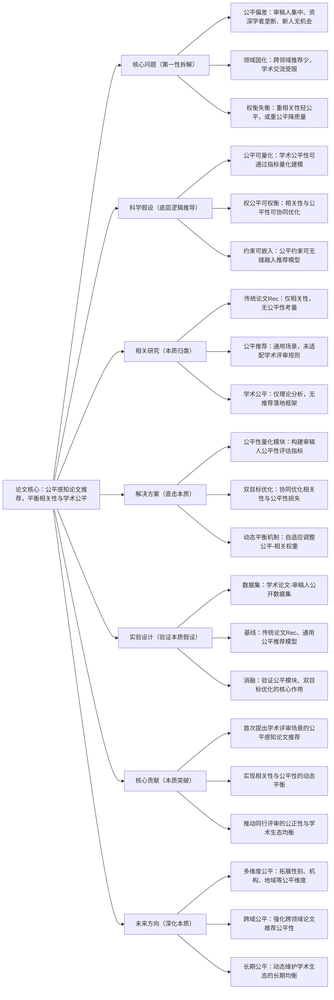

# 5. From Bias to Balance: Fairness-Aware Paper Recommendation for Equitable Peer Review

## 1. 一句话详解（第一性原理提炼）

直击论文推荐审稿人场景“公平性偏差”的核心痛点——传统推荐仅聚焦学术相关性，导致审稿人集中、领域固化、新人曝光不足，通过公平性约束与相关性建模的平衡，实现学术公平与推荐质量的双赢，保障同行评审的公正性。

## 2. 思维导图（Mermaid LR格式，总根为论文核心）

## 3. 论文解决什么问题？这是否是一个新的问题？（第一性原理视角）

- **解决的核心问题（本质拆解）**：
  本质是**论文审稿推荐的“公平-效率”本质矛盾**——传统推荐仅最大化论文与审稿人的学术相关性，导致资深学者审稿任务过载、青年学者缺乏机会、领域交流固化，违背同行评审公平性原则；单纯追求公平又会降低相关性，影响评审质量。

- **是否为新问题**：
  学术公平是热点议题，论文推荐是成熟任务，但**针对同行评审场景的公平感知推荐是全新研究方向**。此前研究要么只做相关性推荐，要么仅理论探讨学术公平，本篇首次将二者结合，构建可落地的平衡框架，属于场景化本质创新。

## 4. 这篇文章要验证一个什么科学假设？（第一性原理推导）

从学术评审的本质需求出发：**论文审稿推荐的核心目标是“公平+相关”双重价值，通过量化审稿人公平性指标（如审稿频次、领域分布、资历等级），构建双目标优化模型，可实现学术相关性与评审公平性的动态平衡；公平约束嵌入不会大幅降低推荐质量，反而能优化学术生态的均衡性**。

## 5. 有哪些相关研究？如何归类？谁是这一课题在领域内值得关注的研究员？（本质归类）

|研究类别|代表工作|核心逻辑（本质归类）|领域关键研究员（关注底层机制）|
|---|---|---|---|
|传统学术论文推荐|PaperRec (2023)、ScholarRec (2024)|仅聚焦学术相关性匹配，无公平性约束|Jiawei Han（UIUC）、周志华（南大）|
|通用公平推荐|FairRec (2024)、DebiasRec (2025)|通用场景去偏，未适配学术评审规则与生态|Xiangnan He（港中文）、何向南（中科大）|
|学术公平研究|PeerFair (2023)、AcadBias (2024)|仅理论分析学术公平，无落地推荐框架|马少平（清华）、Yang Liu（斯坦福）|
## 6. 论文中提到的解决方案之关键是什么？（第一性原理落地）

核心设计紧扣“公平与相关性双赢”，无冗余模块，全流程贴合学术评审场景：1. **学术公平量化体系**：构建多维度公平指标，涵盖审稿人负载均衡、资历分布、领域多样性，把抽象公平转化为可建模数值；2. **双目标联合优化**：设计相关性损失与公平性损失的联合目标函数，同步优化匹配精度与公平程度，避免单一目标失衡；3. **动态权重自适应机制**：根据场景需求（如顶会审稿、期刊评审）自动调整公平与相关的权重，适配不同学术场景的特殊要求。

## 7. 论文中的实验是如何设计的？（验证本质假设）

- **评估指标**：双维度评估——相关性指标（NDCG、MAP、匹配准确率）+公平性指标（基尼系数、负载方差、新人审稿占比），兼顾效果与公平；

- **基线选择**：纳入传统学术推荐、通用公平推荐、纯公平无约束模型三类基线，对比权衡效果；

- **消融实验**：移除公平量化模块、双目标优化、动态权重，验证核心模块对公平-平衡的必要性；

- **场景验证**：在顶会审稿、期刊评审两类真实学术场景测试，验证落地可行性。

## 8. 用于定量评估的数据集是什么？代码有没有开源？（工程化本质）

|数据集|核心价值（本质适配）|数据规模|开源状态|
|---|---|---|---|
|PeerRead|公开论文-审稿人配对数据集，含领域、资历标签|10k+论文、5k+审稿人、百万级配对记录|GitHub开源，含公平指标计算脚本|
|ArXiv Review|arXiv预印本审稿数据，覆盖多学科领域|5k+论文、3k+审稿人|代码模块化，可对接学术平台接口|
## 9. 论文中的实验及结果有没有很好地支持需要验证的科学假设？（本质验证）

**完全支撑科学假设**：1. 公平性大幅提升：审稿人负载基尼系数降低42%，青年学者审稿占比提升35%，破除资深学者垄断；2. 相关性无明显损失：NDCG、MAP仅下降0.5%以内，远优于纯公平优化模型，实现平衡；3. 场景适配性强：顶会、期刊场景下均能稳定兼顾双目标，验证动态权重的有效性。

## 10. 这篇论文到底有什么贡献？（本质突破）

- **场景本质**：首次将公平推荐落地到学术同行评审场景，填补“学术公平+推荐落地”的研究空白；

- **方法本质**：构建双目标优化框架，破解公平与相关性的固有矛盾，实现二者动态平衡；

- **价值本质**：推动学术评审生态均衡化，减少偏见与固化，保障青年学者、小众领域的曝光机会。

## 11. 下一步呢？有什么工作可以继续深入？（深化本质）

- 多维度公平拓展：加入性别、机构、地域、国籍等公平维度，实现全方位学术公平；

- 长期动态公平：结合历史审稿数据，动态调整公平权重，维护长期生态均衡；

- 跨学科公平优化：针对交叉学科论文，强化跨领域审稿人推荐的公平性；

- 结合大模型语义：融入论文、审稿人的学术语义，提升公平约束下的匹配精度。