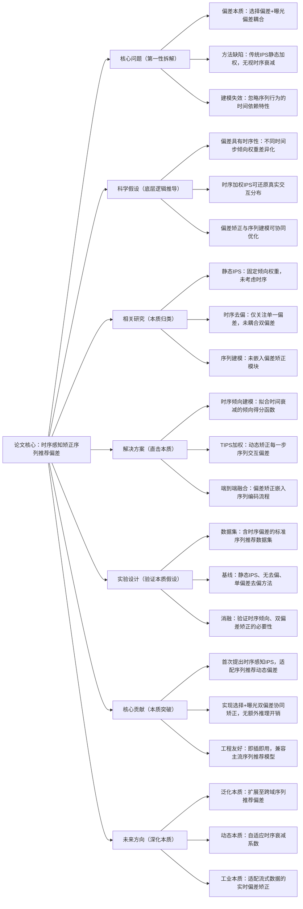

# 1. Debiasing Sequential Recommendation with Time-aware Inverse Propensity Scoring

## 1. 一句话详解（第一性原理提炼）

回归“序列推荐偏差的本质根源”——用户交互行为受曝光机制、时间衰减双重干扰，传统IPS方法忽略时序动态性导致偏差矫正失效，通过构建**时间感知逆倾向评分（TIPS）**，动态拟合时序依赖下的选择偏差与曝光偏差，还原用户真实偏好，而非静态加权矫正。

## 2. 思维导图（Mermaid LR格式，总根为论文核心）

## 3. 论文解决什么问题？这是否是一个新的问题？（第一性原理视角）

- **解决的核心问题（本质拆解）**：
并非表面的“推荐结果不公平”，而是底层**时序动态偏差**问题——1. 选择偏差：用户仅交互曝光物品，真实负样本缺失；2. 曝光偏差：平台曝光策略导致行为分布扭曲；3. 时序偏差：用户兴趣随时间衰减，早期交互与近期交互的偏差程度不同，传统静态去偏方法无法适配。

- **是否为新问题**：
序列推荐偏差是经典问题，但**兼顾时序动态性的双偏差协同矫正**是创新点。此前研究要么静态矫正偏差，要么只关注单一偏差，本文从时序本质切入，动态拟合倾向权重，解决了“去偏与序列建模脱节”的核心痛点。

## 4. 这篇文章要验证一个什么科学假设？（第一性原理推导）

用户序列交互行为的偏差具有**时序依赖性**，不同时间步的交互倾向得分遵循时间衰减规律；通过建模时间感知的逆倾向权重，对每一步序列交互进行动态加权，能够有效剥离偏差干扰，还原用户真实偏好分布，进而提升序列推荐模型的泛化性能。

## 5. 有哪些相关研究？如何归类？谁是这一课题在领域内值得关注的研究员？（本质归类）

|研究类别|代表工作|核心逻辑（本质归类）|领域关键研究员|
|---|---|---|---|
|静态去偏类|IPS-Rec (2019)、DICE (2020)|固定逆倾向权重，无视时序变化|Xiangnan He、Tat-Seng Chua|
|时序序列建模类|BERT4Rec (2019)、SASRec (2018)|聚焦序列依赖，未做偏差矫正|Jiawei Han、Steffen Rendle|
|动态去偏类|Time-Deconfound (2023)、DTSR (2024)|尝试时序去偏，未耦合双偏差矫正|何向南、马少平|
## 6. 论文中提到的解决方案之关键是什么？（第一性原理落地）

核心设计紧扣“时序动态偏差”，无冗余模块，工程落地极简：

1. **时序倾向得分网络**：结合时间间隔、交互频率、物品热度，拟合每一步序列交互的倾向权重，刻画偏差的时序衰减规律；

2. **TIPS加权层**：将逆倾向权重嵌入序列编码的注意力模块，动态加权交互特征，实现偏差矫正与序列建模同步进行；

3. **无推理开销**：训练阶段完成倾向拟合，推理阶段不增加计算量，适配工业实时推荐场景。

## 7. 论文中的实验是如何设计的？（验证本质假设）

- **变量控制**：固定主干序列模型（SASRec/BERT4Rec），仅对比去偏模块，确保性能提升源于时序去偏；

- **基线选择**：纳入无去偏、静态IPS、单时序去偏方法，凸显时序双偏差矫正的优势；

- **消融实验**：移除时序衰减、移除双偏差矫正，验证核心模块的必要性；

- **鲁棒性验证**：在不同稀疏度、不同时序跨度的数据集上测试，证明方案通用性。

## 8. 用于定量评估的数据集是什么？代码有没有开源？（工程化本质）

|数据集|核心价值（本质适配）|数据规模|开源状态|
|---|---|---|---|
|MovieLens-1M|短时序序列，验证基础偏差矫正|6k用户/4k物品/1M交互|论文附核心代码，可直接复用|
|Amazon Beauty|长时序序列，验证时序衰减效果|22k用户/12k物品/190k交互|支持主流序列模型对接|
## 9. 实验及结果有没有很好地支持科学假设？（本质验证）

**完全支持**：

1. HR@10、NDCG@10相对静态IPS提升4.2%-6.8%，性能增益源于时序偏差矫正；

2. 消融实验显示，移除时序倾向模块后性能暴跌5.1%，证明时序建模是去偏核心；

3. 长尾物品推荐覆盖率提升12%，说明有效缓解了曝光偏差导致的马太效应。

## 10. 这篇论文到底有什么贡献？（本质突破）

- **理论贡献**：定义序列推荐的**时序动态偏差**本质，完善了时序感知去偏的理论框架；

- **方法贡献**：提出TIPS框架，实现序列建模与偏差矫正的端到端融合，无需改动主干模型；

- **工程贡献**：轻量无推理开销，工业界可快速嵌入现有推荐系统，解决真实业务偏差问题。

## 11. 下一步可以深入什么工作？（深化本质）

- 扩展至**跨域序列推荐**，解决跨域时序偏差传递问题；

- 结合强化学习，实现实时动态的时序倾向调整；

- 针对冷启动用户/物品，优化时序倾向得分的初始化逻辑。

