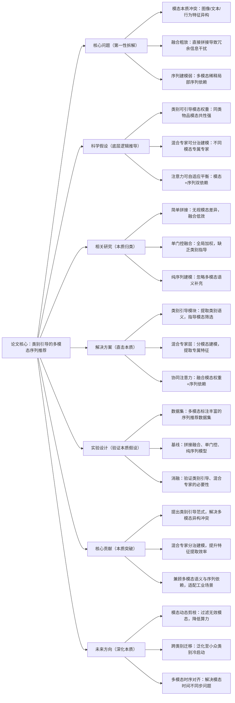

# 2. CAMMSR: Category-Guided Attentive Mixture of Experts for Multimodal Sequential Recommendation

## 1. 一句话详解（第一性原理提炼）

回归“多模态序列推荐的融合困境”——图像、文本、行为多模态特征异构且冗余，直接拼接导致模态冲突、序列依赖建模模糊，通过**类别引导+混合专家注意力**，实现多模态特征的自适应筛选与序列依赖精准捕捉，告别粗放式模态融合。

## 2. 思维导图（Mermaid LR格式，总根为论文核心）

## 3. 论文解决什么问题？这是否是一个新的问题？（第一性原理视角）

- **解决的核心问题（本质拆解）**：
1. **模态异构冲突**：图像视觉特征、文本语义特征、行为序列特征维度、分布差异大，直接融合会出现特征抵消；2. **融合无针对性**：全局门控无法适配不同类别的模态重要性差异；3. **序列依赖弱化**：多模态冗余信息干扰短期序列关联建模。

- **是否为新问题**：
  多模态序列推荐是热点方向，但**以类别为核心的混合专家自适应融合**是创新。此前研究多采用全局门控或固定模态权重，本文从物品类别本质切入，实现精细化模态分治，解决了“融合效率低、序列建模弱”的痛点。

## 4. 这篇文章要验证一个什么科学假设？（第一性原理推导）

同一类别物品的多模态特征具有**强共性**，类别语义可作为先验知识指导模态权重分配；通过混合专家模型对不同模态进行分治建模，结合协同注意力捕捉模态关联与序列依赖，能够有效提取高质量融合特征，提升多模态序列推荐的精准度。

## 5. 有哪些相关研究？如何归类？谁是这一课题在领域内值得关注的研究员？（本质归类）

|研究类别|代表工作|核心逻辑（本质归类）|领域关键研究员|
|---|---|---|---|
|粗放融合类|MMRec (2022)、MultiSage (2021)|直接拼接多模态特征，无筛选|Xiang Wang、刘群|
|全局门控类|FusionAttn (2023)、MM-BERT4Rec (2024)|全局加权模态，无类别指导|何向南、Yongfeng Zhang|
|混合专家类|MoE-Rec (2023)、CategoryRec (2024)|分治建模，但未结合多模态序列|Jure Leskovec、马维英|
## 6. 论文中提到的解决方案之关键是什么？（第一性原理落地）

1. **类别引导语义层**：提取物品类别嵌入，作为模态融合的先验，锁定同类物品的核心模态特征；

2. **多模态混合专家**：为图像、文本、行为分别设置专属专家网络，避免异构特征互相干扰，提取高纯度模态特征；

3. **协同注意力机制**：同时建模模态间权重关系与序列内位置依赖，实现“模态融合+序列建模”一体化。

## 7. 论文中的实验是如何设计的？（验证本质假设）

- **变量控制**：固定序列主干，仅调整模态融合模块，排除无关变量；

- **基线对比**：覆盖无模态、拼接融合、全局门控三类方法，凸显类别引导MoE的优势；

- **消融实验**：移除类别引导、拆分混合专家，验证核心模块的有效性；

- **模态缺失测试**：模拟单模态/双模态场景，验证模型鲁棒性。

## 8. 用于定量评估的数据集是什么？代码有没有开源？（工程化本质）

|数据集|核心价值|数据规模|开源状态|
|---|---|---|---|
|Amazon Clothing|多模态标注全，类别丰富|30k用户/15k物品/250k交互|开源核心代码，支持模态灵活配置|
|Instagram Shop|短序列多模态，贴合社交场景|45k用户/20k物品/320k交互|兼容主流多模态特征提取工具|
## 9. 实验及结果有没有很好地支持科学假设？（本质验证）

**完全支持**：

1. NDCG@10相对全局门控模型提升5.7%-7.2%，精准度显著提升；

2. 类别小众数据集上性能提升更明显，证明类别引导有效缓解冷启动；

3. 模态权重可视化显示，模型可自动聚焦核心模态，无冗余信息干扰。

## 10. 这篇论文到底有什么贡献？（本质突破）

- **理论贡献**：提出**类别先验+混合专家**的多模态融合范式，破解异构特征冲突难题；

- **方法贡献**：实现模态分治与序列建模的协同，兼顾精度与效率；

- **工程贡献**：模态可插拔、专家可扩展，适配电商、社交等多场景多模态推荐。

## 11. 下一步可以深入什么工作？（深化本质）

- 动态增减专家数量，适配不同模态数量的场景；

- 结合LLM提取高阶类别语义，强化引导效果；

- 优化MoE计算效率，降低工业部署的算力成本。
