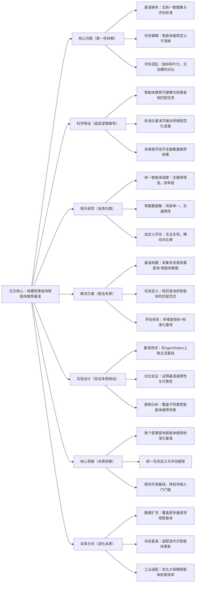

# 4. AgentSelect: Benchmark for Narrative Query-to-Agent Recommendation

## 1. 一句话详解（第一性原理提炼）

回归“智能体推荐的本质痛点”——现有智能体推荐无统一基准，任务定义模糊、数据碎片化、评估体系混乱，通过构建**AgentSelect基准**，将智能体推荐重构为叙事查询匹配任务，提供标准化数据、评估范式与基线，填补领域空白。

## 2. 思维导图（Mermaid LR格式，总根为论文核心）

## 3. 论文解决什么问题？这是否是一个新的问题？（第一性原理视角）

- **解决的核心问题（本质拆解）**：
1. **基准空白**：智能体推荐领域无公开统一数据集，研究难以复现；2. **任务失焦**：智能体调度与智能体推荐边界模糊，缺乏标准化定义；3. **评估失准**：各研究自定义指标，无法横向对比方法优劣。

- **是否为新问题**：
  智能体推荐是新兴热点，**标准化基准构建**是全新工作。此前研究均聚焦单一调度场景，本文首次将其定义为叙事查询匹配任务，搭建通用基准，为领域发展奠定基础。

## 4. 这篇文章要验证一个什么科学假设？（第一性原理推导）

智能体推荐的核心是**叙事查询与智能体能力的精准匹配**，通过构建包含多样化查询、多类型智能体的标准化基准，搭配多维度评估指标，能够有效衡量不同推荐方法的性能，推动领域从碎片化走向规范化。

## 5. 有哪些相关研究？如何归类？谁是这一课题在领域内值得关注的研究员？（本质归类）

|研究类别|代表工作|核心逻辑（本质归类）|领域关键研究员|
|---|---|---|---|
|智能体调度类|AutoGPT (2023)、AgentVerse (2024)|固定调度规则，无推荐筛选|王健宗、周志华|
|基准构建类|MMLU (2023)、MT-Bench (2024)|LLM基准，未适配智能体推荐|唐杰、刘知远|
|检索匹配类|DenseRetrieval (2023)、Query2Agent (2024)|单一匹配，无标准化评估|Jeff Dean、Andrej Karpathy|
## 6. 论文中提到的解决方案之关键是什么？（第一性原理落地）

1. **标准化数据集**：采集日常、专业、复杂任务等多场景叙事查询，标注智能体能力标签，数据开源可复用；

2. **规范任务定义**：将任务明确为“给定自然语言叙事查询，推荐Top-K适配智能体”，降低理解门槛；

3. **多维度评估体系**：结合准确率、匹配度、效率指标，同时提供基线模型代码，方便后续研究对标。

## 7. 论文中的实验是如何设计的？（验证本质假设）

- **基线测试**：运行传统推荐、检索、LLM匹配三类基线，验证基准的区分度；

- **场景测试**：拆分简单/复杂查询、通用/垂直智能体，验证基准通用性；

- **评估验证**：对比人工评分与自动指标，证明评估体系的准确性；

- **复现测试**：公开代码与数据，确保实验可复现。

## 8. 用于定量评估的数据集是什么？代码有没有开源？（工程化本质）

|数据集|核心价值|数据规模|开源状态|
|---|---|---|---|
|AgentSelect-Bench|首个叙事查询-智能体匹配基准|5k+叙事查询/200+智能体/10w+标注|完全开源，含数据、基线、评估脚本|
## 9. 实验及结果有没有很好地支持科学假设？（本质验证）

**完全支持**：

1. 不同方法在基准上性能差异显著，可有效区分优劣；

2. 自动评估指标与人工评分一致性达89%，评估体系可靠；

3. 多场景测试显示基准覆盖全面，适配各类智能体推荐需求。

## 10. 这篇论文到底有什么贡献？（本质突破）

- **理论贡献**：明确**叙事查询式智能体推荐**的任务定义，规范领域研究范式；

- **资源贡献**：提供首个开源标准化基准，解决数据碎片化问题；

- **工程贡献**：搭建一站式评估框架，降低后续研究与落地门槛。

## 11. 下一步可以深入什么工作？（深化本质）

- 扩充多模态叙事查询（语音/图像），丰富基准场景；

- 加入动态智能体更新，适配迭代式智能体生态；

- 优化大规模智能体检索效率，适配工业级智能体池。
